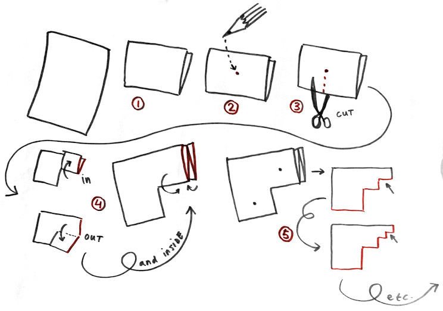
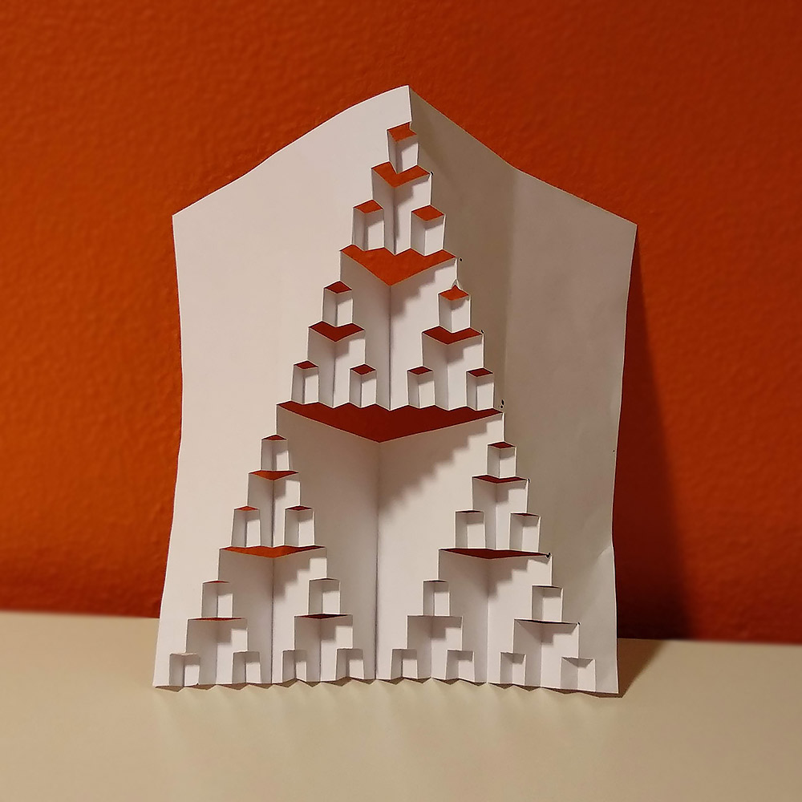
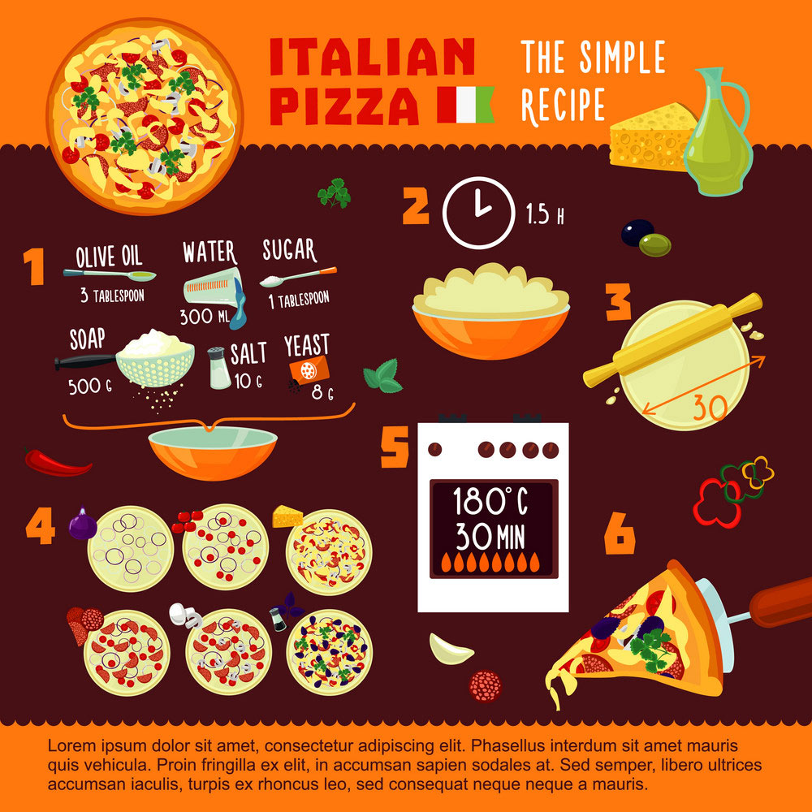
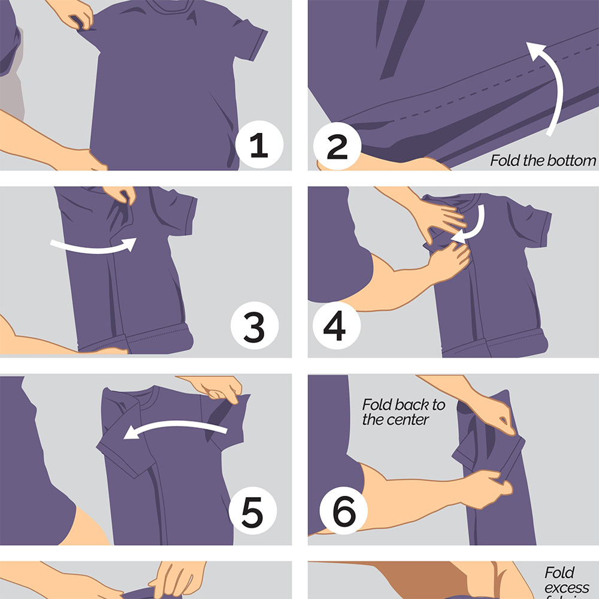
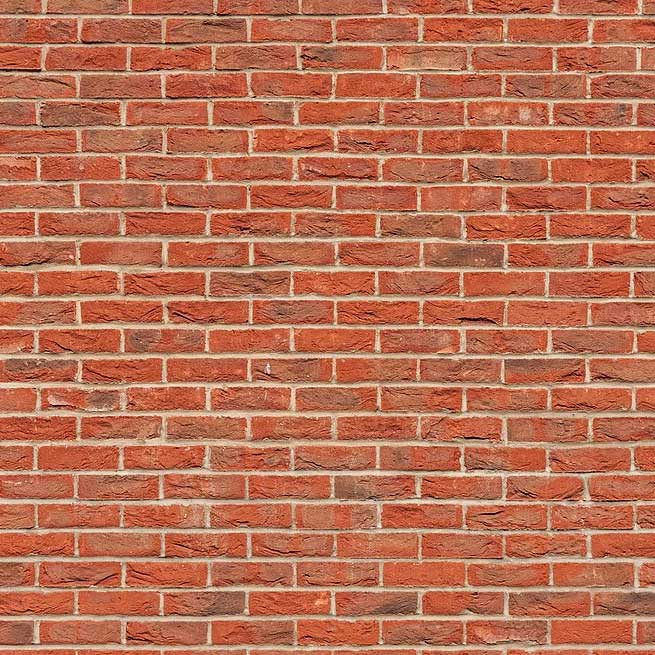
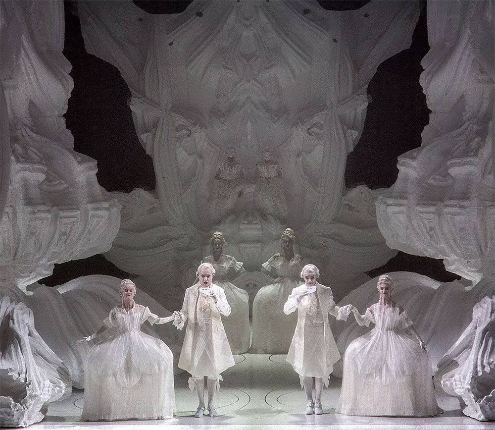
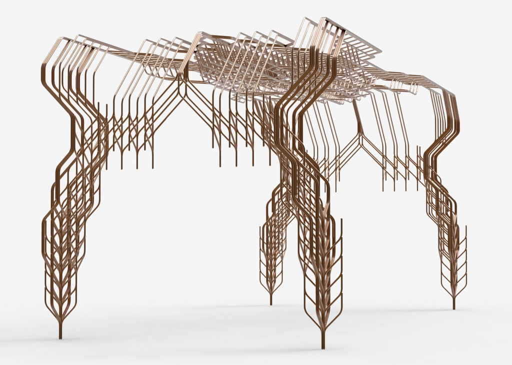
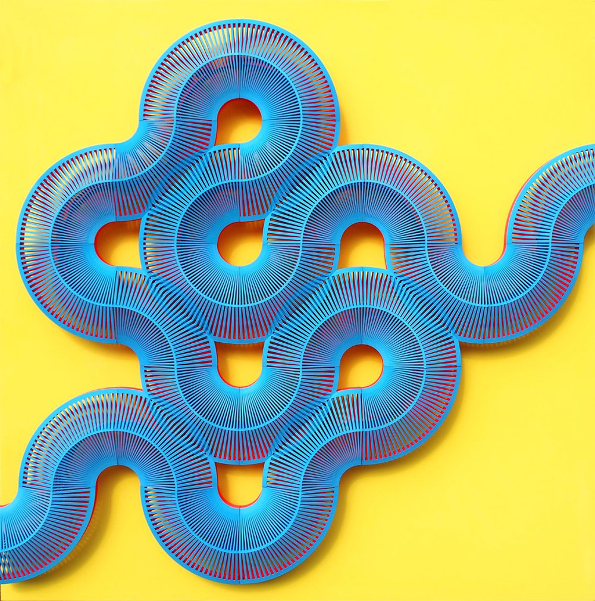

# Become an  <big><big><big>Algorist!</big></big></big>
  
 
 

<big><big><f-next-button title="START" /></big></big>

  <!-- <small>Navigate with arrows on left and right or with <kbd>Alt+LEFT</kbd> and <kbd>Alt+RIGHT</kbd> on keyboard.</small> -->

---

| 1 1
| 2 3 

# Warming up... 

-
 
Let's start with a small warming-up exercise.

1. Fold a sheet of A4 paper <mark>in half</mark> <small>*(short edge to short edge)*</small> 
2. Find the <mark>center</mark> and mark it with a pen  <small>*(don't have to be TOO precise)*</small> 
3. From the <mark>closed edge</mark> cut the paper to the center point 
4. Fold the right ‘flap’ <mark>up</mark>, then back <mark>down</mark> again <small>*(to get a folding line)*</small>. Then fold the 'flap' <mark>inside</mark> itself.
5. <mark>Repeat</mark> steps 2 to 5 for each rectangle for a few times over and over again <small>*(until the rectangles become too small to cut or fold)*</small>

**Do not open the paper until you are done!**

 

<f-prev-button /> <f-next-button title="Next: see the result" />

-

---

| 1 2 
 
# Nice work! 
 
Now if you fold the paper open, you probably end up with something like shown on this picture. 
 
By following the steps of cutting and folding you were following something that is called an <big>**ALGORITHM**</big>.

  

<f-prev-button /> <f-next-button title="Next: definition" />

-

---

# <big>an Algorithm</big>
  
#### <mark>is a set of certain steps needed to solve a problem</mark> 
  
  

<f-prev-button /> <f-next-button title="Next: they are everywhere!" />

  

---

| 1 1 2 2 
 
# Every day... 
 
...we perform such sets of rules, probably without even noticing &ndash; **these rules are often called <mark>everyday algorithms</mark>**. Let's take a look at some examples. 
 
Maybe the most common example of an everyday algorithm is ***cooking***.

  

<f-prev-button /> <f-next-button title="Next: more everyday algorithms" />

-

 
 
~
<small><small>*You have to follow certain steps (recipe) to make a delicious meal.*</small></small>
~

---

| 1 1
| 2 3
| 4 4

# More examples of everyday algorithms

-

#### Folding a t-shirt
 
 
 
~
<small><small>*There are more than one methods to fold a t-shirt. Every method is a "different algorithm" of t-shirt folding.*</small></small>
~

-

#### Building a brick wall
 
 
 
~
<small><small>*Building a stable brick wall is based on an algorithm too: you have to put the bricks so that every other row of bricks is shifted by half compared to previous one.*</small></small>
~

-

<f-hr />
 

<f-prev-button /> <f-next-button title="Next: computer algorithms" />

---

| 1 1
| 2 3
| 4 4

# Computer algorithms

-

The brick wall was quite a simple example of an algorithm. It doesn't require too much of analysis to make one.  
 
More complex algorithms may require ***a lot of computing power*** &ndash; so much that normally people can not manage it just by themself.

-
 
***This is where the computers come to the picture*** &ndash; machines perform computational tasks much quicker than humans, so we can use computers to do the hard work for us.

And also designers, artists and architects have discovered computers and complex algorithms as tools to create some stunning work. 
 
#### Again, let's take a look at some examples

-

  

<f-prev-button /> <f-next-button title="Next: algorithms in design" />

---

| 1 1 2

-

### Grotto set design by Michael Hansmeyer
 
Grotto set design for Mozart's opera Zauberflöte, directed by Romoeo Castellucci

###### http://www.michael-hansmeyer.com/

  

<f-prev-button /> <f-next-button title="Next" />

---

| 1 1 2

-

### A table by Stefan Bassing

Designer Stefan Bassing has used digital modelling to create a pair of tables, made from repetitive elements to simplify the production process.

###### https://stefanbassing.com/

  

<f-prev-button /> <f-next-button title="Next" />

---

| 1 1 2

-

### 'Entangle' Wall Tiles by Lynne MacLachlan

'Entangle' is a 3D printed wall tilling system, taking inspiration from mathematical tiling principles and quantum mechanics.

###### https://lynnemaclachlan.co.uk/

  

<f-prev-button /> <f-next-button title="Next" />

---

| 1 1 2

-

### 'Sand Spline' - generative art by Anders Hoff

The idea is based on the concept of mathematical B-splines.

###### https://inconvergent.net/

  

<f-prev-button /> <f-next-button title="Next" />

---

| 1 1 2

-

### ProtoHouse by SoftKill

Softkill Design has recently completed ProtoHouse, a prototype for the first 3D printed house, that has the same structure as human bones.

###### http://protohouse.tumblr.com/

  

<f-prev-button /> <f-next-button title="Next" />

---

# Ok...

Now we have seen some work from world famous innovative creators. 
You may think, that probably they use some billion-dollar supercomputers plus dark powers to make such stuff.  
 
Let us demonstrate, that ***even quite simple systems can create quite interesting results.*** 
 
## But...

  

<f-prev-button /> <f-next-button title="But... what?" />

---

| 1 1 1
| 2 3 4
| 5 5 5
| 6 6 7
| 8 8 8

## ...but first 
we have to understand the very basics of how computer algorithms usually work:  

-

## **1**
## INPUT
you "feed" some parameters (variables) or data to your algorithm 

-

## **2** 
## PROCESSING 
algorithm does the computing 

-

## **3** 
## OUTPUT
you get a result 

-

<f-hr />

-

Although algorithms may become very complex and hard to understand, some **very simple steps** like ***repeating*** elements and changing their ***size*** or ***rotation***, may produce already rather interesting output.  

-
 
##### Let's try this with a small interactive step-by-step simulation on next slides

-

 

<f-prev-button /> <f-next-button title="Next: let's start simple" />

---

| 1 2 2
| 3 4 4 
 
## Just some lines

-

***Move the sliders*** and see what happens. Nothing too special here &ndash; our algorithm creates a grid of small lines that change when parameters change. Parameters change when you move the sliders. That's it.

-

<f-slider title="Grid size" 
    from="0.2"
    to="2"
    step="0.01"
    :value="0.6"
    v-on:value="i => set('step1', i)"
/>
<f-slider title="Line length" 
    from="-1"
    to="1"
    step="0.01"
    :value="0.01"
    v-on:value="i => set('width1', i)"
/>

 

<small>***HINT:*** *Try to make the grid size smaller than 0.5 and line longer than 0.3*</small>

  

<f-prev-button /> <f-next-button title="Next: add rotation" v-if="get('step1') < 0.5 && get('width1') > 0.3" />

-

<f-scene  width="600" height="500">
  <f-grid-pattern :step="get('step1',0.6)">
    <f-line 
      :points="[ 
        { x: 0, y: 0 }, 
        { x: get('width1', 0.01), y: 0 }, 
      ]"  
      :stroke-width="3"  
    /> 
  </f-grid-pattern>
</f-scene>

---

| 1 2 2
| 3 4 4

## Let's add rotation

-

<small>Ok, now you have three sliders - we have added ***rotation***. Play with them and see if you can create any interesting output. </small>

-

<f-slider title="Grid size" 
    from="0.2"
    to="2"
    step="0.01"
    :value="0.3"
    v-on:value="i => set('step2', i)"
/>
<f-slider title="Line length" 
    from="-3"
    to="3"
    step="0.01"
    :value="0.5"
    v-on:value="i => set('width2', i)"
/>
<f-slider title="Rotation" 
    from="-180"
    to="180"
    step="0.1"
    :value="0.01"
    v-on:value="i => set('rotation2', i)"
/>

 

<small>***HINT:*** *Try to make the grid size smaller than 0.3, line longer than 2 and rotation bigger than 45*</small>

  

<f-prev-button /> <f-next-button title="Next: boxes" v-if="get('step2') < 0.3 && get('width2') > 2 && get('rotation2') > 45" />

-

<f-scene  width="600" height="500">
  <f-grid-pattern :step="get('step2',0.3)">
    <f-group :rotation="{z: get('rotation2',0.01) }"> 
      <f-line
        :points="[ 
          { x: 0, y: 0 }, 
          { x: get('width2', 0.01), y: 0 }, 
        ]"  
        :stroke-width="3"  
      /> 
    </f-group>
  </f-grid-pattern>
</f-scene>

---

| 1 2 2
| 3 4 4

## Boxes

-

Simple lines can get boring quite fast. Let's explore a few more complex shapes. Now let's play with a box. Boxes can get pretty cool if you make them ***overlap*** and ***rotate*** them a bit. Give it a try!

-

<f-slider title="Grid size" 
    from="0.2"
    to="2"
    step="0.01"
    :value="0.9"
    v-on:value="i => set('step3', i)"
/>
<f-slider title="Box size" 
    from="-3"
    to="3"
    step="0.01"
    :value="0.6"
    v-on:value="i => set('width3', i)"
/>
<f-slider title="Rotation" 
    from="-180"
    to="180"
    step="0.1"
    :value="0.01"
    v-on:value="i => set('rotation3', i)"
/>

 

<small>***HINT:*** *Try to make the grid size smaller than 0.4, box bigger than 1 and rotation higher than 45*</small>

  

<f-prev-button /> <f-next-button title="Next: circles" v-if="get('step3') < 0.4 && get('width3') > 1 && get('rotation3') > 45" />

-

<f-scene  width="600" height="500">
  <f-grid-pattern :step="get('step3',0.9)">
    <f-group :rotation="{z: get('rotation3',0.01) }"> 
      <f-box 
        :stroke-width="3"  
        :width = "get('width3',0.6)" 
        :height = "get('width3',0.6)" 
      /> 
    </f-group>
  </f-grid-pattern>
</f-scene>

---

| 1 2 2
| 3 4 4

## Circles

-

***Circles are just CRAZY!*** Remember - all we are doing here is to repeat one simple circle and adjusting its radius, but the visual output can get very complex and interenting.

-

<f-slider title="Grid size" 
    from="0.2"
    to="2"
    step="0.01"
    :value="0.5"
    v-on:value="i => set('step4', i)"
/>
<f-slider title="Circle size" 
    from="0"
    to="2"
    step="0.01"
    :value="0.2"
    v-on:value="i => set('width4', i)"
/>

 

<small>***HINT:*** *Try to make the grid size smaller than 0.3 and circle bigger than 1*</small>

  

<f-prev-button /> <f-next-button title="Next: random" v-if="get('step4') < 0.3 && get('width4') > 1" />

-

<f-scene  width="600" height="500">
  <f-grid-pattern :step="get('step4',0.5)">
    <f-group> 
      <f-circle 
          :stroke-width="3"  
          :r = "get('width4',0.2)" 
        /> 
    </f-group>
  </f-grid-pattern>
</f-scene>

---

| 1 2 2
| 3 4 4

## Random

-

Too much control may always not to be a good thing &mdash; sometimes you get more interesting and unexpected results if you just let things to happen. Let's allow the computer just to generate ***random*** patterns &mdash; all you have to do is to ***press the button***. 

-

<button 
    v-on:click="set( 'randomness', random(0.55, 1, true) )" class="primary"
    style="background:var(--blue)">Random generator</button>

<small v-if="get('randomness')">***HINT:*** *If the pattern sucks, press the button again - you'll get a new on*</small>

  

<f-prev-button /> <f-next-button v-if="get('randomness')" title="Next" />

-

<f-scene  width="600" height="500">
  <f-grid-pattern :step="random(get('randomness')-0.5, get('randomness')+0.5, true)">
    <f-group> 
      <f-circle 
          :stroke-width="3"  
          :r = "random(get('randomness')-0.5, get('randomness')+1, true)" 
        /> 
    </f-group>
  </f-grid-pattern>
</f-scene>

---

| 1 1
| 2 3
| 4 4

# That was just a beginning

-

These were some very simple examples of what a basic repeating combined with some scaling and/or rotating can generate from most simple black and white geometric objects.  

-

But this is just a beginning, we didn't even touch other important properties like ***color***, ***stroke width***, ***transparency***, ***animation*** and so on.

-

  

<f-prev-button /> <f-next-button v-if="get('randomness')" title="Next" />

---

## Now as you have the information, you will become an Algorist.  
 
Let's get back to paper and scissors we started with

-

1. Take the folded paper 
2. Try to mention the steps that are used to get the folded form 
3. Add your own steps by cutting and/or folding the paper. Be creative, take risks :) 
4. Describe your steps, to create an algorithm 
5. Have fun (:

---

# Thank you!!!