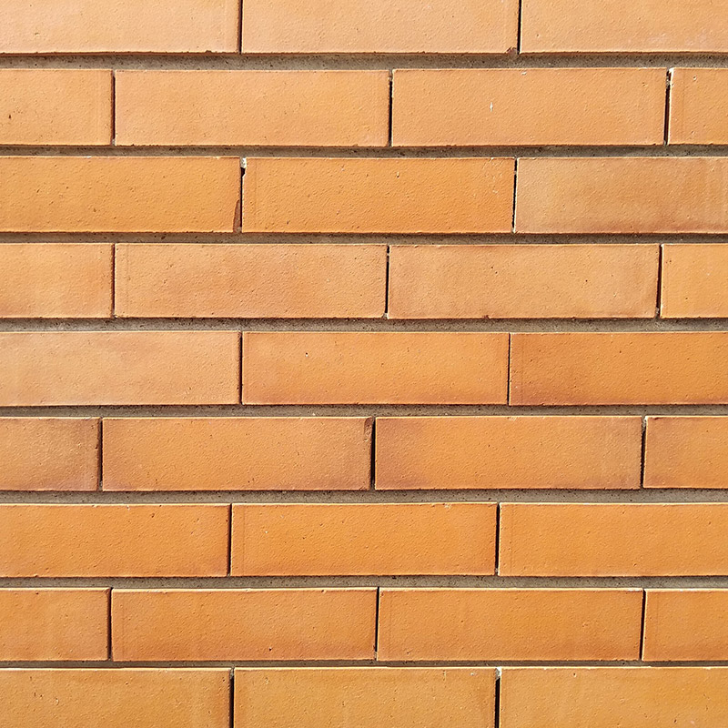

| background: ./images/cover.jpg
| style: background-position:center;
| tint: 0.25
| theme: dark
| chapter: Introduction
| section: Start

# Become an  <big><big>Algorist!</big></big>

<big>~*A brief introduction to algorithms and generative art/design*~</big>

 

<f-next-button title="Start" />

<f-notes width="50vw" style="font-family:var(--font-serif); --base:10px; --primary:var(--darkgray)">

### Teacher’s Guide for DesignSTEM ALGORITHM scenario

#### Introduction

This is a guide for using the algorithm scenario. The guide includes learning goals, an exemplary structure for a lesson plan, and a Q&A section that can help you to lead discussion whether you are a STEM or a design teacher.

**The students will:**
- learn what is an algorithm
- enumerate steps to solve a problem or reach a goal
- learn what computer-generated algorithms are
- understand the very basics of how computer algorithms work
- understand the link between an algorithm and design
- create their own algorithm
- analyze the asymptotic performance of algorithms
- demonstrate familiarity with major algorithms and data structures
- apply important algorithmic design paradigms and methods of analysis
- synthesize efficient algorithms in everyday engineering design situations

**Before using the e-tool**
To get students introduced to the subject of algorithms, please think of visual exploration and analysis of real-life situations where algorithms work (e.g., morning routine or anything that contains sequencing, repetition, and conditional logic). Additionally, please prepare scissors and papers for the warming-up exercise. Laptops/tablets/smartphones will be needed for accessing the design algorithm exercise during the scenario implementation.
The students must have basic knowledge of problem-solving, computers, and design. 

**Using the e-tool** https://designstem.github.io/scenarios/algorithms/
The scenario is composed of the following stages:
1. Warming-up exercise (students will need scissors and paper)
2. Introduction to what an algorithm is with examples where it can be found
3. Explanation of Computer Generated Algorithms
4. Examples of Design Computer Generated Algorithms
5. Individual exploratory work (“playing with lines”). Laptops/ tablets/smartphones needed
6. Individual assignments

**An exemplary lesson plan**
1. Introduce the learning goals of the class
2. Ask the students to think of any problem daily and list the steps they need to perform to solve this problem
3. Ask students to enter the scenario webpage and do the tasks
4. Explain what is an algorithm and where it can be found
5. Discuss with the students the link between algorithms and design
6. Ask them to use the scenario webpage and work with some examples
7. Explain and discuss the work
8. Perform the assignment provided by the scenario

**Questions to ask** during the work to spice up motivation or to help guide students towards the desired direction:
* What is your morning routine before coming to school?
* Which design objects link to algorithms?
* Why do we need algorithms?
* How do algorithms make our lives easier?
* What can be an alternative to the design objects created with the help of algorithms? 
* Why do we need computers?
* What do design and algorithms have something in common?

**After using the e-tool**
Questions to help spark conversation with students:
* How would you describe an algorithm?
* What shape did you obtain after completing the task?
* Which other materials can be used to create similar tasks?
* How did the patterns change when you played with the values?

You can consider also providing other algorithms and design examples. During the exercise with more complex patterns, you can change the scaling and rotating scores. Lastly, you can change the last assignment, but considering the importance of students’ engagement during and after the task. Please engage students in a discussion of their results after the previous assignment. Their final product could be shown to the rest of the class.
 
The task can be completed in an environment with access to the web-scenario.
The task can be reviewed according to class goals.
The task can be evaluated by describing what an algorithm is, how it links to design, creating an algorithm, etc.

</f-notes>

---

| chapter: Warming up
| section: A small warm-up exercise
| rows: auto
| 1 3
| 2 3
| 4 3 

  
  ## Warming up... 

 
-

Let's start with a small warming-up exercise.

1. Fold a sheet of A4 paper in **half** <small>*(short edge to short edge)*</small> 
2. Find the **center** and mark it with a pen  <small>*(don't have to be TOO precise)*</small> 
3. From the **closed edge** cut the paper to the center point 
4. Fold the right ‘flap’ up, then back down again <small>*(to get a folding line)*</small>. Then fold the 'flap' **inside itself**.
5. **Repeat** steps 2 to 5 for each rectangle for a few times over and over again <small>*(until the rectangles become too small to cut or fold)*</small>

 

**Do not open the paper until you are done!**

-

<f-image src="./images/origami-instructions.jpg" style="--image-size:contain; --image-min-height: 60vh;" />

<!--  -->

-

<f-next-button title="Next: see the result" />

---

| rows: auto
| 1 3 
| 2 3
| 4 3
 

  
  ## Nice work!

-

Now, if you open the paper, you probably end up with something similar to this picture. 
 
**By following the steps of cutting and folding you were performing a so-called <var>algorithm</var>.**

-

<f-image src="./images/origami-output.jpg" style="background-position:50% 50%; --image-min-height:80vh;" />

-

<f-next-button title="Next: definition"  />

---

| chapter: Algorithms
| section: Definition
| height: 100vh

## <var>algorithm</var>

in mathematics and computer science, is an unambiguous specification of how to solve a class of problems <f-link to="https://en.wikipedia.org/wiki/Algorithm">Wikipedia</f-link>

 

<small>Or to put it simple:</small>

> #### algorithm *is a set of specific steps needed to solve a problem*
  
 

 <f-next-button title="Next: they are everywhere!" />

  

---

| section: Everyday algorithms
| rows: auto
| 1 3
| 2 3
| 4 3 
 

  
  ## Actually, we solve problems with algorithms every day

-

Probably without even noticing. These are often called <var>everyday algorithms</var>. Let's take a look at some examples. 
 
Maybe the most common example of an everyday algorithm is **cooking**. You have to follow specific steps (recipe) to make a delicious meal.

-

<f-image src="./images/everyday-recipe_3.jpg" style="background-size: cover; background-position:90% 50%;" />

<small>*Preparing food means using algorithms.*</small>

-

 <f-next-button title="Next: more everyday algorithms" />

---

| rows: auto
| 1 1
| 2 3
| 4 4

## More examples of everyday algorithms

 

-

##### Folding a t-shirt
 
<!--   -->

<f-image src="./images/shirt.gif" style="--image-size: cover; --image-position:center; --image-height:51.5vh;" />

<!-- <f-image src="./images/everyday-tshirt.jpg" style="background-size: cover; background-position:50% 50%; --image-min-height: 30vh;" /> -->
 
<small>*There is more than one method to fold a t-shirt. Every technique is a "different algorithm" of t-shirt folding.*</small>

-

##### Building a brick wall
 
  <!--   -->

<f-image src="./images/everyday-wall_2.jpg" style="--image-size: cover; --image-position:center; --image-height:51.5vh;" />
 
<small>*Building a stable brick wall is based on an algorithm too: You have to put the bricks so that every other row of bricks is shifted by half of its size compared to the previous row.*</small>

-

 

<f-next-button title="Next: computer algorithms" />

---

| section: Computer algorithms
| rows: auto
| cols: 2fr 1fr
| 1 4
| 2 4
| 3 4

  
  ## Computer generated algorithms

-

Cooking, folding a t-shirt, building a wall &ndash; these activities consist of relatively simple instructions (i.e., ‘algorithms’).

**Computers also perform algorithms. More complex algorithms may require a lot of computing power &ndash; so much that ordinary people cannot manage it by themselves.**
 
Computers and design go together well. This last decade has seen the emergence of a new way of designing that’s all about the conscious use of algorithms mixed with the computational power of computers. A lot of designers, artists, and architects have been using computers and sophisticated algorithms to create stunning work.

-

 <f-next-button title="Next" />

-

---

| rows: auto
| cols: 2fr 1fr
| 1 1
| 2 4
| 3 4

  
  ## Keep in mind:

-

1. Not all computational design is generative design,
2. And not all generative design is computational.
3. Not every use of computers in design is ‘generative.’

#### And now, let's take a look at some examples of computer-generated algorithms in design:

-

 <f-next-button title="Next: algorithms in design" />

-

---

| chapter: Algorithmic art 
| section: Examples
| rows: auto
| cols: 2fr 1fr
| 2 1
| 2 3

## Grotto set design 
*by Michael Hansmeyer*

Grotto set design for Mozart's opera Zauberflöte, directed by Romeo Castellucci

> ~*“I want to assume the Mozartian potion and bring it to its maximum effect, and here in the gardens is the artificial grotto, the feathers of the fowler, the ceruse white with the artificial fly, the symmetry, palace of the 18th century.”*~

<f-link to="http://www.michael-hansmeyer.com/">michael-hansmeyer.com</f-link>

-

<!--  -->
<f-image src="./images/candy-hansmeyer.jpg" style="background-position:50% 90%; --image-min-height:80vh;" />

<f-notes title="Credits" size="half">

  Zauberflöte 2018 (available at http://www.michael-hansmeyer.com/zauberfloete, accessed on 24.01.2019)

</f-notes>

-

<f-next-button title="Next" />

---

| rows: auto
| cols: 2fr 1fr
| 2 1
| 2 3

## A table 
*by Stefan Bassing*

Designer Stefan Bassing has used digital modeling to create a pair of tables, made from repetitive elements to simplify the production process.

> ~*“Once the furniture is created as a digital model, the role of the computer is at the forefront. The computer numerically controls (CNC) the bending machine, converting steel rods into parts for use. Then, these would be assembled by a craftsperson, before being copper plated.”*~

<f-link to="https://stefanbassing.com/">stefanbassing.com</f-link>

-

<!--  -->
<f-image src="./images/candy-dezeen.jpg" style="background-position:30% 50%; --image-min-height:80vh;" />

<f-notes title="Credits" size="half">

  Tucker 2016, (available at https://www.dezeen.com/2016/03/26/stefan-bassing-barlett-school-architecture-digital-modelling-table-no-1-2-identical-components/, accessed on 24.01.2019)

</f-notes>

-

<f-next-button title="Next" />

---

| rows: auto
| cols: 2fr 1fr
| 2 1
| 2 3

## “Entangle” wall tiles 
*by Lynne MacLachlan*

“Entangle” is a 3D printed wall tilling system, taking inspiration from mathematical tiling principles and quantum mechanics.

> ~*“Based on the mathematical principles of Truchet tiles, two modular segments can be combined in a myriad of different ways. It is possible to create various wave patterns, knot designs, complex repeating patterns, or fill space in a random fashion. (McLachlan 2017).”*~
 
<f-link to="https://lynnemaclachlan.co.uk/">lynnemaclachlan.co.uk</f-link>

-

<f-image src="./images/candy-maclachlan.jpg" style="background-position:50% 50%; --image-min-height:80vh;" />

<f-notes title="Credits">

  Entangle 2017 (available at https://lynnemaclachlan.co.uk/blogs/projects/entangle-wall-tiles, accessed on 24.01.2019)

</f-notes>

-

<f-next-button title="Next" />

---

| rows: auto
| cols: 2fr 1fr
| 2 1
| 2 3

## “Sand Spline” - generative art 
*by Anders Hoff*

The idea is based on the concept of mathematical B-splines.

The author mentions that in mathematics, a B-spline is a smooth spline that is drawn from a number of nodes (control points) without necessarily passing through the nodes themselves.

<f-link to="https://inconvergent.net/">inconvergent.net</f-link>

-

<f-image src="./images/candy-sandspline.jpg" style="background-position:50% 50%; --image-min-height:80vh;" />

<f-notes title="Credits">

  Sand spline (available at https://inconvergent.net/generative/sand-spline/, accessed on 24.01.2019)

</f-notes>

-

<f-next-button title="Next" />

---

| rows: auto
| cols: 2fr 1fr
| 2 1
| 2 3

## “ProtoHouse” 
*by SoftKill*

Softkill Design has recently completed “ProtoHouse,” a prototype for the first 3D printed house, that has the same structure as human bones.

The ProtoHouse project was developed in the Architectural Association School's Design Research Lab within the 'behavioral matter' studio of Robert Stuart-Smith. The project investigated the developmental potential of the latest Selective Laser Sintering technologies, testing the boundaries of large scale 3D printing. The designing was done with computer algorithms that micro-organize the printed material itself.

<f-link to="http://protohouse.tumblr.com/">protohouse.tumblr.com</f-link>

-

<f-image src="./images/candy-softkill.jpg" style="background-position:50% 50%; --image-min-height:80vh;" />

<f-notes title="Credits">

  Fairs 2012 (available at https://www.dezeen.com/2012/10/23/protohouse-by-softkill-design/, accessed on 24.01.2019)

</f-notes>

-

<f-next-button title="Next" />

---

| rows: auto
| cols: 2fr 1fr
| 1 4
| 2 4
| 3 4

  ## That was nice!

-

You might think that probably they use very expensive supercomputers plus knowledge of wizardry to make such stuff. 

However, with basic knowledge of coding, we can demonstrate that **even simple sets of rules can create quite exciting results**. 

-

 <f-next-button />

-

---

| section: How computer algorithms work?
| rows: auto
| 1 1 1 1 1
| 2 3 4 5 6
| 7 7 7 7 7 

## How do computer algorithms work?

### There are five key aspects:

-

## 1.

### <var>finite&shy;ness</var>
The algorithm **must always terminate** after a finite number of steps.

-

## 2.

### <var>definite&shy;ness</var>
**Each step must be precisely defined;** the actions to be carried out must be rigorously and unambiguously specified for each case.

-

## 3.

### <var>input</var> 
An algorithm **has zero or more inputs**, taken from a specified set of objects.

-

## 4.

### <var>output</var>
An algorithm **has one or more outputs**, which have a specified relation to the inputs.

-

## 5.

### <var>effective&shy;ness</var>
**All operations** to be performed must be **sufficiently basic** that they can be done exactly and in finite length (Knut 1997)

-

<f-next-button title="Next" />

---

| rows: auto
| 1 1 1
| 2 3 4
| 5 5 5

## More specifically, an algorithm is composed of:

-

## 1.

### <var>input</var> 
You feed some parameters (variables) or data to your algorithm.

-

## 2.

### <var>processing</var> 
The algorithm does the computing.

-

## 3.

### <var>output</var>
You get a result.

-

 <f-next-button />

---

| chapter: Step by step interactive

## Let's play with some interactive examples

On the following page, you can see how most basic operations like <var>repeating</var>, <var>scaling</var> and <var>rotation</var> can generate quite complex patterns from most basic objects like lines, squares and circles.    

 

**Go crazy and play around!**

 

<f-next-button title="Go!" />

---

| section: Lines
| rows: auto
| cols: 20% 50% 20%
| 1 1 1
| 2 3 4 
 
## a. Just some lines

-

***Move the sliders*** and see what happens. Nothing too special here &ndash; our simple algorithm creates a grid of small lines that change when parameters change. Parameters change when you move the sliders. You should see some dashed lines pattern. That's it.

-

<f-scene responsive class="fullWidthScene" >
  <f-grid-pattern 
    :cols="2+Math.round(4/get('step1',0.6))" 
    :rows="2+Math.round(4/get('step1',0.6))" 
    :step="get('step1',0.6)">
    <f-line 
      :points="[ 
        { x: -get('width1', 0.1)/2, y: 0 }, 
        { x: get('width1', 0.1), y: 0 }, 
      ]"  
      :stroke-width="2"
    /> 
  </f-grid-pattern>
</f-scene>

-

<f-slider title="Grid size" 
    from="0.2"
    to="2"
    :value="0.6"
    set="step1"
/>
<f-slider title="Line length" 
    from="-1"
    to="1"
    :value="0.01"
    set="width1"
/>

 

<small>***HINT:*** *Try to make the grid size smaller than 0.5 and the lines longer than 0.2*</small>

<f-next-button title="Next: add rotation" v-if="get('step1') < 0.5 && Math.abs(get('width1')) > 0.16" />

---

| section: Rotation
| rows: auto
| cols: 20% 50% 20%
| 1 1 1
| 2 3 4

## b. Let's add rotation

-

Ok, now you have three sliders &ndash; we have added ***rotation***. Play with them and see if you can create any exciting output.

-

<f-scene responsive>
  <f-grid-pattern :cols="2+Math.round(4/get('step2',0.6))" :rows="2+Math.round(4/get('step2',0.6))" :step="get('step2',0.3)">
    <f-group :rotation=" get('rotation2',0) "> 
      <f-line
        :points="[ 
          { x: -get('width2', 0)/2, y: 0 }, 
          { x: get('width2', 0), y: 0 }, 
        ]"  
        :stroke-width="2"  
      /> 
    </f-group>
  </f-grid-pattern>
</f-scene>

-

<f-slider title="Grid size" 
    from="0.26"
    to="1"
    step="0.02"
    :value="0.3"
    set="step2"
/>
<f-slider title="Line length" 
    from="-2"
    to="2"
    step="0.05"
    :value="0.01"
    set="width2"
/>
<f-slider title="Rotation" 
    from="-180"
    to="180"
    step="0.1"
    :value="0.01"
    set="rotation2"
    plain="false"
/>

 

<small>***HINT:*** *Try to make the grid size smaller than 0.4, the lines longer than 1 and the rotation bigger than 30.*</small>

 

<f-next-button title="Next: boxes" v-if="get('step2') < 0.4 && Math.abs(get('width2')) > 1 && Math.abs(get('rotation2')) > 30" />

---

| section: Boxes
| rows: auto
| cols: 20% 50% 20%
| 1 1 1
| 2 3 4

## c. Boxes

-

Simple lines can get boring quite fast. Let's explore a few more complex shapes. Now let's play with a box. Boxes can get pretty cool if you make them **overlap** and **rotate** them a bit. Give it a try!

-

<f-scene responsive>
  <f-grid-pattern :cols="2+Math.round(4/get('step3',0.6))" :rows="2+Math.round(4/get('step3',0.6))" :step="get('step3',1)">
    <f-group :rotation="get('rotation3',0)"> 
      <f-box 
        :stroke-width="2"
        :scale="get('width3',0.6)" 
      /> 
    </f-group>
  </f-grid-pattern>
</f-scene>

-

<f-slider title="Grid size" 
    from="0.3"
    to="2"
    step="0.02"
    :value="1"
    v-on:value="i => set('step3', i)"
/>
<f-slider title="Box size" 
    from="-1"
    to="3"
    step="0.02"
    :value="0.6"
    v-on:value="i => set('width3', i)"
/>
<f-slider title="Rotation" 
    from="-180"
    to="180"
    step="0.1"
    :value="-0.001"
    v-on:value="i => set('rotation3', i)"
/>

 

<small>***HINT:*** *Try to make the grid size smaller than 0.5, the box bigger than 1 and the rotation higher than 45.*</small>

<f-next-button title="Next: circles" v-if="get('step3') < 0.5 && Math.abs(get('width3')) > 1 && Math.abs(get('rotation3')) > 45" />

---

| section: Circles
| rows: auto
| cols: 20% 50% 20%
| 1 1 1
| 2 3 4

## d. Circles

-

**Circles are just CRAZY!** Remember: All we are doing here is to repeat a straightforward circle and to adjust its radius, but the visual output can get very complex and exciting.

-

<f-scene responsive id="algrtmCircles">
  <f-grid-pattern :cols="2+Math.round(4/get('step4',0.6))" :rows="2+Math.round(4/get('step4',0.6))" :step="get('step4',0.5)">
    <f-group> 
      <f-circle 
          :stroke-width="2"  
          :scale = "get('width4',0.2)" 
        /> 
    </f-group>
  </f-grid-pattern>
</f-scene>

-

<f-slider title="Grid size" 
    from="0.2"
    to="2"
    step="0.01"
    :value="0.5"
    v-on:value="i => set('step4', i)"
/>
<f-slider title="Circle size" 
    from="0.1"
    to="2"
    step="0.01"
    :value="0.2"
    v-on:value="i => set('width4', i)"
/>

 

<small>***HINT:*** *Try to make the grid size smaller than 0.4 and the circle bigger than 1.*</small>

<f-next-button title="Next: random" v-if="get('step4') < 0.4 && get('width4') > 1" />

<!-- <button v-on:click="send('download', 'algrtmCircles')">Download</button> -->

---

| section: Random circles
| rows: auto
| cols: 20% 50% 20%
| 1 1 1
| 2 3 4

## e. Random

-

Too much control may not always be a good thing &mdash; sometimes, you get more exciting and unexpected results if you just let things happen. Let's allow the computer to generate **random** patterns &mdash; all you have to do is to ***press the button***. 

-

<f-scene responsive id="algrtmRandom">
  <f-grid-pattern :cols="2+Math.round(4/randomizer(0.2, 0.6))" :rows="2+Math.round(4/randomizer(0.2, 0.6))" :step="randomizer(0.2, 0.6)">
    <f-group> 
      <f-circle 
          stroke-width="2"  
          :scale = "get('randomR', randomizer( 0.2, 1))" 
        />  
    </f-group>
  </f-grid-pattern>
</f-scene>

-

<button 
    v-on:click="set( 'randomR', randomizer( 0.2, 1) )" class="primary"
    style="background:var(--blue)">Random generator</button>

<small v-if="get('randomR')">***HINT:*** *If the pattern looks boring, press the button again - you'll get a new pattern.*</small>

<!-- &nbsp;

<f-sidebar src="random-lines.md" title="Random lines" width="60vw" overlay /> -->

&nbsp;

<f-next-button v-if="get('randomR')" title="Next" />

<!-- <button v-on:click="send('download', 'algrtmRandom')">Download</button> -->

---

| chapter: Epilogue
| section: Conclusion
| rows: auto
| cols: 3fr 1fr

| 1 3
| 2 3
| 4 3

  
  ## This was just the beginning &ndash; <small>like a tiny tip of a huge iceberg!</small>

-

But hopefully, with these super basic examples, you saw how simple shapes could be combined, and some basic operations like repeating, scaling, and rotating can generate a lot of intricate patterns.

When we add other important properties like <var>color</var>, <var>stroke width</var>, <var>transparency</var> and so on, we can alter the algorithm further and receive different output.

Plus, it is possible to let different functions and/or data, such as <var>randomness</var>, <var>noise</var>, <var>sine wave</var>, <var>user input</var>, <var>voice</var>, <var>weather information</var>, <var>tweets</var> etc affect the parameters and then we have much more options and complex results.

But let all this be a subject for the next time or better yet &ndash; let this be something for you to discover by yourself :)

-

-

<f-next-button title="Next" />

---

| rows: auto
| section: Last task
| 1 1
| 2 3
| 4 4

## Are you ready to become an Algorist yourself?

-

Your **final task** is to create an algorithm for the "hardware" that you started this scenario with: paper and scissors!

**Try to create a different algorithm from the one we started with.** Experiment with different folds and cuts. Don't be afraid to make a "mistake," there are no mistakes here, just different algorithms.

-

1. Create a 5-step algorithm.

2. Define and enumerate the steps.

3. Discuss what your algorithm is and how it can be improved.

4. In which way can algorithms be used in design other than in architecture — research other options where this can be applied to e.g., graphic design or product design.

5. **Have fun! :)**

-

<f-next-button title="What next?" />

---

| section: What next?
| background: ./images/cover.jpg
| theme: dark
| 1 1 1
| 2 3 3
| 2 4 5

## What to do next?

-

#### Related DesignSTEM projects:

 

<a href="../patterns">2D/3D patterns</a> allows to play around with 2D pattern compositions.

<a href="../frequency">Frequency and Motion</a> From praxiscope to cinema to GIFs: learn the science behind the moving image.
  
<a class="tertiary" href="../"><f-leftarrow-icon /> Back to projects</a>

-
  
#### Other materials:

-

<a href="https://www.bbc.com/ideas/videos/why-algorithms-are-called-algorithms/p07gdlwf" target="_blank">Why algorithms are called algorithms</a> BBC Ideas video

<a href="https://algorithms.design/" target="_blank">How Artificial Intelligence is Changing Design</a>

<a href="https://www.khanacademy.org/computing/computer-science/algorithms" target="_blank">Khan Academy Algorithms course</a>

<a href="http://www.arturneufeld.com/research/fontjoy" target="_blank">Artur Neufeld:</a> About creativity, algorithms and the future of graphic design

<a href="https://www.youtube.com/watch?v=8Uo6zFwSO78" target="_blank">Talk at FITC</a> and <a href="https://mattdesl.svbtle.com/">Blog</a> of Matt DesLauriers, an artist and freelance creative coder

-

<a href="https://generated.space/" target="_blank">Generated Spaces</a> by Kjetil Golid

<a href="https://generativeartistry.com/">Generative Artistry</a> by Tim Holman. 
<a href="https://spec.fm/podcasts/toolsday/186315" target="_blank">Toolsday podcast</a> with Tim Holman.

<a href="https://twitter.com/hashtag/plottertwitter" target="_blank">#plottertwitter</a> - plotter art.

<a href="https://www.creativeapplications.net" target="_blank">Creative Applications</a> - digital art blog

<a href="http://blouze.github.io/projets/harmonogrammes/" target="_blank">Harmonogrammes</a> - a Chrome experiment

<a href="https://www.openprocessing.org/browse/#">OpenProcessing</a> 

<a href="https://www.derivative.ca/" target="_blank">Touch Designer</a>

