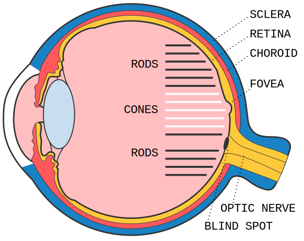
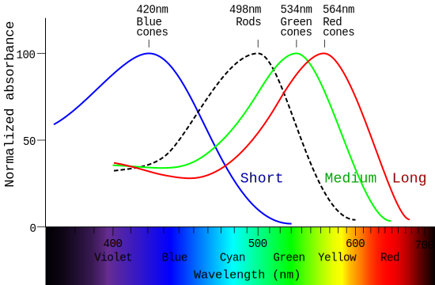

| section: cb-start
| theme: yellow
| height: 100vh
| 1
| 2
| 3

-

# <big><big><big><big>CVD</big></big></big></big> 

### ~Color Vision Deficiency / Color Blindness~

##### ~How to design for people whose color perception is impaired.~

<!-- ~*(Richard Spencer, Kristin Kreer)*~ -->

<!-- <f-embed src="./menu.md" /> -->

#### &nbsp;

<f-next-button title="Let's start" />

-

<f-notes>

Teachers note

#### Aim

The students’ awareness should be raised for the problems people with color vision deficiency have to face in their everyday life. They should realize that it’s not only about the absence of certain colors and therefore being somehow “aesthetically impaired” by seeing less colors. Instead they should experience that not being able to see all colors can have a serious impact, because people might get the wrong information or no information at all.

</f-notes>

---

| section: cb-what
| 1 1
| 2 3
| 4 4
| 5 5

<f-inline>

<f-fact-icon size="large" />

# The definitions

</f-inline>

-

## Color blindness

~People who are **totally color blind**, can only see things as **black and white** or in shades of gray. But total color blindness is very rare. **Most people, whose color perception is impaired, are color vision deficient**.~

-

## Color Vision Deficiency (CVD)

~People with **color vision deficiency** can see colors, but they have **difficulty differentiating between certain shades** of **reds and greens** or **blues and yellows**. CVD is more common than total color blindness.~

-

<!-- <f-hr /> -->

-

<!-- <f-inline> -->

*On the following pages we try to explain, how exactly does CVD affects vision, what happens in the eye and brain and what designers should know about it.*

<f-next-button title="Next" style="flex:1;" />

<!-- </f-inline> -->

---

| height: 100vh
| section: cb-explore
| 1 1 2 2 

<!-- ##### EXPLORE -->
# Why should we care?

  

<f-inline>

  ~This is an example, how a color vision deficient person (with protanopia, i.e. red blindness) could see tomatoes.~ 
  ~Actually there is only **one red tomato** in this picture~

</f-inline>

<!-- <f-icon :size="'large'" :icon="'Activity'" style="width:15vw;" /> -->
<f-inline>

# 🤔

~**Look at the tomatoes and try to guess which one of the tomatoes is already ripe, red and therefore edible.**~

</f-inline>

### &nbsp;

<button @click="()=>{set('revealX', 80); set('revealLocked', false);}" v-if="get('revealX') < 70">Check your answer</button>

 75">

   
   

  ~**Did you guess right? If you picked the right tomato, congratulations!**~
  
  <f-inline>
  
   # 🤢
  
  > ~For color deficient people choosing the wrong tomatoes can have serious consequences for their health, since unripe tomatoes are poisonous and can cause nausea and vomiting.~

  </f-inline>

  <small>~*BTW, you can also drag or click on the image to compare protanopia vs normal seeing*~</small>

   
   

  <f-next-button title="Next: go outside!" />

<f-notes>
  
  
Teachers note

  
  #### Aim

  ~Students explore which parts of their everyday life might cause problems for color vision deficient people. Therefore, we raise awareness for the need to also keep accessibility in mind when designing products which contain important information, which all people should be able to access.~

</f-notes>

-

<ColorblindnessJuxtapose 
  :imageUrl="'images/tomatoes-test__ps2.jpg'" 
  :revealed="get('revealX',0)" 
  :locked="get('revealLocked', true)" 
  :juxtId="'compare'" 
  :upload="false"
  :cbType="'Protanopia'"
  style="box-shadow:0 0 4px 0 hsla(0,0%,0%,0.3);padding:var(--base) var(--base2); border-radius:var(--base)" 
/>

---

| section: cb-safari
| id: cbSafari
| height: 100vh
| padding: 0
| gap: 0

| 1 2

  

  
  <f-inline>

  <f-activity-icon size="large" />

  # Photo safari

  </f-inline>

  #### &nbsp;

  ~Take a digital camera, e.g. the camera of your mobile phone, and go on a photo safari of your everyday life.~

  ~**Take pictures of objects, packagings, posters, signs, magazines, websites, texts etc. that you come across throughout your day. Only choose things which convey information.**~
  
  

  

    <f-next-button title="Analyze your photos" style="margin:var(--base2) 0 var(--base2) 0" />
  

-

<f-image src="images/explore-go-outside.jpg" />

<!-- 

 SSSSSS    IIIIIII    M     M    U     U    L           AAAA     TTTTTTT     OOOOO     RRRRRR 
S             I       M M  MM    U     U    L          A    A       T       O     O    R     R
 SSSSS        I       M  M  M    U     U    L          A    A       T       O     O    R     R
      S       I       M     M    U     U    L          AAAAAA       T       O     O    RRRRRR 
SSSSSS     IIIIIII    M     M     UUUUU     LLLLLLL    A    A       T        OOOOO     R    R

 -->

---

| section: cb-simulator
| height: 100vh
| id: cbSimulator
| 1 1 2 2 2
| 3 3 2 2 2

# CVD simulator

~Simulate CVD by applying different filters to the image.~

<f-card :title="get('cbType', 'Protanopia') == 'Protanopia' ? 'Simulating Protanopia 👉' : 'Simulate Protanopia'"   background="var(--lightergray)" color="var(--darkgray)" style="margin-bottom:calc(var(--base)*0.5);" :style="get('cbType', 'Protanopia') == 'Protanopia' ? {background:'var(--lightblue)'} : {background:'var(--lightergray)'}" @click.native="set('cbType', 'Protanopia')">

reduced sensitivity to <b>RED</b> light

</f-card>

<f-card :title="get('cbType') == 'Deuteranopia' ? 'Simulating Deuteranopia 👉' : 'Simulate Deuteranopia'" background="var(--lightergray)" color="var(--darkgray)" style="margin-bottom:calc(var(--base)*0.5);" :style="get('cbType') == 'Deuteranopia' ? {background:'var(--lightblue)'} : {background:'var(--lightergray)'}" @click.native="set('cbType', 'Deuteranopia')" >

reduced sensitivity to <b>GREEN</b> light

</f-card>

<f-card :title="get('cbType') == 'Tritanopia' ? ' 👉 Simulating Tritanopia' : 'Simulate Tritanopia'" background="var(--lightergray)" color="var(--darkgray)" style="margin-bottom:calc(var(--base)*0.5);" :style="get('cbType') == 'Tritanopia' ? {background:'var(--lightblue)'} : {background:'var(--lightergray)'}" @click.native="set('cbType', 'Tritanopia')">

reduced sensitivity to <b>BLUE</b> light

</f-card>

<small><small>~*Drag the red handlers or click on the image to see the difference between normal and CVD seeing.*~</small></small>
&nbsp; 
<f-hr />

<f-inline>

<f-activity-icon size="large" />

~**Analyze images by asking yourself <f-sidebar title="these questions." src="./cb-analyze-images.md" width="50vw" />**~

</f-inline>

<f-hr />

<f-next-button style="margin:var(--base4) 0" />

-

<ColorblindnessJuxtapose 
  :imageUrl="get('cbSimImg', 'images/cb-metro.jpg')" 
  :revealed="25" 
  :locked="false"
  :cbType="get('cbType', 'Protanopia')"
  style="box-shadow:0 0 4px 0 hsla(0,0%,0%,0.3);padding:var(--base) var(--base2); border-radius:var(--base)"
/>
<!-- <button v-on:click="set('cbSimImg', 'images/crayons.png')">swap</button> -->

---

| section: cb-facts
| 1 1 1 1 
| 2 3 4 5
| 6 6 6 6
| 7 7 7 7
| height: 100vh

# <f-fact-icon size="large" />Short summary about CVD 
<!-- ~<small>Source: <a href="http://www.colourblindawareness.org/" target="_blank">http://www.colourblindawareness.org/</a></small>~ -->

#### &nbsp;

#### ~There are 7 different types of CVD:~

-

<f-fact-icon />

#### Protanomaly &amp; protanopia
~reduced/missing sensitivity to **RED** light~

-

<f-fact-icon />

#### Deuteranomaly &amp; deuteranopia
~reduced/missing sensitivity to **GREEN** light.~

-

<f-fact-icon />

#### Tritanomaly &amp; tritanopia
~reduced/missing sensitivity to **BLUE** light.~

-

<f-fact-icon />

#### Achromatopsia
~**complete** colour blindness (everything seen in shades of grey).~

-

~The **"-nopia"** is more severe condition than **"-anomaly"**:~
~"-anomaly" in the name means that perception of certain light is reduced while "-nopia" means it is missing.~

-

<f-next-button title=" " style="align-self:center;" />

---

| 1 1 1
| 2 3 4
| 2 3 4
| 2 3 4
| 2 3 4
| 5 5 5

# <f-fact-icon size="large" />Short summary about CVD 

-

~**Tritanomaly and achromatopsia are extremely rare** forms of CVD and are both caused by autosomal recessive alleles. People with these forms of CVD inherit two faulty versions (alleles) of genes for normal cone functioning, one from each parent.~

-

~**Protanomaly and deuteranomaly are the more common forms of CVD**, with deuteranomaly being the most common. People with deuteranomaly and protanomaly are collectively known as **red-green colour blind**. They have difficulty distinguishing between reds, greens, browns and oranges. They also commonly confuse different types of blue and purple.~

-

~Colour blindness and colour vision deficiency affects approximately **1 in 12 men** (8%) and **1 in 200 women** (0.5%) in the world.~

-

<f-next-button title=" " />

---

  
  # But why?

  ~Why we see colors differently? What IS a color?~

  #### ~Let's try to understand how the human eye is built~

  ##### &nbsp;

  <f-next-button title="To the eye" />

---

| section: cb-eye
| height: 100vh
| 1 3
| 2 3

<!-- ##### EXPLAIN  -->
# 👁️‍🗨️ The human eye

#### &nbsp;

~When it comes to color vision, the back of the eye, named **retina** is most important. It contains **two types of photoreceptor cells which detect light** and are called **rods and cones**~

~***RODS*** are located in the peripheral parts of the retina and **detect light**, but **not the colour** of light.~

~***CONES*** are found closely packed in the fovea. They contain the photosensitive pigment iodopsin and there are three types which are sensitive to red, green and blue lights. Hence **they are used for colour vision**.~

-

<f-next-button title="Rods and cones" />

-

<figure style="width:100%; height:80vh; position:sticky; top:0;  display:flex;  justify-content:center; align-items: center; margin: 0;">
  
</figure>

---

| height: 100vh
| 1 1
| 2 3
| 4 4

<!-- ##### EXPLAIN  -->
# Rods and cones

~Rods and cones contain different **light-sensitive pigments** which absorb light and undergo a chemical change (“bleaching”) which releases energy. This results in **increased permeability of photoreceptor membranes to sodium ions.**~

~Sodium ions diffuse into the photoreceptors, creating a **generator potential**. If a **threshold level** is reached, an **action potential** is created in a nearby bipolar neuron. This connects to neurons in the **optic nerve** which carry impulses to the brain.~

<small><small>Review the <f-sidebar title="image of the eye" width="50vw"></f-sidebar></small></small>

-

### ~Rods~

~...are located in the **peripheral parts** of the retina and **detect light**, but **not the colour** of light.~

~**Many rods join one bipolar neuron** so that:~

- ~Rods are **sensitive to dim light** (because many weak generator potentials combine to reach the threshold level to trigger an action potential to send nerve impulses to the brain). The photosensitive pigment in rods (rhodopsin) bleaches at low light intensity.~

- ~Rods give **low visual acuity** (the ability to tell part points that are close together) because the brain cannot tell where exactly the light fell on a group of rods.~

-

### ~Cones~

~...are found closely packed in the **fovea**. They contain the photosensitive pigment iodopsin and there are three types which are sensitive to red, green and blue lights. Hence they are used for **colour vision**.~

~**One cone joins one bipolar neuron** so that:~

- ~Cones are **not sensitive to dim light**. Compared to rods, are less sensitive at low light intensity, because a generator potential must reach the threshold level on its own to trigger an action potential to send nerve impulses to the brain). That’s why you can’t see colours in the dark!~

- ~Cones give **high visual acuity** (the ability to tell apart points that are close together) because the brain can tell exactly which cone the light fell upon.~

-

<f-next-button  />

## &nbsp;

---

# Rods and cones: summary

<small><small>Review the <f-sidebar title="image of the eye" width="50vw"></f-sidebar></small></small>

<h3>RODS</h3>        | <h3>CONES</h3>   
----------- | -----------
~Mainly located in the peripheral parts of the retina~  | ~Mainly located in the fovea of the retina~
~Do not give information in colour~ | ~Give information in colour~
~Many rods join to one bipolar neuron~  | ~Single cones join to one bipolar neuron~
~**High light sensitivity**~ ~Several rods connect to one bipolar neuron so many weak generator potentials combine to reach threshold level to trigger action potential to send nerve impulses to the brain~ | ~**Low light sensitivity**~ ~One cone connects to one bipolar neuron so a generator potential must reach threshold level on its own to trigger action potential to send nerve impulses to the brain~
~**Low visual acuity**~ ~Several rods connect to one bipolar neuron so brain cannot tell exactly which rod light fell upon, giving an indistinct image.~ | ~**High visual acuity**~ ~One cone connects to one bipolar neuron so brain can tell exactly which cone light fell upon, giving a distinct image.~

<f-next-button title="Colour perception" />

## &nbsp;

---

| section: cb-colour-perception

| 1 1 1 1 1
| 2 2 2 3 3
| 2 2 2 3 3

# Colour perception
## The Visible Spectrum

-

~White light is made up of all the colours of the rainbow (and everything in between). In a rainbow, colours merge smoothly and continuously from one colour to another. We call this the visible spectrum, as colours represent a narrow range of the wavelengths in the wider electromagnetic spectrum which are visible to the human eye.~

#### ~But light waves are colourless. Colour doesn’t actually exist!~ 😲

<f-next-button title="But..." />

### &nbsp;

-

<small><small>~*The visible spectrum and wavelengths*~</small></small>

---

| 1 3
| 2 3

# But how do we see colour, if it doesn't exist?

~**Colour is a perception – it is a construct of your brain.**~

~**Rods** contain a photosensitive pigment *(rhodopsin)* which shows **maximum absorbance for light of 498 nm**, although it absorbs a wider range of wavelengths either side of this.~

~According to the trichromatic theory, there are **three types of cone** which contain different forms of a different photosensitive pigment *(iodopsin)*, each showing maximum absorption of **blue, green or red light**.~

-

<f-next-button title="The brain" />

-

<figure style="width:100%; height:100vh; position:sticky; top:0;  display:flex;  justify-content:center; align-items: center; margin: 0;">
  
</figure>

---

| 1 1
| 2 3
| 2 3
| 4 4

# 🧠 The brain

~When your rods and cones are stimulated by light, nerve impulses are sent from your eyes to your brain via the optic nerve. **But nerve impulses still do not have colour information**.~

#### &nbsp;

### Now this is what happens next:

-

<f-inline>

<h2 style="align-self:flex-start"><strong>1</strong></h2>

~If the impulses come **from rods**, the brain interprets them as being **caused by light**.~

</f-inline>

-

<f-inline>

<h2 style="align-self:flex-start"><strong>2</strong></h2>

~If the nerve impulse come **from cones**, your brain makes up **what colour the light was** by taking into account the relative numbers of **red, green or blue** cones that were stimulated.~

</f-inline>

-

## And voilà &ndash; this is where the colour is born!

<f-next-button title="Back to CVD" />

---

| 1
| 2 
| 2
| 2
| 3

# Back to CVD

-

~By processing a **massive range of permutations of red, green and blue cone combinations**, you brain is able to detect **10 million different colours**.~

&nbsp;

#### ~People with normal colour vision have all three types of cones working correctly but <u>CVD occurs when one or more of the cone types are faulty</u>. For example, if the red cone is faulty you won’t be able to see colours containing red clearly.~

&nbsp;

~All the other colours are result of mixing RED, GREEN and BLUE lights together.~

-

<f-next-button title="Mixing Red, Green and Blue" />

---

| height: 100%
| padding: 0
| gap: 0
| 1 2

<section style="display:grid; grid-template-rows:8fr 1fr; min-height:100vh; padding:var(--content-padding)">

# Mixing red, green and blue lights
### aka Additive Color System

&nbsp;

~In the Additive Color System **RED**, **GREEN** and **BLUE** are the primary colors.~

- ~Mixing **red and green** gives us **yellow**~
- ~**Green + blue** = **cyan**~
- ~**Red + blue** = **magenta**~
- ~When all three colors overlap, **WHITE** light is produced.~

  <f-next-button title=""  />

</section>

-

<f-scene style="width:80%; height:80%">
  
  <f-circle 
    v-for="(c,i) in ['red', 'lime', 'blue']" 
    :key="'add'+i"
    :fill="c" 
    :x="polarx( i*(360/3), 0.7 )"  
    :y="polary( i*(360/3), 0.7 )" 
    :stroke="get('activeCol') == c ? 'white' : 'none'"
    style="mix-blend-mode: screen;"
  />

</f-scene>

---

| 1 1
| 2 3
| 4 4

# RGB mixing

-

~This is also, how most of the **screens work** &ndash; thousands of **tiny red, green and blue lights** shine more or less intensively.~ 

> ##### ~The intensity of each color is measured from 0 to 255.~

~For example, if only red lights are turned on maximum power (**RED=255 GREEN=0 BLUE=0**) we see a bright <a class="tertiary" v-on:click="set('r0', 255); set('g0', 0); set('b0', 0)">red color</a>. R:0 G:255 B:0 is... <a class="tertiary" v-on:click="set('r0', 0); set('g0', 255); set('b0', 0)">green</a>, of course!~

&nbsp;

More examples

- ~Remember from the previous slide, that **red+green=yellow**? It means the **<a class="tertiary" v-on:click="set('r0', 255); set('g0', 255); set('b0', 0)">yellow's</a> RGB code is R:255 G:255 B:0** - both red and green lights are turned on, while blue is off.~

- ~<a class="tertiary" v-on:click="set('r0', 255); set('g0', 255); set('b0', 255)">White</a> light is produced, when all three colors are turned on maximum power: **R:255 G:255 B:255** and <a class="tertiary" v-on:click="set('r0', 0); set('g0', 0); set('b0', 0)">black</a> means, that everything is turned to 0.~

- ~And all the other colors are <a class="tertiary" v-on:click="set('r0', 160); set('g0', 200); set('b0', 12)">just</a> <a class="tertiary" v-on:click="set('r0', 250); set('g0', 205); set('b0', 22)">different</a> <a class="tertiary" v-on:click="set('r0', 220); set('g0', 30); set('b0', 255)">combinatios</a> of the same red green and blue~

-

#### RGB mixer

<f-inline>
  

    

  

  

    <f-slider title="R" :value="get('r0', 0)" v-on:input="set('r0', $event)" to="255" integer />
    <f-slider title="G" :value="get('g0', 0)" v-on:input="set('g0', $event)" to="255" integer />
    <f-slider title="B" :value="get('b0', 0)" v-on:input="set('b0', $event)" to="255" integer />
  

</f-inline>

<small><small><f-activity-icon size="small" /> *Drag the sliders to generate different color combinations*</small></small>

-

<f-next-button />

## &nbsp;

---

# Todo: add content

<f-next-button />

---

| section: cb-designer
| gap: 2vmin

| 1 1 1 1
| 2 3 4 5

<f-inline style="--base:8px; justify-content:space-between;">

#### Background color

<f-inline>
  

    

  

  

    <f-slider title="H" :value="get('h51', 44)" v-on:input="set('h51', $event)" to="360" integer />
    <f-slider title="S" :value="get('s51', 77)" v-on:input="set('s51', $event)" to="100" integer />
    <f-slider title="B" :value="get('b51', 100)" v-on:input="set('b51', $event)" to="100" integer />
  

</f-inline>

#### Heading color

<f-inline>
  

    

  

  

    <f-slider title="H" :value="get('h52', 44)" v-on:input="set('h52', $event)" to="360" integer />
    <f-slider title="S" :value="get('s52', 77)" v-on:input="set('s52', $event)" to="100" integer />
    <f-slider title="B" :value="get('b52', 77)" v-on:input="set('b52', $event)" to="100" integer />
  

</f-inline>

#### Text color

<f-inline>
  

    

  

  

    <f-slider title="H" :value="get('h53', 44)" v-on:input="set('h53', $event)" to="360" integer />
    <f-slider title="S" :value="get('s53', 77)" v-on:input="set('s53', $event)" to="100" integer />
    <f-slider title="B" :value="get('b53', 77)" v-on:input="set('b53', $event)" to="100" integer />
  

</f-inline>

</f-inline>

-

<Poster 
  :bgColor="hsb2hsl( get('h51',44), get('s51',77), get('b51',100) )" 
  :headingColor="hsb2hsl( get('h52',44), get('s52',77), get('b52',77) )" 
  :textColor="hsb2hsl( get('h53',44), get('s53',77), get('b53',77) )" 
  :type="'Normal'"
/>

-

<Poster 
  :bgColor="colorblind( hsb2hsl( get('h51',44), get('s51',77), get('b51',100) ), 'protanopia' )" 
  :headingColor="colorblind( hsb2hsl( get('h52',44), get('s52',77), get('b52',77) ), 'protanopia' )" 
  :textColor="colorblind( hsb2hsl( get('h53',44), get('s53',77), get('b53',77) ), 'protanopia' )" 
  :type="'Protanopia'"
/>

-

<Poster 
  :bgColor="colorblind( hsb2hsl( get('h51',44), get('s51',77), get('b51',100) ), 'deuteranopia' )" 
  :headingColor="colorblind( hsb2hsl( get('h52',44), get('s52',77), get('b52',77) ), 'deuteranopia' )" 
  :textColor="colorblind( hsb2hsl( get('h53',44), get('s53',77), get('b53',77) ), 'deuteranopia' )" 
  :type="'Deuteranopia'"
/>

-

<Poster 
  :bgColor="colorblind( hsb2hsl( get('h51',44), get('s51',77), get('b51',100) ), 'tritanopia' )" 
  :headingColor="colorblind( hsb2hsl( get('h52',44), get('s52',77), get('b52',77) ), 'tritanopia' )" 
  :textColor="colorblind( hsb2hsl( get('h53',44), get('s53',77), get('b53',77) ), 'tritanopia' )" 
  :type="'Tritanopia'"
/>

---

# Done

<a class="tertiary" href="../"><f-leftarrow-icon /> Back to projects</a>
