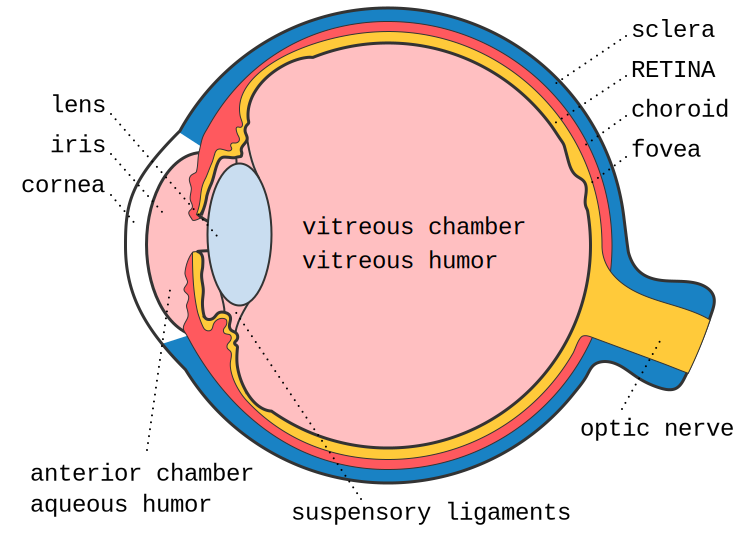

| section: cb-start
| theme: yellow
| height: 100vh

# <big><big><big><big><big><big style="color:var(--white)">CVD</big></big></big></big></big></big> 

#### ~Color Vision Deficiency / Color Blindness~

##### ~How to design information for people whose color perception is impaired.~

<!-- ~*(Richard Spencer, Kristin Kreer)*~ -->

<!-- <f-embed src="./menu.md" /> -->

<f-next-button title="Let's start" style="margin: var(--base8) 0;" />

<f-notes>

Teachers note

#### Aim

The students’ awareness should be raised for the problems people with color vision deficiency have to face in their everyday life. They should realize that it’s not only about the absence of certain colors and therefore being somehow “aesthetically impaired” by seeing less colors. Instead they should experience that not being able to see all colors can have a serious impact, because people might get the wrong information or no information at all.

</f-notes>

---

| section: cb-what
| 1 1
| 2 3
| 4 4
| 5 5

<f-inline>

<f-fact-icon size="large" />

# The definition

</f-inline>

-

## Color blindness

~People who are **totally color blind**, can only see things as **black and white** or in shades of gray. But total color blindness is very rare. **Most people, whose color perception is impaired, are color vision deficient**.~

-

## Color Vision Deficiency (CVD)

~People with **color vision deficiency** can see colors, but they have **difficulty differentiating between certain shades** of **reds and greens** or **blues and yellows**. CVD is more common than total color blindness.~

-

<f-hr />

-

<!-- <f-inline> -->

On the next pages we try to explain, how exactly does CVD affects vision, what happens in the eye and brain and what designers should know about it.

<f-next-button title="Next" style="flex:1;" />

<!-- </f-inline> -->

---

| height: 100vh
| section: cb-explore
| 1 1 2 2 

<!-- ##### EXPLORE -->
# So... CVD

  

<f-inline>

  ~This is an example, how a color vision deficient person (with protanopia, i.e. red blindness) could see tomatoes.~ 
  ~Actually there is only **one red tomato** in this picture~

</f-inline>

<!-- <f-icon :size="'large'" :icon="'Activity'" style="width:15vw;" /> -->
<f-inline>

# 🤔

~**Look at the tomatoes and try to guess which one of the tomatoes is already ripe, red and therefore edible.**~

</f-inline>

### &nbsp;

<button @click="()=>{set('revealX', 80); set('revealLocked', false);}" v-if="get('revealX') < 70">Check your answer</button>

 75">

   
   

  ~**Did you guess right? If you picked the right tomato, congratulations!**~
  
  <f-inline>
  
   # 🤢
  
  > ~For color deficient people choosing the wrong tomatoes can have serious consequences for their health, since unripe tomatoes are poisonous and can cause nausea and vomiting.~

  </f-inline>

  <small>~*BTW, you can also drag or click on the image to compare protanopia vs normal seeing*~</small>

   
   

  <f-next-button title="Next: go outside!" />

<f-notes>
  
  
Teachers note

  
  #### Aim

  ~Students explore which parts of their everyday life might cause problems for color vision deficient people. Therefore, we raise awareness for the need to also keep accessibility in mind when designing products which contain important information, which all people should be able to access.~

</f-notes>

-

<ColorblindnessJuxtapose 
  :imageUrl="'images/tomatoes-test__ps2.jpg'" 
  :revealed="get('revealX',0)" 
  :locked="get('revealLocked', true)" 
  :juxtId="'compare'" 
  :upload="false"
  :cbType="'Protanopia'"
  style="box-shadow:0 0 4px 0 hsla(0,0%,0%,0.3);padding:var(--base) var(--base2); border-radius:var(--base)" 
/>

---

| section: cb-safari
| id: cbSafari
| height: 100vh
| padding: 0
| gap: 0

| 1 2

  

  
  <f-inline>

  <f-activity-icon size="large" />

  # Photo safari

  </f-inline>

  #### &nbsp;

  ~Take a digital camera, e.g. the camera of your mobile phone, and go on a photo safari of your everyday life.~

  ~**Take pictures of objects, packagings, posters, signs, magazines, websites, texts etc. that you come across throughout your day. Only choose things which convey information.**~
  
  

  

    <f-next-button title="Analyze your photos" style="margin:var(--base2) 0 var(--base2) 0" />
  

-

<f-image src="images/explore-go-outside.jpg" />

<!-- 

 SSSSSS    IIIIIII    M     M    U     U    L           AAAA     TTTTTTT     OOOOO     RRRRRR 
S             I       M M  MM    U     U    L          A    A       T       O     O    R     R
 SSSSS        I       M  M  M    U     U    L          A    A       T       O     O    R     R
      S       I       M     M    U     U    L          AAAAAA       T       O     O    RRRRRR 
SSSSSS     IIIIIII    M     M     UUUUU     LLLLLLL    A    A       T        OOOOO     R    R

 -->

---

| section: cb-simulator
| height: 100vh
| id: cbSimulator
| 1 1 2 2 2
| 3 3 2 2 2

# CVD simulator

~Simulate CVD by applying different filters to the image. **Drag the red handlers or click on the image to see the difference**~

<f-card :title="get('cbType', 'Protanopia') == 'Protanopia' ? ' 👉 Simulating Protanopia' : 'Simulate Protanopia'" subtitle="missing RED" background="var(--lightergray)" color="var(--darkgray)" :style="get('cbType', 'Protanopia') == 'Protanopia' ? {background:'var(--lightblue)'} : {background:'var(--lightergray)'}" @click.native="set('cbType', 'Protanopia')" />

<f-card :title="get('cbType') == 'Deuteranopia' ? ' 👉 Simulating Deuteranopia' : 'Simulate Deuteranopia'" subtitle="missing GREEN" background="var(--lightergray)" color="var(--darkgray)" :style="get('cbType') == 'Deuteranopia' ? {background:'var(--lightblue)'} : {background:'var(--lightergray)'}" @click.native="set('cbType', 'Deuteranopia')" />

<f-card :title="get('cbType') == 'Tritanopia' ? ' 👉 Simulating Tritanopia' : 'Simulate Tritanopia'" subtitle="missing BLUE" background="var(--lightergray)" color="var(--darkgray)" :style="get('cbType') == 'Tritanopia' ? {background:'var(--lightblue)'} : {background:'var(--lightergray)'}" @click.native="set('cbType', 'Tritanopia')" />

##### &nbsp; 

<f-hr />

<f-inline>

<f-activity-icon size="large" />

~Analyze your images by answering <f-sidebar title="these questions" src="./cb-analyze-images.md" width="50vw" />~

</f-inline>

<f-hr />

<f-next-button style="margin:var(--base4) 0" />

-

<ColorblindnessJuxtapose 
  :imageUrl="get('cbSimImg', 'images/cb-subway__moscow.png')" 
  :revealed="25" 
  :locked="false"
  :cbType="get('cbType', 'Protanopia')"
  style="box-shadow:0 0 4px 0 hsla(0,0%,0%,0.3);padding:var(--base) var(--base2); border-radius:var(--base)"
/>
<!-- <button v-on:click="set('cbSimImg', 'images/crayons.png')">swap</button> -->

---

| 1 1 1
| 2 3 3
| 4 4 4

# Analyze results

<!-- <f-hr /> -->

-

~Now that you found out about possible weak spots in the color design of objects in your everyday life, have a closer look at it:~

-

##### ~**1** Find out what the main problem is regarding the color scheme.~
##### ~**2** Phrase a hypothesis on how this problem could be solved.~
##### ~**3** Are there also weak spots that can impair people with full color vision? In which way are they different from the other weak spots?~

-

<f-next-button />

---

| section: cb-facts

<f-embed src="./cb-facts.md" />

---

| section: cb-eye
| height: 100vh
| 1 2

<!-- ##### EXPLAIN  -->
# 👁️‍🗨️ The eye

<f-hr style="margin:var(--base6) 0" />

~When it comes to color vision, the **retina** is the part of the eye which is important.~
~It is at the back of the eye and contains two types of photoreceptor cells which detect light:~

#### ~Rods and cones.~

<f-next-button title="Rods and cones" style="margin:var(--base6) 0" />

-

<figure style="width:100%; height:100%; display:flex; justify-content:center; align-items: center; margin: 0;">
  
</figure>

---

| height: 100vh
| 1 2

<!-- ##### EXPLAIN  -->
# The eye
### Rods and cones

<f-hr style="margin:var(--base6) 0" />

~Rods and cones contain different light-sensitive pigments which absorb light and undergo a chemical change (“bleaching”) which releases energy. This results in increased permeability of photoreceptor membranes to sodium ions.~

~Sodium ions diffuse into the photoreceptors, creating a generator potential. If a threshold level is reached, an action potential is created in a nearby bipolar neuron. This connects to neurons in the optic nerve which carry impulses to the brain.~

~**Rods** are located in the peripheral parts of the retina and detect light, but not the color of light.
Rods are sensitive to dim light. The photosensitive pigment in rods (rhodopsin) bleaches at low light intensity.~

~**Cones** are found closely packed in the fovea. They contain the photosensitive pigment iodopsin.~
~There are three types which are sensitive to red, green and blue lights (see also RGB color model).~
~One cone joins one bipolar neuron, so that, compared to rods, they are less sensitive at low light intensity.~ 
~That’s why you can’t see colors in the dark.~

~(For more details, read the worksheets on The Eye).~

<f-next-button style="margin:var(--base6) 0" />

-

s

---

<!-- ##### EXPLAIN  -->
# The eye
## Tasks

<f-hr style="margin:var(--base6) 0" />

1. ~Have a look at the article about color vision on wikipedia.org:
https://en.wikipedia.org/wiki/Color_vision~

2. ~You learned that cones are responsible for color vision. There are three different types of cones. Find out how color perception works in the eye.~

3. ~In the text it says “color is not a property of electromagnetic radiation, but a feature of visual perception by an observer”. Find out what is meant by this (see “Subjectivity of color perception”).~

---

| section: cb-designer
| gap: 2vmin

| 1 1 1 1
| 2 3 4 5

<f-inline style="--base:8px; justify-content:space-between;">

#### Background color

<f-inline>
  

    

  

  

    <f-slider title="H" :value="get('h51', 44)" v-on:input="set('h51', $event)" to="360" integer />
    <f-slider title="S" :value="get('s51', 77)" v-on:input="set('s51', $event)" to="100" integer />
    <f-slider title="B" :value="get('b51', 100)" v-on:input="set('b51', $event)" to="100" integer />
  

</f-inline>

#### Heading color

<f-inline>
  

    

  

  

    <f-slider title="H" :value="get('h52', 44)" v-on:input="set('h52', $event)" to="360" integer />
    <f-slider title="S" :value="get('s52', 77)" v-on:input="set('s52', $event)" to="100" integer />
    <f-slider title="B" :value="get('b52', 77)" v-on:input="set('b52', $event)" to="100" integer />
  

</f-inline>

#### Text color

<f-inline>
  

    

  

  

    <f-slider title="H" :value="get('h53', 44)" v-on:input="set('h53', $event)" to="360" integer />
    <f-slider title="S" :value="get('s53', 77)" v-on:input="set('s53', $event)" to="100" integer />
    <f-slider title="B" :value="get('b53', 77)" v-on:input="set('b53', $event)" to="100" integer />
  

</f-inline>

</f-inline>

-

<Poster 
  :bgColor="hsb2hsl( get('h51',44), get('s51',77), get('b51',100) )" 
  :headingColor="hsb2hsl( get('h52',44), get('s52',77), get('b52',77) )" 
  :textColor="hsb2hsl( get('h53',44), get('s53',77), get('b53',77) )" 
  :type="'Normal'"
/>

-

<Poster 
  :bgColor="colorblind( hsb2hsl( get('h51',44), get('s51',77), get('b51',100) ), 'protanopia' )" 
  :headingColor="colorblind( hsb2hsl( get('h52',44), get('s52',77), get('b52',77) ), 'protanopia' )" 
  :textColor="colorblind( hsb2hsl( get('h53',44), get('s53',77), get('b53',77) ), 'protanopia' )" 
  :type="'Protanopia'"
/>

-

<Poster 
  :bgColor="colorblind( hsb2hsl( get('h51',44), get('s51',77), get('b51',100) ), 'deuteranopia' )" 
  :headingColor="colorblind( hsb2hsl( get('h52',44), get('s52',77), get('b52',77) ), 'deuteranopia' )" 
  :textColor="colorblind( hsb2hsl( get('h53',44), get('s53',77), get('b53',77) ), 'deuteranopia' )" 
  :type="'Deuteranopia'"
/>

-

<Poster 
  :bgColor="colorblind( hsb2hsl( get('h51',44), get('s51',77), get('b51',100) ), 'tritanopia' )" 
  :headingColor="colorblind( hsb2hsl( get('h52',44), get('s52',77), get('b52',77) ), 'tritanopia' )" 
  :textColor="colorblind( hsb2hsl( get('h53',44), get('s53',77), get('b53',77) ), 'tritanopia' )" 
  :type="'Tritanopia'"
/>

---

---

| id: contrast

| 1 1 1 1
| 2 2 2 3 
| 4 4 5 5

<!-- ##### EXPLAIN -->
# Color contrast and harmony

<f-hr style="margin:var(--base6) 0" />

-

## Task 3

Given are a headline and a text on a background. Choose the colors for the background, the headline and the text so that the palette fits to the article, the colors form a harmonious palette and the headline is more prominent than the text.

If possible, discuss your results with someone.

-

-

<f-hr style="margin:var(--base6) 0; visibility: hidden" />

<f-inline>

#### Background

<f-slider title="H" :value="get('h51', 44)" v-on:input="set('h51', $event)" from="0" to="360" integer />
<f-slider title="S" :value="get('s51', 77)" v-on:input="set('s51', $event)" to="100" integer />
<f-slider title="B" :value="get('b51', 100)" v-on:input="set('b51', $event)" to="100" integer />

#### Heading

<f-slider title="H" :value="get('h52', 44)" v-on:input="set('h52', $event)" to="360" integer />
<f-slider title="S" :value="get('s52', 77)" v-on:input="set('s52', $event)" to="100" integer />
<f-slider title="B" :value="get('b52', 77)" v-on:input="set('b52', $event)" to="100" integer />

#### Text

<f-slider title="H" :value="get('h53', 44)" v-on:input="set('h53', $event)" to="360" integer />
<f-slider title="S" :value="get('s53', 77)" v-on:input="set('s53', $event)" to="100" integer />
<f-slider title="B" :value="get('b53', 77)" v-on:input="set('b53', $event)" to="100" integer />

</f-inline>

-

<h1 :style="{
  color: hsb2hsl( get('h52',44), get('s52',77), get('b52',77) )
}">Halloo</h1>

Deutsches Ipsum Dolor meliore Hockenheim et Spezi Te Käsefondue utamur genau Exerci Donaudampfschiffahrtsgesellschaftskapitän eu Kaftfahrzeug-Haftpflichtversicherung Principes Hackfleisch eos Fußball His Wiener Schnitzel moderatius Deutsche Mark.

---

---

RYB wheel

<f-scene width="300" height="300" grid>
  <f-group :rotation="-195">
  <f-arc
    v-for="(c,i) in colorscale('yellow','blue', 6)" 
    :key="c+i"
    :fill="c"
    stroke
    :start-angle="(360 / 12 * i)"
    :end-angle="(360 / 12 * (i+1))"
    :r="2"
    :inner-radius="1"
  />
  <f-arc
    v-for="(c,i) in colorscale('blue','red', 6)" 
    :key="c+i"
    :fill="c"
    stroke
    :start-angle="(360 / 12 * i + 120)"
    :end-angle="(360 / 12 * (i+1) + 120)"
    :r="2"
    :inner-radius="1"
  />
  <f-arc
    v-for="(c,i) in colorscale('red','yellow', 5)" 
    :key="c+i"
    :fill="c"
    stroke
    :start-angle="(360 / 12 * i + 120 + 120)"
    :end-angle="(360 / 12 * (i+1) + 120 + 120)"
    :r="2"
    :inner-radius="1"
  />
  </f-group>
</f-scene>

---

| 1 1 1 1
| 2 3 3 3

## Color blindness types

-

<f-slider title="Slice count" set="c" from="8" to="64" integer />
  
-

  
  

  <b>Normal vision</b>  
  <f-scene width="150" height="150" grid>
    <f-group v-for="(count,i) in range(0,2)" :key="i">
    <f-arc
      v-for="(a,j) in range(0,360,360 / get('c',8))"
      :key="j"
      :fill="hsl(a,100,scale(count,0,2,30,70))"
      stroke
      :start-angle="a"
      :end-angle="a + (360 / get('c',8))"
      :r="scale(count,0,2,1,1.5)"
      :inner-radius="scale(count,0,2,1,1.5) - 0.25"
    />
    </f-group>
  </f-scene>
  

  

  <b>{{ type }}</b>  
  <f-scene  width="150" height="150" grid>
    <f-group v-for="(count,i) in range(0,2)" :key="i">
    <f-arc
      v-for="(a,j) in range(0,360,360 / get('c',8))"
      :key="j"
      :fill="colorblind(hsl(a,100,scale(count,0,2,30,70)), type)"
      stroke
      :start-angle="a"
      :end-angle="a + (360 / get('c',8))"
      :r="scale(count,0,2,1,1.5)"
      :inner-radius="scale(count,0,2,1,1.5) - 0.25"
    />
    </f-group>
  </f-scene>
  

---

| 1 1 1
| 2 3 4

## Contrast checker

-

<f-slider title="Background color hue" set="c1" integer />
<f-slider title="Foreground color brightness" set="c2" to="100" integer />

-

<h2>Halloo {{ contrast(hsl(get('c1',0)),hsl(0, 0, get('c2',0))) < 4.5 ? '⚠️' : ' ' }}</h2>

##### Contrast ratio: {{ contrast(hsl(get('c1',0)),hsl(0, 0, get('c2',0))) }}

Deutsches Ipsum Dolor meliore Hockenheim et Spezi Te Käsefondue utamur genau Exerci Donaudampfschiffahrtsgesellschaftskapitän eu Kaftfahrzeug-Haftpflichtversicherung Principes Hackfleisch eos Fußball His Wiener Schnitzel moderatius Deutsche Mark.

<button>Käsefondue</button>

-

<h2>Halloo {{ contrast(colorblind(hsl(get('c1',0))),colorblind(hsl(0, 0, get('c2',0))) ) < 4.5 ? '⚠️' : '' }}</h2>

##### Contrast ratio: {{ contrast(colorblind(hsl(get('c1',0))),colorblind(hsl(0, 0, get('c2',0)))) }}

Deutsches Ipsum Dolor meliore Hockenheim et Spezi Te Käsefondue utamur genau Exerci Donaudampfschiffahrtsgesellschaftskapitän eu Kaftfahrzeug-Haftpflichtversicherung Principes Hackfleisch eos Fußball His Wiener Schnitzel moderatius Deutsche Mark.

<button>Käsefondue</button>

