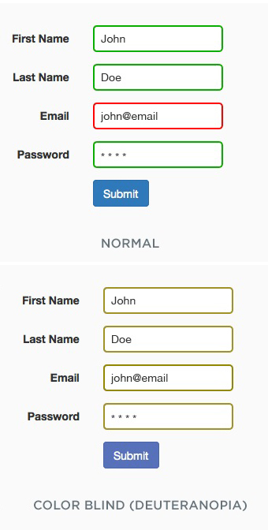

| section: cb-the-eye
| rows: auto
| cols: 2fr 3fr
| 1 1
| 2 3
| 4 3

<!-- ##### EXPLAIN  -->
# The eye

-

~When it comes to color vision, the **retina** is the part of the eye which is important.~
~It is at the back of the eye and contains two types of photoreceptor cells which detect light: **rods and cones**.~

-

<figure style="width:100%; height:100%; display:flex; justify-content:center; align-items: flex-start; margin: 0;">
  
</figure>

-

<f-next-button title="Rods and cones" />

---

| id: cb-rods-and-cones
| rows: auto
| height: 100vh
| 1 2
| 3 2

<!-- ##### EXPLAIN  -->

##### The eye
# Rods and cones

<!-- <f-hr style="margin:var(--base6) 0" /> -->

#### Task

1. ~Read through the text and find out about the difference between rods and cones.~

	
Click here to see the text

  
~Rods and cones contain different light-sensitive pigments which absorb light and undergo a chemical change (“bleaching”) which releases energy. This results in increased permeability of photoreceptor membranes to sodium ions.~

~Sodium ions diffuse into the photoreceptors, creating a generator potential. If a threshold level is reached, an action potential is created in a nearby bipolar neuron. This connects to neurons in the optic nerve which carry impulses to the brain.~

~**Rods** are located in the peripheral parts of the retina and detect light, but not the color of light.~
~Rods are sensitive to dim light. The photosensitive pigment in rods (rhodopsin) bleaches at low light intensity.~

~**Cones** are found closely packed in the fovea. They contain the photosensitive pigment iodopsin.~
~There are three types which are sensitive to red, green and blue lights (see also RGB color model).~
~One cone joins one bipolar neuron, so that, compared to rods, they are less sensitive at low light intensity.~ 
~That’s why you can’t see colors in the dark.~

2. ~You learned that cones are responsible for color vision. There are three different types of cones. Find out how these three cones work together to create color perception. You can find more information in the article about color vision on wikipedia.org:
https://en.wikipedia.org/wiki/Color_vision~

3. ~In the wikipedia article it says *Color is not a property of electromagnetic radiation, but a feature of visual perception by an observer*. Find out what this means (see the chapter on “Subjectivity of color perception”).~

-

<f-image src="./images/color_blindness_accessibility_6.jpg"  />

<!-- <figure style="width:100%; height:100vh; display:flex; justify-content:center; align-items: center; margin: 0; position:sticky; top: 0;">
  
</figure> -->

-

~On the next page, you can find out where your rods and cones are positioned.~
<f-next-button title="Mapping rods and cones" />

---

| rows: auto
| cols: 3fr 2fr
| 1 3
| 2 3

| id: cb-color-vision-mapper

##### The eye
# Mapping Rods and Cones Activity

Use this activity to map the rods and cones in your retina. Notice that when an object is first detected by rod cells located at the periphery of your retina, the object appears black. When the image is detected by cones cells located in the fovea the centre of your retina, the colour of the object becomes apparent.

 

<a href="cv-mapper/" target="_blank" class="tertiary">Open the mapping tool (separate tab)</a>

-

 

<f-next-button title="Next: Color Vision Deficiency" />

-

---

| id: cb-cvd
| rows: auto
| height: 100vh
| 1 3
| 2 3
| 4 4

<!-- ##### EXPLAIN  -->

##### The eye
# Color Vision   Deficiency

<!-- <f-hr style="margin:var(--base6) 0" /> -->

-

~I have a friend, whose name is Michael. He is colorblind. Red blind to be precise.
When we cook together, he always asks me, if meat is still edible, because whether meat is fresh or not, it always appears in a grey hue to him - like meat that is already off.~
~Michael also prefers to wear black clothes. Not because he is a Goth, but because that way, he can be sure not to appear ridiculous by wearing strange color combinations. He wants to avoid people staring at him.~
 

-
<figure style=" display:flex; flex-direction:column; justify-content:center; align-items:center; margin:0; position:sticky; top:15vh;">
  
</figure>

-

<f-next-button />

---

| id: cb-cvd
| rows: auto
| height: 100vh
| 1 2
| 1 2
| 3 3

<!-- ##### EXPLAIN  -->

##### The eye
# Color Vision   Deficiency

<!-- <f-hr style="margin:var(--base6) 0" /> -->

~Besides these minor problems, sometimes accessing information can be really hard for Michael: offline and online.~
~When he is new in a city and wants to take the subway, it is hard to read the maps, because they are color coded. Yes, in the end, he will take the right subway, but it takes him much longer than a person with average color vision.~
~Sometimes, however, it is nearly impossible for him to access information, like in the example on the right. Often, websites use colors to code functions or information. This is helpful for people with normal color vision, because we can navigate and get results much faster. But people like Michael are having a hard time, because they simply cannot see, what the website wants them to do. I remember Michael once sending me a screenshot, to find out what he was doing wrong while filling out an online form. He simply couldn't see the red marking which indicated that his input was faulty.~
~ <f-arrow-icon /> **But why does he have these problems?** What makes him different from a person with average color vision?~ 
~Let's find out.~

-

<figure style="display:flex; flex-direction:column; justify-content:center; align-items:center; margin:0; position:sticky; top:15vh;">
  
</figure>

-

<f-next-button />

---

| id: cb-cvd
| rows: auto
| height: 100vh
| 1 3
| 2 3
| 4 4

<!-- ##### EXPLAIN  -->

##### The eye
# Color Vision   Deficiency

<!-- <f-hr style="margin:var(--base6) 0" /> -->

-

#### Task

1. ~R
