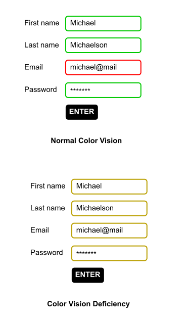
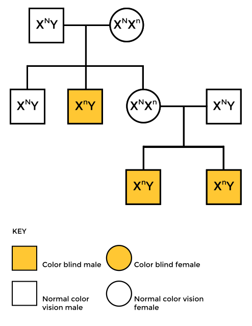
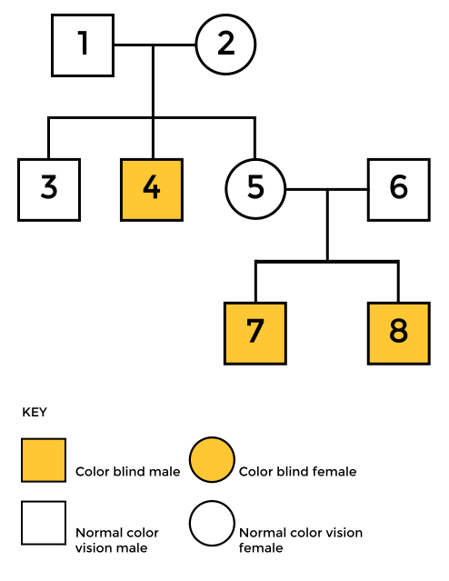

| chapter: The eye
| section: The eye
| id: cb-the-eye
| rows: auto
| cols: 2fr 3fr
| 1 1
| 2 3
| 4 3

<!-- ##### EXPLAIN  -->
## The eye

-

When it comes to color vision, the <var>retina</var> is the part of the eye which is important.
It is at the back of the eye and contains two types of photoreceptor cells which detect light: <var>rods and cones</var>.

1. *Besides the retina, there are other parts of the eye which are important for a functioning vision. On the right, you can see several terms that might be new to you. Find out what they mean online.*
2. *Further, find out what the terms *macula* and *black spot* mean (They are also connected to rods and cones, about which you will learn more on the next slide).*

-

<figure style="width:100%; height:100%; display:flex; justify-content:center; align-items: flex-start; margin: 0;">
  
</figure>

-

<f-next-button title="Rods and cones" />

---

| section: Rods and Cones
| id: cb-rods-and-cones

| 1 2
| 3 2

<!-- ##### EXPLAIN  -->

<caption>The eye</caption>

## Rods and cones

<!-- <f-hr style="margin:var(--base6) 0" /> -->

#### Task

1. *Read through the text and find out about the difference between rods and cones.*

    

      
Click here to see the text

      
    Rods and cones contain different light-sensitive pigments which absorb light and undergo a chemical change (“bleaching”) which releases energy. This results in increased permeability of photoreceptor membranes to sodium ions.

    Sodium ions diffuse into the photoreceptors, creating a generator potential. If a threshold level is reached, an action potential is created in a nearby bipolar neuron. This connects to neurons in the optic nerve which carry impulses to the brain.

    **Rods** are located in the peripheral parts of the retina and detect light, but not the color of light.
    Rods are sensitive to dim light. The photosensitive pigment in rods (rhodopsin) bleaches at low light intensity.

    **Cones** are found closely packed in the fovea. They contain the photosensitive pigment iodopsin.
    There are three types which are sensitive to red, green and blue lights (see also RGB color model).
    One cone joins one bipolar neuron, so that, compared to rods, they are less sensitive at low light intensity.
    That’s why you can’t see colors in the dark.
    
     
    
    You can find more information in this [worksheet](./files/designstem_cvd_worksheet_stem_color_perception.pdf).
    
    

2. *You learned that cones are responsible for color vision. There are three different types of cones. Find out how these three cones work together to create color perception. You can find more information in the article about color vision on wikipedia.org:*
https://en.wikipedia.org/wiki/Color_vision

3. *In the wikipedia article it says: "Color is not a property of electromagnetic radiation, but a feature of visual perception by an observer". Find out what this means (see the chapter on “Subjectivity of color perception”).*

-
<!--
<f-image src="./images/color_blindness_accessibility_6.jpg"  /> -->

<figure style="width:100%; height:90vh; display:flex; justify-content:center; align-items: center; margin: 0; position:sticky; top: 0;">
  
</figure>

-

On the next page, you can find out where your rods and cones are positioned:

<f-next-button title="Mapping rods and cones" />

---

| section: Tool for mapping rods and cones activity
| rows: auto
| cols: 3fr 2fr
| 1 3
| 2 3

| id: cb-color-vision-mapper

<caption>The eye</caption>

## Mapping Rods and Cones Activity

Use this activity to map the rods and cones in your retina. Notice that when an object is first detected by rod cells located at the periphery of your retina, the object appears black. When the image is detected by cones cells located in the fovea the centre of your retina, the colour of the object becomes apparent.

 

<a href="cv-mapper/" target="_blank" class="tertiary">Open the mapping tool (separate tab)</a>

-

 

<f-next-button title="Next: Color Vision Deficiency" />

<f-notes>

Teachers note

#### Aim

This is an additional task to go deeper into Rods and Cones, but is not necessary for the whole workshop. We added it for STEM teachers to go a bit deeper into "The eye" setting. So feel free to skip it with your class.

</f-notes>

---

| chapter: Color Vision Deficiency
| section: Life of a colorblind
| id: cb-cvd1
| rows: auto
| height: 100vh
| 1 3
| 2 3
| 4 4

<!-- ##### EXPLAIN  -->

<caption>Color Vision Deficiency</caption>

## Life of a colorblind

<!-- <f-hr style="margin:var(--base6) 0" /> -->

-

  
**I have a friend, whose name is Micha.** He is colorblind. Red blind to be precise.
When we cook together, he always asks me, if meat is still edible, because whether meat is fresh or not, it always appears in a grey hue to him - like meat that is already off.
Micha also prefers to wear black clothes. Not because he is a Goth, but because that way, he can be sure not to appear ridiculous by wearing strange color combinations. He wants to avoid people staring at him.

 

<f-next-button />

-

<figure style=" display:flex; flex-direction:column; justify-content:center; align-items:center; margin:0; position:sticky; top:15vh;">
  
</figure>

<f-notes>

Teachers note

#### Aim

Don't skip this topic - especially not if you are a design teacher. In this chapter, the students should not only develop empathy for people with a form of CVD, but also get some ideas on which colors are affected most. **They will need this information for later learning stations and for the final task!**

</f-notes>

-

---

| id: cb-cvd2
| rows: auto
| cols: 3fr 2fr
| height: 100vh
| 1 2
| 3 3

<!-- ##### EXPLAIN  -->

<caption>Color Vision Deficiency</caption>

## Life of a colorblind

<!-- <f-hr style="margin:var(--base6) 0" /> -->

Besides these minor problems, sometimes accessing information can be really hard for Micha: offline and online.
When he is new in a city and wants to take the subway, it is hard to read the maps, because they are color coded. Yes, in the end, he will take the right subway, but it takes him much longer than a person with average color vision.
Sometimes, however, it is nearly impossible for him to access information, like in the example on the right. Often, websites use colors to code functions or information. This is helpful for people with normal color vision, because we can navigate and get results much faster. But people like Micha are having a hard time, because they simply cannot see, what the website wants them to do. I remember Michael once sending me a screenshot, to find out what he was doing wrong while filling out an online form. He simply couldn't see the red marking which indicated that his input was faulty.

<f-arrow-icon /> **But why does he have these problems?** What makes him different from a person with average color vision?

 

**Let's find out.**
<f-next-button />

-

  

---

| section: Why are people colorblind?
| id: cb-cvd3
| rows: auto
| height: 100vh
| 1 2
| 3 3

<!-- ##### EXPLAIN  -->

<caption>Color Vision Deficiency</caption>

## Why are people colorblind?

<!-- <f-hr style="margin:var(--base6) 0" /> -->

#### Task

1. *Read through the text and find out about the different types of color blindness. Micha is red colorblind. What is the medical term for his condition and which colors does he have trouble seeing?*
    <!-- PLEASE NOTE: The two tabs in front of the whole block that is inside of this first list item 1. ensure, that the list is not broken and next block starts with 2. It's a silly hack, but right now it is so. -->
    <f-sidebar title="Open" overlay size="half">
      <a class="tertiary" style="margin-bottom:3vh;">Read about CVD <f-arrow-icon rotation="-45" /></a>
      
      

        
      ## Color Vision Deficiency
  
      Color Vision Deficiency (CVD) is commonly known as color blindness. It affects approximately 1 in 12 men (8%) and 1 in 200 women in the world.
  
      Complete color blindness, *Achromatopsia*, is very rare (affects approximately 3 in 100 000 people). This means that people only see black, white and shades of grey, because their cones don't function. Only their rods. In addition, they have a decreased visual acuity and are uncomfortable in bright environments. These problems occur, because rods actually are needed for vision during twilight, not during daylight. Further, cones are neccessary for sharp vision, but since they are missing in the macula, people with Achromatopsia don't see sharp. This is genetic defect, which cannot be cured.
  
      There are three types of CVD, depending on the cones that are affected. We differenciate between **Protanopia** (red cones), **Deuteranopia** (green cones) and **Tritanopia** (blue cones).
  
      **Protanopia** and **Deuteranopia** (and their milder versions **Protanomaly** and **Deuteranomaly**) are the more common forms of CVD, with Deuteranomaly being the most common. People with deuteranomaly and protanomaly are collectively known as **red-green color blind**. They have difficulty distinguishing between reds, greens, browns and oranges. They also commonly confuse different types of blue and purple.
  
      Protanopia and Deuteranopia are both caused by x-linked recessive alleles of genes for normal cone functioning. People with protanomaly do have red-sensitive cones but the photosensitive pigment they contain does not function. The same goes for deuteranomaly and green-sensitive cones.
  
      Males are much more likely to be red-green color vision deficient than females because males have the sex chromosomes XY, so have only one X chromosome. Therefore, to be color vision deficient, they need only one copy of the recessive allele for color blindness. In contrast, females have the sex chromosomes XX. Therefore, to be color blind, they would need two copies of the recessive allele, one on each X chromosome.
  
      **Tritanopia** and **Tritanomaly** are very rare color vision disturbances in which only the red and the green cone pigments are present, with a total absence of blue retinal receptors for Tritanopia. For Tritanomaly the S-cone is not missing, only malfunctioning. For people with tritanopia and tritanomaly, blue hues appear greenish, yellows and oranges appear pinkish and purple colors appear deep red.
  
      Most people with a form of CVD have a genetic defect. But color blindness can also be caused by brain or retinal damages, e.g. due to accidents which produce swelling of the brain. Sometimes CVD is due to retinal damage caused by diabetes, Vintamin A deficiency or age-related macular degeneration.
      

    </f-sidebar>

2. *Work out the genotypes of each individual, using the symbols <f-math inline> X^N </f-math> for an X chromosome with an allele for normal color vision, <f-math inline> X^n </f-math> for an X chromosome with an allele for red-green CVD, and Y for the Y chromosome, which carries no allele for color vision; see diagram on the right. <f-arrow-icon />*

3. *Red-green CVD is much more common in males, who always inherit the allele from their mother. State what the genotypes of the parents of a red-green color blind female would have to be.*

    

      
Check out the answers but don't cheat

       

      <ol>
      <li>

      The term for Micha's condition is Protanopia. He has problems distinguishing between reds, greens, browns and oranges. For a protanope, the brightness of red, orange, and yellow are much reduced compared to normal color vision. This dimming can be so pronounced that reds may be confused with black or dark gray, and red traffic lights may appear to be extinguished. They may learn to distinguish reds from yellows primarily on the basis of their apparent brightness or lightness, not on any perceptible hue difference. Violet, lavender, and purple are indistinguishable from various shades of blue because their reddish components are so dimmed as to be invisible. For example, pink flowers, reflecting both red light and blue light, may appear just blue to the protanope.
      
      </li>
        
      <li>
      <figure style="width:100%; height:100%; display:flex; justify-content:center; align-items: flex-start; margin: 0;">
        
      </figure>
      </li>
      <li>
      
      For a female to be color blind, her father would have to be <f-math inline> X^nY </f-math> and her mother would have to be <f-math inline> X^N X^n </f-math> (a *carrier* with normal color vision) or <f-math inline> X^n X^n </f-math> (color vision deficient herself). This is rare and more likely to happen in small or isolated populations where there is a higher frequency of cousin-cousin marriages.
      
      </li>
      </ol>
    

-

  

-

<f-next-button title="Color Mixing" />
