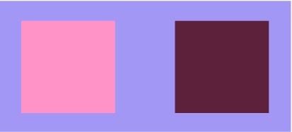
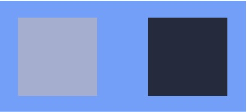
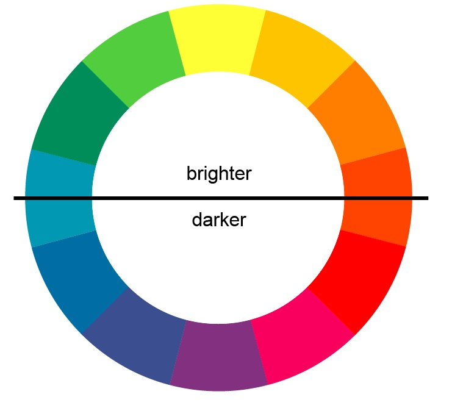
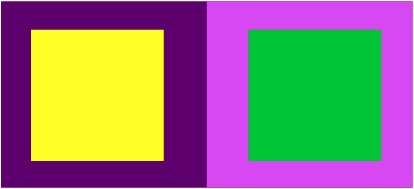
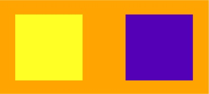

| chapter: Color contrast and harmony
| section: Contrast and harmony
| id: cb-contrast-and-harmony

<!--
| padding: 0
| gap: 0
-->

| rows: auto
| 1 2
| 3 2

<section style="padding:var(--content-padding)">
  
  ## Color contrast and harmony

  A single color has an emotional and physical effect, but placing it in context with other colors can alter this effect.
  
  Designers create contrasting or allied color relationships i.e. **palettes** to affect the viewer’s impression. They use contrasts and harmonies as stylistic devices.
  
  <blockquote style="background: none;">

  ~*“The color combinations called ‘harmonious’ in common speech usually are composed of closely similar chromas, or else of different colors in the same shades. They are combinations of colors that meet without sharp contrast.”*~
  
  
&mdash;Johannes Itten

  </blockquote>
  
  &nbsp;

  <f-next-button />

</section>

-

                                                             
<f-image src="./images/contrast-and-harmony-dots.jpg" style="background-position:50% 50%; min-height: 90vh;" />

---

<!--
| padding: 0
| gap: 0
-->

| rows: auto
| 1 2
| 3 2

<section style="padding:var(--content-padding); padding-bottom:0;">
  
  <!-- ##### EXPLAIN -->
  ## Color contrast and harmony

  But harmony not only exists if color combinations are made up by colors which are neighbours in the color wheel or by colors with the same hue but different brightness, like in this example.
  
  **Color contrasts can also be harmonious.** Don’t equate contrast and harmony with *disagreeable* and *agreeable*.

</section>

-

<f-image src="images/contrast-and-harmony-cereal.jpg" style="background-position:60% 50%; min-height:60vh; width:100%; height:100%;" />

-

<section style=" padding:var(--content-padding); padding-top:0;">
  <f-next-button />
</section>

---

<!--
| padding: 0
| gap: 0
-->

| rows: auto
| 1 2
| 3 2

<section style="padding:var(--content-padding); padding-bottom:0;">

## Color contrast and harmony

Color combinations with high contrasts can feel bolder and louder. They attract your attention much more than e.g. monochromatic color palettes. But that doesn’t always mean that they are less harmonious.

This example shows a **complementary contrast** of red and blue hues.

It feels bolder and louder than the last picture with the cereal bowl, but still harmonious and pleasing to the eye.

Therefore, don’t mix up color contrast with discord. Even loud and bold color combinations can feel harmonious.

</section>

-

<f-image src="images/contrast-and-harmony-candystore.jpg" style="background-position:50% 50%; min-height:60vh; width:100%; height:100%;" />

-

<section style="padding:var(--content-padding); padding-top:0;">
  <f-next-button />
</section>

---

| section: Johannes Itten
| id: cb-itten

<!--
| padding: 0
| gap: 0
-->

| rows: auto
| 1 2
| 3 2

<section style="padding:var(--content-padding); padding-bottom:0;">

<caption>Color contrast and harmony</caption>

## Itten's contrasts

**Johannes Itten**, who taught at Bauhaus between 1919 and 1923, tried to describe the relationship of colors and defined seven different color contrasts. In 1961, he also designed his famous color wheel, which you have probably already seen at some point. By using this color wheel, you can describe all of his contrasts.

#### Tasks

1. ~Find out about the definitions and examples of the following contrasts online.~
2. ~Find out how these contrasts work and which effect they have.~

- ##### Contrast of hue
- ##### Light-dark contrast
- ##### Cold-warm contrast
- ##### Complementary contrast
- ##### Simultaneous contrast
- ##### Contrast of saturation
- ##### Contrast of extension

#### Extra task:
~Look at your daily surroundings more closely and try to find Itten's color contrasts in magazines, posters, on websites and everywhere, where there is color design. Which purpose do the contrasts serve? Analyse them, keeping the target group and product in mind!~

</section>

-
<figure style="width:100%; height:100vh; display:flex; justify-content:center; align-items: center; margin: 0; position:sticky; top: 0; padding:var(--content-padding)">
  
</figure>

<!--
<f-image src="images/cvd_itten_colorwheel.svg" style="background-position:50% 50%; min-height: 90vh;" />
-->

<!--
<f-image src="images/johannes-itten.jpg" style="background-position:50% 10%; min-height:60vh; width:100%; height:100%;" />
-->
-

<section style="padding:var(--content-padding);">
  <f-next-button />
</section>

---

| section: TASK: Find the contrasts
| id: cb-task1
| rows: auto
| cols: 2fr 3fr
| 1 1
| 2 3
| 4 4

<!-- ##### EXPLAIN -->
<caption>Color contrast and harmony</caption>

## <f-activity-icon size="medium" /> Find the contrasts 1

<!-- <f-hr  style="margin:var(--base6) 0" /> -->

-

After you found out about Itten's contrasts, look at the pictures on the next pages and match the contrasts with the pictures. **Don't cheat** by being lazy and clicking on the answer key first! You're better than that. 😉  

~Which contrasts do you see?~

<ContrastQuiz :input="[ 
  ['Contrast of hue',         0], 
  ['Light-dark contrast',     1], 
  ['Cold-warm contrast',      1],
  ['Complementary contrast',  1],
  ['Simultaneous contrast',   0],
  ['Contrast of saturation',  1],
  ['Contrast of extension',   0]
]" />

-

<f-image src="images/contrast-and-harmony-lake.jpg" style="background-position:85% 50%; min-height:60vh; width:100%; height:100%;" />

-

<f-next-button />

---

| rows: auto
| cols: 2fr 3fr
| 1 1
| 2 3
| 4 4

<!-- ##### EXPLAIN  -->
<caption>Color contrast and harmony</caption>

## <f-activity-icon size="medium" /> Find the contrasts 2

-

~How many color contrasts can you identify in this example?~ 

<ContrastQuiz :input="[ 
  ['Contrast of hue',         0], 
  ['Light-dark contrast',     1], 
  ['Cold-warm contrast',      1],
  ['Complementary contrast',  1],
  ['Simultaneous contrast',   0],
  ['Contrast of saturation',  0],
  ['Contrast of extension',   1]
]" />

-

<f-image src="images/contrast-snow.png" style="background-position:70% 50%; min-height:60vh; width:100%; height:100%;" />

-

<f-next-button />

---

| rows: auto
| cols: 2fr 3fr
| 1 1
| 2 3
| 4 4

<!-- ##### EXPLAIN  -->
<caption>Color contrast and harmony</caption>

## <f-activity-icon size="medium" /> Find the contrasts 3

-

~One last example for you to prove that you are *Itten worthy*. Easy, isn't it?~ 🤔

<ContrastQuiz :input="[ 
  ['Contrast of hue',         0], 
  ['Light-dark contrast',     1], 
  ['Cold-warm contrast',      0],
  ['Complementary contrast',  0],
  ['Simultaneous contrast',   1], 
  ['Contrast of saturation',  1],
  ['Contrast of extension',   1]
]" />

-

<f-image src="images/contrast-red.png" style="background-position:30% 50%; min-height:60vh; width:100%; height:100%;" />

-

<f-next-button />

---

| section: Color palettes
| id: cb-wheels
| theme: dark
| cols: 3fr 2fr
| 1 3
| 2 3
| 4 3

<!-- ##### EXPLAIN  -->
<caption>Color contrast and harmony</caption>

## Complementary palette

-

In order to create a harmonious color palette, you can also use the color wheel.

**Complementary colors** are high in contrast and have a very bold and aggressive effect.

&nbsp;

#### Hint:
You can change the position of the white dots around the color wheel to get new complementary colors.
**Try it!** 🧐

-

<ColorPaletteWheel name="Complementary" />

-

<f-next-button  />

---

| id: split-complementary
| theme: dark
| rows: auto
| cols: 3fr 2fr
| 1 3
| 2 3
| 4 3

<!-- ##### EXPLAIN  -->
<caption>Color contrast and harmony</caption>

## Split complementary palette

-

If you want a color palette which is more harmonious than complementary palette, but still bold, you might want to try a **split complementary palette**.
&nbsp;
**Remember**, the example on the right is only for one level of brightness and saturation. Of course, you can and should also alter the brightness and/or saturation of the color palette. Maybe choose one bold color that should really stand out (your primary color) and then alter the other colors so that they form a hierarchy, their contrast is still high enough, without feeling disharmonious.
The same goes for each color palette that you create.

-

<ColorPaletteWheel name="SplitComplementary" />

-

<f-next-button  />

---

| id: double-complementary-triadic
| theme: dark
| rows: auto
| cols: 1fr 2fr 2fr
| 1 1 1
| 2 3 4
| 5 5 5

<!-- ##### EXPLAIN  -->
<caption>Color contrast and harmony</caption>

## Double complementary and triadic palettes

-

Besides split comple&shy;mentary palettes, there are also **double comple&shy;mentary** and **triadic palettes** which form bold contrasts.
**Please, scroll down to get more information.**

-

<ColorPaletteWheel name="DoubleComplementary" />

As for double comple&shy;mentary palettes be careful not to use equal volumes of the four colors. This can have a piercing effect.

-

<ColorPaletteWheel name="Triadic" sectors="24" />

Triads with primary colors are garish. You get softer palettes with secondary or tertiary colors.

-

<f-next-button  />

---

| id: analoguous
| theme: dark
| rows: auto
| cols: 3fr 2fr
| 1 3
| 2 3
| 4 3

<!-- ##### EXPLAIN  -->
<caption>Color contrast and harmony</caption>

## Analoguous palette

-

**Analogous palettes** are pleasing to the eye, because they are build by colors with similar light ray wavelengths. In the color wheel, they are equally spaced from each other.
Again, remember to alter brightness and saturation to receive a more prominent or harmonious effect.

-

<ColorPaletteWheel name="Analoguous" />

-

<f-next-button  />

---

| id: monochromatic
| theme: dark
| rows: auto
| cols: 3fr 2fr
| 1 3
| 2 3
| 4 3

<!-- ##### EXPLAIN  -->
<caption>Color contrast and harmony</caption>

## Monochromatic palette

-

**Monochromatic palettes** have an even softer effect than analogous palettes, but they are also less prominent.

For monochromatic palettes, you combine one hue with its different shades, either formed by variation of brightness or saturation.

-

<ColorPaletteWheel name="Monochromatic" />

-

<f-next-button  />

---

| id: task2
| theme: dark
| rows: auto
| 1 2 2
| 3 4 5
| 6 6 6

<!-- ##### EXPLAIN -->
<caption>Color contrast and harmony</caption>

## <f-activity-icon size="medium" /> Your turn!

-

#### Change the given color palette so that:

~It stays as closely as possible to the original hues and~
~a) the palette is **more harmonious**~ or
~b) the palette is **more prominent**~.

Keep in mind that colors influence one another (*see Itten's simultaneous contrast*). A color e.g. can appear colder or warmer, brighter or darker next to another color.

-

<f-scene responsive width="400" height="200">
  <f-box 
    width="8"
    height="4"
    stroke="none"
    :fill="hsb2hsl( get('h11', 300), get('s11', 100), get('b11', 100) )"
  />
</f-scene>

<f-slider :value="get('h11', 300)" v-on:input="set('h11',$event)" from="0" to="360" integer title="H" />
<f-slider :value="get('s11', 100)" v-on:input="set('s11',$event)" from="0" to="100" integer title="S" />
<f-slider :value="get('b11', 100)" v-on:input="set('b11',$event)" from="0" to="100" integer title="B" />

-

<f-scene responsive width="400" height="200">
  <f-box 
    width="8"
    height="4"
    stroke="none"
    :fill="hsb2hsl( get('h21', 120) , get('s21', 100), get('b21', 100) )"
  />
</f-scene>

<f-slider :value="get('h21', 120)" v-on:input="set('h21',$event)" from="0" to="360" integer title="H" />
<f-slider :value="get('s21', 100)" v-on:input="set('s21',$event)" from="0" to="100" integer title="S" />
<f-slider :value="get('b21', 100)" v-on:input="set('b21',$event)" from="0" to="100" integer title="B" />

-

<f-scene responsive width="400" height="200">
  <f-box 
    width="8"
    height="4"
    stroke="none"
    :fill="hsb2hsl( get('h31', 180) , get('s31', 100), get('b31', 100) )"
  />
</f-scene>

<f-slider :value="get('h31', 180)" v-on:input="set('h31',$event)" from="0" to="360" integer title="H" />
<f-slider :value="get('s31', 100)" v-on:input="set('s31',$event)" from="0" to="100" integer title="S" />
<f-slider :value="get('b31', 100)" v-on:input="set('b31',$event)" from="0" to="100" integer title="B" />

-

> Use the knowledge about contrasts and harmonies which you just found out about. 
If possible, **exchange and discuss your results** with someone else.

<f-next-button style="margin:var(--base4) 0;" />

---

| rows: auto
| cols: 1fr 2fr 2fr
| 1 1 3
| 2 2 3
| 4 4 3

<caption>Color palettes</caption>

## <f-activity-icon size="medium" /> Create a palette

~Choose the colors for the background, the headline and the text so that the palette fits to the article, the colors form a harmonious palette and the headline is more prominent than the text.~
> Please, **take a screenshot of your final colors' HSB values** for later! 👈

-

<color-mixer v-show=" get('activeEl', 'el1') == 'el1' " colorModel="HSB" outputID="col1-" key="mixer1" :values="[44, 77, 100]" title="Background color" />
<color-mixer v-show=" get('activeEl') == 'el2' "colorModel="HSB" outputID="col2-" key="mixer2" title="Heading color" :values="[44, 77, 77]" />
<color-mixer v-show=" get('activeEl') == 'el3' "colorModel="HSB" outputID="col3-" key="mixer3" title="Text color" :values="[44, 77, 50]" />

&nbsp;

<!-- <f-inline> -->
  <f-toggle title="Background" v-on:click.native="set('activeEl', 'el1')" :value="get('activeEl', 'el1') == 'el1' ? 1 : 0 " />
  <f-toggle title="Heading color" v-on:click.native="set('activeEl', 'el2')" :value="get('activeEl') == 'el2' ? 1 : 0 " />
  <f-toggle title="Text color" v-on:click.native="set('activeEl', 'el3')" :value="get('activeEl') == 'el3' ? 1 : 0 " />
<!-- </f-inline> -->

-

<h1 :style="{
  color: hsb2hsl( get('col2-1',44), get('col2-2',77), get('col2-3',77) )
  }"
  :class="
    get('activeEl') == 'el2' ? 'marchingants--active' : 'marchingants'  
  "
  @click.prevent="set('activeEl', 'el2')"
>Discover nature</h1>

If you love nature, walks in the woods, mountain peaks reflected in lake waters, wildlife sanctuaries for observing animals in their own habitat, a whole range of flora... plan a holiday in the mountains!

-

> If possible, discuss your results with someone, i.e. *why did you choose a certain combination*, *how does it fit to the topic* and *does your result fulfill the criteria of the task*?

<f-next-button />

---

| gap: 1vmin
| rows: auto

| 1 1 1 1
| 2 2 3 3
| 4 4 4 4
| 6 7 8 9
| 5 5 5 5

<caption>Color palettes</caption>

## <f-activity-icon size="medium" /> CVD compatible palette

-

Earlier, we learned that people with color vision deficiencies cannot see certain colors, therefore it is hard for them to sometimes access information, especially when texts are written using colors other than black, or are placed on colorful backgrounds other than just white. Now we will find out what it needs to get functioning color schemes for people with CVD.

-

  
> **Hints**: For this task, you need the HSB values of the last task! Also, take screenshots of your results on this page in between, to compare them later and to have a future reference for the final task of this workshop.

-
 

#### Open the tasks in the sidebar: 

<f-sidebar title="Click me!" overlay size="half">

  1. ~Adjust the background, headline and text colors, **so that they match your HSB values of the last task**. Does your color palette work for people with Protanopia, Deuteranopia and Tritanopia? If not, try to make it work, by altering your colors' values.~
  2. ~Adjust the colors, so that the results in Protanopia, Deuteranopia and Tritanopia is bad, and I mean *really bad* 💩. Try to find out which color combinations don't work well.~
  3. ~Adjust the colors, so that the results in all three color vision deficiencies is the best you can get. How many combinations can you find for this task?~
  4. ~Analyse the results and form a conclusion based on the following questions: *When do color palettes work well for color vision deficient people? What do we need to pay attention to, when creating them?*~

</f-sidebar>

 

-

<f-inline>
  

    <ColorMixer v-show=" get('pactive', 'p1') == 'p1' " colorModel="HSB" outputID="pcol1-" key="pmixer1" :values="[44, 77, 100]" title="Background color" />
    <ColorMixer v-show=" get('pactive') == 'p2' "colorModel="HSB" outputID="pcol2-" key="pmixer2" title="Heading color" :values="[44, 77, 77]" />
    <ColorMixer v-show=" get('pactive') == 'p3' "colorModel="HSB" outputID="pcol3-" key="pmixer3" title="Text color" :values="[44, 77, 50]" />
  

  
  

  <f-toggle title="Background" v-on:click.native="set('pactive', 'p1')" :value="get('pactive', 'p1') == 'p1' ? 1 : 0 " />
    <f-toggle title="Heading color" v-on:click.native="set('pactive', 'p2')" :value="get('pactive') == 'p2' ? 1 : 0 " />
    <f-toggle title="Text color" v-on:click.native="set('pactive', 'p3')" :value="get('pactive') == 'p3' ? 1 : 0 " />
  

</f-inline>

 

<f-next-button title="Design time!" />

#### &nbsp;

-

<Poster 
  :bgColor="hsb2hsl( get('pcol1-1',44), get('pcol1-2',77), get('pcol1-3',77) )" 
  :headingColor="hsb2hsl( get('pcol2-1',44), get('pcol2-2',77), get('pcol2-3',77) )" 
  :textColor="hsb2hsl( get('pcol3-1',44), get('pcol3-2',77), get('pcol3-3',77) )" 
  :type="'Normal'"
/>

-

<Poster 
  :bgColor="colorblind( hsb2hsl( get('pcol1-1',44), get('pcol1-2',77), get('pcol1-3',77) ), 'protanopia' )" 
  :headingColor="colorblind( hsb2hsl( get('pcol2-1',44), get('pcol2-2',77), get('pcol2-3',77) ), 'protanopia' )" 
  :textColor="colorblind( hsb2hsl( get('pcol3-1',44), get('pcol3-2',77), get('pcol3-3',77) ), 'protanopia' )" 
  :type="'Protanopia'"
/>

-

<Poster 
  :bgColor="colorblind( hsb2hsl( get('pcol1-1',44), get('pcol1-2',77), get('pcol1-3',77) ), 'deuteranopia' )" 
  :headingColor="colorblind( hsb2hsl( get('pcol2-1',44), get('pcol2-2',77), get('pcol2-3',77) ), 'deuteranopia' )" 
  :textColor="colorblind( hsb2hsl( get('pcol3-1',44), get('pcol3-2',77), get('pcol3-3',77) ), 'deuteranopia' )" 
  :type="'Deuteranopia'"
/>

-

<Poster 
  :bgColor="colorblind( hsb2hsl( get('pcol1-1',44), get('pcol1-2',77), get('pcol1-3',77) ), 'tritanopia' )" 
  :headingColor="colorblind( hsb2hsl( get('pcol2-1',44), get('pcol2-2',77), get('pcol2-3',77) ), 'tritanopia' )" 
  :textColor="colorblind( hsb2hsl( get('pcol3-1',44), get('pcol3-2',77), get('pcol3-3',77) ), 'tritanopia' )" 
  :type="'Tritanopia'"
/>

---

| id: cb-contrasts

<!--
| padding: 0
| gap: 0
-->

| rows: auto
| 1 2
| 3 2

<section style="padding:var(--content-padding)">

<caption>Color palettes</caption>

## Palettes for CVD

&nbsp;

After you have tried out different color schemes, let's summarize what you found out and draw some conclusions about color design for people with color vision deficiency.

1. ~Look at the last task on the last page (task 4 on *CVD compatible palette*) and review what you found out.~
2. ~When you are really sure that you have come up with your own conclusion, click on the following link. **Don't cheat!**~

<f-sidebar  overlay size="half">

&nbsp; 

<button>Click me when you're ready!</button>

  
  **In order to get color schemes that work for nearly everyone, you need to pay attention to the following guideline.**
    
  &nbsp;
    
  ~Try to increase the difference between foreground and background colors as much as possible. Further, avoid colors that are next to each other in the color wheel and close in brightness. The first example compares a bad color combination (on the left), to a better one (on the right). Below it, you can see how it would look like to a colorblind person with Protanopia.~
  <figure style="width:100%; height:100%; display:flex; justify-content:center; align-items: flex-start; margin: 0;">
    
  </figure>
  <figure style="width:100%; height:100%; display:flex; justify-content:center; align-items: flex-start; margin: 0;">
    
  </figure>
    
  &nbsp;
    
  ~Next, colors can have the same saturation and brightness, and still feel darker or lighter than others. Look at the color wheel below. You should choose dark color hues from the bottom and add them to light color hues from the top half. Never use light colors from the bottom half, against dark colors from the top one. Good example on the left, bad one on the right.~
  
  <figure style="width:100%; height:100%; display:flex; justify-content:center; align-items: flex-start; margin: 0;">
    
  </figure>
  
  <figure style="width:100%; height:100%; display:flex; justify-content:center; align-items: flex-start; margin: 0;">
    
  </figure>
  
  &nbsp;
    
  ~Don't use colors that are neighbors in the color wheel. Try to choose colors that are as far away from each other as possible. This increases the contrast.~
    
  <figure style="width:100%; height:100%; display:flex; justify-content:center; align-items: flex-start; margin: 0;">
    
  </figure>
    
  &nbsp;
    
  ~**On the whole, try to make colors differ more dramatically in hue, saturation and brightness, than you would usually do for a person with average color vision.** This helps create stronger contrasts that also work for people with a CVD.~

  
  
</f-sidebar>

</section>

-

<f-image src="./images/cvb_arrow.jpg" style="background-position:50% 50%; min-height: 90vh;" />

-

<section>
    <f-next-button />
</section>

---

<!--

PPPPPP      AAAAA     L          EEEEEEE    TTTTTTT    TTTTTTT    EEEEEEE 
P     P    A     A    L          E             T          T       E      
P     P    A     A    L          EEEEE         T          T       EEEEE
PPPPPP     AAAAAAA    L          E             T          T       E      
P          A     A    LLLLLLL    EEEEEEE       T          T       EEEEEEE

-->

| id: cb-palettes

<!--
| padding: 0
| gap: 0
-->

| rows: auto
| 1 2
| 3 2

<section style="padding:var(--content-padding)">

<caption>Color palettes</caption>

## <f-fact-icon size="medium" /> Tips!

Creating color palettes with more than two or three colors takes time, patience and reviewing. Often you need to start from the beginning, because the palette just doesn't work. Here are some tips you should keep in mind when building a color palette. Reading them carefully might make your life a bit easier 😎:

  
 Figure out the purpose

  Analyse the product and the target group for which you are going to design. Are there typical colors already in use by similar products?

  
 Review color basics

  
  Make sure you remember all the basics about the three properties of color, color meanings, color contrast and harmony, before you get started.

  

  
 Choose a dominant color, then accent colors

  
  First, decide for a color for the largest areas (e.g. the background color), then choose an accent color. If there is a corporate color, choose the dominant color with it in mind.

  
 Select shades, then vary them

  
  Play with saturation and brightness to create different effects (cheerful, dramatic, cold, warm etc.).

  
 Look at compati&shy;bility of hues

    
  Review the color combi&shy;nations and contrasts. Are they **pleasing**? Are they **piercing**? Maybe you can use **split comple&shy;mentary** palettes instead to make the contrast softer.

  
  
 Limit the number of colors

  Two or three colors are mostly enough. More can get too complex. If you choose more than three colors for a palette, be careful. Always have **dominant colors** and some colors for the back&shy;ground. Decide if you really need them all, or if you can limit your palette more.

  

  
 Put the colors into action 

  e.g. in a mock-up, so that you can better judge whether your color palette works.

 
  
&nbsp;

<f-next-button />

</section>

-

<f-image src="./images/cvb_brushes.jpg" style="background-position:50% 50%; min-height: 90vh;" />

---

| id: cb-learningstationsummary
| padding: 0
| gap: 0
| rows: auto
| 1 2
| 3 2

<section style="padding:var(--content-padding)">

<caption>Learning Station Summary</caption>

## <f-fact-icon /> What's next?

&nbsp;

You leveled up and are close to the finish line. You learned a lot, but **the big endgame is still before you**.
Gather your knowledge and skills on *accessibility, the eye, color vision deficiency, color mixing, the properties of color, color contrasts and color palettes* to prove in a final task, that you have the ability to design well working color palettes for people with CVD.

On the next slide, **you may choose the path that you want to take: STEM or Design.**

**Choose wisely.** 🧐

</section>

-

<f-image src="./images/cvd_finishline.jpg" style="background-position:50% 50%; min-height: 90vh;" />

-

<section>
  <f-next-button />
</section>
