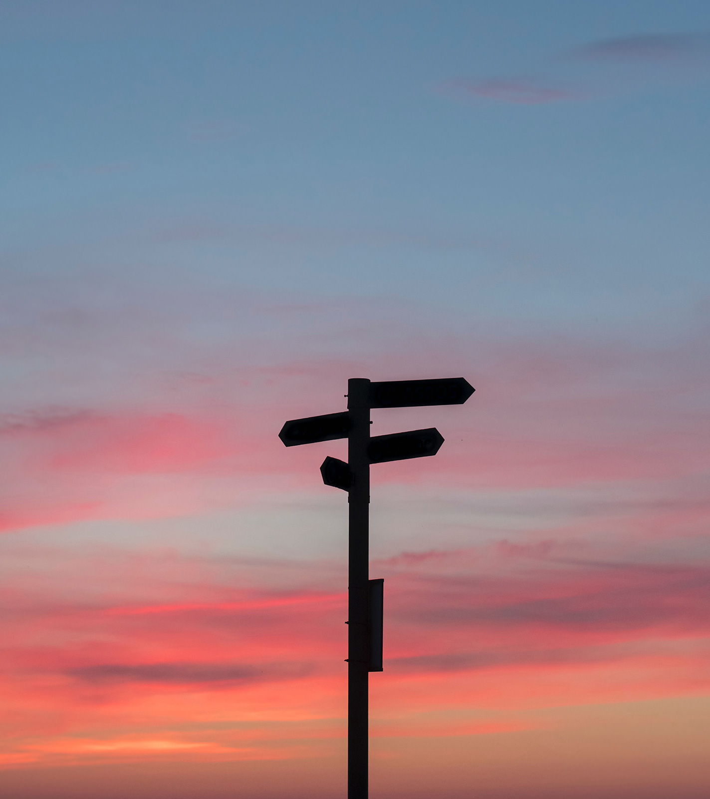
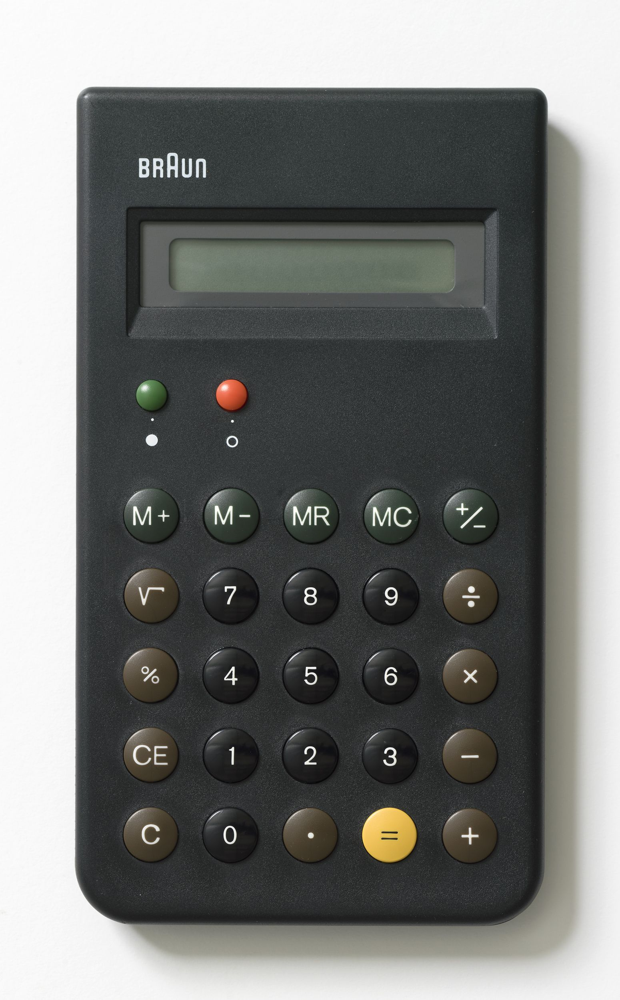

| section: cb-workshop
| rows: auto
| 1 2

<!-- ##### Elaborate Overview  -->
## Final task

~Now that you found out about the different topics surrounding designing for colorblind, it's time for some action.
There are two different paths that you could take for the final task.
Either you could choose the STEM or the DESIGN focus.~

~*The STEM path is for all students who don't have any access to or knowledge about design software (like Photoshop or Illustrator).
Whereas the DESIGN path requires you to also use design software. For the STEM path you only need some paper, brushes and watercolors*.~

#### ~Choose your path:~

<button class="primary" v-on:click="send('goto', 'cb-workshop-stem')">STEM path</button>

<button class="primary" v-on:click="send('goto', 'cb-workshop-design')">DESIGN path</button> 

-

<figure style="width:100%; display:flex; flex-direction:column; justify-content:center; align-items:center; margin:0; position:sticky; top:15vh;">
  
</figure>

<f-notes>
  
  
Teachers notes

  
  ### Hint for teachers. 
  ~The design object on which students test their knowledge can be diverse and adjusted to the subject. For example, you could also focus on the following objects:~
   
* Posters
* Brochures
* Diagrams
* Infographics
* Websites
* Packaging
* Game design
 
~Whenever information needs to be conveyed visually, we have to think about accessibility, because it is not only about aesthetics anymore. It’s about enabling the target group to get the information they need. Therefore many products are suitable as learning objects for this project and can be adjusted to the students’ level. Feel free to use the following tasks as basis for your own.~

</f-notes>

---

| id: cb-workshop-stem
| rows: auto
| 1 1
| 2 3
| 4 3

<!-- ##### Elaborate STEM students -->
## Workshop STEM

-

~Congratulations! You chose the STEM path and this is your quest:
Create a new color scheme for a calculator with white buttons, which also works for people with color vision deficiency.~

 

1. ~**Product**: First, group the buttons and find hierarchies. Which are important buttons that you use often? How many different colors would you need?~
2. ~**Color design**: Decide upon a color scheme which also works for color blind people with protanopia and deuteranopia.~
3. ~**Mockup**: Mix the colors you chose with watercolors and paint in the white buttons on the [calculator worksheet](./files/designstem_cvd_worksheet_stem.pdf).~

 

> Hint: ~If you cannot work with watercolors, you might want to try the following <a href="#" v-on:click="goto('cb-calc')">online tool</a>. It is a bit more difficult to work with than watercolors, but it basically works like the color mixing tools you used in the tasks before. Click on *Edit* under a color, to change it (upper right). Then click on a calculator button to select it and next on the color you want to apply. After working on the button, you should deselect it. You can also select several buttons at the same time. Further, you can switch the label color between black and white. When you are happy with your color scheme, take a screenshot of it, to save it for later!~

-

<figure style="width:100%; display:flex; flex-direction:column; justify-content:center; align-items:center; margin:0; position:sticky; top:15vh;">
  
  <figcaption>
  
  *This is the model calculator*
  
  </figcaption>
</figure>

-
<button class="primary" v-on:click="send('goto', 'cb-workshop-test')">Test your design</button>

---

| id: cb-calc

<calculator-designer />

---

| id: cb-workshop-design
| rows: auto
| 1 1
| 2 3
| 4 3

<!-- ##### Elaborate DESIGN students -->
## Workshop DESIGN

-

~Congratulations! You chose the DESIGN path and this is your quest:
Design a calculator app that works for people with color vision deficiency, but at the same time will be appealing to people with normal color vision.~

 

1. ~**Product**: First, group the buttons and find hierarchies. Which are important buttons that you use often? How many colors would you need for your color scheme?~
2. ~**Target group**: Think about who will use it. What is most important to them? How does that affect your design?~
3. ~**Layout**: Scribble a layout for your calculator app. Use the calculator displayed here as a reference.~
4. ~**Color design**: Decide upon a color scheme which also works for color blind people with protanopia and deuteranopia.~
5. ~**Mockup**: Make a mockup of your design in a graphic program and apply your color scheme to it.~

 

-

<figure style="width:100%; display:flex; justify-content:center; flex-direction:column; align-items: center; margin: 0; position:sticky; top:15vh;">
  
  <figcaption>This is the model calculator</figcaption>
</figure>

-

<button class="primary" v-on:click="send('goto', 'cb-workshop-test')">Test your design</button>

---

<!--

EVALUATE PHASE

-->

| rows: auto
| id: cb-workshop-test
| 1 2
| 3 2

<!-- ##### Evaluate testing  -->
## Test your design

 

~Lets see how well your design works for people with color vision deficiency.
Upload your picture into the CVD-simulator and check whether it works.~

<f-card :title="get('cbType', 'protanopia') == 'protanopia' ? 'Simulating Protanopia 👉' : 'Simulate Protanopia'"   background="var(--lightergray)" color="var(--darkgray)" style="margin-bottom:calc(var(--base)*0.5); height:auto;" :style="get('cbType', 'protanopia') == 'protanopia' ? {background:'var(--lightblue)'} : {background:'var(--lightergray)'}" @click.native="set('cbType', 'protanopia')">

reduced sensitivity to <b>RED</b> light

</f-card>

<f-card :title="get('cbType') == 'deuteranopia' ? 'Simulating Deuteranopia 👉' : 'Simulate Deuteranopia'" background="var(--lightergray)" color="var(--darkgray)" style="margin-bottom:calc(var(--base)*0.5); height:auto;" :style="get('cbType') == 'deuteranopia' ? {background:'var(--lightblue)'} : {background:'var(--lightergray)'}" @click.native="set('cbType', 'deuteranopia')" >

reduced sensitivity to <b>GREEN</b> light

</f-card>

<f-card :title="get('cbType') == 'tritanopia' ? ' 👉 Simulating Tritanopia' : 'Simulate Tritanopia'" background="var(--lightergray)" color="var(--darkgray)" style="margin-bottom:calc(var(--base)*0.5); height:auto;" :style="get('cbType') == 'tritanopia' ? {background:'var(--lightblue)'} : {background:'var(--lightergray)'}" @click.native="set('cbType', 'tritanopia')">

reduced sensitivity to <b>BLUE</b> light

</f-card>

 

1. ~Check if your color schemes is flawed.~
2. ~Adjust your color scheme, if necessary, and check again.~
3. ~Write down your insights in your journal.~
4. ~Present your design in class. Be ready to explain your choices.~

-

<i>Drag the red triangular handlers or click on image to see the difference</i>

<colorblindness-juxtapose 
    :imageUrl="'images/colorblind-subway.png'" 
    :revealed="25" 
    :locked="false"
    :cbType="get('cbType', 'protanopia')"
    style="box-shadow:0 0 4px 0 hsla(0,0%,0%,0.3);padding:var(--base) var(--base2); border-radius:var(--base)"
/>

-

<f-notes>

Teachers notes

  
### Aim. 

~In this phase the students should reflect on their design decisions and be able to present their final results in class. This is the chance for you to grade the student's work but also to allow feedback and discussions among the students about the challenges of the task.~

~You could also start discussions on a meta level, e.g. *Reflect on what you learned. What was new for you or interesting? Do you think the information will be useful for you in your daily work? Do you think it is necessary to bear this in mind when designing products?*~

</f-notes>

<f-next-button style="margin:var(--base4) 0" />

---

| section: evaluate
| height: 100vh
| 1 2

<!-- ##### Evaluate meta  -->
## EVALUATE

~Lets reflect on what you achieved.~

 
 
1. Reflect on what you learned. What was new for you or interesting? What was difficult or easy?
2. Do you think the information will be useful for you as a designer or STEM student?
3. What about the social relevance? When we design, should we focus more on people with CVD? Is it more difficult/more work to do so?
 
4. Think of other methods to make information more accessible other than color coding it. What could you do else?
 
<f-next-button style="margin:var(--base4) 0" />

<f-notes>
  
  
Teachers notes

  
  ### Hint for teachers. 
  ~In the first task, the students will probably come up with alternatives like patterns or symbols. If you have the time in your lesson, maybe you could let them incooperate this in their design. Let them make a version B to their color scheme.~

</f-notes>

-

<f-image src="./images/color_blindness_accessibility_eye.jpg" style="background-position:50% 50%; min-height: 90vh;" />

---

| section: evaluate
| height: 100vh
| 1 2

<!-- ##### Evaluate meta  -->
## EVALUATE | Design

> ~Dieter Rams (born 20 May 1932 in Wiesbaden, Hessen) is a German industrial designer and retired academic closely associated with the consumer products company Braun, the furniture company Vitsœ, and the functionalist school of industrial design. His unobtrusive approach and belief in "less but better" design generated a timeless quality in his products and have influenced the design of many companies, including Apple, which also secured Rams worldwide recognition and appreciation. Rams designed the famous calculator BRAUN ET66 in 1987 (which you can see on the right) together with his colleague Dietrich Lubs.~

 
 
1. Have a look at the calculator Dieter Rams designed for BRAUN. Compare his solution for the color scheme to yours. What is different?
2. Did he do a good job regarding accessibility for color vision deficient people? Explain your opinion! If possible, also check it in the CVD simulator to strengthen your arguments.
3. If so, what should he have done differently to improve it?
 
<f-next-button style="margin:var(--base4) 0" />

<f-notes>
  
  
Teachers notes

  
  ### Hint for teachers. 
  ~This is the chance for you to lead over to Dieter Rams' 10 design principles.~
   
~You can find a nice overview with examples on the following website:~
https://www.vitsoe.com/gb/about/good-design
~This could be interesting for students, since the functionality of BRAUN's (and Dieter Rams') product design has often been copied or taken as an inspiration, see Apple's products for example.~

</f-notes>

-

<figure style="width:100%; display:flex; justify-content:center; flex-direction:column; align-items: center; margin: 0; position:sticky; top:15vh;">
  
  <figcaption>This is Dieter Rams' calculator for BRAUN</figcaption>
</figure>

---

| section: evaluate
| height: 100vh
| 1 2

<!-- ##### Evaluate meta  -->
## EVALUATE | Biology

~Do you still know everything there is to know about the eye and in specific about rods and cones? Find out in this [multiple choice quiz](./files/designstem_cvd_worksheet_stem_quiz1_answerkey.pdf).~

 

~**Here are some further questions to think about:**~
1. In terms of rods and cones, what do the fovea and blind spot have in common? How are they different?
2. In terms of rods and cones, how would you expect the retina of a nocturnal mammal to be different from that of a diurnal mammal? Can you explain it?

 

<f-next-button style="margin:var(--base4) 0" />

<!--
a) Rods and cones are receptors in the retina of the eye. What kind of receptor are they?
<ContrastQuiz :input="[ 
  ['Osmoreceptors',         0], 
  ['Baroreceptors',     0], 
  ['Photoreceptors',      1],
  ['Chemoreceptors',  0]
]" />
~b) Rods and cones contain light-sensitive pigments which undergo a chemical change when they absorb light. What is this chemical change called?~
<ContrastQuiz :input="[ 
  ['Bleaching',         1], 
  ['Neutralisation',     0], 
  ['Hydrolysis',      0],
  ['Condensation',  0]
]" />
~c) When light bleaches the photosensitive pigments in rods and cones, the energy released causes the membranes of rods and cones to become...?~
<ContrastQuiz :input="[ 
  ['less permeable to Na+ ions',         0], 
  ['less permeable to K+ ions',     0], 
  ['more permeable to K+ ions',      0],
  ['more permeable to Na+ ions',  1]
]" />
~d) Which is the correct sequence of ‘potentials’ following depolarisation of rod and cone membranes?~
<ContrastQuiz :input="[ 
  ['Generator, Action, Threshold',         0], 
  ['Action, Generator, Threshold',     0], 
  ['Generator, Threshold, Action',      1],
  ['Threshold, Generator, Action',  0]
]" />
-->

<f-notes>
  
  
Teachers notes

  
  ### Hint for teachers. 
  ~Through this quiz, on the one hand, you can go deeper into the topic or on the other hand, you can evaluate your students increase of knowledge. Maybe also use the questions in a test for grading?~

</f-notes>

-

<f-image src="./images/color_blindness_accessibility_eye.jpg" style="background-position:50% 50%; min-height: 90vh;" />

---

| section: final
| height: 100vh
| 1 2

<!-- ##### Evaluate meta  -->
## You did it! 😄

 
 
~We hope that you enjoyed doing this workshop, and that it will help you in your further life to create nice color schemes that work for all!~

 

~*This workshop is dedicated to Micha, who was the inspiration for it, and to people like him. People whose accessibility is restricted, due to designers lack of knowledge.* Luckily, you are a pro now and know, that this problem can be fixed easily.~

 

~**If you are still motivated to learn more, you are welcome to check out the other workshops.**~ 😉

 
  
  
  #### Related DesignSTEM projects:

   
  
  <a href="../metamerism">Color perception</a> shows you that even if an object has one fixed color, it can still look different.

  <a href="../dyes">Natural dyes</a> Making your own dye is not only fun but also environmental friendly.
  
  <a href="../waste">Waste is a design mistake</a> Explore how to design products with zero waste.
  

-

<f-image src="./images/cvd_success.jpg" style="background-position:50% 50%; min-height: 90vh;" />
