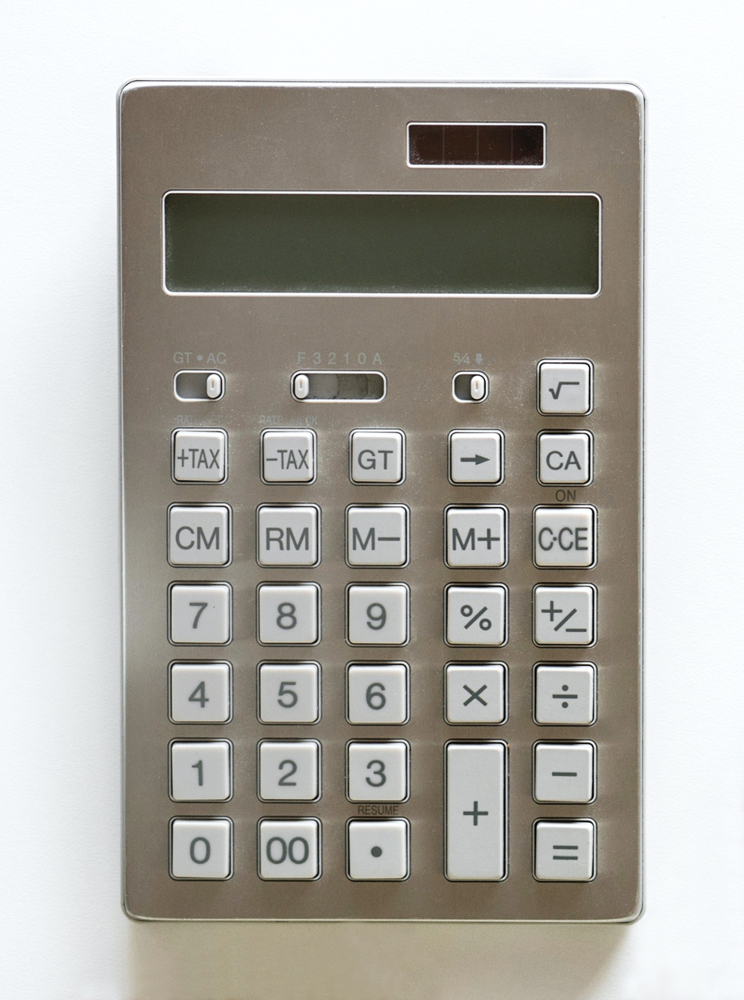

| section: cb-workshop
| rows: auto
| 1 1
| 2 3

<!-- ##### Elaborate Overview  -->
# Workshop

-

~Now that you found out about the different topics surrounding designing for colorblind, it's time for some action.
There are two different paths that you could take for the final task.
Either you could choose the STEM or the DESIGN focus.~

~*The STEM path is for all students who don't have any access to or knowledge about design software (like Photoshop or Illustrator).
Whereas the DESIGN path requires you to also use design software. For the STEM path you only need some paper, brushes and watercolors*.~

-

#### ~Choose your path:~

<button class="primary" v-on:click="send('goto', 'cb-workshop-stem')">STEM path</button>

<button class="primary" v-on:click="send('goto', 'cb-workshop-design')">DESIGN path</button> 

---

| id: cb-workshop-stem
| rows: auto
| 1 1
| 2 3
| 4 3

<!-- ##### Elaborate STEM students -->
# Workshop STEM

-

~Congratulations! You chose the STEM path and this is your quest:
Create a new color scheme for a calculator with white buttons, which also works for people with color vision deficiency.~

 

1. ~**Product**: First, group the buttons and find hierarchies. Which are important buttons that you use often? How many different colors would you need?~
2. ~**Color design**: Decide upon a color scheme which also works for color blind people with protanopia and deuteranopia.~
3. ~**Mockup**: Mix the colors you chose with watercolors and paint in the white buttons on the [calculator worksheet](https://www.google.de).~

 

<!-- <mark> Here we need to add a picture of the calculator.</mark> -->
<mark> We need to add a link to a pdf with the calculator in task no. 3 - Link is now to google (color-me-in-sheet).</mark>

-

<figure style="width:100%; display:flex; flex-direction:column; justify-content:center; align-items:center; margin:0; position:sticky; top:15vh;">
  
  <figcaption>
  
  *This is the model calculator*
  
  </figcaption>
</figure>

-
<button class="primary" v-on:click="send('goto', 'cb-workshop-test')">Test your design</button>

---

| id: cb-workshop-design
| rows: auto
| 1 1
| 2 3
| 4 3

<!-- ##### Elaborate DESIGN students -->
# Workshop DESIGN

-

~Congratulations! You chose the DESIGN path and this is your quest:
Design a calculator app that works for people with color vision deficiency, but at the same time will be appealing to people with normal color vision.~

 

1. ~**Product**: First, group the buttons and find hierarchies. Which are important buttons that you use often? How many colors would you need for your color scheme?~
2. ~**Target group**: Think about who will use it. What is most important to them? How does that affect your design?~
3. ~**Layout**: Scribble a layout for your calculator app. Use the calculator displayed here as a reference.~
4. ~**Color design**: Decide upon a color scheme which also works for color blind people with protanopia and deuteranopia.~
5. ~**Mockup**: Make a mockup of your design in a graphic program and apply your color scheme to it.~

 

-

<figure style="width:100%; display:flex; justify-content:center; flex-direction:column; align-items: center; margin: 0; position:sticky; top:15vh;">
  
  <figcaption>This is the model calculator</figcaption>
</figure>

-

<button class="primary" v-on:click="send('goto', 'cb-workshop-test')">Test your design</button>

---

<calculator-designer />

---

<!--

EVALUATE PHASE

-->

| rows: auto
| id: cb-workshop-test
| 1 2
| 3 2

<!-- ##### Evaluate testing  -->
# Test your design

 

~Lets see how well your design works for people with color vision deficiency.
Upload your picture into the CVD-simulator and check whether it works.~

<f-card :title="get('cbType', 'protanopia') == 'protanopia' ? 'Simulating Protanopia 👉' : 'Simulate Protanopia'"   background="var(--lightergray)" color="var(--darkgray)" style="margin-bottom:calc(var(--base)*0.5); height:auto;" :style="get('cbType', 'protanopia') == 'protanopia' ? {background:'var(--lightblue)'} : {background:'var(--lightergray)'}" @click.native="set('cbType', 'protanopia')">

reduced sensitivity to <b>RED</b> light

</f-card>

<f-card :title="get('cbType') == 'deuteranopia' ? 'Simulating Deuteranopia 👉' : 'Simulate Deuteranopia'" background="var(--lightergray)" color="var(--darkgray)" style="margin-bottom:calc(var(--base)*0.5); height:auto;" :style="get('cbType') == 'deuteranopia' ? {background:'var(--lightblue)'} : {background:'var(--lightergray)'}" @click.native="set('cbType', 'deuteranopia')" >

reduced sensitivity to <b>GREEN</b> light

</f-card>

<f-card :title="get('cbType') == 'tritanopia' ? ' 👉 Simulating Tritanopia' : 'Simulate Tritanopia'" background="var(--lightergray)" color="var(--darkgray)" style="margin-bottom:calc(var(--base)*0.5); height:auto;" :style="get('cbType') == 'tritanopia' ? {background:'var(--lightblue)'} : {background:'var(--lightergray)'}" @click.native="set('cbType', 'tritanopia')">

reduced sensitivity to <b>BLUE</b> light

</f-card>

 

1. Check if your color schemes is flawed.
2. Adjust your color scheme, if necessary, and check again.
3. Present your design in class and be ready to explain your choices.

-

<i>Drag the red triangular handlers or click on image to see the difference</i>

<colorblindness-juxtapose 
    :imageUrl="'images/colorblind-subway.png'" 
    :revealed="25" 
    :locked="false"
    :cbType="get('cbType', 'protanopia')"
    style="box-shadow:0 0 4px 0 hsla(0,0%,0%,0.3);padding:var(--base) var(--base2); border-radius:var(--base)"
/>

-

<f-notes>

Teachers notes

  
### Aim. 

~In this phase the students should reflect on their design decisions and be able to present their final results in class. This is the chance for you to grade the student's work but also to allow feedback and discussions among the students about the challenges of the task.~

~You could also start discussions on a meta level, e.g. *Reflect on what you learned. What was new for you or interesting? Do you think the information will be useful for you in your daily work? Do you think it is necessary to bear this in mind when designing products?*~

</f-notes>

<f-next-button style="margin:var(--base4) 0" />

---

| section: evaluate
| height: 100vh
| 1 2

<!-- ##### Evaluate meta  -->
# EVALUATE

<f-hr style="margin:var(--base6) 0" />

~Lets reflect on what you achieved.~

 
 
1. Reflect on what you learned. What was new for you or interesting? What was difficult or easy?
2. Do you think the information will be useful for you as a designer or STEM student?
3. What about the social relevance? When we design, should we focus more on people with CVD? Is it more difficult/more work to do so?
 
4. Think of other methods to make information more accessible other than color coding it. What could you do else?
 

<f-notes>
  
  
Teachers notes

  
  ### Hint for teachers. 
  ~In the first task, the students will probably come up with alternatives like patterns or symbols. If you have the time in your lesson, maybe you could let them incooperate this in their design. Let them make a version B to their color scheme.~

</f-notes>

-

<f-image src="./images/color_blindness_accessibility_eye.jpg" style="background-position:50% 50%; min-height: 90vh;" />

---

| section: evaluate
| height: 100vh
| 1 2

<!-- ##### Evaluate meta  -->
# EVALUATE | Design

<f-hr style="margin:var(--base6) 0" />

 
 
1. Have a look at the famous calculator Dieter Rams designed for BRAUN. Compare his solution to yours. What is different?
2. Did he do a good job regarding accessibility for color vision deficient people? Explain your opinion!
3. What should he have done different?

<f-notes>
  
  
Teachers notes

  
  ### Hint for teachers. 
  ~This is the chance for you to lead over to Dieter Rams' 10 design principles.~

</f-notes>

-

<f-image src="./images/color_blindness_accessibility_eye.jpg" style="background-position:50% 50%; min-height: 90vh;" />

---

| section: evaluate
| height: 100vh
| 1 2

<!-- ##### Evaluate meta  -->
# EVALUATE | Biology

<f-hr style="margin:var(--base6) 0" />

 
 
1. Have a look at the famous calculator Dieter Rams designed for BRAUN. Compare his solution to yours. What is different?
2. Did he do a good job regarding accessibility for color vision deficient people? Explain your opinion!
3. What should he have done different?

<f-notes>
  
  
Teachers notes

  
  ### Hint for teachers. 
  ~This is the chance for you to lead over to Dieter Rams' 10 design principles.~

</f-notes>

-

<f-image src="./images/color_blindness_accessibility_eye.jpg" style="background-position:50% 50%; min-height: 90vh;" />

