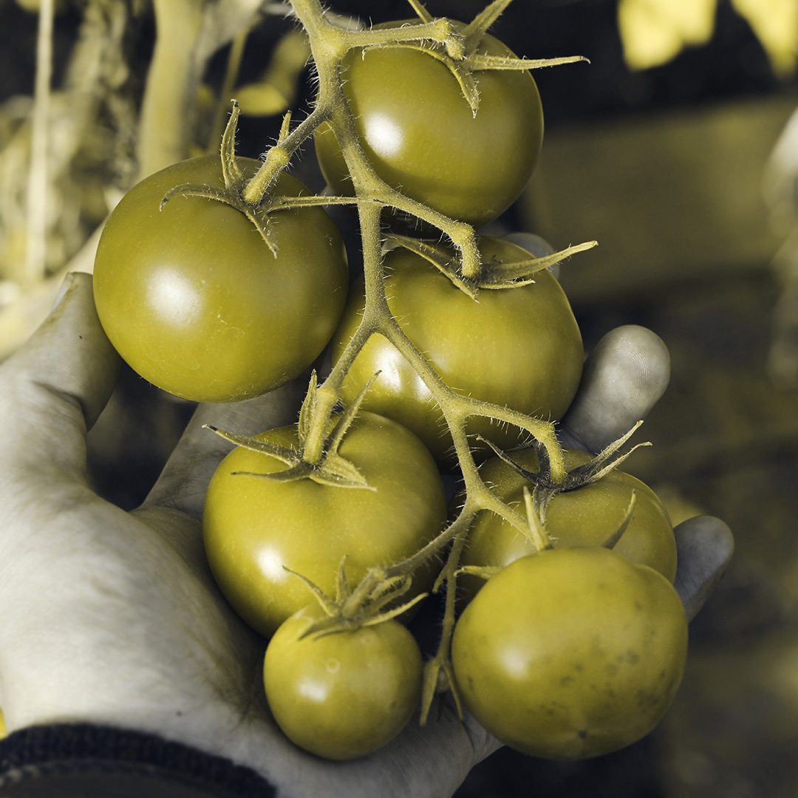
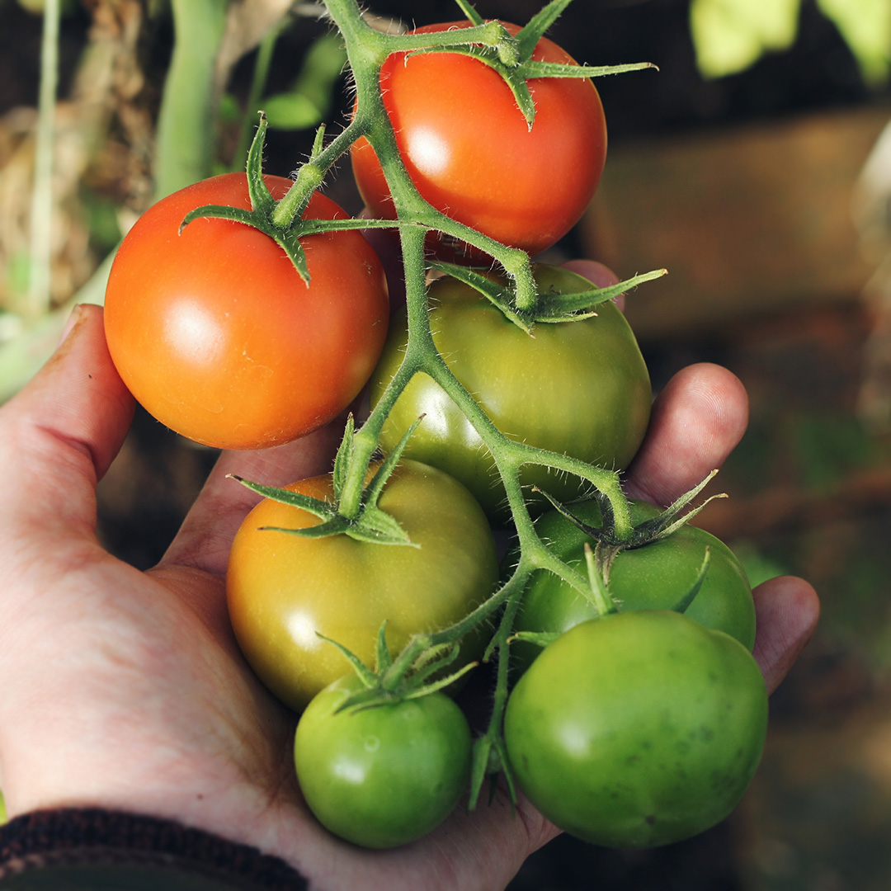

# <big>Color Vision Deficiency &  Accessibility</big>

### How to design information for people whose color perception is impaired.

(Richard Spencer, Kristin Kreer)

 

<f-next-button title="Let's start" />

<button v-on:click="send('goto', 15)">HOPP!</button>

<!-- <button v-on:click="set('index',3)" >HOPP!</button> -->

  

  
Teachers note

    <h4>Aim</h4>
    The students’ awareness should be raised for the problems people with color vision deficiency have to face in their everyday life. They should realize that it’s not only about the absence of certain colors and therefore being somehow “aesthetically impaired” by seeing less colors. Instead they should experience that not being able to see all colors can have a serious impact, because people might get the wrong information or no information at all.

 

---

| 1 2

This is how a color vision deficient person (with protanopia, i.e. red blindness) would see tomatoes.

### Guess which of the tomatoes and how many are already ripe, red and therefore edible.

**<mark>Click on the picture</mark> to check if you guessed correct.**

-

---

| 1 2
| 3 3

## Did you guess right?
### How did you choose the tomato?

If you picked the right tomatoes, congratulations! 

**For color deficient people choosing the wrong tomatoes can have serious consequences for their health**, since unripe tomatoes are poisonous and can cause nausea and vomiting.

***Think of further everyday situations*** where it is needed to be able to tell the right colors.

 

<f-next-button />

-

-

  
Teachers note

  ### Aim
  Students  explore which parts of their everyday life might cause problems for color vision deficient people. Therefore, we raise awareness for the need to also keep accessibility in mind when designing products which contain important information, which all people should be able to access.

---

| 1 2

``Here is the juxtapose image comparer``
``It sort of repeats the previous steps. Do we even need it here?``

**Drag the slider** to compare normal and colorblind visions to see the difference

 

<f-next-button />

-

<ImageCompare :before="'images/tomatoes-normal.jpg'" :after="'images/tomatoes-protanopia.jpg'" :padding ="{left:0, right:0}" :hideAfter="false"></ImageCompare>

---

# EXPLORE

Take a digital camera, e.g. the camera of your mobile phone, and go on a photo safari of your everyday life.

image

<f-next-button />

---

# EXPLORE

1. Take pictures of objects, packagings, posters, signs, magazines, websites, texts etc. that you come across throughout your day. Only choose things which convey information.
2. Open your pictures in Photoshop or go to the following website and upload your files there: https://www.color-blindness.com/coblis-color-blindness-simulator/

<ColorblindnessSimulator :imageUrl="'images/before.jpg'" />

3. Simulate color vision deficiency by applying different filters for protanopia (red blindness) and deuteranopia (green blindness).
4. Find out if any information on your pictures get lost for colorblind people. Does it concern important information? Would it impair the ability to understand the meaning in part or completely?

<f-next-button />

---

# EXPLORE

Now that you found out about possible weak spots in the color design of objects in your everyday life, have a closer look at it:
5. Find out what the main problem is regarding the color scheme.
6. Phrase a hypothesis on how this problem could be solved.
7. Are there also weak spots that can impair people with full color vision? In which way are they different from the other weak spots?

<f-next-button />

---

  
Teachers notes

  Aim. In order to know how to design products/information using color (color combinations), the students need to gather knowledge about different concepts, that influence whether a color combination works for colorblind people or not.
  This phase should focus on making sure that the students end up with the correct information (so not too experimental, but mostly informative).
  The students need to do all of the working stations.

## EXPLAIN | learning stations

Find out about the following topics through working on the provided learning stations. This should enable you to optimize the accessibility of information in your design products.

- Accessibility
- The eye
- Color vision deficiency
- Subtractive and additive color mixing
- Three dimensions of color (color space models)
- Color contrast and color harmony theory
- Design rules for creating color palettes
- Summary station

<f-next-button />

---

# EXPLAIN | Accessibility

### Tasks

1. What do you understand by “accessibility”? Have you ever come across that term? In which context have you heard about it?
2. Go to https://en.wikipedia.org/wiki/Accessibility and find out about the definition.
3. Get an overview of the areas in which we need to improve accessibility.
4. Further, find out about the difference between “accessibility” and “usability”.

image

<f-next-button />

---

# EXPLAIN | The eye

<f-next-button />

---

# EXPLAIN | Color mixing 1

Color is derived from light, either natural or artificial. With little light, little or no color is present. With a lot of light comes lots of color. Strong light produces intense color.

Our eyes have three color receptor cells or cones: red, green and blue. As a result, all incoming light is reduced to these three colors. All perceived colors are generated by a mixture of these three colors.

In the Additive Color System, red, green and blue are the primary colors. When all three colors overlap, white light is produced

1. Have a look at the RGB Model for additive color mixing and find out about its three secondary colors (which are also the primary colors for the CMY Model, called Subtractive Color System). What are secondary colors?
2. Find out where the RGB Model is used? 
3. Complementary colors are opposite of each other and form white light. Find out about the complementary color pairs in the RGB Model.

<f-next-button />

---

# EXPLAIN | Color mixing 2

All objects have physical properties that cause them to absorb some color waves and reflect others. Color, when applied to a surface such as canvas or paper, has the same characteristic.

Color is produced by absorption of wavelengths e.g. on paper and remission of the remaining wavelengths, which are perceived by the eye and form a color impression. So for example a cyan colored dot on white paper absorbs red wavelengths (they are complementary to cyan) and remits blue and green, which together mix to cyan.

This is called Subtractive Color System, because light is subtracted/absorbed and the remaining light produces a sensation of color.

1. The primary colors of the CMY Model are also the secondary colors of the RGB-Model. In RGB mixing all colors results in white light. What do you think happens in CMY? Try it out.

<f-next-button />

---

| 1 1 1
| 2 2 2
| 3 4 5
| 6 6 6

# EXPLAIN | Color mixing 3

-

4. Try to reproduce the following colors by adjusting the controllers for red, green and blue. 

First, in your mind, try to disassemble them into their three components. How much of red, green and blue is needed to make the color? Then check your assumptions by adjusting the controllers so that you receive a color that is as similar as possible to the example. 

-

  <f-slider set="r1" from="0" to="255" integer title="r" />
  <f-slider set="g1" from="0" to="255" integer title="g" />
  <f-slider set="b1" from="0" to="255" integer title="b" />
  <f-scene width="600" height="300">
    <f-box 
      width="4"
      height="4"
      stroke="none"
      x="-2"
      :fill="rgb( get('r1', 0) , get('g1', 0), get('b1', 0) )"
    />
    <f-box 
      width="4"
      height="4"
      x="2"
      stroke="none"
      :fill="rgb( 255 , 0, 255 )"
    />
    <f-text
      v-if="Math.abs( get('r1',0) - 255) < 1    &&    Math.abs(get('g1',0) - 0) < 1    &&    Math.abs(get('b1',0) - 255) < 1"
      fill="white" scale="2">
        YOU DID IT!!!
    </f-text>
    <f-text
      v-else-if="Math.abs( get('r1',0) - 255) < 10    &&    Math.abs(get('g1',0) - 0) < 10    &&    Math.abs(get('b1',0) - 255) < 10" 
      fill="white">
        ALMOST THERE...
    </f-text>
    <f-text
      v-else-if="Math.abs( get('r1',0) - 255) < 50    &&    Math.abs(get('g1',0) - 0) < 50    &&    Math.abs(get('b1',0) - 255)  < 50"
      fill="white">
        GETTING WARMER!
    </f-text>
    <f-text v-else fill="white">
        MATCH THE COLORS
    </f-text>

  </f-scene>

-

-

  <f-slider set="r2" from="0" to="255" integer title="r" />
  <f-slider set="g2" from="0" to="255" integer title="g" />
  <f-slider set="b2" from="0" to="255" integer title="b" />
  <f-scene width="600" height="300">
    <f-box 
      width="4"
      height="4"
      stroke="none"
      x="-2"
      :fill="rgb( get('r2', 0) , get('g2', 0), get('b2', 0) )"
    />
    <f-box 
      width="4"
      height="4"
      x="2"
      stroke="none"
      :fill="rgb( 255 , 201, 53 )"
    />
    <f-text
      v-if="Math.abs( get('r2',0) - 255) < 1    &&    Math.abs(get('g2',0) - 201) < 1    &&    Math.abs(get('b2',0) - 53) < 1"
      scale="2">
        YOU DID IT!!!
    </f-text>
    <f-text
      v-else-if="Math.abs( get('r2',0) - 255) < 10    &&    Math.abs(get('g2',0) - 201) < 10    &&    Math.abs(get('b2',0) - 53) < 10">
        ALMOST THERE...
    </f-text>
    <f-text
      v-else-if="Math.abs( get('r2',0) - 255) < 50    &&    Math.abs(get('g2',0) - 201) < 50    &&    Math.abs(get('b2',0) - 53)  < 50">
        GETTING WARMER!
    </f-text>
    <f-text v-else>
        THIS IS HARDER
    </f-text>
    <f-text :position="{x:0, y:-0.5}" >DIFFERENCE: {{ Math.abs( get('r2',0) - 255) + Math.abs( get('g2',0) - 201) + Math.abs( get('b2',0) - 53)  }}</f-text>
  </f-scene>

-

<f-next-button />

---

# EXPLAIN | Three properties of color 1

When talking about the effect of color, most people only think of its shade. Designing with color means designing with all three properties of color, which are hue, saturation and brightness.
All three of these properties change the effect the color has. Have a look at the following example:

  <f-scene width="400" height="200">
    <f-box 
      width="4"
      height="4"
      stroke="none"
      x="-2"
      :fill="hsl(112,63,36)"
    />
    <f-box 
      width="4"
      height="4"
      x="2"
      stroke="none"
      :fill="hsl(123,100,51)"
    />
  </f-scene>

Both are greens, but they have different effects. Most people wouldn’t call the right color natural although green often is used to suggest organic, natural themes. Therefore we have to look closely when working with colors and not only judge the color’s effect by its hue.

<f-next-button />

---

# EXPLAIN | Three properties of color 2

Have a look at the following colors and find adjectives to describe them. For which products could you possibly use each one of them? Do you know of any that already exist?

  <f-scene width="600" height="200">
    <f-box 
      width="4"
      height="4"
      stroke="none"
      x="-4"
      :fill="hsl(252,100,50)"
    />
    <f-box 
      width="4"
      height="4"
      x="0"
      stroke="none"
      :fill="hsl(92,100,50)"
    />
    <f-box 
      width="4"
      height="4"
      x="4"
      stroke="none"
      :fill="hsl(22,100,50)"
    />
  </f-scene>

---

# EXPLAIN | Three properties of color 2

Now the brightness of each color is reduced to 50%, which means less light for the same hue.
Find adjectives to describe the effect bright colors have in comparison to dark colors of the same hue. 

  <f-scene width="600" height="200">
    <f-box 
      width="4"
      height="4"
      stroke="none"
      x="-4"
      :fill="hsl(252,100,50)"
    />
    <f-box 
      width="4"
      height="2"
      stroke="none"
      x="-4"
      y="1"
      :fill="hsl(252,100,25)"
    />
    <f-box 
      width="4"
      height="4"
      x="0"
      stroke="none"
      :fill="hsl(92,100,50)"
    />
    <f-box 
      width="4"
      height="2"
      x="0"
      y="1"
      stroke="none"
      :fill="hsl(92,100,25)"
    />
    <f-box 
      width="4"
      height="4"
      x="4"
      stroke="none"
      :fill="hsl(22,100,50)"
    />
    <f-box 
      width="4"
      height="2"
      x="4"
      y="1"
      stroke="none"
      :fill="hsl(22,100,25)"
    />
  </f-scene>

<f-next-button />

---

# EXPLAIN | Three properties of color 3

Next, the saturation of the colors is reduced. You can compare this effect to dissolving watercolors in water. Low saturation means less pigment in the water. High saturation means a high degree of pigment dissolved in water.
Describe the difference between low and high saturated colors with adjectives. When/for which products would you use which?

`isn't it more like brightness increased instead of saturation reduced?`

  <f-scene width="600" height="200">
    <f-box 
      width="4"
      height="4"
      stroke="none"
      x="-4"
      :fill="hsl(252,100,50)"
    />
    <f-box 
      width="4"
      height="2"
      stroke="none"
      x="-4"
      y="1"
      :fill="hsl(252,100,90)"
    />
    <f-box 
      width="4"
      height="4"
      x="0"
      stroke="none"
      :fill="hsl(92,100,50)"
    />
    <f-box 
      width="4"
      height="2"
      x="0"
      y="1"
      stroke="none"
      :fill="hsl(92,100,90)"
    />
    <f-box 
      width="4"
      height="4"
      x="4"
      stroke="none"
      :fill="hsl(22,100,50)"
    />
    <f-box 
      width="4"
      height="2"
      x="4"
      y="1"
      stroke="none"
      :fill="hsl(22,100,90)"
    />
  </f-scene>

<f-next-button />

---

# RGB Explorer

Commented out temporarily because of heavy CPU usage

<!-- <f-scene3 grid>
	<f-rotation3>
  <f-group3 scale="0.5">
  <f-line3
  	points="0 0 0, 2 0 0"
    :stroke="rgb(255,0,0)"
  />
  <f-line3
  	points="0 0 0, 0 2 0"
    :stroke="rgb(0,255,0)"
  />
  <f-line3
  	points="0 0 0, 0 0 2"
   :stroke="rgb(0,0,255)"
  />
  <f-line3
  	points="0 0 0, 2 2 0"
    :stroke="rgb(255,255,0)"
  />
  <f-line3
  	points="0 0 0, 2 0 2"
    :stroke="rgb(255,0,255)"
  />
  <f-line3
  	points="0 0 0, 0 2 2"
    :stroke="rgb(0,255,255)"
  />
	<f-group3 v-for="r in range(0,2)">
    <f-group3 v-for="g in range(0,2)">
      <f-point3
        v-for="b in range(0,2)"
        :stroke-width="70"
        :x="r"
        :y="g"
        :z="b"
        :stroke="rgb(r * 180,g * 180,b * 180)"
      />
    </f-group3>
  </f-group3>
  </f-group3>
  </f-rotation3>
</f-scene3> -->

---

| 1 1 1 1
| 2 3 3 3

## Color blindness types

-

<f-slider title="Slice count" set="c" from="8" to="64" integer />
  
-

  
  

  <b>Normal vision</b>  
  <f-scene width="150" height="150" grid>
    <f-group v-for="(count,i) in range(0,2)" :key="i">
    <f-arc
      v-for="(a,j) in range(0,360,360 / get('c',8))"
      :key="j"
      :fill="hsl(a,100,scale(count,0,2,30,70))"
      stroke
      :start-angle="a"
      :end-angle="a + (360 / get('c',8))"
      :r="scale(count,0,2,1,1.5)"
      :inner-radius="scale(count,0,2,1,1.5) - 0.25"
    />
    </f-group>
  </f-scene>
  

  

  <b>{{ type }}</b>  
  <f-scene  width="150" height="150" grid>
    <f-group v-for="(count,i) in range(0,2)" :key="i">
    <f-arc
      v-for="(a,j) in range(0,360,360 / get('c',8))"
      :key="j"
      :fill="colorblind(hsl(a,100,scale(count,0,2,30,70)), type)"
      stroke
      :start-angle="a"
      :end-angle="a + (360 / get('c',8))"
      :r="scale(count,0,2,1,1.5)"
      :inner-radius="scale(count,0,2,1,1.5) - 0.25"
    />
    </f-group>
  </f-scene>
  

---

| 1 1 1
| 2 3 4

## Contrast checker

-

<f-slider title="Background color hue" set="c1" integer />
<f-slider title="Foreground color brightness" set="c2" to="100" integer />

-

<h2>Halloo {{ contrast(hsl(get('c1',0)),hsl(0, 0, get('c2',0))) < 4.5 ? '⚠️' : ' ' }}</h2>

##### Contrast ratio: {{ contrast(hsl(get('c1',0)),hsl(0, 0, get('c2',0))) }}

Deutsches Ipsum Dolor meliore Hockenheim et Spezi Te Käsefondue utamur genau Exerci Donaudampfschiffahrtsgesellschaftskapitän eu Kaftfahrzeug-Haftpflichtversicherung Principes Hackfleisch eos Fußball His Wiener Schnitzel moderatius Deutsche Mark.

<button>Käsefondue</button>

-

<h2>Halloo {{ contrast(colorblind(hsl(get('c1',0))),colorblind(hsl(0, 0, get('c2',0))) ) < 4.5 ? '⚠️' : '' }}</h2>

##### Contrast ratio: {{ contrast(colorblind(hsl(get('c1',0))),colorblind(hsl(0, 0, get('c2',0)))) }}

Deutsches Ipsum Dolor meliore Hockenheim et Spezi Te Käsefondue utamur genau Exerci Donaudampfschiffahrtsgesellschaftskapitän eu Kaftfahrzeug-Haftpflichtversicherung Principes Hackfleisch eos Fußball His Wiener Schnitzel moderatius Deutsche Mark.

<button>Käsefondue</button>

