| background: ./images/map.png
| theme: dark
| chapter: Introduction
| section: Course overview

# <big>Natural dyes</big>

***TODO: Credits***

<f-notes width="50vw" style="--primary: var(--darkgray)" title="Overview">

## Overview

Study Project "Natural Dyes" approaches the subject of chemical bonds in biology/chemistry via environmental issues by combining practical chemistry work with art/design-centered tasks and processes. 

Final aim of the study project is to **develop environmentally sustainable product**, which originates from recycling and reusing the resources in order to reduce the environmental load of textile and fashion industry to the planet.

## Suggestions

* Items to be dyed should be chosen by students themselves. It is best, if they come up with special idea and/or develop the product. But it might be also just an ready-made item, which would carry the environmental message  - T-shirts, socks, blouses, shawls, headscarves etc.

* Those items should be made 100% of natural (white) fibers - cotton, silk, wool, linen etc.

* Encourage to recycle both textiles and colouring agents. Textile items could be picked up from second-hand stores or similar.

* Distributable message should be phrased by students. Remember to offer support, if required.

* Encourage students to help plan the whole process at the beginning, including the core message to be spread.

* Inform your students at least 1 week before the start of chemistry part of the project, so there will be time to collect food residue and prepare other necessary materials.

* Be prepared yourself as well: assemble materials required for the project so the work won't stop halfway.

***NOTE:*** There are several possible learning paths that could be designed with use of this learning project, depending on the interests and aims of both teachers and students. Try it out boldly, you are welcome to integrate this learning material with different study projects.

## Time

**Quicklook:** 30 min

**Full path:** up to 20 hrs during 3-6 weeks period: 12-16 hrs depending on dyeing process and level of task difficulty chosen plus 4 hrs for compendious group poster and pitching the idea and product

## Class setting

* Individual work, groups of 3-4 students
* Joint discussions and analyses in class lead by teacher

## Materials

Fiber / clothes to be dyed
Food waste with coloring agents
Rusted metal items
Soy milk
Aluminum pot
Wooden spoons
Fabric for filtration of fluid, string or cord
Glass jars
Water
Stove
Large paper
Coloured markers.

---

| theme: dark
| padding: 0
| section: Wearing a message

<section><section>

## The power of T-Shirt: wearing a message

British fashion designer **Vivienne Westwood** started revolutionary mission of raising awareness on global climate issues, crossing age and state borders, and allowing people to express their attitude and values.

https://blog.viviennewestwood.com/the-story-so-far/

Nowadays, mitigation of climate change is no longer an option, it is rather inevitable way of acting out in order to maintain our planet habitable. 

</section></section>

-

<f-image src="./images/westwood.jpg" />

***ERIK / JANIKA: Can we use the photo?***

<f-notes style="--primary: var(--darkgray)">

## See also:

<f-video src="https://www.youtube.com/watch?v=qvYmFcAegH4" />

https://www.viviennewestwoodmovie.com/

Photo credit:
http://climaterevolution.co.uk/wp/wp-content/uploads/2014/02/vivienne-westwood.jpg

</f-notes>

---

| padding: 0

<section><section>

## The power of T-Shirt: wearing a message

Nowadays,message T-shirt, being an iconic fashion item, is generally used to deliver the information to wide target groups and regrettably happens to be overused. 

With its roots in subcultures, the message T-shirt is taken over by  marketing industry and has become the main communication agent since.

We might consider, whether excessive production and underuse of Fast Fashion items are worth the load on the planet and what could we do about it.

</section></section>
-

<f-image src="images/shirt.png" />

***ERIK / JANIKA: Unknown image source***

---

##  Fashion as Influencing agent

Subject: consuming standards of western society, influence on third world countries population.

**How exactly does the fashion industry cause environmental damage?**

***TASK***

##### 1

Watch the video “The Life Cycle of a T-shirt”

##### 2

Discuss the video in group.

-

<f-video src="https://www.youtube.com/watch?v=BiSYoeqb_VY" />

<f-notes>

Demonstration & discussion with group, focusing on students interests.
Final question: what did you learn?

</f-notes>

---

| padding: 0

<section><section>

##  Fashion as Influencing agent II

Look at the NASA image of the Aral Sea in Central Asia. This huge inland lake has shrunk to less than 10% of its original size because water from the rivers that feed it have been diverted to irrigate farmland, largely to grow cotton.

##### 4.

Group or individual work: Complete T-shirt [quiz](https://drive.google.com/drive/folders/1ADNeXguW70d9cBFPz6QQ2gjTGguhkQQZ)

***TODO: Replace with real quiz*** 

##### 5.

Summarize all the ways in which production of a cotton T-shirt can cause environmental damage and any other concerns. Also, consider possible steps which the fashion industry and you personally could take to minimize this damage.

</section></section>

-

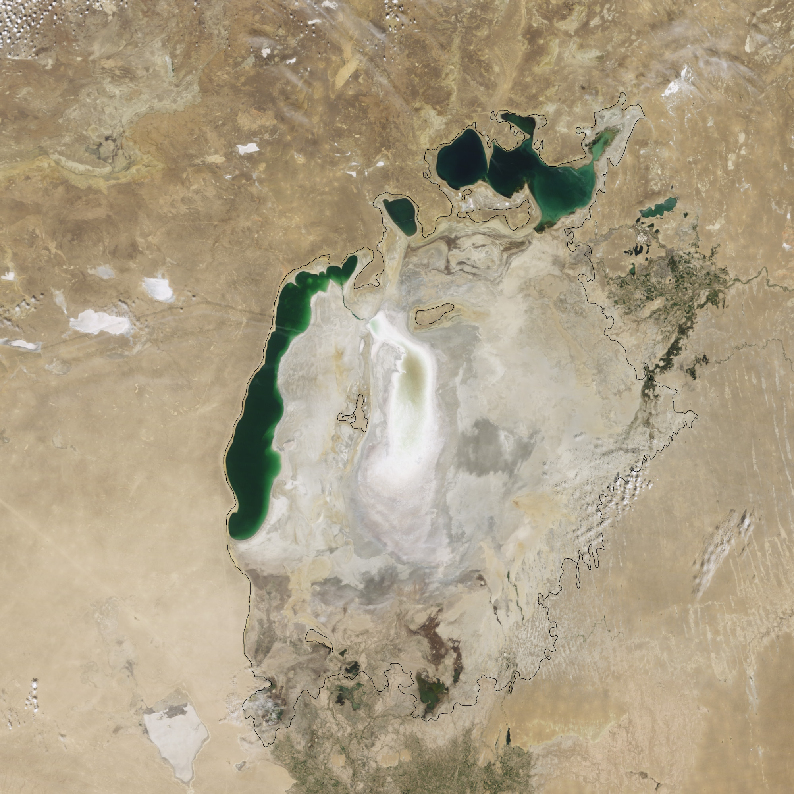

---

##  Greenwashing

People are becoming more and more aware of the environmental issues. In 2015, global performance management company, [Nielsen](https://www.nielsen.com), that provides a comprehensive understanding of what consumers watch and buy,  reported that [73 percent of Millennials are willing to pay more for sustainable goods](https://www.nielsen.com/us/en/press-releases/2015/consumer-goods-brands-that-demonstrate-commitment-to-sustainability-outperform/).

***TASK***

**Discuss in group:** Are you willing to pay more for sustainable goods? Why or why not? Give some examples. 

<f-notes>
https://www.nielsen.com/us/en/press-releases/2015/consumer-goods-brands-that-demonstrate-commitment-to-sustainability-outperform/
</f-notes>

---

##  Greenwashing 2

However, some companies are becoming more adept at falsely claiming to be "green" by promoting environmentally-friendly initiatives or images without actually implementing business practices that minimize environmental impact. 

This type of promotion is termed "green washing", a term coined in the 1980s by the environmentalist [Jay Westerveld](https://www.revolvy.com/page/Jay-Westerveld). 

More on history of Greenwashing [A History of Greenwashing: How Dirty Towels Impacted the Green Movement](https://web.archive.org/web/20150923212726/http://www.dailyfinance.com/2011/02/12/the-history-of-greenwashing-how-dirty-towels-impacted-the-green/) by Jim Motvalli, Daily Finance.

<f-notes>

The Oxford English Dictionary defines green wasting as the "dissemination is misinformation by an organization so as to present an environmentally responsible public image." This may involve misleading advertising, unsubstantiated claims or omission of important facts. For example, one clothing manufactures who claimed to sell eco-friendly bamboo-clothing actually sold rayon produced from bamboo. Processing of rayon uses harsh chemicals and releases hazardous air pollutants. Another manufacturer celebrated its position as the top user of organic cotton (grown without use of harmful pesticides), yet only 13.7% of the cotton used by this company is organic.

https://www.theguardian.com/sustainable-business/2016/aug/20/greenwashing-environmentalism-lies-companies
http://www.arterritory.com/en/lifestyle/design_fashion/5062-upcycling_as_a_fashion_philosophy/

</f-notes>

---

##  Greenwashing 3

***TASK***

How are the products being presented as “green products” i.e “greenwashed”?

1. Make up two teams of students. 

2. Each group reads an article and presents the findings.

Group 1: Read the article  [The troubling evolution of corporate greenwashing](https://www.theguardian.com/sustainable-business/2016/aug/20/greenwashing-environmentalism-lies-companies)

Group 2: Read the article [Please Stop Saying Fashion is the 2nd Most Polluting Industry After Oil](https://ecocult.com/now-know-fashion-5th-polluting-industry-equal-livestock)

<f-notes>

Society is becoming increasingly aware of environmental issues, including the impact of fast fashion on the environment. However, some companies are becoming more adept at falsely claiming to be "green" by promoting environmentally-friendly initiatives or images without actually implementing business practices that minimize environmental impact. This type of promotion is termed “green washing”, a term coined in the 1980s by the environmentalist Jay Westerveld. 

The Oxford English Dictionary defines green wasting as the “dissemination is misinformation by an organization so as to present an environmentally responsible public image.” This may involve misleading advertising, unsubstantiated claims or omission of important facts. For example, one clothing manufactures who claimed to sell eco-friendly bamboo-clothing actually sold rayon produced from bamboo. Processing of rayon uses harsh chemicals and releases hazardous air pollutants. Another manufacturer celebrated its position as the top user of organic cotton (grown without use of harmful pesticides), yet only 13.7% of the cotton used by this company is organic.

https://www.theguardian.com/sustainable-business/2016/aug/20/greenwashing-environmentalism-lies-companies

http://www.arterritory.com/en/lifestyle/design_fashion/5062-upcycling_as_a_fashion_philosophy/

---

##  Pre-exploration

## What could be done to reduce the impact of excessive consumption of textile products?

Examples: 

**Upcycling** as a way of reducing the impact of textile and fashion industries.

***TASK*** Read and discuss the article: [Upcycling as a Fashion Philosophy](http://www.arterritory.com/en/lifestyle/design_fashion/5062-upcycling_as_a_fashion_philosophy/) by Una Meistere.

By *rebirthing* clothes through upcycling, you could save an estimated CO2 Saving of 12 kg per month (120 kg per year), just by extending the life of your clothing. One of the ways to do it is to **redye your clothes**.

***TASK*** Read and discuss the article [How to Make Natural Dyes to Dye Fabric & Clothes at Home](https://www.1millionwomen.com.au/blog/how-to-make-natural-dyes-to-dye-fabric-clothes-at-home/) by 1 Million Women.

---

| chapter: Biology / Chemistry
| section: Dyeing and Mordanting

***TODO: Titlecard***

## Dyeing and Mordanting

***TASK*** Dye some scraps of different natural fibers, using natural agents and mordants only. Work in small groups.

Workflow for production:

1. Introduce yourself to the basics of textiles, materials, dyes and mordants.  
2. Plan the process of mordanting and dyeing, consider different techniques.
3. Prepare materials and tools, make the process timeline.
4. Dye your textile scraps. Make pictures of process for process map. Take notes.

<f-notes>

Theory part (basics of dyeing and mordanting) should be presented by teacher. 

Remember: Main aim of this study project is to Integrate disciplines of design and bio/chemistry; so teachers of both disciplines could work together: prepare the material and/or introduce it in your classroom together, if possible and/or necessary.

</f-notes>

---

| section: Natural pigments

##  Biology/Chemistry 2

***TASK***

## Explore natural pigments

1. With the help of information provided by teacher, **find out about the natural pigments with colouring effect**.

2. Discuss properties and usage of natural and artificial/chemical pigments in our environment. 

3. Find out about the impacts of pigments on human body. Make some examples. 

4. Discuss and explain the process of dyeing, i.e how the bond is forming.

<f-notes>

Teacher notes:

1. Teacher should prepare and make a short presentation according to the interests of students.
 
Share references and/or sources to the material, that would help your students. 

2. 3. depending on the profile of the group, historical facts might also be considered. You may include film clips, works of art etc.

3. Ask students to make examples, explain the group, how chemical bond is forming. Make it simple.

</f-notes>

---

| section: Choosing the fabric

## Choosing the fabric

There are many aspects to consider when **choosing the fabric** to be dyed. Most of the natural fabrics are made either of **cellulose** (modal, viscose rayon, cotton, hemp, bamboo, linen) or **protein** (soy fibre, silk, wool). See more in comprehensive [list of  textile fibers by its source](https://www.textileschool.com/amp/2782/comprehensive-list-of-textile-fibers/).

Often dyes used are **toxic** to humans or polluting the environment (e.g. azo dyes).

One of the ways to be more  conscious environmentally is to use natural dyes, for example **food residues that contain tannins** (list). Tannins act as natural mordants.

There is a bigger variety of dyes that you can use for dyeing the protein fibres. Soon you will find out why!

<f-notes>

Bring several strips of natural fabrics to the classroom, so students can touch the fabric and feel/realize the difference.

Introduce them natural fabrics both with cellulose and protein composition.

Also introduce manmade fabrics with synthetical composition in order to make better comparison.

Supportive online materials:

Cotton: https://www.textileschool.com/amp/164/cotton-fibers-and-its-properties/
Linen/flax: https://www.textileschool.com/2632/linen-fiber-from-flax-plants-and-the-linen-fabrics/
Silk: https://www.textileschool.com/163/how-silk-fiber-is-made/
Wool: https://www.textileschool.com/423/wool-fibers-natural-protein-fibers/
Viscose/rayon: https://www.textileschool.com/145/basics-of-rayon-fiber/

</f-notes>

---

##  Biology/Chemistry 4

***TASK*** testing the fabrics

We are to make two simple (nontechnical) tests to identify the type of fabric fibers. Nontechnical testing does not require any special equipment or setting. The different nontechnical methods of identifying the textile fibers are:

Conduct experiments in small groups. Follow teachers guidelines. Take notes.

Discuss the findings all together.

-

<f-video src="https://www.youtube.com/watch?v=Ug9K0DHQSgc" />

Feeling test

<f-video src="https://www.youtube.com/watch?v=kb4tCcnA6jo" />

Burning test

<f-notes>

For each group of students you will need: 

Feeling Test: selection of fabric strips (both natural and artificial) in order to get better comparison.

Burning Test: box of matches or a lighter, candle, non-flammable stand, tweezers and selection of fabric strips.

Explain and demonstrate both procedures  Let students experiment. Ask them to take notes. 

Finalise the experiment with discussion on what and how they have learned.

</f-notes>

---

##  Biology/Chemistry 4 Cellulose

Cellulose is an organic compound, more specifically a polysaccharide consisting of glucose units.

Listen to teachers  explanations and/or watch the video:

https://www.bbc.com/bitesize/articles/z2d2gdm

<f-notes>

bio/chemistry teacher can work with his/her own materials of the topic, or add explanation to the video (link on slide).

</f-notes>

---

##  Biology/Chemistry 5 Proteins

Proteins are organic compounds, consisting of long chains of amino acids.

Listen to teachers' explanations and/or watch the videos:

https://www.khanacademy.org/science/high-school-biology/hs-biology-foundations/hs-biological-macromolecules/v/introduction-to-proteins-and-amino-acids

-

<f-video src="https://www.youtube.com/watch?v=wvTv8TqWC48" />

---

##  Biology/Chemistry 6 Tannins

Tannins are water-soluble organic molecules that bind to and precipitate proteins.

Easy explanation on tannins in plants: https://vinepair.com/wine-101/guide-to-tannins/

-

<f-notes title="Credits">

Image source:

https://commons.wikimedia.org/wiki/File:Woody_Dicot_Stem_One_Year_Quercus_(35038421793).jpg

</f-notes>

---

##  Biology/Chemistry 7 Toxic Dyes

"It is estimated that over 20 000 different dyes and pigments are used industrially and over 7x105 tons of synthetic dyes are annually produced worldwide."; see Ref.

Facts are to be presented by teacher, followed by a brief discussion about the information in small groups. Try to find out more foods and/or beverages with high tannin content. 

<f-notes>

References:

C. Ogugbue, T. Sawidis; Bioremediation and Detoxification of Synthetic Wastewater Containing Triarylmethane Dyes by AeromonashydrophilaIso-lated from Industrial Effluent, J. Biotechnology Research International, (2011).

Assessment of Toxicity of Textile Dyes and Chemicals via Materials Safety Data Sheets.

Available from: https://www.researchgate.net/publication/309155638_Assessment_of_Toxicity_of_Textile_Dyes_and_Chemicals_via_Materials_Safety_Data_Sheets [accessed Apr 19 2019].

</f-notes>

---

| 1 1 1 1 1
| 2 3 4 5 6
| rows: auto

##  Biology/Chemistry 8: List of food residues that contain tannins 

-

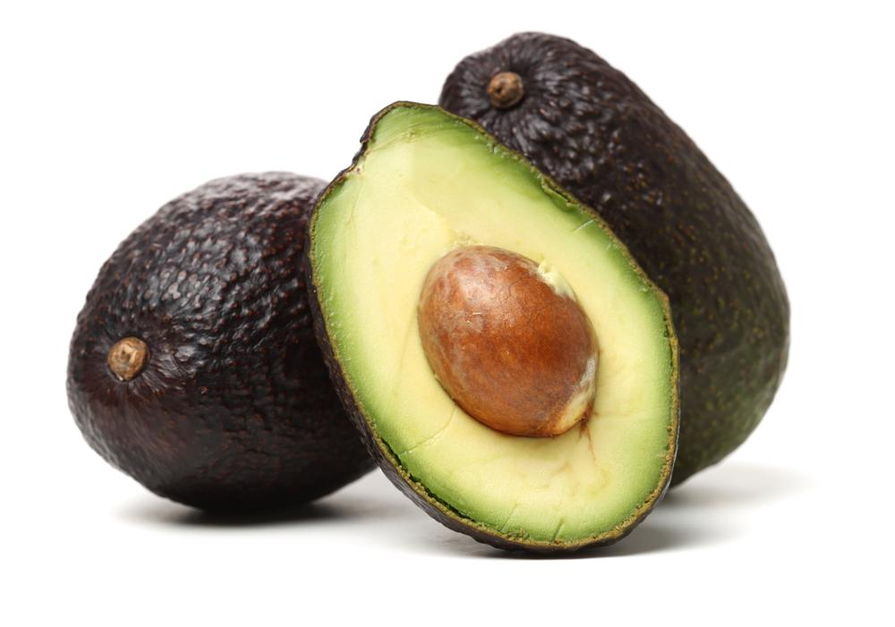

Avocado stones and Avocado skins (especially Hass variety)

-

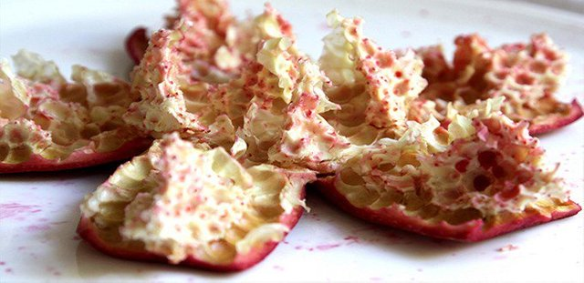

Pomegranate skins

-

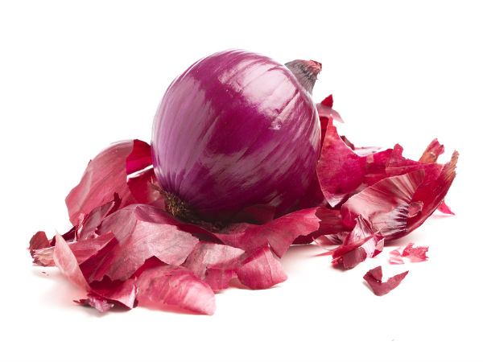

Red onion peels

-

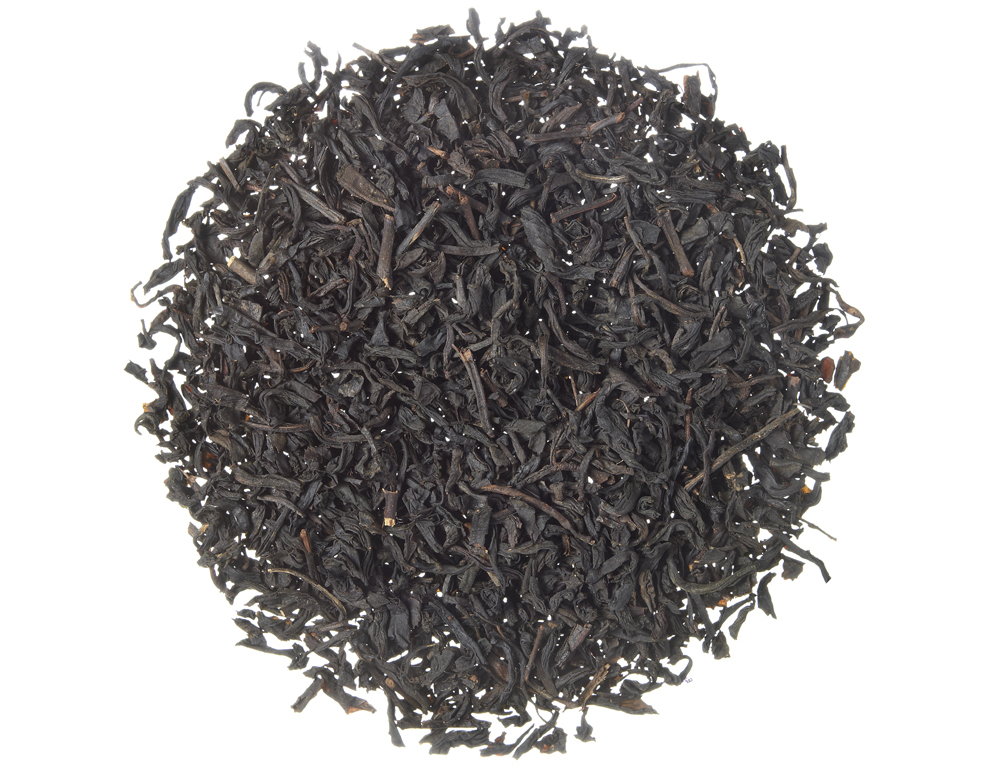

Black tea

-

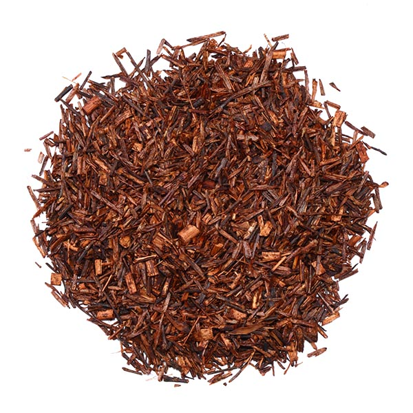

Rooibos tea

***ERIK / JANIKA: Can we use these photos?***

---

<f-notes title="Credits">

https://cdn.shopify.com/s/files/1/2336/3219/products/shutterstock_766828153lambhassavo_x850.jpg?v=1531526746

https://steemitimages.com/640x0/https://www.altibbi.com/global/img/website/xlarge/5a96a7f220e45article_4151_1.jpg

https://www.boldsky.com/img/2017/06/coverimage-23-1498208010.jpg

https://dhb3yazwboecu.cloudfront.net/1007/fotosProducto/tes/
10110_VanillaBlackTea_1000x1000_l.jpg

https://localteaco.com/wp-content/uploads/2014/03/Organic-Red-Rooibos-Loose-Leaf.jpg

</f-notes>

---

| section: Mordants

## Mordants

People are becoming more conscious about the issues related to fast fashion and use of toxic dyes. One of the least mentioned topics is **mordants**.

It is important to consider using natural dyes since most natural dyes are not particularly toxic in themselves, but a mordant is invariably required for development of shade and dye fixation.

Typically, a mordant is a heavy metal salt of aluminum, iron, copper, chromium or tin and have an effect to our health and environment. ***TODO*** See Ref1

There are some alternatives to using the metal salts mordants. For example the material of the pot used for extracting the dye and dyeing can have an mordanting effect and different materials lead to different colors. Usually iron pots darken the color especially if there are tannins present and aluminum pots help to bring out the yellows from brown onion peels. 

<f-notes>

https://www.sciencedirect.com/topics/chemistry/azo-dye

http://www.textilestudio.ca/guest%20artists/flint1.html

</f-notes>

---

##  Mordants

The list of alternatives is long e.g. vinegar, soy milk, buffalo milk and urine. You can read more about the topic here:
http://www.textilestudio.ca/guest%20artists/flint1.html

Different traditional cultures have found their own unique ways to fix the colour on the fabric. For example, soy milk is used in Japan. You can buy it from the shops or make it on your own.

More information here:

https://www.pankuka-prints.com/post/217441097099/soy-milk-natural-dyes-paints

-

<f-image src="./images/cloth.jpg" />

***ERIK / JANIKA: Can we use this photo?***

<f-notes title="Credits">

Image source:

https://img.etsystatic.com/isbi/18a48b/1386966743/isbi_fullxfull.1386966743_4ahdlfky.jpg?version=0

</f-notes>

---

| section: Choosing the fabric

## Choosing the fabric

One of the aspects to think about while choosing the fabric is to consider how much water has been consumed and polluted in the process of making the fabric. Other important aspects to consider are use of cropland, use of pesticides.Here you can find useful links to further research the environmental impact of different fabrics. 

***TASK***: group work. Pick an article and research it. Presenting the findings in a compact form during discussion.

https://www.textileschool.com/154/eco-friendly-fibers/

https://www.treehugger.com/sustainable-fashion/do-you-know-which-fabrics-are-most-sustainable.html

<f-notes>

Teacher notes:

You might want to present some interesting facts in the beginning of the topic. These should be selected, following the interests on the group.

Pick an interesting piece of information, visualize it.

Let students analyse the articles and present information in form of thesis/statements during follow-up discussion.

Alternative pathway: here could be an excellent possibility to include issues of Social Justice.

</f-notes>

---

| section: Experiment on dyeing
| 1 1
| 2 3

## Experiment on dyeing

Workflow for experiment 

1. Pretreatment of fabric <small>15 min x 3 times</small>
2. Collecting food residues
3. Extracting the dye <small>1,5h x 3 times</small>
4. Dyeing <small>1,5h</small>
5. Aftercare of fabric

-

List of materials

* pot (aluminum, copper or iron)
* fabric (t-shirt)
* Filter Cloth
* soy milk (at least 1L)
* wooden spoon (for stirring, one for each dye extract)
* Protective clothing

For pre-treating the fabric you need to soak it in the soy milk for 12 hours. Keep the soaking solution in a cool place.
Dry the fabric. Repeat the procedure 2-3 times.

-

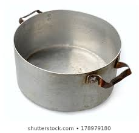

***ERIK / JANIKA: Can we use this photo? It's from Shutterstock***

<f-notes>

It is recommended, that you bring a set of necessary items to the classroom.

If necessary, explain, why pot of certain material and wooden spoon must be used.

</f-notes>

---

##  Collecting the food residues

Following food residues that contain tannins, can be used:

1. pomegranate peels (you get bright yellow shade, using aluminum pot)
2. avocado peels (you get pink shade, using aluminum pot)
3. avocado stones (you get pink shade, using aluminum pot)

Keep the materials in the dark and dry place. Drying of food residue is not compulsory. 

Note: Do not use anything, that has mold on it.

<f-notes>

Avocado stones are around 12% of the total weight on an avocado.

</f-notes>

---

##  Extracting the dye

Workflow for experiment 

1. Heat the selected food residue materials in the aluminum pot on medium temperature for 1,5h

2. Cool the mixture down.

3. Repeat heating and cooling process for 1-2 more times.

4. Filter the mixture. Use protective clothing. Work cautiously, the mixture is hot and may leave stains. 

5. Pour the liquid into the bottle and store it in the cool place.

---

##  Dyeing the fabric. Workflow for experiment

1. Pour dye extract into your dye pot. Use aluminum pot. 

2. Wet the fabric and put it into dye pot.

3. Fibres have to be submerged. If not, add some water. The fabric has to move freely in the liquid for the sake of even colouring.

4. Heat the colouring solution for at least 1 hour. Use low/medium heat and stir it time to time. Leave it to cool.

5. You can repeat step 4 to get deeper shade of colors.

6. Gently squeeze out the the excess dye and let the fabric dry in the shade.

Video example of dyeing fabric with avocado:

-

<f-video src="https://www.youtube.com/watch?v=pb8Zvv-I6Fk" />

---

##  Dyeing the fabric 2

Important notes: 

* You will get the best results by working slowly. 
* The fabric should stay in the dye-pot for at least for 24h all together. This time is needed for dye molecules to create bonds with fabric fibres. 
* The fabric should be stored for at least 7 days before you rinse it. 
* Keep record of the dyeing process in order to gain better results on your product that will be 

<f-notes>

Explain to the class, how the process of dyeing is happening.

</f-notes>

---

##  Dyeing the fabric 3, summary

***TASK*** make a process map of dyeing process 

* Work in small groups
* Use your notes, discuss your experiments.
* Make a process map on large paper to explain the process of dyeing.
* Present your map in classroom.

Example of a process map on the next page

<f-notes>

Let the students work in small groups. Those who have experimented with similar materials, could make the joint process map.
The map could be the final step of bio/chem part and be concluded with evaluation.

See more: https://creately.com/blog/diagrams/process-mapping-guide/

***FIX***

What is a Process Map?

A process map visually shows the steps of a work activity and the people who are involved in carrying out each step.

When mapping a process you simply draw a box for each step and connect them with arrows to show a flow.  A basic process map would look like this;

</f-notes>

---

 

---

| chapter: Product development
| section: Introduction

***TODO: Titlecard***

##  Introduction

It is time for us to make an effort to help the Earth. 

**The main task is to develop a handy, easy-to-make product**, which is  

1. solving a problem
2. made of recycled textile/cloth item
3. dyed using only natural color agent and mordants

Try to find the idea(s), how would using such products help maintain the well-being of our planet and ourselves.

---

| section: Process

## TODO: title

Form a small groups of 3-5 students.

You might want to work with your friends; draw a lots or use some other method of your choice to form the group.

You will be using the simplified method of **design thinking**, which is widely and effectively used in creative industry. 

The process consists of 5 steps, which could be linear or not, depending on how the group is making a progress.

---

| 1 2 2

##  Design thinking

**Design Thinking** has evolved from Human-Centered Design focusing on customer experience, to Service Design focusing on customer journeys and touch points between a business and its customer.

Design Thinking is a step-by-step, user-centered method to creative thinking and innovation, which is based on the [building up](https://experience.sap.com/skillup/introduction-to-design-thinking/) of ideas. Generally, Design Thinking follows a five-step approach:

-

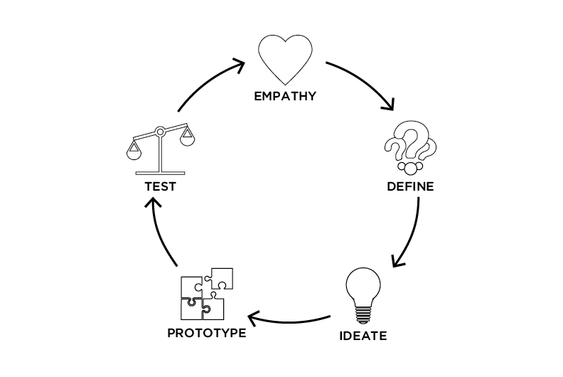

***ERIK / JANIKA: Can we use this illustration?***

<f-notes>

Illustration shows the main aims of every stage of Design Thinking Process. 
Starting point is Empathy stage, which might need a more substantive analysis together with students.
Image source: https://www.applicoinc.com/services/exchange-driven-design/

</f-notes>

---

## TODO: title

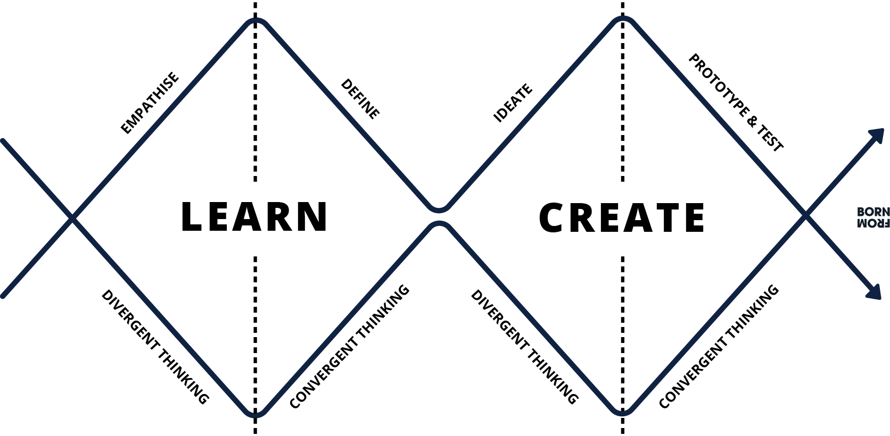

***ERIK / JANIKA: Can we use this illustration?***

<f-notes>

Encourage your group to work step-by step. If something remains unclear, help the group to find the answer. If necessary, turn back to previous step. 

The class will be using the Double Diamond of Design Thinking, which is more closely explained here: https://www.designcouncil.org.uk/news-opinion/design-process-what-double-diamond

Explain, how to work using divergent and convergent thinking processes in order to follow the Double Diamond Tool.

Image source: https://uploads-ssl.webflow.com/5bd07840d8493f0de57fbcd0/5cc19045f13ccec4952cdd43_Asset%206%402x.png

</f-notes>

---

## TODO: title

Although you are following the stages of a certain process, it might be confusing to find the solution to the problem. 

It is normal for a creative process to move freely between different thoughts. 

Encourage yourself to the freedom of thinking, keep notes/record of your ideas, listen to your teammates and feel free to develop every idea that wakes new thoughts. 

Eventually, you will find the answer :)

---

## TODO: title

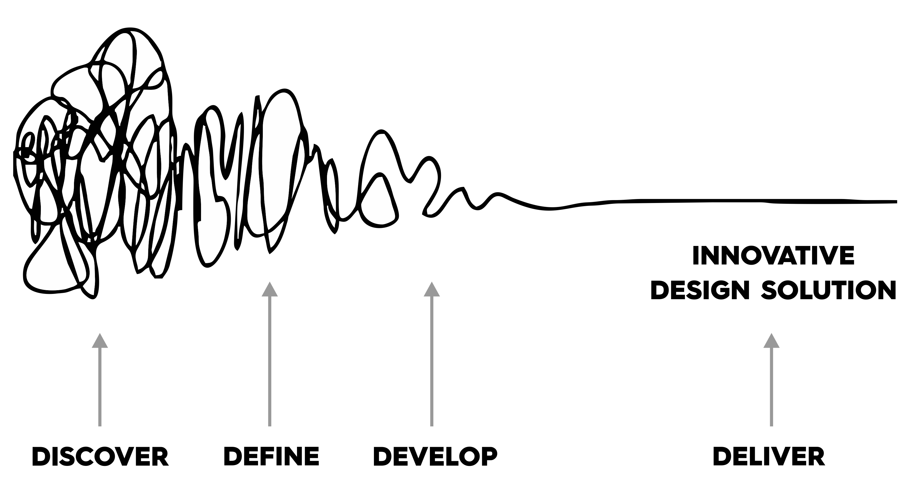

***ERIK / JANIKA: Can we use this illustration?***

<f-notes>

Image source: http://www.bullart.com.au/wp-content/uploads/2016/07/Design-Thinking2.png

</f-notes>

---

| section: Presenting ideas

##  Presenting ideas

After the process of product ideation is finished, the ideas are to be presented to the audience, whole class should be engaged. Feel free to present sketches, visualizations and/or example models of your product.

Groups would introduce their ideas briefly, covering information such as:

1. Name/description of your product
2. End users and/or target group of your product
3. Name the problem(s), which are to be solved by using your product.

Audience will have to ask specifying questions to refine and/or develop the idea, propose alternative solutions etc

---

## Refining ideas

Discuss the results on presenting the ideas with your classmates and within your group.

***Subtask 1:*** find out, whether and how the process of making your product is sustainable?

***Subtask 2:*** use the design thinking process with your group again (***TODO*** See slide 39) and **find out and describe, how it is possible to make your process and/or product even more sustainable.** Remember themes you discussed earlier in bio/chem part of the learning project, such as issues of greenwashing, industrial textile production and fashion industry problems.

---

## Preparing the marketing pitch for your product 

**Pitch**, also named **marketing pitch**, is a presentation of a **business idea** to potential investors.

People pitch ideas, because they need **resources** to fulfill their ideas. If the goal is to raise startup cash, the target of the pitch is an investor.

Other businesses pitch to potential **customers** to sell their product. Pitching is part of preparing the introduction of your idea and product to the audience and/or future customers.

***SUBTASK 1*** Prepare the pitching presentation about your product. Rehearse within your group. Make your pitch stand out. 

***SUBTASK 2*** Present your pitching presentation to your class. 

<f-notes>

It is possible to arrange the pitching of ideas as (a part of) assessment.

</f-notes>

---

| chapter: Art and Design
| section: Core message

***TODO: Titlecard***

## Core message

***TASK*** create visual design for your product

### Core message and idea 

Phrase the message that is clear enough to extend public understanding about ecological issues and matches your product.

##### 1.

Write the message on paper. Rephrase, if needed. Use extra help on language, if needed. Perform testing among the representatives of target audience.

##### 2.

Think about lettering; pick/draw the images to be used (if any).

##### 3.

Brainstorm in your group, which items/products would be carrying the message AND be sustainable by nature as well.

---

| section: Creating visuals

##  Creating the visuals of your product

##### 4.

Sketch your items and/or design on the paper by hand. Try to make variations, visualize and develop the idea, keep in mind the simplicity of the expression and composition :)

##### 5.

Digitalize your design. 
Simplest way is to take a photo(s) with your smartphone.

##### 6.

Process your images in a graphic software of your choice to make the etched model of your product. 

Visual message should be designed in a simplified and/or stylized  visual mode.

Remember to advise using enough contrast

---

***ERIK / JANIKA: Can we use this illustration?***

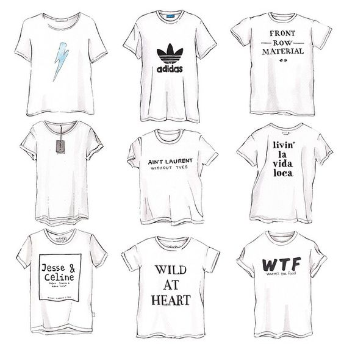

<f-notes>

Image source: https://i.pinimg.com/564x/aa/2e/db/aa2edb0b73bd63bc481a94219703116b.jpg

</f-notes>

---

| section: Making models

## Make digital / visual models of your product

##### 7.

Analyse examples given by teacher together with your classmates.

##### 8.

With your group, analyse legibility of the message design, visual hierarchy, colour contrast and overall wholeness of item and designed message, while fitting your design on the sketch of your product (use graphic software of your choice) or on selected  t-shirt (use graphic testing module of t-shirt). Think consistency. 

##### 9.

Ask for others' opinions on purposefulness of your message and (product) design, do they match? Try different variations, if required. 

<f-notes>

Prepare set of product design examples that are suited to the interests and outcomes of product development stage of your gr oup.

Examples may be both digital (photos, videos) and physical (items).

Demonstrate the through.analysis on couple of examples and support class 
with guiding questions to preform the analysis of some ot together

</f-notes>

---

| section: Matching design and technique

##  Matching design and technique

##### 11.

Keep in mind that you are supposed to use only natural color and mordant agents to complete your task. Experiment to find the best way for applying design onto your item. Again, make changes to your design and/or item details, if necessary.  If you plan to make several items, be ready for differences, as outcome may differ due to the dyeing process.

##### 12.

Make changes to your visual model, applying the knowledge you achieved of dyeing (and use process map you've made). Again, analyse legibility, visual hierarchy, colour contrast as you did before to find out, whether your design is deliverable by natural dyeing process.
 
<f-notes>

It is essential to support students through the analyse process. As students' experience to analyse both details and whole entity of item and design is still evolving, the most valuable experience they might achieve is developing observation and analysis skills. 

</f-notes>

---

| section: Process map
| 1 1 2

##  Process map

### Task: make design process map of your own products full stack process

##### 12.

Repeat steps 4-11, if necessary. 

When you are happy with your product and design, it is time to look back and analyse the product design process in whole.

***SUBTASK*** Using the design process chart as model, create your own chart with **clearly stated outcomes of each stage** together with your group mates. 

**Present your work** and help other groups by asking questions about what they have reached.

-

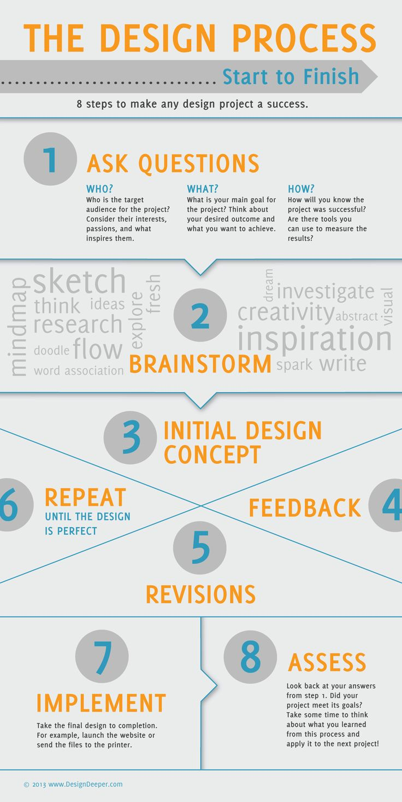

<f-notes>

It is essential to support and encourage students through the analyzing process. As they lack experience to analyse both details and whole entity of item and design and their competencies are still evolving, this is the most valuable experience they get out of design and development stage of their project.

Have large papers or flipchart and markers ready for each group.
explain the chart to the class briefly

Have each group to make process map of their own work according to the example

Let each group present their flipchart and encourage other students to ask specifying questions straight after the presentation.

Encourage students to make additions to their process maps.

This task may serve as process evaluation tool, should you need to grade your students; as the design stage ends here.

Weblink address of the chart is: https://infographicnow.com/wp-content/uploads/2017/05/business-infographic-design-deeper-design-deeper-maintenance-mode.jpg

</f-notes>

---

##  Product dyeing process

First of all, **you need to plan ahead the dyeing process**. 

It is best to do it together with your teammates. 

Discuss dyeing techniques, that would suit best to your design.

Remember to use your previous experience from bio/chem section, and your Process Map.

Think, how using different techniques, such as tie-dye, stencil, iron rust etc. would be used to transfer your design onto your item. You can also combine different techniques in order to achieve more artistic approach.

***TODO*** Link to Exploration Biology/Chemistry 1

***TODO*** Link to Biology/Chemistry 12.5 
Dyeing the fabric 3, summary

---

## ***TODO: title***

***SUBTASK 1*** create Dyeing Protocol of your product 

***SUBTASK 2*** conduct the Dyeing Process accordingly

Decide, how will you transfer your design to your item. (And still, if necessary, adapt your design.) Keep in mind, what kind of colour shades you will be able to gain (use your previous knowledge). 

---

## ***TODO: title***

To bring the pattern or text on the t-shirt, you could try:

A. Shibori technique to tie/fold the elements which will not be wearing the colour; 

B. Stencil technique to cover the part of the item which will not be wearing the colour;  

C. Use iron water to make the colours on the areas of design darker;

D. Pretreat the fabric by painting the pattern/text with soy milk.

Follow the steps for dyeing the fabric, that you have use slides on Exploration 4). ***LINK***

NOTE: Keep the record of colouring process, time and results. 

<f-notes>

Demonstrate examples of techniques.

Tie-dye: https://www.joann.com/tie-dye/

Combined techniques: https://www.artistsnetwork.com/art-mediums/technique-tuesdays-10-tips-for-stenciling/

</f-notes>

---

## Extension to printing (optional)

***TASK***

**Get to know printmaking and painting techniques**, that can be used to decorate your message t-shirt. Experiment with techniques, different dyes and/or different fabrics and/or material. You can also combine techniques and/or add ready-made textile markers. 

Discuss the process and results.

Follow the steps for dyeing the fabric, that you have use slides on Exploration 4). 

NOTE: Keep the record of colouring process, time and results. 

---

##  Brainstorming

How could we make each step of the process even more environmental-friendly?

***SUBTASK 1*** Write down the step by step protocol for improved experiment. 

---

##  Pitching

Presenting/Pitching the dyeing methods.
Use your own dyed fabrics as examples.

---

##  Explanation A

Class will **compile the poster** in form of a mind map or similar, to demonstrate and explain, what they have learned about natural pigments, dyes and dyeing.

Poster will be discussed and analysed during a class conversation, which should be led by teacher.

---

##  References

Taavi Nagel Photos https://www.facebook.com/Taavi%20Nagel%20Photos
http://climaterevolution.co.uk/wp/wp-content/uploads/2014/02/vivienne-westwood.jpg

Vivienne Westwood official Website https://blog.viviennewestwood.com

Documentary about Vivienne Westwood: https://www.viviennewestwoodmovie.com/

The Life Cycle of a T-shirt: https://ia600802.us.archive.org/17/items/youtube-BiSYoeqb_VY/The_life_cycle_of_a_t-shirt_-_Angel_Chang-BiSYoeqb_VY.mp4

T-shirt Quiz: https://drive.google.com/drive/folders/1ADNeXguW70d9cBFPz6QQ2gjTGguhkQQZ

Jay Westerveld https://www.revolvy.com/page/Jay-Westerveld

The History of Greenwashing. Jim Motavalli. Daily Finance, Feb 12th, 2011: https://web.archive.org/web/20150923212726/http://www.dailyfinance.com/2011/02/12/the-history-of-greenwashing-how-dirty-towels-impacted-the-green/

