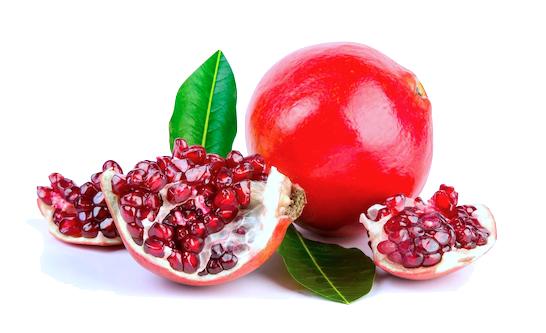
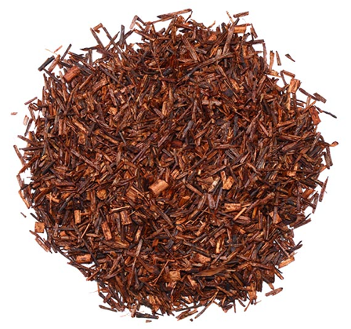
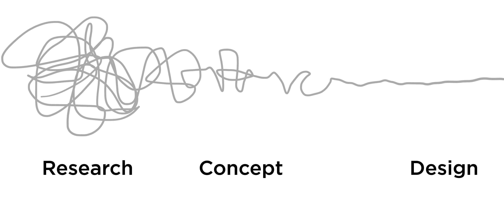

| background: ./images/map.jpg
| theme: dark
| chapter: Introduction
| section: Course overview

# <big>Sustainable fashion with natural dyes</big>

<big>From  biochemistry to product design and back</big>

<f-notes size="half" title="Course overview">

## Course Overview

Study Project "Natural Dyes" approaches the subject of chemical bonds in biology/chemistry via environmental issues by combining practical chemistry work with art/design-centered tasks and processes. 

Final aim of the study project is to **develop environmentally sustainable product**, which originates from recycling and reusing resources in order to reduce the environmental damage caused by textile and fashion industry.

### Suggestions

* Items to be dyed should be chosen by students themselves. Preferably, if they should come up with a special idea and/or develop the product. However, the product may be a ready-made item, carrying and environmental message, such as T-shirts, socks, blouses, shawls or headscarves.

* These items should be completely from natural (white) fibers, such as cotton, silk, wool and linen.

* Encourage students to recycle both textiles and colouring agents. Textile items could be picked up from second-hand stores.

* A distributable message should be constructed by students, with the teacher offering support, if needed.

* Encourage students plan the whole process at the beginning, including the core message to be spread.

* Inform your students at least one week before the start of chemistry part of the project, so they have sufficient time to collect food residue and prepare other necessary materials.

* You need to be prepared: assemble all materials required for the project to ensure successful completion.

***NOTE:*** There are several possible learning paths that could be followed during this learning project, depending on the interests and aims of both teachers and students. You could integrate this learning material with other study projects.

### Time

**Quicklook:** 30 min

**Full project:** up to 20 hrs during a 3-6 weeks period: 12-16 hrs depending on the dyeing process chosen and the level of task difficulty chosen, plus 4 hrs for production of group poster to present essential facts and for pitching the idea and product

### Class setting

* Individual work, groups of 3-4 students
* Joint discussions and analyses in class lead by the teacher

### Materials

* Fiber / clothes to be dyed
* Food waste with coloring agents
vRusty metal items
* Soy milk
* Aluminum pot
* Wooden spoons
* Fabric to filter fluid (string or cord)
* Glass jars
* Water
* Stove
* Large paper
* Coloured markers

</f-notes>

---

| theme: dark
| padding: 0
| section: Wearing a message

<section>

## The power of T-Shirt: wearing a message

British fashion designer **Vivienne Westwood** started a revolutionary mission by raising awareness on global climate issues, crossing age and state borders, thus allowing people to express their attitudes and values.

https://blog.viviennewestwood.com/the-story-so-far/

Nowadays, mitigation of climate change is no longer an option, if we are to keep planet Earth habitable. 

📺 See the Vivienne Westwood movie

 

<f-video src="https://www.youtube.com/watch?v=qvYmFcAegH4" />

<small>https://www.viviennewestwoodmovie.com/</small>

</section>

-

<f-image src="./images/westwood.jpg" />

<f-notes title="Credits">

Photo credit:
http://climaterevolution.co.uk/wp/wp-content/uploads/2014/02/vivienne-westwood.jpg

</f-notes>

---

| padding: 0

<section>

## The power of the T-Shirt: wearing a message

Nowadays, the message T-shirt, is an iconic fashion item, used to deliver information to wide target groups. Regrettably T-shirts with a message happens to be overused. 

With its roots in subcultures, the message T-shirt has been taken over by the marketing industry and has become the main agent of communication.

Is the excessive production and overuse of Fast Fashion items worth the environmental damage they cause? What can we do about it?

</section>

-

<f-image src="images/shirt.png" />

<f-notes title="Credits">

Image source:
https://www.lyst.com/clothing/vivienne-westwood-climate-revolution-cotton-jersey-t-shirt-white/

</f-notes>

---

| section: Fashion as influencing agent

| 1 2 2
| theme: dark

##  Fashion as <var>influencing agent</var>

How exactly does the fashion industry cause environmental damage?

 

<caption>📺💬 Watch and discuss the video "The Life Cycle of a T-shirt"</caption>

-

<f-video src="https://www.youtube.com/watch?v=BiSYoeqb_VY" />

<f-notes>

Demonstration & discussion with group, focusing on students interests.
Final question: what did you learn?

</f-notes>

---

| 1 2
| theme: dark
| padding: 0

<section>

##  Fashion as <var>influencing agent</var> 2

Look at the NASA image of the Aral Sea in Central Asia. This huge inland lake has shrunk to less than 10% of its original size because water from the rivers that feed it have been diverted to irrigate farmland, largely to grow cotton.

Group or individual work: <a href="./quiz/quiz-1.html" target="_blank">Complete T-shirt quiz</a>
 

Summarize all the ways in which production of a cotton T-shirt can cause environmental damage and any other concerns. Also, consider possible steps which the fashion industry and you personally could take to minimize this damage.

</section>

-

<f-image src="./images/aral.jpg" />

---

| section: Green lifestyle

| 1 1 1 1
| 2 2 2 2 
| 3 3 4 4
| rows: 50vh auto 1fr
| padding: 0

<f-image src="https://c.pxhere.com/photos/4d/bb/handmade_soap_cold_process_craft_natural_organic_pink_blue-662695.jpg!d" />

-

<section style="padding-bottom: 0">

## Living a gr€€n lifestyle

</section>

-

<section style="padding-top: 0; padding-right: 0">

People are becoming more and more aware of the environmental issues. In 2015, there is a claim that [73 percent of Millennials are willing to pay more for sustainable goods](https://www.nielsen.com/us/en/press-releases/2015/consumer-goods-brands-that-demonstrate-commitment-to-sustainability-outperform/).

</section>

-

<section style="padding-top: 0; padding-left: 0">

<caption>💬 Discuss</caption>

Are you willing to pay more for sustainable goods? Why or why not? Give some examples. 

</section>

<f-notes>
https://www.nielsen.com/us/en/press-releases/2015/consumer-goods-brands-that-demonstrate-commitment-to-sustainability-outperform/
</f-notes>

---

| section: Greenwashing

| background: https://i.pinimg.com/originals/81/ea/e7/81eae70feed346c20cb3d9ef484fa8a4.jpg
| tint: 0
| 1 1 2 2 2 3 3

##  Green&shy;washing

However, some companies are becoming more adept at falsely claiming to be "green" by promoting environmentally-friendly initiatives or images without actually implementing business practices that minimize environmental impact. 

-

-

##  &nbsp; &nbsp;

This type of promotion is termed <var>greenwashing</var>, a term coined in the 1980s by the environmentalist [Jay Westerveld](https://www.revolvy.com/page/Jay-Westerveld). 

Read more about the phenomena here: [A History of Greenwashing: How Dirty Towels Impacted the Green Movement](https://web.archive.org/web/20150923212726/http://www.dailyfinance.com/2011/02/12/the-history-of-greenwashing-how-dirty-towels-impacted-the-green/) by Jim Motvalli, Daily Finance.

<f-notes>

The Oxford English Dictionary defines <var>greenwashing</var> as the "dissemination is misinformation by an organization so as to present an environmentally responsible public image." This may involve misleading advertising, unsubstantiated claims or omission of important facts. For example, one clothing manufactures who claimed to sell eco-friendly bamboo-clothing actually sold rayon produced from bamboo. Processing of rayon uses harsh chemicals and releases hazardous air pollutants. Another manufacturer celebrated its position as the top user of organic cotton (grown without the use of harmful pesticides), yet only 13.7% of the cotton used by this company is organic.

Image credit https://www.pinterest.com/pin/447826756696310614/?nic=1a

</f-notes>

---

| section: Are you being greenwashed?
| 1 1 1
| 2 3 4

<caption>📖💬📢 Read, discuss and share the findings</caption>

## Are you being greenwashed?

-

How are the products being presented as "green products" i.e "greenwashed”?

1. Make up two teams of students. 

2. Each group reads an article and presents the findings.

-

<f-card>

### A group 

Read the article  [The troubling evolution of corporate greenwashing](https://www.theguardian.com/sustainable-business/2016/aug/20/greenwashing-environmentalism-lies-companies)

</f-card>

-

<f-card>

### B group 

Read the article [Please Stop Saying Fashion is the 2nd Most Polluting Industry After Oil](https://ecocult.com/now-know-fashion-5th-polluting-industry-equal-livestock)

</f-card>

---

| section: Upcycling
| padding: 0

<section>

## Upcycling

**What could be done to reduce the impact of excessive consumption of textile products?**

<var>Upcycling</var> is a way of reducing the impact of textile and fashion industries.

By *rebirthing* clothes through upcycling, you could save an reduce CO2 emissions by 12kg per month, just by extending the life of your clothing. 

One of the ways to do it is to *redye* your clothes.

 

<caption>📖💬 Read and discuss</caption>

[Upcycling as a Fashion Philosophy](http://www.arterritory.com/en/lifestyle/design_fashion/5062-upcycling_as_a_fashion_philosophy/) by Una Meistere.

[How to Make Natural Dyes to Dye Fabric & Clothes at Home](https://www.1millionwomen.com.au/blog/how-to-make-natural-dyes-to-dye-fabric-clothes-at-home/) by 1 Million Women.

</section>

-

<f-image src="http://media.voog.com/0000/0037/4717/photos/_P4A7159_large.jpg" />

<f-notes title="Credits">

https://reetaus.com/

</f-notes>

---

| chapter: Biochemistry
| section: Time for biochemistry
| theme: dark

# <big>🧪</big>

# Time for biochemistry

<big>Let's look a the chemistry making the sustainable fashion happen</big> 

---

| section: Natural pigments
| padding: 0

<section>

## Explore natural pigments

1. With the help of the information provided by your teacher, **find out about natural pigments with coloring properties**.

2. Discuss the properties and use of natural and artificial/chemical pigments in our environment. 

3. Find out about the impacts of pigments on the human body. Give some examples. 

4. Discuss and explain the process of dyeing, i.e how pigments bond to fabric.

</section>

-

<f-image src="https://c.pxhere.com/photos/91/4c/hand_rang_barse_holi_color_pink_powder_pigment-797619.jpg!d" />

<f-notes>

### Teacher notes:

1. The teacher should prepare and make a short presentation according to the interests of students.
 
  Share references or sources of the information presented, to help your students. 

2. Depending on the profile of the group, historical facts may also be considered. You could, for example include film clips or works of art.

3. Ask students to explain how chemical bonds are formed, keeping it simple.

Photo credits: https://pxhere.com/en/photo/797619

</f-notes>

---

| section: Choosing the fabrics
| padding: 0
| 2 1

<section>

## Choosing the fabrics

There are many aspects to consider when **choosing the fabric** to be dyed. Most of the natural fabrics are made either of **cellulose** (modal, viscose rayon, cotton, hemp, bamboo, linen) or **protein** (soy fibre, silk, wool). See more in the comprehensive [list of  textile fibers by its source](https://www.textileschool.com/amp/2782/comprehensive-list-of-textile-fibers/).

Often dyes used are **toxic** to humans or polluting the environment (e.g. azo dyes).

One of the ways to be more  conscious environmentally is to use natural dyes, for example **food residues that contain tannins**. Tannins act as natural mordants.

A greater variety of dyes can be used for dyeing protein fibres. You will find out why soon!

</section>

-

<f-image src="https://c.pxhere.com/photos/f0/fb/pareo_beach_fabrics-1075992.jpg!d" />

<f-notes>

Bring several strips of natural fabrics to the classroom, so students can touch the fabric and feel/realize the difference.

Include cellulose-based and protein-based natural fabrics.

Also introduce man-made synthetic fabrics for students to compare to natural fabrics.

**Supportive online materials:**

Cotton: https://www.textileschool.com/amp/164/cotton-fibers-and-its-properties/

Linen/flax: https://www.textileschool.com/2632/linen-fiber-from-flax-plants-and-the-linen-fabrics/

Silk: https://www.textileschool.com/163/how-silk-fiber-is-made/

Wool: https://www.textileschool.com/423/wool-fibers-natural-protein-fibers/

Viscose/rayon: https://www.textileschool.com/145/basics-of-rayon-fiber/

Image credit: https://pxhere.com/en/photo/1075992

</f-notes>

---

| section: Testing the fabrics
| background: lightergray
| 1 2
| 3 3
| 4 5

<f-video src="https://www.youtube.com/watch?v=Ug9K0DHQSgc" />

-

<f-video src="https://www.youtube.com/watch?v=kb4tCcnA6jo" />

-

<caption>🔬 Lab experiment</caption>

## Testing the fabrics

We are to do two simple nontechnical tests to identify the type of fabric fibers that  not require any special equipment or setting.  They are called <var>feeling test</var> and <var>burning test</var>.

-

1 Conduct experiments in small groups. 

2 Follow teachers guidelines. 

-

3 Take notes.

4 Discuss the findings as a group.

<f-notes>

For each group of students you will need: 

Feeling Test: selection of fabric strips (both natural and artificial) in order to get better comparison.

Burning Test: box of matches or a lighter, candle, non-flammable stand, tweezers and selection of fabric strips.

Explain and demonstrate both procedures  Let students experiment. Ask them to take notes. 

Finalise the experiment with discussion on what and how they have learned.

</f-notes>

---

| section: Key terms
| 1 1 1
| 3 5 7
| 2 4 6
| cols: 1fr 1.5fr 1fr

## Key terms

-

<var>Cellulose</var> is an organic compound, more specifically a polysaccharide consisting of repeating glucose subunits.

📺 See <a href="https://www.bbc.com/bitesize/articles/z2d2gdm">a related video</a>

-

<a href="https://www.bbc.com/bitesize/articles/z2d2gdm">

  <f-image src="./images/cellulose.png" />

</a>

-

<var>Proteins</var> are organic compounds, consisting of long chains of repeated amino acid subunits.

📺 See <a href="https://www.khanacademy.org/science/high-school-biology/hs-biology-foundations/hs-biological-macromolecules/v/introduction-to-proteins-and-amino-acids">a related video</a>.

-

<f-video src="https://www.youtube.com/watch?v=wvTv8TqWC48" />

-

<var>Tannins</var> are water-soluble organic molecules that bind to and precipitate proteins.

📖 Read <a href="https://vinepair.com/wine-101/guide-to-tannins/">a related article</a>.

-

<f-image src="https://upload.wikimedia.org/wikipedia/commons/thumb/9/90/Woody_Dicot_Stem_One_Year_Quercus_%2835038421793%29.jpg/1280px-Woody_Dicot_Stem_One_Year_Quercus_%2835038421793%29.jpg" />

<f-notes title="Credits">

A bio/chemistry teacher can work with his / her own materials for this topic, or add further explanations of information presented in the video.

Image source:

https://commons.wikimedia.org/wiki/File:Woody_Dicot_Stem_One_Year_Quercus_(35038421793).jpg

</f-notes>

---

| section: Food containing tannins
| 1
| 2
| 3
| 4
| rows: 1fr auto auto

##  Food residues that contain tannins 

-

-

Avocado stones and Avocado skins

Pomegranate skins

Red onion peels

Black tea

Rooibos tea

<f-notes title="Credits">

https://cdn.shopify.com/s/files/1/2336/3219/products/shutterstock_766828153lambhassavo_x850.jpg?v=1531526746

https://pxhere.com/en/photo/147669

https://www.boldsky.com/img/2017/06/coverimage-23-1498208010.jpg

https://dhb3yazwboecu.cloudfront.net/1007/fotosProducto/tes/
10110_VanillaBlackTea_1000x1000_l.jpg

https://localteaco.com/wp-content/uploads/2014/03/Organic-Red-Rooibos-Loose-Leaf.jpg

</f-notes>

---

| section: Mordants
| 1 1 1
| 2 3 4

## Mordants

-

People are becoming more conscious about the issues related to fast fashion and use of toxic dyes. One of the least mentioned topics is <var>mordant</var>.

Most natural dyes are not particularly toxic in themselves. However, a mordant is invariably required for development of shade and dye fixation.

Typically, a mordant is a heavy metal salt of **aluminum, iron, copper, chromium or tin** and can have an detrimental effect on our health and on the environment

-

<f-image src="./images/pot.jpg"/>

-

### Alternative mordants

There are some alternatives to using the metal salts mordants. For example the material of the pot used for extracting the dye and dyeing can have an mordanting effect and different materials lead to different colors. Usually iron pots darken the color especially if there are tannins present, whereas aluminum pots help to bring out the yellows from brown onion peels. 

<f-notes title="Credits">

https://www.sciencedirect.com/topics/chemistry/azo-dye

http://www.textilestudio.ca/guest%20artists/flint1.html

</f-notes>

---

| section: Alterative mordants
| 1 1
| 2 3

##  Alternative mordants

-

The list of alternatives is long and includes **vinegar, buffalo milk** and **urine**. 

**Read more:**

http://www.textilestudio.ca/guest%20artists/flint1.html

Different traditional cultures have found their own unique ways to fix the color onto fabric. For example, **soy milk** is used in Japan. You can buy it from the shops or make your own.

**Read more:**

https://www.pankuka-prints.com/post/217441097099/soy-milk-natural-dyes-paints

-

<f-image src="./images/puuvillsojas.jpg" />

<f-notes title="Credits">

Image source:

It is possible for you to make brief summary on the topic to save time.
It is a good option if your students are not fluent in English.
Also, here is a good option to widen the topic, if your students are interested.

http://www.textilestudio.ca/guest%20artists/flint1.html

</f-notes>

---

| section: Fabric and pesticides
| background: https://c.pxhere.com/photos/5f/8e/airplane_crop_duster_dangerous_agriculture_aircraft_farm_aviation_plane-932474.jpg!d
| backgroundposition: 50% 100%
| tint: 0
| 1 1
| 2 3

## Fabric and pesticides

-

One of the aspects to think about when choosing the fabric is to consider how much water has been consumed and polluted in the process of making the fabric. Other important aspects to consider are use of land, use of <var>pesticides</var>. Here you can find useful links to further research the environmental impact of different fabrics. 

-

Pick an article and research it. Presenting your findings concisely during discussion.

https://www.textileschool.com/154/eco-friendly-fibers/

https://www.treehugger.com/sustainable-fashion/do-you-know-which-fabrics-are-most-sustainable.html

<f-notes>

### Teacher notes:

You might want to present some interesting facts at the beginning of the topic. These facts should be chosen according to the interests of the group.

Pick an interesting piece of information, visualize it.

Allow students to analyse the articles and present information during follow-up discussion.

**Alternative pathway**: at this point,there is an excellent opportunity to include social justice issues.

Photo credits: https://pxhere.com/en/photo/932474

</f-notes>

---

| chapter: Dyeing Experiment
| section: Time for dyeing
| background: ./images/dyes.jpg
| theme: dark

# Time for Dyeing Experiment

---

| section: Starting experiment
| 1 2
| 3 3
| 4 5

<f-image src="./images/kit1.jpg">

-

<f-image src="./images/kit2.jpg">

-

## Starting experiment

-

##### Protocol for the experiment 

1. Pretreatment of fabric

2. Collecting food residues

3. Extracting the dye

4. Dyeing the fabric

5. Aftercare of the fabric

-

##### List of materials

* pot (aluminum, copper or iron)
* fabric (T-shirt)
* Filter Cloth
* soy milk (at least 1 litre)
* wooden spoon
* Protective clothing

<f-notes>

It is recommended, that you supply the items required.

If necessary, explain why a pot of certain material and wooden spoon are used.

</f-notes>

---

| section: 1. Pretreatment of fabric
| 1 2 2 2

### 1.

### Pretreatment of fabric

*15 min x 3 times*

For pre-treating the fabric you need to soak it in the soy milk for 12 hours. Keep the soaking solution in a cool place. Dry the fabric. Repeat the procedure 2 or 3 times.

-

<f-image src="./images/puuvillsojas.jpg" />

---

| section: 2. Collecting the food residues
| 1 2 3
| 4 4 4

<f-image src="./images/resi3.jpg" />

-

<f-image src="./images/resi2.jpg" />

-

<f-image src="./images/resi1.jpg" />

-

### 2. Collecting the food residues

The following food residues containing <var>tannins</var>, can be used:

1. pomegranate peels (these give a yellow shade, using an aluminum pot)

2. avocado peels (these give a pink shade, using an aluminum pot)

3. avocado stones (these give a pink shade, using an aluminum pot)

Keep the materials in a dark, dry place. Drying of food residue is not compulsory. 

***Note:*** Do not use food residues that have mould growing on them.

<f-notes>

Avocado stones account for approximately 12% of the total weight on an avocado.

</f-notes>

---

| section: 3. Extracting the dye
| 1 2
| 1 3
| rows: 1fr 1fr

###  3. Extracting the dye

*1,5h x 3 times*

##### Protocol for the experiment 

1. Heat the selected food residue materials in an aluminum pot on medium temperature for 1.5 hours

2. Cool the mixture down.

3. Repeat heating and cooling process for once or more

4. Filter the mixture. Use protective clothing. Work carefully, the mixture is hot and may stain. 

5. Pour the liquid into the bottle and store it in a cool place.

-

<f-image src="./images/pot.jpg"/>

-

<f-image src="./images/bottle.jpg"/>

---

| section: 4. Dyeing the fabric
| 1 3
| 2 3

###  4. Dyeing the fabric

*1,5h*

##### Protocol for the experiment

1. Pour dye extract into your dye pot.

2. Wet the fabric and put it into the dye pot.

3. Fibres must be submerged. If not, add more water. The fabric has to move freely in the solution to ensure even dyeing.

4. Heat the dye solution for at least 1 hour. Use low or medium heat and stir it from time to time. Leave it to cool.

5. You can repeat step 4 to get deeper shades of colors.

6. Gently squeeze out excess dye solution and leave the fabric dry in the shade. 

-

📺 See video about dyeing fabric with avocado

 

<f-video src="https://www.youtube.com/watch?v=pb8Zvv-I6Fk" />

-

<f-image src="./images/avopomshirt.jpg" />

---

| section: 5. Aftercare of the fabric
| background: ./images/final.jpg
| tint: 0
| 1 1 1
| 2 3 3

### 5. Aftercare of the fabric

-

* You will get the best results by allowing sufficient time to dye the fabric.

* The fabric should be stored for at least 7 days before you rinse it. 

-

---

| section: Making a process map
| padding: 0
| 1
| 2
| rows: 1fr auto

<f-image src="./images/process.jpg" />

-

<section>

## Wrapping up the experiment

#### Create a <var>process map</var> of dyeing process 

* Work in small groups

* Use your notes and discuss your experiments.

* Create a process map on large paper to explain the process of dyeing.

* Present your map to other members of your class.

</section>

<f-notes>

### What is a Process Map?

A process map visually shows the steps of a work activity and the people who are involved in carrying out each step.

When mapping a process you simply draw a box for each step and connect them with arrows to show the direction of flow.

See more: https://creately.com/blog/diagrams/process-mapping-guide/

### Suggestions

Let the students work in small groups. Students who have experimented with similar materials could create a joint process map.

The map could be the final step of biochemistry part and may conclude with an evaluation.

</f-notes>

---

| chapter: Product design
| section: Time for product design
| theme: dark
| background: https://c.pxhere.com/photos/7d/ef/forest_fog_cloud-109942.jpg!d
| tint: 0.8

# <big>💡</big>

# Time for product design

<big>Let's design a product to help the Earth</big> 

<f-notes title="Credits">

https://pxhere.com/en/photo/109942

</f-notes>

---

| section: The task

# 💡 

## The task

**Your task is to develop a handy, easy-to-make product**, which is  

1. solving a problem

2. made of using an item of recycled textile

3. dyed using only natural color agent and mordants

How would using such products to help maintain the well-being of our planet and ourselves?

-

# 🔀

## The process

Form a small groups of 3-5 students.

You might want to work with your friends; draw a lots or use some other method of your choice to form the group.

You will be using the simplified method of **design thinking**, which is widely and effectively used in creative industries. 

The design thinking process has five steps, which could be linear or not, depending on how the group a progresses.

---

| section: Design thinking
| 1 1 2 2 2

##  Design thinking

**Design Thinking** has evolved from Human-Centered Design focusing on customer experience, to Service Design focusing on customer journeys and touch points between a business and its customer.

Design Thinking is a step-by-step, user-centered method to creative thinking and innovation, which is based on the [building up](https://experience.sap.com/skillup/introduction-to-design-thinking/) of ideas. 

Generally, Design Thinking follows a five-step approach:

-

<f-notes>

Illustration shows the main aims of every stage of Design Thinking Process. 

The starting point is the Empathy Stage. Students may benefit from further explanation of this stage.

Encourage your group to work step-by step. If something is unclear, help the group to find the answer. If necessary, return to a previous step. 

The class will be using the Double Diamond of Design Thinking, which is explained here: https://www.designcouncil.org.uk/news-opinion/design-process-what-double-diamond

Explain, how to work using divergent and convergent thinking processes in order to follow the Double Diamond Tool.

</f-notes>

---

| section: Getting stuck
| 1
| 2

-

## Getting stuck

Although you are following the stages of a certain process, it might be confusing to find the solution to the problem. 

It is normal for a creative process to move freely between different thoughts. 

Allow yourself to think freely; keep notes/record of your ideas; listen to your teammates and feel free to develop every idea that evokes new thoughts. 

Eventually, you will find the answer :)

---

| section: Presenting ideas
| 1
| 2

<f-image src="https://c.pxhere.com/photos/01/35/office_building_conference_room_boardroom_conference_table-9341.jpg!d" />

-

##  Presenting ideas

After the process of product ideation is finished, the ideas are to be presented to the audience; and the whole class should be engaged. Feel free to present sketches, visualizations and/or example models of your product.

Groups should introduce their ideas briefly, covering information such as:

<f-card>
Name/description of your product
</f-card>

<f-card>
End users and/or target group of your product
</f-card>

<f-card>
Name the problem(s), that are to be solved by using your product.
</f-card>

Your audience should be encouraged to ask questions to refine and develop the idea, or to propose alternative solutions.

---

| section: Refining ideas

<caption>💬 Discuss</caption>

## Refining ideas

After presenting your ideas to your classmates, discuss the results within your group.

1. Is the process of making your product is sustainable?

2. Use the design thinking process with your group **find out and describe, how it is possible to make your process and/or product even more sustainable.** 

  Remember themes you discussed earlier in biochemistry part of the learning project, such as issues of greenwashing, industrial textile production and fashion industry problems.

---

| section: Pitch your product

<caption>📢 Present</caption>

## Pitch your product 

<var>Pitch</var>, also named <var>marketing pitch</var>, is a presentation of a **business idea** to potential investors.

People pitch ideas, because they need **resources** to fulfill their ideas. If the goal is to raise startup cash, the target of the pitch is an investor.

Other businesses pitch to potential **customers** to sell their product. Pitching is part of preparing the introduction of your idea and product to the audience and/or future customers.

1. Prepare the pitching presentation about your product. Rehearse within your group. Make your pitch stand out. 

2. Present your pitching presentation to your class. 

<f-notes>

It is possible to arrange the pitching of ideas as a part of an assessment.

</f-notes>

---

| chapter: Visual design
| section: Time for visual design
| theme: dark
| background: https://c.pxhere.com/images/21/38/c46c3ef5b67a0b9d2b3e49d0240b-1445899.jpg!d
| tint: 0.5

# <big>🎨</big>

# Time for visual design

<big>Let's create a visual design for our product</big>

<f-notes>

Image credits: https://pxhere.com/en/photo/1445899

</f-notes>

---

| section: Core message
| 1 1 1
| 2 2 2
| 3 4 5

<f-image style="background-position: 50% 50%" src="https://c.pxhere.com/photos/de/87/computer_office_table_keyboard_wood_work_business_desk-1188439.jpg!d" />

-

## Phrase the core message 

Phrase the <var>core message</var> so that it clear enough to extend public understanding about environmental issues and matches your product.

-

### 1.

Write the message on paper. Rephrase and ask for help on language if needed. Test your message by presenting it to target audience.

-

### 2.

Think about lettering; pick or draw any images you intend to use.

-

### 3.

Brainstorm in your group which items or products could both carry the message required *and* be sustainable.

<f-notes title="Credits">

https://pxhere.com/en/photo/1188439

</f-notes>

---

| section: Creating visuals
| 1 1 1
| 2 2 2
| 3 4 5

<f-image style="background-position: 50% 75%" src="https://c.pxhere.com/photos/7b/7b/apple_books_colored_crayons_coloured_pencils_design_desk_education_eraser-911859.jpg!d" />

-

##  Create the visuals

-

### 4.

Sketch your items and/or design on the paper by hand. Try to make variations, visualize and develop the idea, keep in mind the simplicity of the expression and composition :)

-

### 5.

Digitalize your design. The simplest way is to take photo with your smartphone.

-

### 6.

Process your images in a graphic software package of your choice to make the etched model of your product. 

<f-notes>

The visual message should be designed in a simplified and/or stylized visual mode.

Remember to use enough contrast

</f-notes>

---

| section: Making models
| 1 1 1 2 2

## Make digital models

<h3 style="margin: 0">7</h3>

Analyse examples given by your teacher together with your classmates.

<h3 style="margin: 0">8</h3>

With your group, analyse legibility of the message design, visual hierarchy, colour contrast and overall wholeness of the item and designed message, while fitting your design on the sketch of your product (use graphic software of your choice) or on a T-shirt (use graphic testing module of T-shirt). Think about consistency. 

<h3 style="margin: 0">9</h3>

Ask for others' opinions on purposefulness of your message and (product) design. Do they match? Try different variations, if required. 

-

<f-image src="https://ih1.redbubble.net/image.928645219.1020/ssrco,unisex_tshirt,womens,fafafa:ca443f4786,front,tall_three_quarter,x1000-bg,f8f8f8.u14.jpg" />

<f-notes>

Prepare a set of product design examples that are suited to the interests and outcomes of the product development stage of your gr oup.

Examples may be both digital (photos, videos) and physical (items).

Demonstrate the analysis for a couple of examples and support the class with guiding questions.

Image credits: https://www.redbubble.com/shop/p/9771020.NL9AC.cluey-kookaburra?grid_pos=5&rbs=e2d313e8-5dcb-4406-98fa-ef6efc5cc741&ref=shop_grid&searchTerm=environmental%20message#&gid=1&pid=2

</f-notes>

---

| section: Match design and technique
| 1 1
| 2 3

##  Match design and technique

-

### 10.

Keep in mind that you are supposed to use only natural color and mordant agents to complete your task. Experiment to find the best way for applying design onto your item. Make further changes to your design item if necessary.  If you plan to make several items, be ready for differences, as outcome may differ due to the dyeing process.

-

### 11.

Make changes to your visual model, applying the knowledge you achieved of dyeing (and use process map you've made). Again, analyse legibility, visual hierarchy, colour contrast as you did before to find out, whether your design is deliverable by a natural dyeing process.
 
<f-notes>

It is essential to support students through the analyse process. As your students' ability to analyse both details and whole entity of the item and design is still evolving, they will develop observation and analysis skills. 

</f-notes>

---

| section: Time for reflection
| padding: 0

<section>

## Time for reflection

When you are happy with your product and design, it is time to look back and analyse the product design process as a whole.

1. Using the design process chart as model, create your own chart with **clearly stated outcomes of each stage** together with your teammates. 

2. **Present your work** and help other groups by asking questions about what they have reached.

</section>

-

<f-image src="images/shirt.png" />

<f-notes>

It is essential to support and encourage students through the analysis process. As they lack experience to analyse both details and whole entity of the item and design and their competencies are still evolving, this is the most valuable experience they get out of design and development stage of their project.

Have large papers or flipchart and markers ready for each group. Explain the chart to the class briefly

Instruct each group to make process map of their own work according to the example

Let each group present their flipchart and encourage other students to ask questions straight after the presentation.

Encourage students to make additions to their process maps.

This task may serve as process evaluation tool, should you need to grade your students; as the design stage ends here.

Weblink address of the chart is: https://infographicnow.com/wp-content/uploads/2017/05/business-infographic-design-deeper-design-deeper-maintenance-mode.jpg

</f-notes>

<f-notes title="Credits">

Image source:

Photo by glaramknits, https://www.flickr.com/photos/21907219@N02/14376614428/

</f-notes>

---

| section: Wrapping up
| theme: dark
| background: ./images/map.png
| tint: 0.5

## Wrapping up

#### Related DesignSTEM projects:

 

<a href="../rgblamp">RGB lamp</a> covers a product design process from a different angle, from an engineering perspective.

#### Other links:

[Rebecca Desnos](https://rebeccadesnos.com), a maker and storyteller, creating books and magazines about making things with plants.

https://www.instagram.com/rebeccadesnos/

 

<f-link class="tertiary" to=".."><f-leftarrow-icon /> Back to projects</f-link>
-

<f-notes title="References">

##  References

Taavi Nagel Photos https://www.facebook.com/Taavi%20Nagel%20Photos
http://climaterevolution.co.uk/wp/wp-content/uploads/2014/02/vivienne-westwood.jpg

Vivienne Westwood official Website https://blog.viviennewestwood.com

Documentary about Vivienne Westwood: https://www.viviennewestwoodmovie.com/

The Life Cycle of a T-shirt: https://ia600802.us.archive.org/17/items/youtube-BiSYoeqb_VY/The_life_cycle_of_a_t-shirt_-_Angel_Chang-BiSYoeqb_VY.mp4

Jay Westerveld https://www.revolvy.com/page/Jay-Westerveld

The History of Greenwashing. Jim Motavalli. Daily Finance, Feb 12th, 2011: https://web.archive.org/web/20150923212726/http://www.dailyfinance.com/2011/02/12/the-history-of-greenwashing-how-dirty-towels-impacted-the-green/

</f-notes>