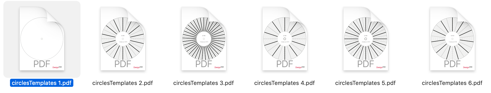

| section: START
| theme: dark

| 1 1 1 1 1 2 2 2

<f-scene width="1100" height="1100" style="position: fixed; top: -470px; right: -600px; z-index: 10000;">
  <f-circle r="0.1" :stroke="color('darkgray')" />
  <f-circle r="1.26" :stroke="color('darkgray')" />
  <f-circle r="1.95" :stroke="color('darkgray')" />
  <f-spinner :duration="10000">
    <f-group
      v-for="n in range(0,120).slice(0, 30)"
      :key="n"
      :rotation="(360 / 30) * n"
      scale="0.1">
  	<image
      :href="'./images/metropolis/metropolis' + String(n + 1).padStart(3,'0') + '.png'"
      :height="399 / 100"
      :width="250 / 100"
      transform="translate(0,14)"
    />
    </f-group>
  </f-spinner>
</f-scene>

# <big><big>Frequency & Motion</big></big>

<big>

Most of the information of our surroundings is perceived visually or audibly. Our brain processes this data and gives a meaningful context to it, but sometimes it fails and we might experience *visual anomalies* like *wheels rolling opposite direction* or *moving elements on a still picture*. Why this is happening?

<f-inline align-items="flex-start">

<f-fact-icon size="small" />

Click on <a v-on:click="send('menu')"><f-menu-icon /></a> to get the lesson outline and <a v-on:click="send('notes')">notes</a> to see teacher notes.

</f-inline>

Ready to trick your brain and explore your creativity? Prepare your turntable and let's go!

</big>

<f-next-button title="Start" />

-

<f-notes class-name="tertiary" width="50vw" style="--base: 9px; --primary: var(--darkgray);">

#### Teacher notes

This lesson is divided into three main sections:

1. Hands-on activity with the turntable to explore the meaning of frequency and movement.

2. Virtual learning objects to elaborate and test how frame rate affects our perception of movement and how frequency can be presented as a form of sinusoidal wave and 

3. Creative work to combine art and motion on a turntable.

</f-notes>

---

| background: images/collage.png
| tint: 0
| theme: dark

### The tools you will need

<f-next-button />

---

| section: DISCUSS_1

| gap: 0

| 1 2 3
| 1 4 5
| 1 6 7

<f-icon-heading icon="fact">Discuss</f-icon-heading>

# What is frequency?

Watch the following videos and define frequency with your own words and describe all possible ways to experience it.

<f-next-button />

-

<f-video src="https://www.youtube.com/watch?v=heRuLp7CyTM" />

-

<f-video src="https://www.youtube.com/watch?v=yrfibt6Bkwc" />

-

<f-video src="https://www.youtube.com/watch?v=upvYAAh8RuU" />

-

<f-video src="https://www.youtube.com/watch?v=lmIFXIXQQ_E" />

-

<f-video src="https://www.youtube.com/watch?v=wvJAgrUBF4w" />

-

<f-video src="https://www.youtube.com/watch?v=FO566k4nA3g" />

---

| background: images/example.jpg
| theme: dark

<f-activity-icon />

### Time for first hands-on exercise

<f-next-button title="Start" />

---

| section: ACTIVITY_1
| rows: auto 1fr

| 1 1 1
| 2 2 3

<f-notes class-name="tertiary" width="50vw" style="--base: 9px">

### Objective

By experimentation, students should discover how the speed of motion affects our visual perception on shapes and / or colour.

Let students draw different ideas on cut-out circles and have them on the turntable’s platter rotating at different speed levels.

It’s all about discovering new shapes and their alignment on a circle to produce visually exciting blends through movement.

Optionally, put on the vinyl record and put the paper template on it, so students can experiment with different audio and animation speeds.

### Preparation

> ##### You will need
Printed paper templates, turntable, scissors, pencils

Download and print out paper template to hand over to students. 

<a href="./files/frequency_templates.zip" class="tertiary">
<f-arrow-icon rotation="90" />Download PDF templates from here (.zip file)</a>

You'll find 6 template PDF's from the .zip file. In this excercise You'll need only the 1st template (plain).

> ##### <f-fact-icon size="small" /> Printing tips
1. print the sheet 100% size, one sided
2. print more than 1 sheet for every student

</f-notes>

# <f-activity-icon />Make a spinning animation

-

You are now ready to make your own visual experiments!

1 First you need a paper template

<a href="./files/plainCircle.pdf" class="tertiary"><f-arrow-icon rotation="90" />Download PDF template</a>

2 Use scissors to cut out circles from a paper and draw on it anything you would like to see spinning on a turntable. 

3Put the paper circle on the turntable and start spinning.

4Draw different variations to find visually the most appealing and interesting combination of movement.

<f-next-button />

-

<f-scene width="400" height="400">
  <f-rotation duration="4000">
  <f-circle r="1.9" />
  <f-arc
    v-for="r in range(0.2,1.8,1.8 / 18)"
    :r="r"
    :inner-radius="r"
    :start-angle="180"
    :end-angle="360 + 175"
    :stroke="color('lightgray')"
    stroke-width="1"
  />
  <f-circle
    r="0.8"
    :fill="color('white')"
  />
  <f-circle
    r="0.1"
    :fill="color('white')"
  />
  <f-text y="0.4">33⅓</f-text>
  <f-text y="-0.4">rpm</f-text>
  </f-rotation>
</f-scene>

---

| section: THEORY_1
| rows: auto auto 1fr

| 1 1
| 2 3
| 4 4

# From spinning to frequency

-

As you might have noticed with your drawings in order, to have a smooth animation or optical illusion, you have to manipulate two variables:

* <var>Rotational speed</var> of the turntable.

* <var class="blue">Amount of elements</var>around the circle. 

-

~Both variables can be described as [frequency](https://en.wikipedia.org/wiki/Frequency) and be expressed on a form of [sine waves](https://en.wikipedia.org/wiki/Sine_wave). Frequency is an important parameter used in science and engineering to specify the rate of a phenomenon.~

-

<f-fact-icon size="small" />
<f-sidebar title="Later You'll learn what frequency means in waves">

Current <var class="gray">x</var> axis value is <var class="gray">{{ round(get('a') / Math.PI,2) }} × π</var>

<f-slider set="a" :from="-Math.PI" :to="Math.PI" duration="1000" />
<small>Precise value is <var class="gray">{{ get('a') }}</var>

<f-scene :width="200" :height="(Math.PI / 2) * 200 + 16">
    <f-line
      :points="range(-Math.PI,Math.PI,0.1).map(x => [Math.cos(x),x])"
      :stroke="color('blue')"
      opacity="0.75"
    />
    <f-line
      :points="range(-Math.PI,Math.PI,0.1).map(x => [Math.cos(x),(x / 2) - (Math.PI / 2),])"
      :stroke="color('orange')"
      opacity="0.75"
    />
    <f-line
      :points="range(Math.PI,Math.PI * 3,0.1).map(x => [Math.cos(x),(x / 2) - (Math.PI / 2)])"
      :stroke="color('orange')"
      opacity="0.75"
    />
    <f-point
      :stroke="color('blue')"
      stroke-width="16"
      :x="Math.cos(get('a'))"
      :y="get('a')"
    />
    <f-point
      :stroke="color('orange')"
      stroke-width="10"
      :x="Math.cos((get('a') * 2) - Math.PI)"
      :y="get('a')"
    />
    <f-line
      :stroke="color('blue')"
      stroke-width="1"
      opacity="0.2"
      :x1="Math.cos(get('a'))"
      :x2="Math.cos(get('a'))"
      :y1="-Math.PI"
      :y2="Math.PI"
    />
    <f-line
      :stroke="color('orange')"
      stroke-width="1"
      opacity="0.2"
      :x1="Math.cos((get('a') * 2) - Math.PI)"
      :x2="Math.cos((get('a') * 2) - Math.PI)"
      :y1="-Math.PI"
      :y2="Math.PI"
    />
</f-scene>

<f-scene width="200" height="200">
    <f-circle />
    <f-point
      :stroke="color('blue')"
      stroke-width="16"
      :x="Math.cos(get('a'))"
      :y="Math.sin(get('a'))"
    />
    <f-point
      :stroke="color('orange')"
      stroke-width="10"
      :x="Math.cos((get('a') * 2) - Math.PI)"
      :y="Math.sin((get('a') * 2) - Math.PI)"
    />
    <f-line
      :stroke="color('blue')"
      stroke-width="1"
      opacity="0.2"
      :x1="-Math.PI"
      :x2="Math.PI"
      :y1="Math.sin(get('a'))"
      :y2="Math.sin(get('a'))"
    />
    <f-line
      :stroke="color('blue')"
      stroke-width="1"
      opacity="0.2"
      :y1="-Math.PI"
      :y2="Math.PI"
      :x1="Math.cos(get('a'))"
      :x2="Math.cos(get('a'))"
    />
    <f-line
      :stroke="color('orange')"
      stroke-width="1"
      opacity="0.2"
      :x1="-Math.PI"
      :x2="Math.PI"
      :y1="Math.sin((get('a') * 2) - Math.PI)"
      :y2="Math.sin((get('a') * 2) - Math.PI)"
    />
    <f-line
      :stroke="color('orange')"
      stroke-width="1"
      opacity="0.2"
      :y1="-Math.PI"
      :y2="Math.PI"
      :x1="Math.cos((get('a') * 2) - Math.PI)"
      :x2="Math.cos((get('a') * 2) - Math.PI)"
    />
</f-scene>

<f-scene :width="(Math.PI / 2) * 200 + 16" height="200">
    <f-line
      :points="range(-Math.PI,Math.PI,0.1).map(x => [x,Math.sin(x)])"
      :stroke="color('blue')"
      opacity="0.75"
    />
    <f-line
      :points="range(-Math.PI,Math.PI,0.1).map(x => [(x / 2) - (Math.PI / 2),Math.sin(x)])"
      :stroke="color('orange')"
      opacity="0.75"
    />
    <f-line
      :points="range(Math.PI,Math.PI * 3,0.1).map(x => [(x / 2) - (Math.PI / 2),Math.sin(x)])"
      :stroke="color('orange')"
      opacity="0.75"
    />
    <f-point
      :stroke="color('blue')"
      stroke-width="16"
      :x="get('a')"
      :y="Math.sin(get('a'))"
    />
    <f-point
      :stroke="color('orange')"
      stroke-width="10"
      :x="get('a')"
      :y="Math.sin((get('a') * 2) - Math.PI)"
    />
    <f-line
      :stroke="color('blue')"
      stroke-width="1"
      opacity="0.2"
      :x1="-Math.PI"
      :x2="Math.PI"
      :y1="Math.sin(get('a'))"
      :y2="Math.sin(get('a'))"
    />
    <f-line
      :stroke="color('orange')"
      stroke-width="1"
      opacity="0.2"
      :x1="-Math.PI"
      :x2="Math.PI"
      :y1="Math.sin((get('a') * 2) - Math.PI)"
      :y2="Math.sin((get('a') * 2) - Math.PI)"
    />
      
</f-scene>

-

<f-next-button />

---

| theme: dark

<f-fact-icon />

~The most common way to experience noticeable visual distortion caused by frequency is having the phenomenon occurring on a screen.~
  
Watch following clip and notice  <var>how wheels of the wagon are moving?</var>

<f-next-button title="Go" />

---

| theme: dark

<f-video src="https://www.youtube.com/watch?v=89TltTWEXzU&feature=youtu.be&start=3300" />

---

| section: EXPERIMENT_1

# What happened to the wheels?

~You just experienced a *wagon-wheel effect* or *stroboscopic effect* occurring on a movie clip when moving wheels are stopping or moving backwards. How does it work? Lets set up an experiment.~

#### Adjust the wheel speed so the lines will stop

Rotation speed is <var>{{ get('d', 800) }} milliseconds</var> per rotation.
This is roughly <var>{{ get('d', 800) / 1000}} seconds</var>.
          
<f-slider
  set="d"
  value="800"
  to="2000"
  step="10"
  integer
  title=""
/>

 

<f-fade v-if="get('d') == 0">

Hey, this is cheating! The wheel has to have *some* speed :)

</f-fade>

<f-fade v-if="get('d') == 500">

Almost there! Wait...it seems it is still moving?

</f-fade>

<f-fade v-if="get('d') == 1000">

Great! So it takes exactly <var>1 second</var> to make the wheel stop. *But why*? Let's move to the next step to figure it out.

<f-next-button />

</f-fade>

-

<f-scene width="500" height="500">
  <f-circle r="0.1" :stroke="color('lightergray')" />
  <f-circle r="1.03" :stroke="color('lightergray')" />
  <f-circle r="1.95" :stroke="color('lightergray')" />
  <f-spinner :duration="get('d')">
  	<f-spin-pattern count="60" r="0.5">
      <f-box
        height="0.025"
        width="0.65"
        position="1 0"
        :fill="color('primary')"
        stroke
      />
    </f-spin-pattern>
    <f-spin-pattern count="1" r="0.5">
      <f-point
        position="1.45 0"
        stroke-width="4"
        :stroke="color('red')"
      />
    </f-spin-pattern>
  </f-spinner>
</f-scene>

---

# Make it stop, again

#### Adjust the number of lines

Not lets keep the rotation constant, <var>1 second</var> per rotation, and adjust number of lines to make it appear the wheel stops.

We have <var class="blue">{{ get('c') }} lines</var>

<f-slider
  set="c"
  value="40"
  to="120"
  integer
  title=""
/>

 

<f-fade v-if="get('c') == 0">

Really? Like *really really really*?

</f-fade>

<f-fade v-if="get('c') == 15">

Did it stop? My eyes are not sure.

</f-fade>

<f-fade v-if="get('c') == 30">

Yes, it kind of stopped but this flicker is kind of annoying. Can you do better?.

</f-fade>

<f-fade v-if="get('c') == 60">

It stopped exactly at <var class="blue">60 lines</var>. *Why*? Let's figure it out in the next step.

<f-next-button />

</f-fade>

<f-fade v-if="get('c') == 90">

Ok, you can call it stopping, I call it a flicker. Try some more!

</f-fade>

<f-fade v-if="get('c') == 120">

Very good, it stopped! But can you do it with smaller number of lines as well?

</f-fade>

-

<f-scene width="500" height="500">
  <f-circle r="0.1" :stroke="color('lightergray')" />
  <f-circle r="1.03" :stroke="color('lightergray')" />
  <f-circle r="1.95" :stroke="color('lightergray')" />
  <f-spinner :duration="1000">
  	<f-spin-pattern :count="get('c')" r="0.5">
  	<f-box
      height="0.025"
      width="0.65"
      position="1 0"
      :fill="color('blue')"
      stroke
    />
    </f-spin-pattern>
    <f-spin-pattern count="1" r="0.5">
      <f-point
        position="1.45 0"
        stroke-width="4"
        :stroke="color('red')"
      />
    </f-spin-pattern>
  </f-spinner>
</f-scene>

---

# All together now

#### Adjust *both* the rotation <var>speed</var> and the number of <var class="blue">lines</var> so the wheel stops

Rotation speed is <var>{{ get('d2') }} ms</var> or<var> {{ get('d2') / 1000}} seconds</var> per rotation.

<f-slider
  set="d2"
  value="1200"
  to="2000"
  step="10"
  integer
  title=""
/>

We have <var class="blue">{{ get('c2', 60) }} lines</var>

<f-slider
  set="c2"
  value="20"
  to="120"
  integer
  title=""
/>

 

<f-fade v-if="get('d2') == 0 || get('c2') == 0">

Trust me, this value is just too low..

</f-fade>

*Voilà!* We ended up in a place where we have <var>1 second</var> for a full rotation and <var class="blue">60 lines</var> on a wheel. Do you know how fast your monitor updates it's picture?

It is <var class="blue">60 times</var><var class="red">per second</var>, also know as <var class="gray">60 Herz</var> or <var class="gray">60 Hz</var>.

The lines *never stopped*. They are moving *right now*. It is all an *illusion*.

<f-next-button />

-

<f-scene width="500" height="500">
  <f-circle r="0.1" :stroke="color('lightergray')" />
  <f-circle r="1.03" :stroke="color('lightergray')" />
  <f-circle r="1.95" :stroke="color('lightergray')" />
  <f-spinner :duration="get('d2')">
  	<f-spin-pattern :count="get('c2')" r="0.5">
  	<f-box
      height="0.025"
      width="0.65"
      position="1 0"
      :fill="color('blue')"
      stroke
    />
    </f-spin-pattern>
    <f-spin-pattern count="1" r="0.5">
      <f-point
        position="1.45 0"
        stroke-width="4"
        :stroke="color('red')"
      />
    </f-spin-pattern>
  </f-spinner>
</f-scene>

---

# Illusion of cinema

~By replacing replace <var class="blue">lines</var> with <var class="blue">image frames</var> we created the most basic cinema projector.~

Rotation speed is <var>{{ get('d3') }} ms</var> or<var> {{ get('d3') / 1000}} seconds</var> per rotation.

<f-slider
  set="d3"
  value="1000"
  to="2000"
  step="10"
  integer
  title=""
/>

We have <var class="blue">{{ get('c3', 60) }} image frames</var>

<f-slider
  set="c3"
  value="60"
  from="1"
  to="120"
  integer
  title=""
/>

 

~This is what happened with wagon wheels. Traditionally the movie playback speed is <var class="blue">24 frames</var> per <var>second</var> but wheels moving on screen can get in and out of sync of the framerate so they appear to stand still or moving backwards. It is called a <a href="https://en.wikipedia.org/wiki/Stroboscopic_effect" target="_blank">stroboscopic effect.</a>~

<f-next-button />

-

<f-scene width="500" height="500">
  <f-circle r="0.1" :stroke="color('lightergray')" />
  <f-circle r="1.95" :stroke="color('lightergray')" />
  <f-spinner :duration="get('d3')">
    <f-group v-for="n in range(0,120).slice(0, get('c3'))" :rotation="(360 / get('c3')) * n" scale="0.1">
  	<image
      :href="'./images/metropolis/metropolis' + String(n + 1).padStart(3,'0') + '.png'"
      :height="399 / 100"
      :width="250 / 100"
      transform="translate(0,14)"
    />
    </f-group>
  </f-spinner>
</f-scene>

---

| section: ACTIVITY_2
| rows: auto 1fr

| 1 1 1
| 2 2 3

<f-notes class-name="tertiary" width="50vw" style="--base: 9px">

### Objective

Students will acquire deeper knowledge about frequency and frame rate while producing artwork on the circles with grid.

These circles will be used to replica [stroboscopic effect](https://en.wikipedia.org/wiki/Stroboscopic_effect).

### Preparation

> ##### You will need
Printed grid circles, turntable, scissors, pencils, smartphone/tablet/PC for online tool

Download and print out paper templates to hand over to students. You can download them from here

<a href="./files/frequency_templates.zip" class="tertiary"><f-arrow-icon rotation="90" />Download PDF templates</a>

> ##### <f-fact-icon size="small" /> Printing tips
1. Print the sheet 100% size, onesided
2. Print more than 1 sheet for every student

Students have to find the precise spinning speed to demonstrate the effect through the lens of smartphone / tablet / PC camera using the frame rate tool. 

<a class="tertiary" href="../frequency_camera">Open framerate camera app</a>

</f-notes>

# <f-activity-icon />Make a spinning animation II

-

1 First you need paper templates with spokes

<a href="./files/frequency_templates.zip" class="tertiary"><f-arrow-icon rotation="90" />Download set of PDF templates (.zip file)</a>

2 Draw in between the spokes

3 Have the paper to rotate on the turntable

4 Experiment with turntable speeds so the lines (strokes) will stop

4 Observe the rotation on your smartphone / tablet / computer and adjust the framerate:

<a class="tertiary" href="../frequency_camera" target="_blank">Open framerate camera app</a>

<f-next-button />

-

<f-scene width="400" height="400">
  <f-rotation>
  <f-circle r="1.9" />
  <f-arc
    v-for="r in range(0.2,1.8,1.8 / 18)"
    :r="r"
    :inner-radius="r"
    :start-angle="180"
    :end-angle="360 + 175"
    :stroke="color('lightergray')"
    stroke-width="1"
  />
  <f-line
    v-for="a in range(0,360,360/10)"
    :x2="polarx(a,1.9)"
    :y2="polary(a,1.9)"
  />
  <f-circle
    r="0.8"
    :fill="color('white')"
  />
  <f-circle
    r="0.1"
    :fill="color('white')"
  />
  <f-text y="0.4">33⅓</f-text>
  <f-text y="-0.4">rpm</f-text>
  </f-rotation>
</f-scene>

---

| section: THEORY_2

| 1 1 2 2

<f-notes class-name="tertiary" width="50vw" style="--base: 9px">

Students will learn how to present frequency on a sinusoidal wave. To let them experiment and test their new knowledge about frequency in a more mathematical way of thinking

~Frequency can be expressed with sinusoidal wave having two variables: time and cycle. On a two-dimensional space, if X-axis will represent time and Y-axis a cycle, we can start presenting frequency with the sinusoidal wave.~

~On sinusoidal wave time lapses from left to right on the horizontal axis. Highest frequency has more cycles on a vertical axis representing faster rate.~

</f-notes>

# Frequency as a wave

~After exploring spinning frequency and frame rate, let's define frequency as form of *wave*. The most common waveform might be the <a target="_blank" href="https://pudding.cool/2018/02/waveforms/">soundwave <f-arrow-icon rotation="-45" style="--icon-stroke: var(--gray)" /></a> but it can also represent <a href="../colorblindness">color <f-arrow-icon rotation="-45" style="--icon-stroke: var(--gray)" /></a></a> or movement.~

#### **1** Explore the waveform

Current <var class="gray">x</var> axis value is <var class="gray">{{ round(get('a') / Math.PI,2) }} × π</var>

<f-slider set="a" :from="-Math.PI" :to="Math.PI" duration="1000" />
<small>Precise value is <var class="gray">{{ get('a') }}</var>

#### **2** Discuss

What are you findings regarding waves moving in different speeds, on different frequencies? How can frequency be interpreted in other visual ways?

<f-next-button />

-

<f-scene :width="200" :height="(Math.PI / 2) * 200 + 16">
    <f-line
      :points="range(-Math.PI,Math.PI,0.1).map(x => [Math.cos(x),x])"
      :stroke="color('blue')"
      opacity="0.75"
    />
    <f-line
      :points="range(-Math.PI,Math.PI,0.1).map(x => [Math.cos(x),(x / 2) - (Math.PI / 2),])"
      :stroke="color('orange')"
      opacity="0.75"
    />
    <f-line
      :points="range(Math.PI,Math.PI * 3,0.1).map(x => [Math.cos(x),(x / 2) - (Math.PI / 2)])"
      :stroke="color('orange')"
      opacity="0.75"
    />
    <f-point
      :stroke="color('blue')"
      stroke-width="16"
      :x="Math.cos(get('a'))"
      :y="get('a')"
    />
    <f-point
      :stroke="color('orange')"
      stroke-width="10"
      :x="Math.cos((get('a') * 2) - Math.PI)"
      :y="get('a')"
    />
    <f-line
      :stroke="color('blue')"
      stroke-width="1"
      opacity="0.2"
      :x1="Math.cos(get('a'))"
      :x2="Math.cos(get('a'))"
      :y1="-Math.PI"
      :y2="Math.PI"
    />
    <f-line
      :stroke="color('orange')"
      stroke-width="1"
      opacity="0.2"
      :x1="Math.cos((get('a') * 2) - Math.PI)"
      :x2="Math.cos((get('a') * 2) - Math.PI)"
      :y1="-Math.PI"
      :y2="Math.PI"
    />
</f-scene>

<f-scene width="200" height="200">
    <f-circle />
    <f-point
      :stroke="color('blue')"
      stroke-width="16"
      :x="Math.cos(get('a'))"
      :y="Math.sin(get('a'))"
    />
    <f-point
      :stroke="color('orange')"
      stroke-width="10"
      :x="Math.cos((get('a') * 2) - Math.PI)"
      :y="Math.sin((get('a') * 2) - Math.PI)"
    />
    <f-line
      :stroke="color('blue')"
      stroke-width="1"
      opacity="0.2"
      :x1="-Math.PI"
      :x2="Math.PI"
      :y1="Math.sin(get('a'))"
      :y2="Math.sin(get('a'))"
    />
    <f-line
      :stroke="color('blue')"
      stroke-width="1"
      opacity="0.2"
      :y1="-Math.PI"
      :y2="Math.PI"
      :x1="Math.cos(get('a'))"
      :x2="Math.cos(get('a'))"
    />
    <f-line
      :stroke="color('orange')"
      stroke-width="1"
      opacity="0.2"
      :x1="-Math.PI"
      :x2="Math.PI"
      :y1="Math.sin((get('a') * 2) - Math.PI)"
      :y2="Math.sin((get('a') * 2) - Math.PI)"
    />
    <f-line
      :stroke="color('orange')"
      stroke-width="1"
      opacity="0.2"
      :y1="-Math.PI"
      :y2="Math.PI"
      :x1="Math.cos((get('a') * 2) - Math.PI)"
      :x2="Math.cos((get('a') * 2) - Math.PI)"
    />
</f-scene>

<f-scene :width="(Math.PI / 2) * 200 + 16" height="200">
    <f-line
      :points="range(-Math.PI,Math.PI,0.1).map(x => [x,Math.sin(x)])"
      :stroke="color('blue')"
      opacity="0.75"
    />
    <f-line
      :points="range(-Math.PI,Math.PI,0.1).map(x => [(x / 2) - (Math.PI / 2),Math.sin(x)])"
      :stroke="color('orange')"
      opacity="0.75"
    />
    <f-line
      :points="range(Math.PI,Math.PI * 3,0.1).map(x => [(x / 2) - (Math.PI / 2),Math.sin(x)])"
      :stroke="color('orange')"
      opacity="0.75"
    />
    <f-point
      :stroke="color('blue')"
      stroke-width="16"
      :x="get('a')"
      :y="Math.sin(get('a'))"
    />
    <f-point
      :stroke="color('orange')"
      stroke-width="10"
      :x="get('a')"
      :y="Math.sin((get('a') * 2) - Math.PI)"
    />
    <f-line
      :stroke="color('blue')"
      stroke-width="1"
      opacity="0.2"
      :x1="-Math.PI"
      :x2="Math.PI"
      :y1="Math.sin(get('a'))"
      :y2="Math.sin(get('a'))"
    />
    <f-line
      :stroke="color('orange')"
      stroke-width="1"
      opacity="0.2"
      :x1="-Math.PI"
      :x2="Math.PI"
      :y1="Math.sin((get('a') * 2) - Math.PI)"
      :y2="Math.sin((get('a') * 2) - Math.PI)"
    />
      
</f-scene>

---

| section: ACTIVITY_3

| 1 2
| 1 3

# <f-activity-icon />Final project

#### **1** Create and present an animation

As a final task, you will prepare an analog animation using rotational movement. You can visualize abstract morphing or use more illustrative style for the animation. Experiment and use your knowledge gathered from previous exercises to achieve visually attractive outcome. 

#### **2** Answer the questions

1. What constraints did you experience with the process?

2. Which variable (e.g. framerate, speed of the rotating device, spokes) had the most critical part in your animation?

<a class="tertiary" href="..">← Back to projects</a>

<f-notes class-name="tertiary" width="50vw" style="--base: 9px">

Final assignment is an individual work for students is to create analogue animation and capture it with any device that can record a video file.

> **You will need:** Any device that captures video, any kind of props

There are many paths for students to take:

* They can make it as a flat 2D animation
* They can go more complex and make it with a 3D shape

There is possibility to manipulate visuals with strobe light or use any other device than turntable to rotate the artwork.

It is teacher, who can decide according to the planned curriculum, how complex the pathway should be to take.

</f-notes>

-

<f-video src="https://www.youtube.com/watch?v=D6imyhJYEIY" />

-

<f-video src="https://www.youtube.com/watch?v=9n-DtqB0sNc" />

<!--

~In everyday life most of the information of our surroundings is perceived visually or audibly.~

~Our brain processes this data and gives a meaningful context to it (e.g. colour vision), but sometimes it fails to process this info and we might experience visual anomalies like wheels rolling opposite to a driving direction ([wagon-wheel effect](https://en.wikipedia.org/wiki/Wagon-wheel_effect)) or moving elements on a still picture ([optical art](https://en.wikipedia.org/wiki/Op_art)).~

-->
