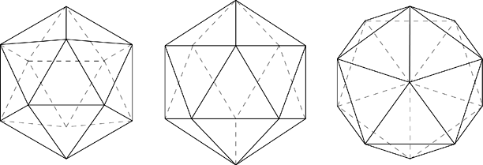
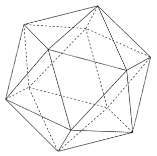
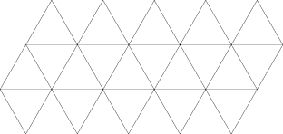
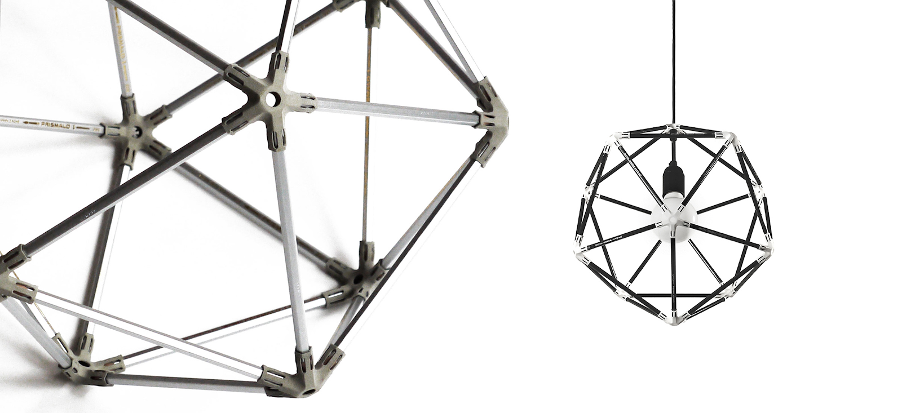

| background: ./images/photo3.jpg
| theme: dark

# <big>From geometry to design</big>

<big>How geometric object becomes a design object</big>

<f-notes title="Outline" width="50vw" style="--primary: var(--darkgray)">

## Scenario outline

1. Discover the slide-together technique which uses two-dimensional shape to create three-dimensional object

2. Make the modular polyhedra model from 20 pieces paper triangles

3. Icosahedron explanation

4. How can math model be base for designing the useful object? What creates difference? See https://foroalfa.org/en/articles/from-the-useful-object-to-the-object-tool

5. Based on the modular polyhedra model create your object by changing triangle shape so you can't recognize geometry, from geometry to model with emotion and character.
</f-notes>

---

# Discover the slide-together technique 

### which uses two-dimensional shape to create three-dimensional object

Nature has been called the greatest designer. 

Lets learn nature’s design process and create ourselves. 

How nature creates? **Repetition**, repeating patterns.

Geometric patterns are useful tool in graphic design, but not only.

Geometric 3D models can give ideas for creating everyday domestic objects with beauty and character.

See

https://sliceforms.wordpress.com/
http://www.k2g2.org/wiki:sliceform
http://archive.bridgesmathart.org/2017/bridges2017-63.pdf 

---

# Make the modular polyhedra model 

Make the modular polyhedra model from paper with slide-together technique. 

### 1. Print out worksheet on 160 g/m² A4 paper 
<a class="tertiary" href="./files/geometry_printout.pdf"><f-download-icon /> Download</a>

### 2. Cut out 20 pieces of triangles with slits at the proper locations

### 3. Slide triangles together

<f-notes>

### See also

http://www.georgehart.com/slide-togethers/slide-togethers.html

http://www.cutoutfoldup.com/956-slide-together-model-made-with-triangles.php

http://makingmathvisible.com/PaperTriangleBall/PaperTriangleBall.html

</f-notes>

---

| 1 1 1 2
| 3 3 4 4
| rows: auto

-

-

-

# The icosahedron is a 20-faced polyhedron

When balanced on a point, the icosahedron can be understood as a "ring" of 10 triangular faces with a rosette of 5 faces above and another rosette of 5 below.

When balanced on a point, the icosahedron can be understood as a "ring" of 10 triangular faces with a rosette of 5 faces above and another rosette of 5 below.

http://mathworld.wolfram.com/Icosahedron.html

https://www.flickr.com/photos/fdecomite/3604422381/in/photostream/

https://www.halodesign.dk/brands/iq-light/?lang=en

---

| padding: 0

<section><section>

# Who Discovered the Icosahedron?

It has been suggested that the regular icosahedron is the first example of a geometrical object that was the free creation of human thought, not the result of observations in nature.

WHY? HOW?

</section></section>

-

---

| padding: 0

<section><section>

# Viruses

Icosahedron is not seen in nature human scale, only at microscopic scales for example the structure of virus can be icosahedral shape.

This is diagram of an Adenovirus.

https://www.khanacademy.org/science/high-school-biology/hs-human-body-systems/hs-the-immune-system/a/intro-to-viruses

https://viralzone.expasy.org/678

</section></section>

-

---

# History

Twenty-sided die (icosahedron) with faces inscribed with Greek letters. 
Created: 2nd century B.C.–4th century A.D. Period: Ptolemaic Period–Roman Period

https://www.georgehart.com/icosahedral/icosahedral.html

-

---

| background: ./images/photo2.jpg
| theme: dark

# Math model as a base for design

---

| padding: 0

<section>

# This is Michiel Cornelissen 30 pencil icosahedron

http://www.michielcornelissen.com/portfolio_page/30-pencil-icosahedron/
https://www.amazon.ca/Ikea-Joxtrop-Renewable-Lampshade-Cardboard/dp/B01LXV2N2S

</section>

---

# From geometry to feelings

Alter the base triangle in a way that makes the composed structure to have “feelings”

---

| background: ./images/photo1.jpg

<f-notes>

***TRANSLATE***

Kolmnurgast saab slide-together tehnikaga luua ka teisi geomeetrilisi kujundeid...

https://www.halodesign.dk/brands/iq-light/

</f-notes>

---

# Why hands and paper?

Alongside the new high-tech trend, it is just as important to experiment with your own hands. Thinking with hands will eventually lead us to a world of complex design and science.

As in the digital world, there is no limit to hands-on method, moreover, expanding its boundaries is equally accessible to everyone.

Let's start with paper, ordinary and available material.