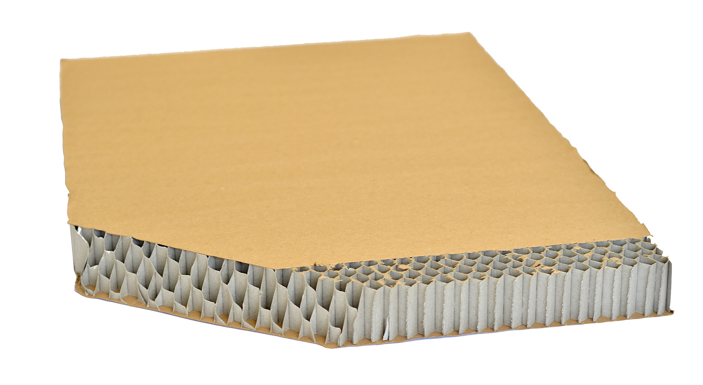

| section: Start
| theme: light
| gap: var(--base10)
| background: https://upload.wikimedia.org/wikipedia/commons/thumb/6/6e/Museum_of_Brands_London_can_display.jpg/1920px-Museum_of_Brands_London_can_display.jpg
| theme: dark

# <big>Of Bees and Packaging</big>

<big>How to optimize packaging, reduce excess space and avoid material waste</big></big>

<f-next-button title="Start" />

<f-notes style="--primary: var(--darkgray)" >

### Learning goals

In this workshop, you will look at different aspects regarding packaging design and use knowledge in mathematics to complete your final task successfully.

We will be focussing on packaging made out of cardboard, but there are so many other ways to "wrap" products. But the main aims are always the same:

* Protect the product (against damage, stealing)
* Make the product look more appealing from the outside (sell the product to the customer)

Image credits: www.unsplash.com

</f-notes>

---

| section: History of packages
| 1 1 2 2 2 2
| gap: var(--base5)

-

## Human-made packaging

Whenever products are sold, they need to be protected for their transport, before their use. Whether salespeople wrap fish into the old newspaper at a market or whether we have high-end hi-fi products that are put into shiny, colorful packaging. Packaging has always been there whenever there were products that have been sold and/or transported.

1. The evolution of packaging is strongly related to human history. Watch the following video and find out more:

  

    
Watch the video overview

    <f-video src="https://www.youtube.com/watch?time_continue=4&v=xz9UM9ZVvXY" />
  

2. Look for packaging around you and find differences between them regarding their shape. Compare the form to the product inside. In which way does the packaging mirror the inside?

3. Take pictures of these packagings for future reference.

 

---

| section: Fraud packaging

| 1 1 2 2

## Fraud packaging

Today, the packaging is not only protection but also marketing and, therefore, often misleading! 

On the right, you can see an X-Ray of a cocoa package, showing the amount of product in relation to the size of the packaging.

 

<caption>🕵️🤔 Investigate and think</caption>

1. Look through your cupboards at home or walk through your neighborhood supermarket: Are there any product packaging that is misleading (i.e., content is smaller than the packaging suggests)?

2. What do you think and feel about it?

3. Which environmental consequences do fraud packages have?

 

-

<f-notes title="Credits">

[© Verbraucherzentrale Hamburg (vzhh)](https://www.vzhh.de/themen/mogelpackungen/luftpackungen/mogelpackungen-jede-menge-luft-nach-oben)

---

| 2 4 6
| 1 3 5

### Costly packaging

Sometimes the value of the package is higher than the value of the product itself, depending on the material in use and the further processing to make the product look more valuable.

<f-arrow-icon /> **Find other examples!**

-

<f-image src="https://upload.wikimedia.org/wikipedia/commons/4/45/Metal_Water_Bottles.jpeg" />

-

### Precious packaging

Sometimes the package is part of the value, like with perfume bottles. Walk through a perfume store and look at the different and extraordinary shapes. No one would put so much effort into designing bottles if it wasn't what the customer wanted.

<f-arrow-icon /> **Which other examples of precious packaging can you find?**

-

<f-image src="https://upload.wikimedia.org/wikipedia/commons/thumb/0/0e/Chanel_N%C2%B05.jpg/1024px-Chanel_N%C2%B05.jpg" />

-

### Ethic packaging

 Reducing packaging is an ethic mission &ndash; **always**! And it is getting out of hand, because one product can be wrapped multiple times, e.g., cornflakes. They are packaged in a plastic bag inside a cardboard box.

<f-arrow-icon /> **Find other examples for multiple times wrapped products. What is the purpose?**

 

-

<f-image src="https://upload.wikimedia.org/wikipedia/commons/thumb/e/e6/Make_a_difference%2C_understanding_Pendleton%27s_recycling_program_DVIDS536228.jpg/1200px-Make_a_difference%2C_understanding_Pendleton%27s_recycling_program_DVIDS536228.jpg" />

---

| section: Packages in nature
| gap: var(--base8)

## Packaging in nature

Nature has always evolved the best packaging for its products. 

#### TASK

Where in nature, can you find packaging examples? Think of fruits, for example.

 

But let's think further:
**How can we optimize packaging?** 

 

-

<f-image src="https://upload.wikimedia.org/wikipedia/commons/thumb/f/fe/Edward_Julius_Detmold_-_The_Fruits_of_the_Earth.jpg/800px-Edward_Julius_Detmold_-_The_Fruits_of_the_Earth.jpg" />

---

| section: Exercise: milk carton
| 1 1
| 2 3
| 4 4

<caption>🛠️ Exercise</caption>

## Compare perimeter and volume

-

1. Bring/take a milk or juice carton (square shape). Cut off the top of the carton and fill it with rice until it is full.

2 Weigh the rice on a scale without the carton (pour it into a bowl). Note the weight!

3 Also, cut off the bottom of the carton and cut along one of the sides to open it up.

-

4 Change the base of the carton into different regular shapes (see below) and check if the resulting boxes contain varying amounts of rice at the same amount of carton wrapping.

5 Which shape optimizes the carton's volume?

6 What can you say about the relation between the <var>perimeter</var> of the base and the <var>volume</var> of the carton?

-

<table>
  <tbody>
    <tr>
      <td>
        <f-scene responsive width="200" height="200">
          <f-regularpolygon
            scale="1.75"
            count="3"
            :stroke="color('red')"
          />
        </f-scene>
      </td>
      <td>
        <f-scene responsive width="200" height="200">
          <f-regularpolygon
            scale="1.75"
            count="4"
            :stroke="color('red')"
          />
        </f-scene>
      </td>
      <td>
        <f-scene responsive width="200" height="200">
          <f-regularpolygon
            scale="1.75"
            count="5"
            :stroke="color('red')"
          />
        </f-scene>
      </td>
      <td>
        <f-scene responsive width="200" height="200">
          <f-regularpolygon
            scale="1.75"
            count="6"
            :stroke="color('red')"
          />
        </f-scene>
      </td>
      <td>
        <f-scene responsive width="200" height="200">
          <f-circle
            scale="1.75"
            :stroke="color('red')"
            stroke-width="5"
          />
        </f-scene>
      </td>
    </tr>
    <tr>
      <td>Weight:</td>
      <td>Weight:</td>
      <td>Weight:</td>
      <td>Weight:</td>
      <td>Weight:</td>
    </tr>
  </tbody>
</table>

-

<!--

-->

---

| section: Explore polygon area and perimeter
| 1 1 1 2 2
| background: var(--lightergray)

## Explore: Polygons with a fixed perimeter

**Experiment how polygons area changes**

1. Start changing only the dimension of a square and a triangle with the same <var>perimeter</var> <f-math inline :update="get('p')">p = \color{red}{ {{ get('p') }} }</f-math>

  <f-slider set="p" from="1" to="10" />

  <small>

  Which is the ratio between square and triangle areas? What can you say about the volume of a milk carton with triangle base?

  </small>

2. Now keep a fixed perimeter of <f-math inline red>10</f-math> and change the <var>number of edges</var> <f-math inline :update="get('n')">n = \color{red}{ {{ get('n') }} }</f-math>

  <f-slider set="n" from="3" to="32" integer >
  </f-slider>

  <small>

  How does the ratio between square and polygons change?
  You are given a fixed perimeter, which is the polygon with the biggest area?
  What can you say about the volume of the milk carton?
  Have you ever seen packages where the base is not square?

  </small>

 

-

<f-scene dots step="0.5" responsive>
  <f-group :rotation="get('r',0)">
    <f-circle opacity="0.1" :r="crEP(get('n',3),get('p',1))" :stroke="color('yellow')/>
    <f-circle :r="crEP(32,get('p',1))" opacity="0.2" />
    <f-line
      closed
      :points="polarpoints(Math.floor(4),crEP(4,get('p',1)))"
      :stroke="color('blue')"
    />
    <f-line
      closed
      :points="polarpoints(Math.floor(get('n',3)),crEP(get('n',3),get('p',1)))"
      :stroke="color('red')"
    />
    <f-circle opacity="0.1" :r="rEP(get('n',3),get('p',1))" / :stroke="color('green')>
    <f-line
      opacity="0"
      :x2="polarpoints(get('n',3),rEP(get('n',3),get('p',1)))[0].x"
      :y2="polarpoints(get('n',3),rEP(get('n',3),get('p',1)))[0].y"
    />
  </f-group>
</f-scene>

---

| section: Stacking multiple packages
| gap: var(--base8)

## Multiple packaging

Take a lemon or an orange. Think about its parts and its packaging subdivision.

Sometimes natural packagings do not optimize the amount per se, but they maximize the **outer container utilization**.

-

<f-image src="https://upload.wikimedia.org/wikipedia/commons/thumb/4/43/Ambersweet_oranges.jpg/1280px-Ambersweet_oranges.jpg" />

---

| 1 1
| 2 3
| rows: auto 1fr
| background: var(--lightergray)

## What if we have to store multiple packages?

-

Try to fill all the gaps between packages optimizing perimeter in a different pattern.

<var>perimeter</var> <f-math inline :update="get('p')">p = {{ get('p') }}</f-math>

<f-slider set="p" from="1" to="10" />

<var>number of edges</var> <f-math inline :update="get('n')">n = {{ get('n') }}</f-math>

<f-slider set="n" from="3" to="32" integer />

<var>rotation</var> <f-math inline :update="get('r')">n = {{ get('r') }}</f-math>

<f-slider set="r" from="0" to="360" />

 

1. Which polygon is the best regarding the storage, which is the worst?

2. Reflect on your result from no. 1 and compare it to shelves at home or the supermarket. Which shape would be best here?

 

-

<f-scene width="220" height="220">
  <f-group scale="1">
    <f-grid-pattern cols="3" rows="3" step="1">
      <f-group :rotation="get('r',0)">
        <f-line 
          closed
          :points="polarpoints(Math.floor(get('n',3)),crEP(get('n',3),get('p',1)))"
          :stroke="color('red')"
          fill="white"
        />
      />
    </f-grid-pattern>
  </f-group> 
</f-scene>

<f-scene width="220" height="220">
  <f-group scale="1">
    <f-hex-pattern cols="3" rows="3" step="0.5">
      <f-group :rotation="get('r',0)">
        <f-line 
          closed
          :points="polarpoints(Math.floor(get('n',3)),crEP(get('n',3),get('p',1)))"
          :stroke="color('red')"
          fill="white"
        />
      />
    </f-grid-pattern>
  </f-group> 
</f-scene>

<f-scene width="220" height="220">
  <f-group scale="1">
    <f-spin-pattern>
      <f-group :rotation="get('r',0)">
        <f-line 
          closed
          :points="polarpoints(Math.floor(get('n',3)),crEP(get('n',3),get('p',1)))"
          :stroke="color('red')"
          fill="white"
        />
      />
    </f-grid-pattern>
  </f-group> 
</f-scene>

---

| 1 2 2 2

## Let's put it together!

Take all the information you gathered during the last pages! Can you evaluate which is the **optimal shape to store the maximum amount of rice with minimal cardboard material** without loss of space in between the cartons?
**Which shape would you pick? Explain your choice!**

 

-

---

| section: Bees and packaging 1
| 1 2 2

## Bees and packaging

Find out how honeycombs are built and why bees choose hexagons and not other regular polygons. 

1. Watch the video

2. Verify that the hexagon has the maximum area among the stackable polygons with the same perimeter.

3. Verify that the hexagon has the minimum perimeter among the stackable polygons with the same area.

 

-

<f-video src="https://www.youtube.com/watch?v=QEzlsjAqADA" />

---

| section: Bees and packaging 2
| 1 2

## Packaging materials

Honeycombs are not only used for packaging but also **packaging materials**.

<blockquote>

Cardboard honeycomb panels consist of two supporting surface layers and a honeycomb core, similar to that of a honeycomb from a beehive.
  
</blockquote>

#### Tasks

1. Research further possible applications for honeycomb cardboards. Where are they used else, other than packaging?
2. Find out the advantages honeycomb cardboard has, in comparison to wood or other materials. What makes it so attractive to work with?

 

-

---

| section: Natural marketing
| padding: 0

<section>

<caption>Discuss</caption>

## Natural marketing in packaging 

Sometimes in nature, the **packaging is part of the product**.

1. Take an apple. Think about its skin, core, and seeds. What is the product, and what is packaging?

2. Do you know about a human-made product having a package that is part of the product? Research on the internet if necessary!

3. What do you think about products where the package is part of the product? What are the advantages and what are the disadvantages?

 

</section>

-

<f-notes title="Credits">

https://www.rawpixel.com/image/321681/free-illustration-image-pear-antique-antique-book

</f-notes>

---

| caption: Final assignment
| gap: var(--base6)
| background: var(--lightergray)

<caption>🎓 Final assignment</caption>

## Design your own packaging

Now that you've learned so much about packaging, it's time that you design one yourself. Choose one of the following three tasks:

**For all tasks**: Create a dummy of your packaging and be ready to explain why you designed it this way!
-

## A

1. Choose an object that you want to design a cardboard package for. You can use multiple small objects (like rice, cornflakes, pasta, etc.) or a more significant object.

2. Remember what you've learned about fraud packaging. Sometimes a little air inside is needed to protect the product during a bumpy ride, but too much is misleading. Plan your sizing carefully! Decide upon the best shape.

3. What if you have to store/stack several packages? How could you optimize the shape of your package to reduce the loss of space between them?

4. Additional task: Think about the packaging inside the cardboard package. Fragile objects need extra packaging. How can you guarantee that the object won't break, while trying not to waste material?

-

## B

1. Try to design a reusable package, possibly suitable for different purposes. Take this example: At LUSH, you will get reusable packaging for soaps, so you'll go there and can get a refill into your old packaging.

2. Choose a product for your reusable packaging.

3. Evaluate what’s the best material for your package; keep in mind that it has to be reusable! 

4. What if you have to store/stack several packages, how could you optimize the shape of your package to reduce the loss of space between them?

-

## C

1. Design packaging for different spices, which together will form a pattern but can be used individually! It should be not only functional, but also look unusual/beautiful/fresh.

2. Make scribbles to plan your modules and the complete packaging, including all modules.

3. Evaluate what’s the best material for your package.

<f-notes style="--primary: var(--darkgray)" >

### Additional information

Depending on your students' proficiency, you can also let them design the layout of the packaging itself, that means add texts, logo, pictures, etc. Maybe also come up with ideas for refinement to make the packaging more appealing.

</f-notes>

---

| caption: Final assignment
| 1 2
| padding: 0

<section>

<caption>Final assignment</caption>

##  Evaluate your packaging

**Congratulations on creating your packaging!** Let's have a closer look!

1. What was most challenging about designing it? Where did you struggle?

2. What did you learn about packaging design? Is there anything new that you didn't know yet?

3. On a daily basis, we throw away cardboard packaging or recycle them. This immensely increased throughout the last fifty years. But also, plastic is being used massively for packaging. Can you imagine alternatives? Browse the internet to find new ideas on other options.

 

-

<f-image src="./images/bees_boxes.jpg" />

---

| section: Wrapping up
| 1 1 1 1 5 5 5
| 2 2 3 3 5 5 5
| 4 4 4 4 5 5 5
| background: https://upload.wikimedia.org/wikipedia/commons/thumb/6/6e/Museum_of_Brands_London_can_display.jpg/1920px-Museum_of_Brands_London_can_display.jpg
| tint: 0.6
| theme: dark

## Wrapping up

-

#### Related DesignSTEM projects

<a href="../waste">Waste is a Design Mistake</a> explores the material and packaging optimization in 3D.

<a href="../patterns">2D/3D Patterns</a> allows to play around with 2D pattern compositions.

-

#### Understanding regular shapes

[Concept of regular polygons (particular attention to the hexagon) and their main characteristics](https://www.mathsisfun.com/geometry/interior-angles-polygons.html)

[Advanced concepts of regular polygons and measures](http://mathworld.wolfram.com/RegularPolygon.html
)

[How to build a regular polygon](https://www.geogebra.org/m/WCFMxSce)

[Circumcircle of a polygon](https://www.mathopenref.com/polygoncircumcircle.html)

-

<a class="tertiary" href="../"><f-home-icon /> &nbsp; Back to projects</a>

-

