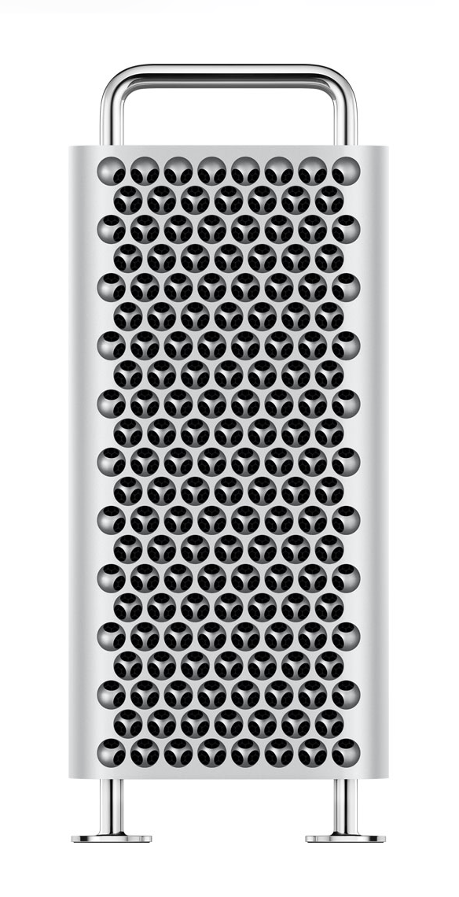

| chapter: Patterns
| section: Introduction

| background: ./images/wall.jpg
| tint: 0
| theme: dark

# <big>2D and 3D patterns</big>

Will be in shape — whatever the shape. Over and over. 

***ERIK: Let's replace it with actual pattern image. Emphasis is on 2D/3D sculptural pattern***

---

| padding: 0

<section>

## Orientation on patterns

In order to find inspiration in making your own 2D textures and 3D structures, you will have to be able to recognize, find and order them. 

Next you will find some questions and accompanying tasks to help you. 

</section>

-

<f-image src="./images/face.jpg" />

***ERIK: No idea about origin***

---

| section: Exercise 1

## Orientation on patterns

### Exercise 1

Answers these question and find some inspirational images to stimulate your brain:

1. How do you **define** a pattern?

2. How would you **describe** a pattern?

3. Find at least three **meaningful examples** of patterns from 
your daily life. Take pictures of them, make sketches, etc.

4. Find at least three patterns **from other cultures**.

5. And at last: what pattern **defines you**? Think about your daily habits...

---

| section: Exercise 2

## Orientation on patterns

### Exercise 2

This is how you can experiment with making patterns:

* Use LEGO®

* Use Tangram puzzles

* Find similar leaves, stones, flowers, packaging, emoji, … etc.

* Use the Adobe Capture app https://www.adobe.com/products/capture.html

* Investigate the world of tessellations

  * with paper cutting http://tessellations.org/methods-diy-papercut.shtml
  
  * this online interactive tool http://www.shodor.org/interactivate/activities/Tessellate/

  * or the Amaziograph https://amaziograph.com/education.html app.

---

| section: Adding 3D

## Textures & structures

A pattern is made when a shape is copied repeatedly. 

The definition of <var>texture</var> we use when it’s a 2D surface where the pattern is only repeated in X and Y axes. 

The definition of <var>structure</var> we use for 3D patterns were the Z-axe gets in, for example with LEGO® or in Minecraft. 

Be sure to keep in mind that **repetition is key** at all times!

-

<f-image src="./images/bricks1.png" />

---

| chapter: Transformations
| section: Introduction
| padding: 0

<section>

## Geometric operations

To make different designs you can use geometric operations such as:

* translate

* reflect

* rotate

* scale

* affine transformation

</section>

-

<f-image src="./images/bricks2.jpg" />

---

| section: Translation

| background: lightergray
| cols: 2fr 2fr 4fr 2fr
| style: --base: 8px

| 1 1 1 1
| 2 3 4 5

| rows: auto 1fr

<f-inline style="--inline-justify: space-between">

# Translation

<f-next-button />

</f-inline>

-

#### Single translation

A <var>translation</var> is a <var class="gray">transformation</var> that moves a figure in a specific direction, without changing its angle or shape.

In the 2D coordinates, we can specify a translation by how far the shape is moved along the axises.

> Adjust the translation along the axises to see the effect

-

<f-scene grid class="r" v-slot="{ svgscale }" responsive>
  <f-group :scale="svgscale">
    <f-target transform="translate(-50, 50) scale(1,-1)" />
  </f-group>
  <f-group opacity="0.5" :position="[get('t_x1',1),get('t_y1',1)]">
    <f-group :scale="svgscale">
      <f-target transform="translate(-50, 50) scale(1,-1)" />
    </f-group>
  </f-group>
</f-scene>

##### x-axis translation `{{ get('t_x1', 1) }}`

<f-slider set="t_x1" value="1" from="-2" to="2" />

##### y-axis translation `{{ get('t_y1', 1) }}`

<f-slider set="t_y1" value="1" from="-2" to="2" />

-

<f-scene class="r" v-slot="{ svgscale }" responsive download>
  <f-group v-for="y in range(-2,2)">
    <f-group
      v-for="x in range(-2,2)"
      :position="[x * get('t_x2',0),y * get('t_y2',0)]"
    >
      <f-group :scale="svgscale">
        <f-target transform="translate(-50, 50) scale(1,-1)" />
      </f-group>
    </f-group>
  </f-group>
</f-scene>

-

#### Repeated translation

When <var>translation</var> is applied repeatedly, we willl see the visual patterns emerge.

Here is the simple grid repetition on x and y axis.

##### Repetition in x-axis `{{ get('t_x2',0) }}`

<f-slider set="t_x2" from="0" to="0.75" />

##### Repetition in y-axis `{{ get('t_y2',0) }}`

<f-slider set="t_y2" value="0" from="0" to="0.75" />

---

| section: Scaling
| background: lightergray
| cols: 2fr 2fr 4fr 2fr
| style: --base: 8px

| 1 1 1 1
| 2 3 4 5

| rows: auto 1fr

<f-inline style="--inline-justify: space-between">

# Scaling

<f-next-button />

</f-inline>

-

<!-- Commenting out the sliders -->

  <f-slider title="rotation" set="r"  />
  <f-slider title="scale" set="s" value="1" from="0.1" to="4" />
  <f-source />

#### Single scaling

A <var>scaling</var> is a transformation that resizes a shape.

Unlike <var class="gray">translation</var> and <var class="gray">rotation</var> that generate <var class="gray">congurate</var> shapes, scaling generates <var>similar</var> shapes.

-

<f-scene grid class="r" v-slot="{ svgscale }" responsive>
  <f-group :scale="svgscale">
    <f-target transform="translate(-50, 50) scale(1,-1)" />
  </f-group>
  <f-group opacity="0.5" :scale="get('s_s1', 2)">
    <f-group :scale="svgscale">
      <f-target transform="translate(-50, 50) scale(1,-1)" />
    </f-group>
  </f-group>
</f-scene>

##### Scaling factor `{{ get('s_s1',2) }} ×` 

<f-slider set="s_s1" value="2" step="0.1" from="0" to="25" />

-

<f-scene grid class="r" v-slot="{ svgscale }" responsive>
  <f-group v-for="s in range(0.5,10,1)" :scale="scale(s,0.5,10,0.5,get('s_s2',1))">
    <f-group :scale="svgscale">
      <f-target transform="translate(-50, 50) scale(1,-1)" />
    </f-group>
  </f-group>
</f-scene>

-

#### Repeated scaling

When <var>scaling</var> is repeated we will multiple shapes in incrementally bigger sizes.

##### Maximum scaling factor `{{ get('s_s2',1) }} ×`

<f-slider set="s_s2" value="1" from="1" to="25" />

---

| section: Rotation
| background: lightergray
| cols: 2fr 2fr 4fr 2fr
| style: --base: 8px

| 1 1 1 1
| 2 3 4 5

| rows: auto 1fr

<f-inline style="--inline-justify: space-between">

# Rotation

<f-next-button />

</f-inline>

-

<!-- Commenting out the sliders -->

  <f-slider title="rotation" set="r"  />
  <f-slider title="scale" set="s" value="1" from="0.1" to="4" />
  <f-source />

#### Single rotation

A <var>rotation</var> is a transformation is a transformation that turns a shape by a certain angle around a fixed point. That point is called the ● <var>center of rotation</var>.

-

<f-scene step="1" class="r" v-slot="{ svgscale }" responsive>
  <f-group :scale="svgscale">
    <f-target transform="translate(-50, 50) scale(1,-1)" />
  </f-group>
  <f-group opacity="0.75" :position="[-get('r_x1',1),-get('r_y1',1)]">
    <f-polargrid count="8" />
    <f-group :rotation="get('r_r1',45)">
      <f-group :scale="svgscale" :position="[get('r_x1',1),get('r_y1',1)]">
        <f-target transform="translate(-50, 50) scale(1,-1)" />
      </f-group>
    </f-group>
  </f-group>
  <f-circle :position="[-get('r_x1',1),-get('r_y1',1)]" r="0.08" stroke fill="var(--red)" />
</f-scene>

##### Rotation `{{ get('r_r1',45) }}°`

<f-slider set="r_r1" value="45" integer />

##### X of center `{{ get('r_x1',1) }}`

<f-slider set="r_x1" value="1" to="2" />

##### X of center `{{ get('r_y1',1) }}`

<f-slider set="r_y1" value="1" to="2" />

-

<f-scene step="1" class="r" v-slot="{ svgscale }" responsive>
    <f-group
      v-for="a in range(0,360,360 / get('r_c',1)).slice(0, get('r_c',1))"
      :rotation="a"
    >
      <f-line
        :x2="3"
        stroke-width="1"
        opacity="0.1"
      />
      <f-group :scale="svgscale" :position="[1,0]">
        <f-target transform="translate(-50, 50) scale(1,-1)" />
      </f-group>
    </f-group>
</f-scene>

-

#### Repeated rotation

By applying rotation to an element multiple times we can create a circular set of elements with all elements having <var>rotational symmetry</var>.

##### Number of rotations `{{ get('r_c',1) }}`

##### Rotation step `{{ round(360 / get('r_c',1),2) }}°`

<f-slider set="r_c" value="1" from="1" to="72" integer />

---

| section: Reflection

| background: lightergray
| cols: 2fr 2fr 4fr 2fr
| style: --base: 8px

| 1 1 1 1
| 2 2 5 6
| 3 4 5 6 

| rows: auto

<f-inline style="--inline-justify: space-between">

# Reflection

<f-next-button />

</f-inline>

-

A shape has <var>reflectional symmetry</var> if it looks the same after being reflected. The line of reflection is called the <var>axis of symmetry</var>, and it splits the shape into two <var class="gray">congruent</var> halves.

-

<f-scene grid class="r" v-slot="{ svgscale }" responsive>
  <f-mirror-x r="2" :step="get('r_dx1', 1)" v-slot="{ value }">
  <f-group :scale="svgscale" :opacity="[0.5,1][value]">
    <f-target transform="translate(-50, 50) scale(1,-1)" />
  </f-group>
  </f-mirror-x>
</f-scene>

#### Reflection around X axis

##### Distance `{{ get('r_dx1', 1) }}`

<f-slider set="r_dx1" value="0" from="-0.25" to="2" />

-

<f-scene grid class="r" v-slot="{ svgscale }" responsive>
  <f-mirror-y r="2" :step="get('r_dy1', 1)" v-slot="{ value }">
  <f-group :scale="svgscale" :opacity="[0.5,1][value]">
    <f-target transform="translate(-50, 50) scale(1,-1)" />
  </f-group>
  </f-mirror-y>
</f-scene>

#### Reflection around Y axis

##### Distance `{{ get('r_dy1', 1) }}`

<f-slider set="r_dy1" value="1" from="-0.25" to="2" />

-

<f-scene step="1" class="r" v-slot="{ svgscale }" responsive download>
    <f-group
      v-for="a in range(0,360,360 / get('r_c1',6)).slice(0, get('r_c1',6))"
      :rotation="a"
      style="mix-blend-mode: multiply;"
    >
      <f-line
        :x2="3"
        stroke-width="1"
        opacity="0.1"
      />
      <f-mirror-x r="4" :step="get('r_x2',0)">
        <f-mirror-y r="4" :step="get('r_y2',0)">
          <f-group :rotation="get('r_r1',0)" :scale="get('r_s1',1)">
          <f-group :scale="svgscale">
            <f-target transform="translate(-50, 50) scale(1,-1)" />
          </f-group>
          </f-group>
        </f-mirror-y>
      </f-mirror-x>
    </f-group>
</f-scene>

-

#### Repeated reflection

We can combine the <var>reflection</var> and transformations we learned ealier.

##### Arount x axis `{{ get('r_y2',0) }}`

<f-slider set="r_y2" from="0" to="1" />

##### Around in y axis `{{ get('r_x2',0) }}`

<f-slider set="r_x2" from="0" to="1" />

##### Element rotation `{{ get('r_r1', 0.5) }} ×`

<f-slider set="r_r1" />

##### Number of rotations `{{ get('r_c1',6) }}`

<f-slider set="r_c1" value="6" from="1" to="16" integer />

##### Element scale `{{ get('r_s1',1) }}`

<f-slider set="r_s1" value="1" from="0.5" to="4" />

---

| section: Combined transformations

| background: lightergray
| cols: 2fr 2fr 4fr 2fr
| style: --base: 8px

| 1 1 1 1
| 2 3 4 5

| rows: auto 1fr

<f-inline style="--inline-justify: space-between">

# Combined transformations

<f-next-button />

</f-inline>

-

<!-- Commenting out the sliders -->

  <f-slider title="rotation" set="r"  />
  <f-slider title="scale" set="s" value="1" from="0.1" to="4" />
  <f-source />

A true power of transformations will come out when they are combined, this means <var class="gray">translation</var>, <var class="gray">scaling</var>, <var class="gray">rotation</var> are applied all to the same shape, creating <var>affine transformation</var>.

> Adjust all the transformations on the shapes to see the *combined* effect.

-

#### Translation

##### x and y axis `{{ get('c_x1',0.05) }}`

<f-slider set="c_x1" value="0.05" from="0" to="4" />

#### Scaling

##### Element scaling `{{ get('c_s1', 4) }} ×`

<f-slider set="c_s1" value="4" from="0.1" to="5" />

#### Rotation

##### Element rotation `{{ get('c_r1', 1) }} ×`

<f-slider set="c_r1" />

##### Number of rotations `{{ get('c_c',6) }}`

<f-slider set="c_c" value="6" from="1" to="36" integer />

-

<f-scene v-if="get('c_p',0) == 1" step="1" class="r" v-slot="{ svgscale }" responsive download>
    <f-group
      v-for="a in range(0,360,360 / get('c_c',6)).slice(0, get('c_c',6))"
      :rotation="a"
    >
      <f-line
        :x2="3"
        stroke-width="1"
        opacity="0.1"
      />
      <f-group
        :position="[get('c_x1',0.05),0]"
        :scale="get('c_s1',4)"
        :rotation="get('c_r1',0)"
      >
      <f-group :scale="svgscale">
        <f-target :mode="['normal','multiply','difference'][get('c_m',0)]" transform="translate(-50, 50) scale(1,-1)" />
      </f-group>
      </f-group>
    </f-group>
</f-scene>

<f-scene v-else class="r" v-slot="{ svgscale }" responsive download>
  <f-group v-for="y in range(-2,2)">
    <f-group
      v-for="x in range(-2,2)"
      :position="[x * get('c_x1',0.75),y * get('c_x1',0.75)]"
      :scale="get('c_s1',1)"
      :rotation="get('c_r1',0)"
    >
      <f-group :scale="svgscale">
        <f-target :mode="['normal','multiply','difference'][get('c_m',0)]" transform="translate(-50, 50) scale(1,-1)" />
      </f-group>
    </f-group>
  </f-group>
</f-scene>

-

#### Choose pattern

<f-buttons :value="get('c_p',0)" v-on:value="v => set('c_p',v)" :buttons="['Grid pattern','Circle pattern']"  />

Choose between <var>translational</var> and <var>rotational</var> <var class="gray">symmetry</var>. 

#### Bring in creativity

To get more creative you can adjust the blend mode of the elements, creating a whole new set of pattern variations.

<f-buttons :value="get('c_m',0)" v-on:value="v => set('c_m',v)" :buttons="['normal','multiply','difference']"  />

---

| chapter: From 2D to 3D patterns
| section: Textures & structures

## Textures & structures

### Exercise 1

In this stage you will make a 2D pattern / texture using only the X and Y axes. You can try to make transformations with a ruler and compass or digitally:

https://www.mathsisfun.com/geometry/symmetry-artist.html

https://www.mathsisfun.com/geometry/transformations.html

* **Describe the grid** that was used with the patterns you found in the orientation exercises.

* **Generate a flat surface tessellation** with a pattern that describes you, by hand or with a digital tool.

<f-inline>
  <a class="primary" href="../patterns_editor">Go to tessellation editor</a>
  <a class="primary" href="../patterns_playground">Go to pattern playground</a>
</f-inline>

---

## Textures & structures

### Exercise 2

Now let’s share all the findings!

1. Make a moodboard or poster to show others the examples of 2D & 3D pattern designs that have inspired your ideas and findings.

2. Explain during group discussions the ideas and constructions on your moodboard / poster. 

3. Give each other feedback on the work.

---

## Production method

Depending on the production method you will choose, some materials are more suitable than others.

New techniques are useful for experimenting with material and integrating <var>sequences</var> (series) or <var>algorithms</var>(arithmetic methods) in your design. 

> See also scenario on [algorithms](https://github.com/designstem/scenarios/algorithms)

-

<f-image src="./images/physical1.png" />

---

## Translation

History shows that 2D patterns are translated to 3D as well. Sometimes in a very strict order and relation, like in The Bossche School. https://en.wikipedia.org/wiki/Bossche_School

The famous Le Corbusier invented a language in architecture, where 2D has been translated into 3D. http://papers.cumincad.org/data/works/att/3642.content.pdf

-

<f-image src="./images/house.jpg" />

---

| padding: 0
| 1 1 1 1 1 2 2

<f-image src="./images/wall.jpg" />

-

<section>

</section>

---

| section: The fourth dimension

## The fourth dimension: time

### Exercise

Another addition to designing patterns could be the fourth dimension: time. This can be achieved with **light** (moving shadows alter the 3D view as well), **rhythm** (tapping to a song is a pattern...), **nature**, etc. 

* Even rituals, social habits and cultures show a wide range of patterns. Can you name a few examples of these kind of patterns?

* Go explore the adding of 4D to your patterns. 

* What could be the changes to your designs? How do you sense it?

* What would be the purpose for your pattern? Can you explain why?

---

| section: Final assignment

## Final assignment

Key steps

1. Now that you improved your knowledge and skills, find a way to produce your pattern, texture or structure. You can use stamp, stencil, cut out vinyl, 3D printers, laser cutters, AR/VR... Get your skates on!

2. When you think you're done with making your best 2D/3D pattern, find at least two students to get peer reviews. You will need them in the next stage to make improvements to the design.

---

## Evaluation of your pattern skills 

After having worked with this scenario, your pattern skills have grown. Describe here what you have learned, for instance using these questions:

* How was your skills level on patterns before you started this scenario?

* What was your main goal with this exercise?

* In what step did you struggle the most?

* What have you learned doing this scenario?

* Will you see more patterns in your daily life from now on?

