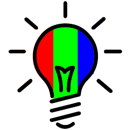

| padding: none
| theme: yellow

| 1 1 2

<section style="padding: var(--base5)">

</img>
# RGB Lamp

<big>Design, Engineering and Make your own rgb lamp!</big>

<f-inline>
<a class="primary" href="./step-0.0.html">Let's get started</a>
<a class="secondary" href="../rgblamp_vision/index.html">E-tools</a>
<a class="secondary" href="./step-0.0.html">Design Process</a>
</f-inline>
 

<b><big>Remember</big></b>

The red keyword <b style="color:red">“task”</b> suggest you to perform some tasks.

The green keyword <b style="color:green">“play”</b> suggest you to play with e-tools.

The blue keyword <b style="color:blue">“think”</b> suggest you to think about something.

There are several <a class="secondary" href="../rgblamp_vision/index.html">e-tools</a> that can help you!

 
<b><big>Buy an RGB Lamp</big></b>
<ul>
<li>RGB Lamp <a href="https://www.amazon.it/s?k=rgb+lamp&__mk_it_IT=%C3%85M%C3%85%C5%BD%C3%95%C3%91&ref=nb_sb_noss">(amazon.it)</a></li>
<li>RGB Lamp controlled by an app <a href="https://www.amazon.it/s?k=rgb+lamp+apps&__mk_it_IT=%C3%85M%C3%85%C5%BD%C3%95%C3%91&ref=nb_sb_noss">(amazon.it)</a></li>
<li>RGB for Arduino <a href="https://www.amazon.it/s?k=rgb+arduino&__mk_it_IT=%C3%85M%C3%85%C5%BD%C3%95%C3%91&ref=nb_sb_noss_2">(amazon.it)</a></li>
</ul>

 

<b><big>Roadmap</big></b>
### **1** <a href="step-1.0.html">Research</a>
### **2** <a href="step-2.0.html">Design</a>
### **3** <a href="step-3.0.html">Detailed design</a>
### **4** <a href="step-4.0.html">Engineering</a> (optional)
### **5** <a href="step-5.0.html">Making</a> (optional)
### **6** <a href="step-6.0.html">Communication</a>
### **7** <a href="step-7.0.html">Self-Assessment</a>

