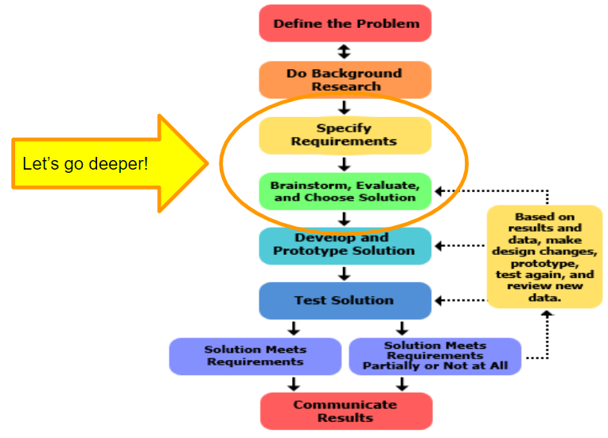
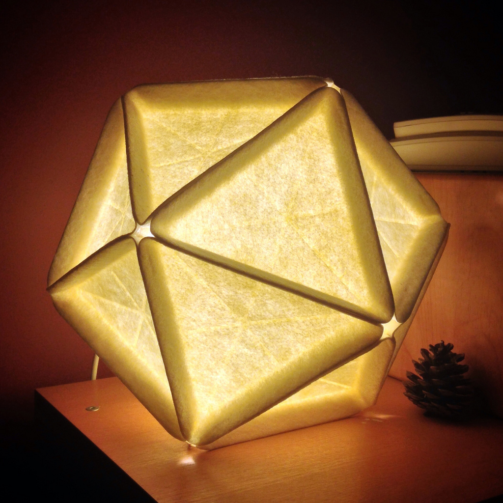

| height: fit
| padding: none
| theme: yellow

| 1 2 2

<section style="padding: var(--base5)">

<f-sidebar src="./menu.md"><button slot="button">table of contents</button></f-sidebar>

### **2** Design

# Where are we?

<big>Specify Requirements:</big> Design requirements state the important characteristics that your solution must meet to succeed. One of the best ways to identify the design requirements for your solution is to analyze the concrete example of a similar, existing product, noting each of its key features.

<big>Brainstorm Solutions:</big> There are always many good possibilities for solving design problems. If you focus on just one before looking at the alternatives, it is almost certain that you are overlooking a better solution. Good designers try to generate as many possible solutions as they can.

<a class="ternary" href="https://www.sciencebuddies.org/science-fair-projects/engineering-design-process/engineering-design-process-steps">
read more (www.sciencebuddies.org)</a>

 
 
<f-next-button title="Next" />

-
 

---

| height: fit
| padding: none
| theme: yellow

| 1 2

<section style="padding: var(--base5)">

<f-sidebar src="./menu.md"><button slot="button">table of contents</button></f-sidebar>

### **2** Design

# <big style="color:purple">Assignment:</big> Design your own RGB Lamp

Grab a piece of paper and design/sketch your own lamp.

<big>Suggestions:</big>
<ul>
<li>What is its function? 
(e.g. aesthetics, decoration, information, communication, health, psychology) </li>
<li>How will your RGB lamp interact with the environment?</li>
<li>Which input from the environment does your lamp react to? 
(e.g. time, light, noise, music, temperature, heart rate, feelings)</li>
</ul>

 
<f-prev-button /> 
<a class="primary" href="./step-3.0.html">Go to Detailed Design step</a>
-
 
<a style="float=top" href="https://www.flickr.com/photos/62449696@N00/9522596028">flickr</a>

---