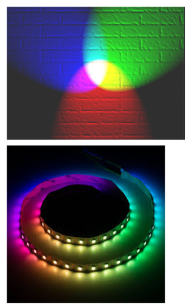
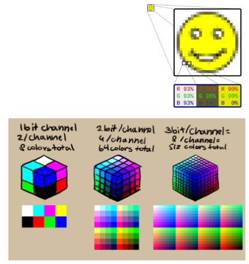

| height: fit
| padding: none
| theme: yellow

| 1 2 2

<section style="padding: var(--base5)">

<f-sidebar src="./menu.md"><button slot="button">table of contents</button></f-sidebar>

### **3** Detailed Design

# Where are we?

 
<f-next-button title="Next" />

-

 

---

| height: fit
| padding: none
| theme: yellow

| 1 2

<section style="padding: var(--base5)">

<f-sidebar src="./menu.md"><button slot="button">table of contents</button></f-sidebar>

### **3** Detailed Design

# How is color produced in devices?

The RGB color model is an additive color model in which red, green and blue light are added together in various ways to reproduce a broad array of colors.
The name of the model comes from the initials of the three additive primary colors, red, green, and blue.

The main purpose of the RGB color model is for the sensing, representation and display of images in electronic systems, such as televisions and computers, though it has also been used in conventional photography. Before the electronic age, the RGB color model already had a solid theory behind it, based in human perception of colors.

<a href="https://en.wikipedia.org/wiki/RGB_color_model">wikipedia</a>

 
<f-prev-button /> 
<f-next-button title="Next" />

-

<a href="https://commons.wikimedia.org/wiki/File:RGB_illumination.jpg">wikipedia</a>

---

| height: fit
| padding: none
| theme: yellow

| 1 2

<section style="padding: var(--base5)">

<f-sidebar src="./menu.md"><button slot="button">table of contents</button></f-sidebar>

### **3** Detailed Design

# How many bits are needed to represent your bit depth?

<table>
<tr>
<td>1bit</td>
<td>Only two colors in total, usually black and white.</td>
</tr>
<tr>
<td>4bit (16 colors)</td>
<td>16 colors in total, these are famous as many early games were presented in this color palette.<//td>
</tr>
<tr>
<td>8bit</td>
<td>256 colors in total. 8bit images are commonly used in games to save on memory for textures and sprites.</td>
</tr>
</table>

<big style="color:green">Play</big> with <a class="primary" href="https://designstem.github.io/scenarios/colorbits/">Bits and Colors</a>

 
<f-prev-button /> 
<f-next-button title="Next" />

-

<a href="https://it.m.wikipedia.org/wiki/File:Rgb-raster-image.svg">wikipedia</a>

---

| height: fit
| padding: none
| theme: yellow

| 1 2

<section style="padding: var(--base5)">

<f-sidebar src="./menu.md"><button slot="button">table of contents</button></f-sidebar>

### **3** Detailed Design

# RGB Colors

<big style="color:blue">Think:</big> how are red, green and blue lights added together in various ways to reproduce a broad array of colors?

<big style="color:green">Play</big> with <a class="primary" href="https://designstem.github.io/scenarios/rgblamp_vision/labs.html">RBG virtual lab</a> <a class="primary" href="https://designstem.github.io/scenarios/rgblamp_vision/mixing/index.html">RBG color mixing</a>

<big style="color:blue">Think:</big> Which colours will you able to obtain?

 
<f-prev-button /> 
<f-next-button title="Next" />

-
 

---

| height: fit
| padding: none
| theme: yellow

| 1 2

<section style="padding: var(--base5)">

<f-sidebar src="./menu.md"><button slot="button">table of contents</button></f-sidebar>

### **3** Detailed Design

#   Dynamic RGB Colors 
<big style="color:blue">Think:</big> how you can describe the changing of the lamp colors?

<big style="color:green">Play</big> with <a class="primary" href="https://designstem.github.io/scenarios/rgblamp_vision/dynamic-mixing/index.html">Dynamic RBG Color Mixing</a>

<big style="color:blue">Think:</big> which sequence of colours are you able to obtain?

 
<f-prev-button /> 
<f-next-button title="Next" />

-

 

---

| height: fit
| padding: none
| theme: yellow

| 1 2

<section style="padding: var(--base5)">

<f-sidebar src="./menu.md"><button slot="button">table of contents</button></f-sidebar>

### **3** Detailed Design

# <big style="color:purple">Assignment:</big> Engineering your own RGB Lamp

Grab a piece of paper and write a high-level description of how the values of the three different channels (red, green, blue) will react to the input from the environment.

<big>Suggestions:</big>
<ul>
<li>make a diagram or a graph showing the relationship between input and colors.</li>
<li> ...continue...
</ul>

 
<f-prev-button /> <f-next-button title="Next" />

-

<a style="float=top" href="https://www.publicdomainpictures.net/en/view-image.php?image=34795&picture=business-chart">www.publicdomainpictures.net</a>

---

| height: fit
| padding: none
| theme: yellow

| 1 2

<section style="padding: var(--base5)">

<f-sidebar src="./menu.md"><button slot="button">table of contents</button></f-sidebar>

### **3** Detailed Design

# <big style="color:purple">Assignment:</big> Engineering your own RGB Lamp

<big>Suggestions:</big>
<ul>
<li>...</li>
<li>draw a picture showing  relationship between input and colors.</li>
</ul>

 
<f-prev-button /> 
<a class="primary" href="./step-4.0.html">Go to Engineering step</a>

-

<a style="float=top" href="https://en.wikipedia.org/wiki/Robert_Plutchik">wikipedia</a>

---