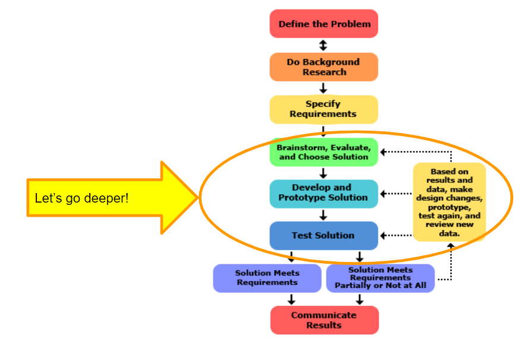

| height: fit
| padding: none
| theme: yellow

| 1 2 2

<section style="padding: var(--base5)">

<f-sidebar src="./menu.md"><button slot="button">table of contents</button></f-sidebar>

### **4** Engineering

# Where are we?
<big>Develop the Solution:</big> Development involves the refinement and improvement of a solution, and it continues throughout the design process, often even after a product ships to customers.

<big>Test and Redesign:</big> The design process involves multiple iterations and redesigns of your final solution. You will likely test your solution, find new problems, make changes, and test new solutions before settling on a final design.

<a class="ternary" href="https://www.sciencebuddies.org/science-fair-projects/engineering-design-process/engineering-design-process-steps">
read more (www.sciencebuddies.org)</a>
 
 
<f-next-button title="Next" />

-
 

---

| height: fit
| padding: none
| theme: yellow

| 1 2

<section style="padding: var(--base5)">

<f-sidebar src="./menu.md"><button slot="button">table of contents</button></f-sidebar>

### **4** Engineering

# <big style="color:purple">Assignment:</big> Engineering your own RGB Lamp

Create a spreadsheet  and make a detailed description of how the values of the three different channels (red, green, blue) will react to the input from the environment.

  <big>Suggestions:</big>
<ul>
<li>build a relationship between environmental parameters and colors</li>
<li>How do you interpolate the missing values? (E.g. spline, keyframes)</li>
</ul>

 
<f-prev-button /> 
<a class="primary" href="./step-5.0.html">Go to Making step</a>
 
 
Skip Making step and <a class="secondary" href="./step-6.0.html"> Go to Communication step</a>

-
 

---

