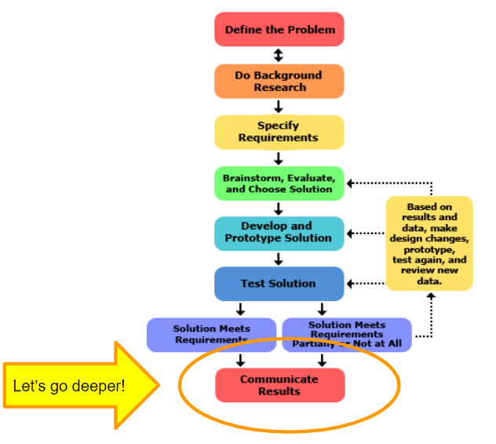

### **6** Communication

# Where are we?

### Communicate Results

To complete your project, communicate your results to others in a final report and/or a display board. Professional engineers always do the same, thoroughly documenting their solutions so that they can be manufactured and supported.

<a class="ternary" href="https://www.sciencebuddies.org/science-fair-projects/engineering-design-process/engineering-design-process-steps">
read more (www.sciencebuddies.org)</a>
 
 
<f-next-button title="Next" />

-
 

---

### **6** Communication

# Marketing

(def.) The activity, set of institutions, and processes for creating, communicating, delivering, and exchanging offerings that have value for customers, clients, partners, and society at large.

***KJ: Bored with boring definitions***

<f-next-button />

-

***KJ: Can we acually show how Hue marketing looks like in web?***

<a style="float=top" href="https://www2.meethue.com/en-in">Philips Hue</a>
<ul>
<li>Turn on your peace of mind</li>
<li>Turn on your moments</li>
<li>Turn on your imagination</li>
</ul>

---

### **6** Communication

#  Assignment: Make your presentation

Create a presentation. ***KJ: Feels unfinished sentence***

### Suggestions:

***KJ: Use clearer wording instead "suggestions"***

1. Who is our ideal customer?
2. How can we best add value to that customer's life?
3. How can we articulate that value to the customer in 15 words or less?
4. Why are we better than the alternatives?

<a class="primary" @click="send('first')" href="./step-7.0.html">Go to Self-Assessment step</a>

-

<f-video src="https://www.youtube.com/watch?v=w82a1FT5o88" />

<a href="https://www.youtube.com/channel/UCir93b_ftqInEaDpsWYbo_g">Practical Psychology</a>