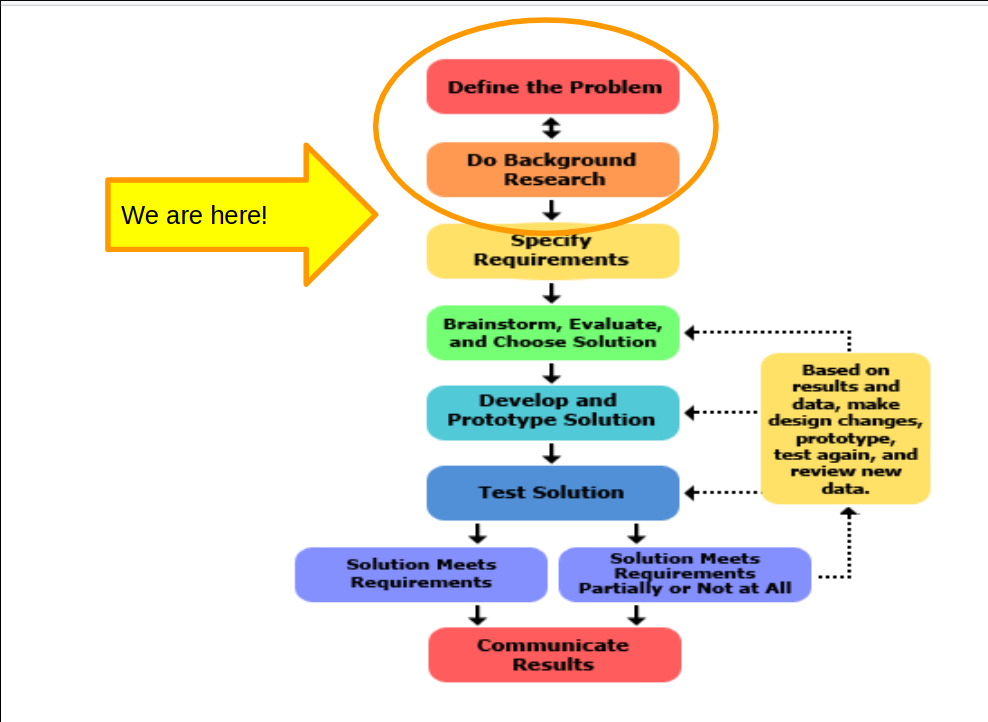
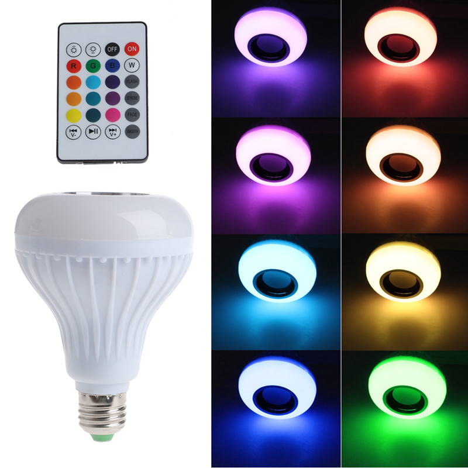
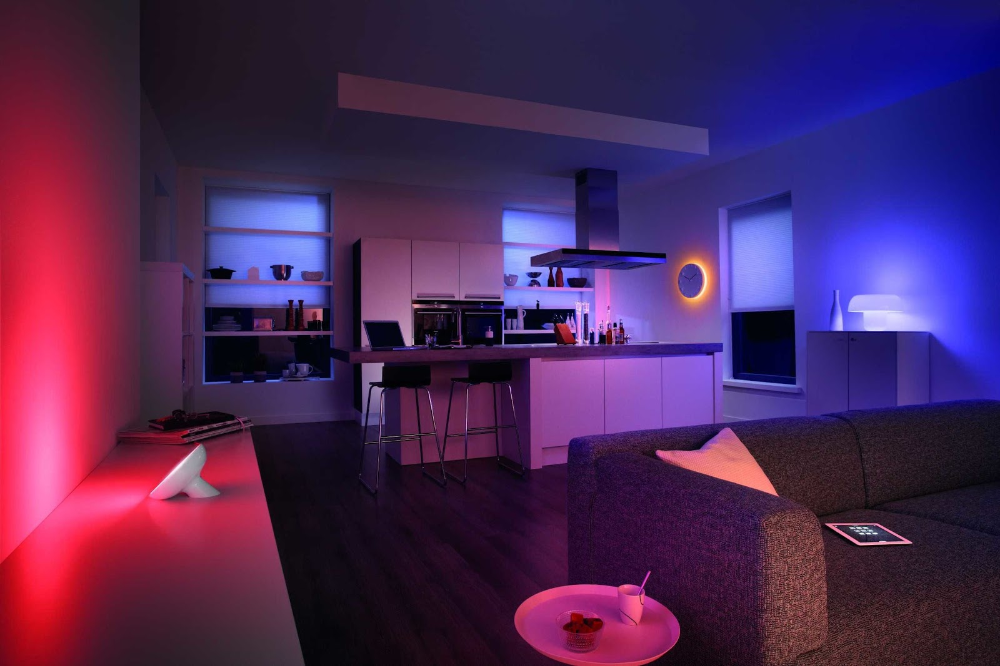
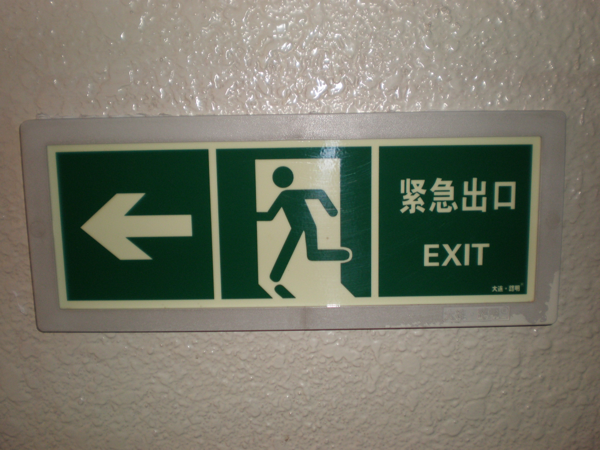
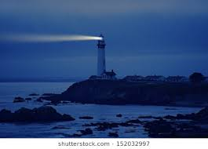
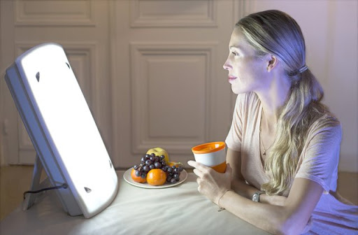
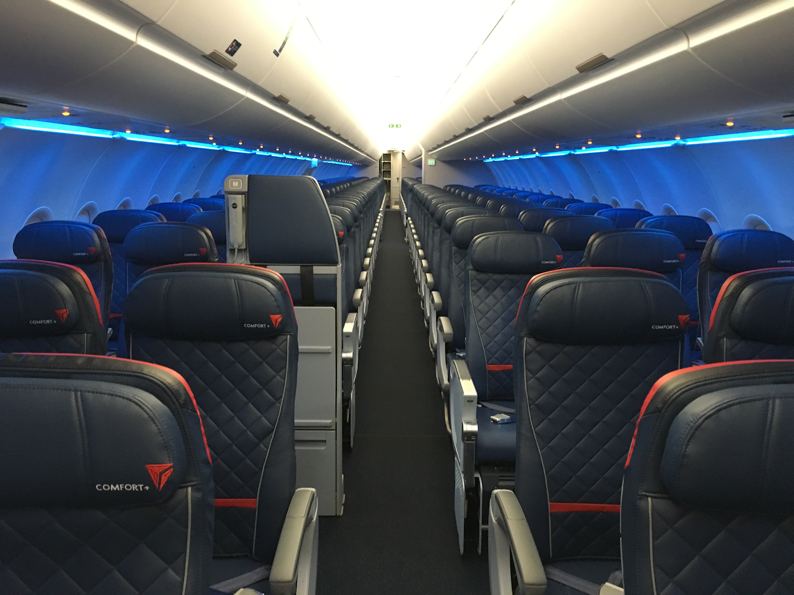
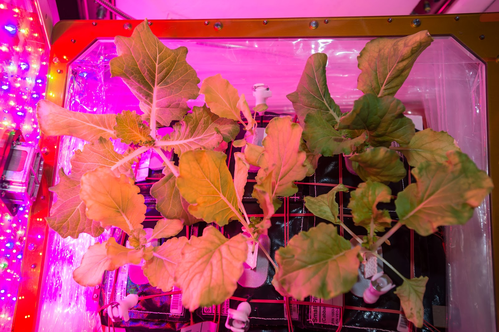
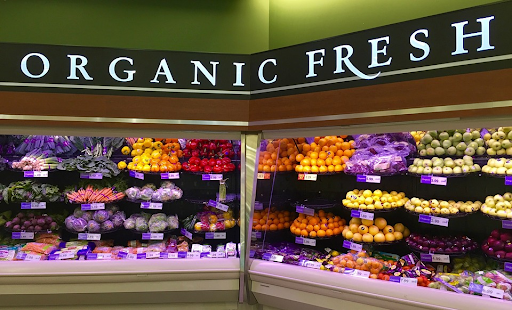

| section: step1
| 1 1 1 2 2

### **1** Research

# Where are we?

### Define the Problem

The engineering design process starts when you ask the following questions about problems that you observe:
<ul>
<li>What is the need?</li>
<li>Who has the need?</li>
<li>Why is it important to satisfy the need?</li>
</ul>

### Do Background Research

Learn from the experiences of others — this can help you find out about existing solutions to similar problems, and avoid mistakes that were made in the past.

<a class="ternary" href="https://www.sciencebuddies.org/science-fair-projects/engineering-design-process/engineering-design-process-steps">
read more (www.sciencebuddies.org)</a>
 
 
<f-next-button title="Next" />

-

---

| 1 2 2

***KJ: Do not see the need for this page***

### **1** Research

## Real-life design object

Design covers:

* graphic design (colour models, psychology, function)
* multimedia design (interaction, UI, functional perspective)
* decorator-stylist craft (colour exploration, decorative, functional aspect)
* furniture design (functional, decorative aspect)
* interior design (decorative, psychological aspect)

<f-next-button />

-

The <a style="float=top" href="https://www2.meethue.com/en-in">Philips Hue</a> Buld.

---

| 1 2 2

### **1** Research

## Real-life design object

***KJ: Why introduce design where when page is about case study of the design object?***

Design covers:

* graphic design (colour models, psychology, function)
* multimedia design (interaction, UI, functional perspective)
* decorator-stylist craft (colour exploration, decorative, functional aspect)
* furniture design (functional, decorative aspect)
* interior design (decorative, psychological aspect)

<f-next-button />

-

A room illuminated by a <a href="https://www2.meethue.com/en-in">Philips Hue</a> bulb.

---

| background: ./images/philips_hue_b.jpg
| theme: dark

***NOTE*** Can you use this image? If so, make it big 

<f-next-button />

---

| 1 2 3
| 1 4 5
| 6 6 6
| rows: auto auto 1fr

### **1** Research

#### Different functions of colored light

## Light for aesthetics or decoration

<mark style="background:blue; color: white">Think</mark> Find another example of a light object which the main function is a decorative function. What would you change in order to make it more engaging for your teacher?

<mark style="background:red; color: white">Task</mark> share your story with your classmates. 

-

<f-video src="https://www.youtube.com/watch?v=QcH1ikARU_4" />

-

<f-video src="https://www.youtube.com/watch?v=7FbK4wA7hjc" />

-

<f-video src="https://www.youtube.com/watch?v=ycgC2Mf0jxs" />

-

<f-video src="https://www.youtube.com/watch?v=X3pzuReF4jA" />

-

<f-next-button />

---

### **1** Research

#### Different functions of colored light

# Light and information or communication

<mark style="background:blue; color: white">Think</mark> about an incident you relied on a light which had a communicative function. 

<mark style="background:red; color: white">Task</mark> Share your story with your classmates. What happened? What did you do?  Collect these stories. 

<f-next-button title="Next" />

-

***KJ: Better images, pleaaaase!***

<a href="https://it.m.wikipedia.org/wiki/File:Green_English-Chinese_icon_exit_sign.JPG">wikipedia</a>

<a href="https://www.shutterstock.com/">shutterstock</a>

---

### **1** Research

#### Different functions of colored light

# Light and health

~**Biodynamic lighting** is an artificial light source that replicates the dynamic variations of daylight and sunlight through a light management system.~

~**Chronobiology** is a field of biology that examines periodic (cyclic) phenomena in living organisms and their adaptation to solar- and lunar-related rhythms.~

<mark style="background:blue; color: white">Think</mark> What has light to do with health? How does light influence our bodies?

<f-next-button />

-

<a href="https://www.verywellhealth.com/bright-light-therapy-and-its-use-in-alzheimers-disease-98668">verywellhealth</a>

---

### **1** Research

#### Different functions of colored light

# Light and health

~Flying west is less tiring than flying east. This airplane shows blueish light to keep you more awake in order to abate your jetlag.~

<f-next-button />

-

<a href="https://www.verywellhealth.com/bright-light-therapy-and-its-use-in-alzheimers-disease-98668">verywellhealth</a>

---

| background: ./imgs/cap1_4.png
| theme: dark

 

### Did you knew?

~Flying west is less tiring than flying east.~

~This airplane shows blueish light to keep you more awake in order to abate your jetlag.~

***KJ: Try to break the monotonous slides like this***

<f-next-button />

---

### **1** Research

#### Different functions of colored light

# Light and health

~Light is one of the most important factors in healthy plant growth. Plants, unlike humans, can make their own food through a process called photosynthesis.~

~The correct color of light, along with water and nutrient soil, will provide a plant with the sustenance of life.~

### Plants prefer blue and red light

~These two color qualities have the greatest influence on how a plant grows. Blue lights' responsibility is to promote leaf and vegetable growth, while red, when combined with blue, will make a plant flower.~

<f-next-button title="Next" />

-

***KJ: Could we use the images from Rotterdam museum we took there?***

<a href="https://www.jestpic.com/u/dunyahalleri/">dunyahalleri</a>

---

### **1** Research

#### Different functions of colored light

# Light and psychology

~**Color psychology** is the study of hues as a determinant of human behavior. Color influences perceptions that are not obvious, such as the taste of food <a href="https://en.wikipedia.org/wiki/Color_psychology">Wikipedia</a>~

***KJ: Can we we have original text here without Wikipedia link?***

~For example, colored light is used in stores to make certain products more attractive to buyers.~

***KJ: Give me examples (with images!). Blue for fish, yellow for meat? Or make it a student activity to bring photos from SPAR?***

<button class="primary" @click="send('step2')">Go to Design step</button>

-

<a href="https://pixabay.com/it/photos/organici-alimenti-biologici-cibo-1341558/">pixabay</a>

