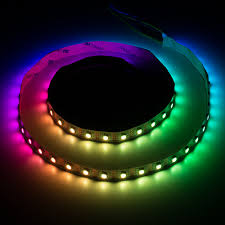
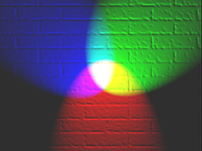
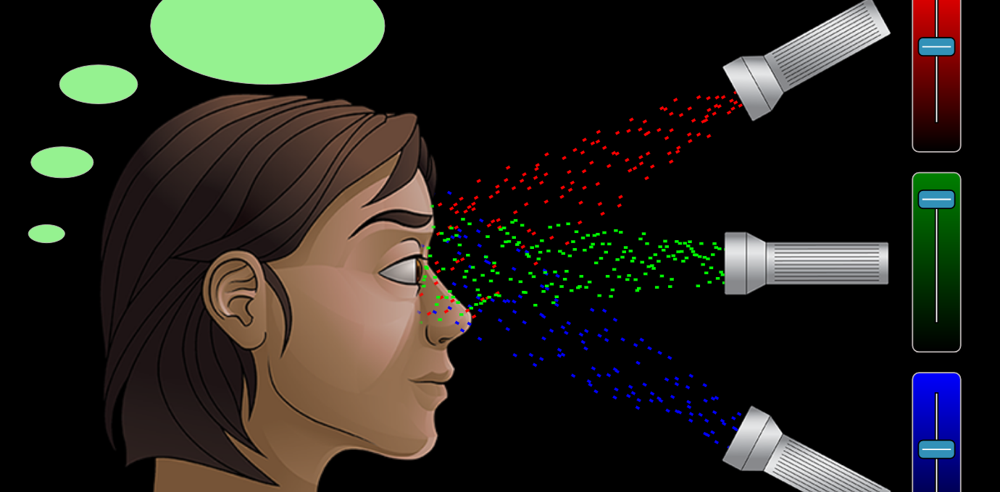
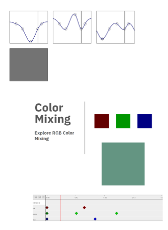
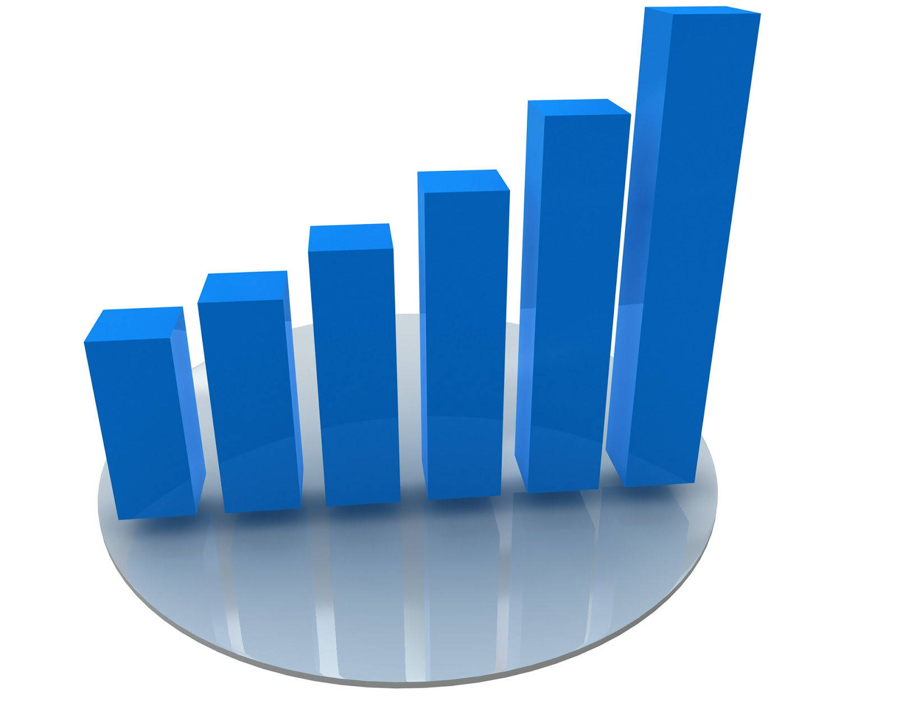
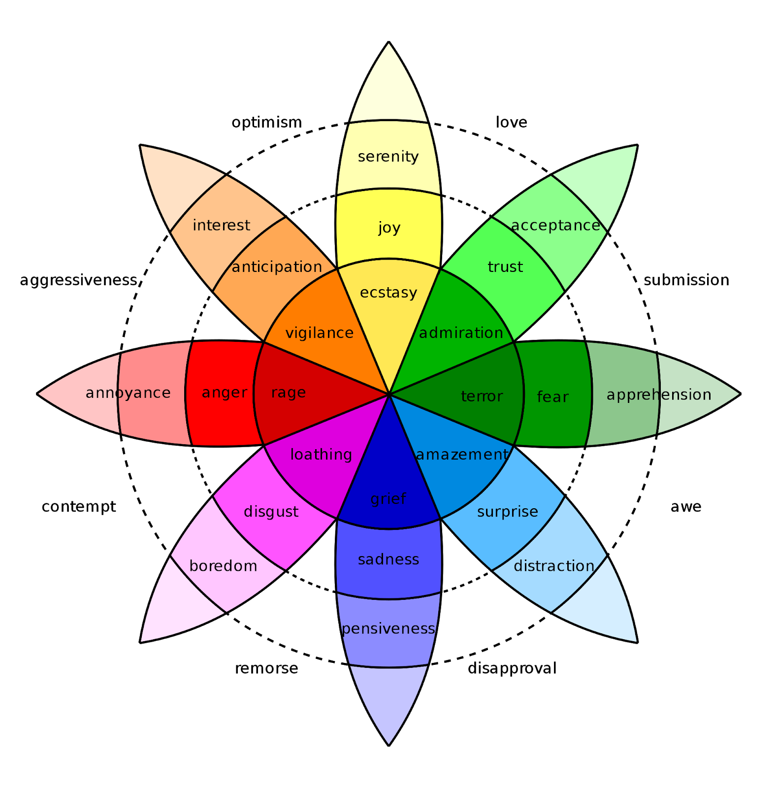

| section: step3
| 1 1 2

### 3. Detailed Design

## Where are we?

<big>Choose the Best Solution:</big> Look at whether each possible solution meets your design requirements. Some solutions probably meet more requirements than others. Reject solutions that do not meet the requirements.

<big>Develop the Solution:</big> Development involves the refinement and improvement of a solution, and it continues throughout the design process, often even after a product ships to customers.

<a class="ternary" href="https://www.sciencebuddies.org/science-fair-projects/engineering-design-process/engineering-design-process-steps">
read more (www.sciencebuddies.org)</a>

 
 
<f-next-button title="Next" />

-

 

---

### 3. Detailed Design

## How is color produced in devices?

***KJ: Long and boring***

~The RGB color model is an additive color model in which red, green and blue light are added together in various ways to reproduce a broad array of colors.
The name of the model comes from the initials of the three additive primary colors, red, green, and blue.~

~The main purpose of the RGB color model is for the sensing, representation and display of images in electronic systems, such as televisions and computers, though it has also been used in conventional photography. Before the electronic age, the RGB color model already had a solid theory behind it, based in human perception of colors.~

<a href="https://en.wikipedia.org/wiki/RGB_color_model">Wikipedia</a>

<f-next-button />

-

<a href="https://www.flickr.com/photos/sparkfun/30470462665">SparkFun Electronics</a>

<a href="https://commons.wikimedia.org/wiki/File:RGB_illumination.jpg">wikipedia</a>

---

***KJ: I need a grappa***

### 3. Detailed Design

## How many bits are needed to represent your bit depth?

Bits|Colors|Description
---|---|---
`1`|2|Only two colors in total, usually black and white
`4`|16|Many early games were presented in this color palette
`8  `|256|8bit images are commonly used in games to save on memory for textures and sprites

<mark style="background:green; color: white">Play</mark> with <a class="tertiary" href="https://designstem.github.io/scenarios/colorbits/">Bits and Colors</a>

<f-next-button title="Next" />

-

<a href="https://it.m.wikipedia.org/wiki/File:Rgb-raster-image.svg">wikipedia</a>

<a href="https://docs.krita.org/en/general_concepts/colors/bit_depth.html">bit_depth</a>

---

### 3. Detailed Design

## RGB Colors

<mark style="background:blue; color: white">Think</mark> how are red, green and blue lights added together in various ways to reproduce a broad array of colors?

<mark style="background:green; color: white">Play</mark> with <a class="tertiary" href="https://designstem.github.io/scenarios/rgblamp_vision/labs.html">RBG virtual lab</a> <a class="tertiary" href="https://designstem.github.io/scenarios/rgblamp_vision/mixing/index.html">RBG color mixing</a>

<mark style="background:blue; color: white">Think</mark> Which colours will you able to obtain?

<f-next-button title="Next" />

-

---

### 3. Detailed Design

##   Dynamic RGB Colors 
<mark style="background:blue; color: white">Think</mark> how you can describe the changing of the lamp colors?

<mark style="background:green; color: white">Play</mark> with <a class="tertiary" href="https://designstem.github.io/scenarios/rgblamp_vision/dynamic-mixing/index.html">Dynamic RBG Color Mixing</a>

<mark style="background:blue; color: white">Think</mark> which sequence of colours are you able to obtain?

<f-next-button title="Next" />

-

 

---

### 3. Detailed Design

## Assignment: Engineering your own RGB Lamp

Grab a piece of paper and write a high-level description of how the values of the three different channels (red, green, blue) will react to the input from the environment.

***KJ: The task is not entirely clear and image does not help***

<big>Suggestions:</big>
<ul>
<li>make a diagram or a graph showing the relationship between input and colors.</li>
<li> ...continue...
</ul>

<f-next-button title="Next" />

-

***MADONNNNNNNA MIAAAAA: Please do not use such images***

<a style="float=top" href="https://www.publicdomainpictures.net/en/view-image.php?image=34795&picture=business-chart">www.publicdomainpictures.net</a>

---

### 3. Detailed Design

##  Assignment: Engineering your own RGB Lamp

***KJ: Feels incomplete***

### Suggestions:

...

draw a picture showing  relationship between input and colors.</li>

<f-inline>
<a class="primary" @click="goto('step4')">Go to Engineering step</a> 
or
<a class="secondary" @click="goto('step6')">Go to Communication step</a>
</f-inline>
-

<a  ref="https://en.wikipedia.org/wiki/Robert_Plutchik">wikipedia</a>

