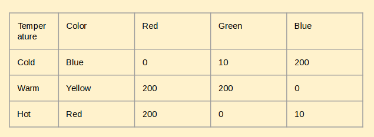

| chapter: Engineering 
| section: Introduction

# Engineering

### 1. Develop the Solution

Development involves the refinement and improvement of a solution, and it continues throughout the design process, often even after a product ships to customers.

### 2. Test and Redesign

The design process involves multiple iterations and redesigns of your final solution. You will likely test your solution, find new problems, make changes, and test new solutions before settling on a final design. <f-link to="https://www.sciencebuddies.org/science-fair-projects/engineering-design-process/engineering-design-process-steps">Read more</a>

---

## Assignment: Engineering your own RGB Lamp

Create a spreadsheet  and make a detailed description of how the values of the three different channels (red, green, blue) will react to the input from the environment.

***KJ: Lets work on wording here***

### Suggestions

* Build a relationship between environmental parameters and colors
* How do you interpolate the missing values? (E.g. spline, keyframes)

<f-inline>
<a class="primary" @click="goto('step5')">Go to Making step</a>
or <a class="secondary" @click="goto('step6')">Go to Communication step</a>

-

***KJ:***

We|Can|Do
---|---|---
Actual|Tables|Here :)