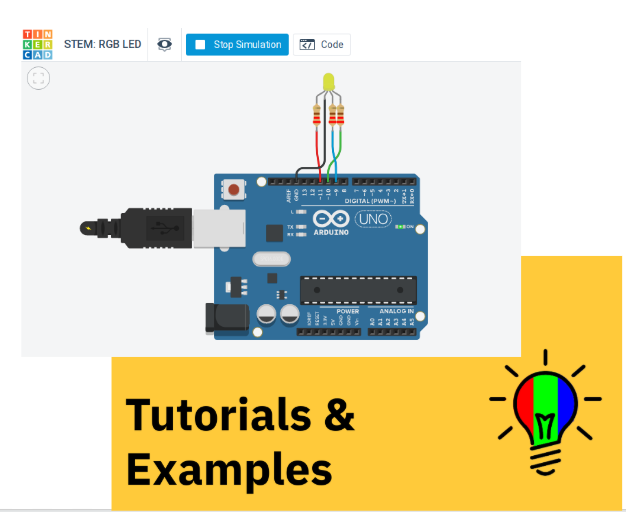

| chapter: Prototyping 
| section: Introduction

### 5. Making

## Where are we?

### Build a Prototype

A prototype is an operating version of a solution. Often it is made with different materials than the final version, and generally it is not as polished. Prototypes are a key step in the development of a final solution, allowing the designer to test how the solution will work.

### Test and Redesign

The design process involves multiple iterations and redesigns of your final solution. You will likely test your solution, find new problems, make changes, and test new solutions before settling on a final design.

<a class="ternary" href="https://www.sciencebuddies.org/science-fair-projects/engineering-design-process/engineering-design-process-steps">
read more (www.sciencebuddies.org)</a>
 
 
<f-next-button title="Next" />

-
 

---

***KJ: I need more grappa***

### 5. Making

## RGB Lamps made with Arduino

How can I build a RGB lamp?

<mark style="background:blue; color: white">Play</mark> with <a class="tertiary" href="https://designstem.github.io/scenarios/rgblamp_vision/arduino/index.html">Arduino using tinkercad</a> (contains several tutorials and examples).

<f-next-button title="Next" />

-

<a href="https://www.tinkercad.com/">tinkercad</a>

---

***KJ: Keep pouring***

### 5. Making

##  Assignment: Build you own (virtual) RGB lamp with Arduino</big>

<big>Start here:</big>
<ul>
<li><a href="https://www.tinkercad.com/">play with tinkercad</a></li>
<li><a href="https://www.google.com/search?q=arduino+rgb+lamp">search in google</a></li>
</ul>

<a class="primary" @click="goto('step6')">Go to Communication step</a>

-

<a href="https://pixabay.com/vectors/rgb-led-8mm-bulbs-2270087/">pixabay</a>
