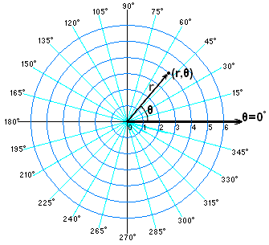

| chapter: Introduction
| topic: First page

| theme: dark
| background: ./images/tech-7.jpg
| tint: 0.7
| style: background-position:center;

| cols: 1fr 4fr
| rows: auto
| 3 1
| 3 2

-

<big>

# <big>Spirals</big>

</big>

&nbsp;

<f-next-button title="Start" />

-

---

| theme: dark

<!-- ## Discove&shy;ring Spirals

Spiral is a very common shape in nature and in as well as every day life. In the **natural world**, we may find spirals in the DNA double helix, the fingerprint, the flowers, the snails and shells but also in the galaxies, the hurricanes etc. Even the shape of an egg can be seen as a special type of spiral.

Spiral patterns can be also met in parts of **mechanical constructions**: turbines, propellers, screws, drills, springs etc.

**Architects** also use the spirals to shape buildings and components like stairs.

Finally spiral shaped **artworks**, **figures** and **artifacts** are used in every day life objects, even in the ancient time. -->

  

    
  ## Dis&shy;cove&shy;ring spirals
  
  Spiral is a very common shape in nature and in as well as every day life. 

  

  <f-image src="./images/nature-1.jpg" />
  <f-image src="./images/nature-2.jpg" />
  <f-image src="./images/nature-3.jpg"  />
  <f-image src="./images/nature-4.jpg" />

  

  In the **natural world**, we may find spirals in the DNA double helix, the fingerprint, the flowers, the snails and shells but also in the galaxies, the hurricanes etc. Even the shape of an egg can be seen as a special type of spiral.
  
  

  <f-image src="./images/nature-5.jpg" />
  <f-image src="./images/nature-6.jpg" />
  <f-image src="./images/nature-7.jpg" />
  <f-image src="./images/nature-9.jpg" />

  

  Spiral patterns can be also met in parts of **mechanical constructions**: turbines, propellers, screws, drills, springs etc.
  
  

  <f-image src="./images/tech-1.jpg" />
  <f-image src="./images/tech-2.jpg" />
  <f-image src="./images/tech-3.jpg" />
  <f-image src="./images/tech-4.jpg" />
  <f-image src="./images/tech-5.jpg" />
  <f-image src="./images/tech-6.jpg" />
  <f-image src="./images/tech-7.jpg" />
  <f-image src="./images/tech-8.jpg" />

  

  **Architects** also use the spirals to shape buildings and components like stairs.
  
  

  <f-image src="./images/architecture-1.jpg" />
  <f-image src="./images/architecture-2.jpg" />
  <f-image src="./images/architecture-9.jpg" />
  <f-image src="./images/architecture-4.jpg" />
  <f-image src="./images/architecture-5.jpg" />
  <f-image src="./images/architecture-6.jpg" />
  <f-image src="./images/architecture-8.jpg" />
  <f-image src="./images/architecture-7.jpg" style="grid-column:1 / span 2" />

  

  Spiral shaped **artworks**, **figures** and **artifacts** are used in every day life objects, even in the ancient time.
  
  

  <f-image src="./images/art-3.jpg" />
  <f-image src="./images/art-4.jpg" />
  <f-image src="./images/art-5.jpg" />
  <f-image src="./images/art-6.jpg" />
  <f-image src="./images/art-7.jpg" />

---

| theme: light
| 1 1 1 
| 2 3 4 
| rows: auto

***TASK*** <f-activity-icon />

Watch the following videos about the spirals and try answer the questions in the following [worksheet](https://spiralsdesignstem.files.wordpress.com/2018/07/worksheet-1-1.docx)

-

<f-video src="https://www.youtube.com/watch?v=lPOf70xIJyg" />

Spiral in Nature

-

<f-video src="https://www.youtube.com/watch?v=iEnR8zupK0A" />

Demo on Fibonacci Sequence Spirals in Nature – The Golden Ratio

-

<f-video src="https://www.youtube.com/watch?v=aIUu5uMKB70" />

Why Are Most Galaxies Spiral-Shaped?

---

| rows: auto

<!-- 2. Working with spirals -->
## Practicing in Spreadsheets

Here, you will be able to draw different Archimedean spiral shapes using an Excel spreadsheet. The Excel file contains two spreadsheets: the first labeled “Archimedean Spiral” in which you may type in the basic parameters and draw the corresponding spiral and the second labeled “Explanation” in which you are given the instructions how to setup your own spiral shape in Excel.

You can download the Excel spreadsheet here: [Spiral Shape in Excel](https://spiralsdesignstem.files.wordpress.com/2018/09/spiral-shape-in-excel1.xls) (XSL)

 

<f-next-button />

-

<f-image src="https://spiralsdesignstem.files.wordpress.com/2018/09/excel1.jpg" style="--image-min-height:40vh; --image-height:40vh;" />
<f-image src="https://spiralsdesignstem.files.wordpress.com/2018/09/excel21.jpg" style="--image-min-height:40vh; --image-height:40vh;" />

<!--  

 -->

---

| rows: auto 
| cols: 3fr 2fr
| 1 1
| 2 3
| 4 4

## 2D, 3D Spirals in Geogebra

-

Geogebra is a free online math tools for graphing, geometry, 3D modelling etc.

 

<f-inline>

  <f-link to="https://www.geogebra.org/2d" class="button tertiary">Geogebra 2D version</f-link>

  <f-link to="https://www.geogebra.org/3d" class="button tertiary">Geogebra 3D version</f-link>

</f-inline>

 

<f-link to="https://spiralsdesignstem.files.wordpress.com/2018/10/what-is-geogebra.pdf">Short introduction to Geogebra</f-link> (pdf)

In our example Geogebra will be used as a practicing tool for creating 3D spirals.

-

### Geogebra examples

<f-link to="https://www.geogebra.org/m/aKC2MESg">Spiral types in Geogebra</f-link>

#### 3D spiral examples:

Spiral 1: <f-link to="https://www.geogebra.org/m/usfyzvuc">geogebra.org/m/usfyzvuc</f-link>
Spiral 2: <f-link to="https://www.geogebra.org/m/scky7tbf">geogebra.org/m/scky7tbf</f-link>
Spiral 3: <f-link to="https://www.geogebra.org/m/yctfkmjg">geogebra.org/m/yctfkmjg</f-link>
Spiral 4: <f-link to="https://www.geogebra.org/m/jkvcnjpd">geogebra.org/m/jkvcnjpd</f-link>
Screw:    <f-link to="https://www.geogebra.org/m/pdrtw9uv">geogebra.org/m/pdrtw9uv</f-link>

-

<f-next-button />

---

| 1 
| 2
| 3 

## <f-activity-icon /> Task 1

Open the Geogebra application in https://www.geogebra.org/3d

Start practicing in creating 3D spirals, following the instructions of the <f-link to="https://spiralsdesignstem.files.wordpress.com/2018/10/worksheet-spiral.pdf">Worksheet 1</f-link> (PDF)

-

## <f-activity-icon /> Task 2

Open the Geogebra application in https://www.geogebra.org/3d

Start practicing in creating 3D spirals, following the instructions of the <f-link to="https://spiralsdesignstem.files.wordpress.com/2018/11/archimedean-spiral-worksheet.pdf">Worksheet 2</f-link> (PDF)

-

<f-next-button />

---

| theme: dark

  # Basics of trigono&shy;metry and polar coordi&shy;nates
  
   

  <f-next-button />
  

---

<!-- 3. Background -->

| 1 3
| 2 3
| 4 4

<caption>Basics of trigonometry and polar coordinates</caption>

## Basics of trigonometry

-

In order to design a spiral you first need to recall the basic knowledge from trigonometry, a know the basic notation of trigonometry which is the branch of mathematics dealing with the **relations of the sides and angles of triangles**.

### The sides of an orthogonal triangle

Assume that there is an orthogonal triangle (a triangle with one angle equal to 90°). The side that is always opposite to the right angle is called <f-math inline red>**"hypotenuse"**</f-math>. This is the longest side in the orthogonal triangle.

If we choose an angle <f-math inline>θ</f-math> other the right angle, the side that lies opposite to it is called <f-math inline blue>"opposite"</f-math>. The third angle, not in the opposite side is called <f-math inline green>"adjacent"</f-math> sides. Let's call the sides <f-math inline green>a</f-math>, <f-math inline blue>b</f-math> and <f-math inline red>c</f-math>.

The length of the three sides <f-math inline green>a</f-math>, <f-math inline blue>b</f-math> and <f-math inline red>c</f-math> of an orthogonal triangle are linked with **“Pythagorean equation”**

<f-math>\color{blue}a^2 \color{black}+ \color{green}b^2 \color{black}= \color{red}c^2</f-math>

This equation states that **the square of the hypotenuse** (the side opposite the right angle) is equal to **the sum of the squares of the other two sides**.

-

  <f-scene responsive style="max-width:700px;">
    <defs>
    <marker id="arrow" viewBox="0 0 10 10" refX="5" refY="5"
      markerWidth="5" markerHeight="5"
      orient="auto-start-reverse" fill="lightgray" >
        <path d="M 0 0 L 10 5 L 0 10 z" />
    </marker>
    </defs>
    <f-arc position="-1.5 -1" start-angle="90" end-angle="130" r="0.4" inner-radius="0.4" stroke-width="2" />
    <f-line points="-1.5 -1, 1 -1"  :stroke="color('green')" />
    <f-line points="1 -1, 1  1"     :stroke="color('blue')" />
    <f-line points="1 1, -1.5 -1"     :stroke="color('red')" />
    <f-box r="0.2" position="0.9 -0.9" strokeWidth="2" />
    <polyline points="-1.05,-0.85 0.85,-0.1" fill="none" stroke="lightgray" stroke-width="0.02" stroke-dasharray="0.04" marker-end="url(#arrow)" />
    <polyline points="0.9,-0.9 -0.2,-0.1" fill="none" stroke="lightgray" stroke-width="0.02" stroke-dasharray="0.04" marker-end="url(#arrow)" />
    <f-text :fill="color('red')" position="-0.6 0.5">Hypotenuse:c</f-text>
    <f-text :fill="color('green')" position="-0.2 -1.3">Adjascent:a</f-text>
    <f-text :fill="color('blue')" position="1.3 0" rotation="90">Opposite:b</f-text>
    <f-text position="-1.5 -0.8" style="font-size:120%">θ</f-text>
  </f-scene>

-

 

<f-next-button />

---

| 1 2
| 3 4
| 5 5

<caption>Basics of trigonometry and polar coordinates</caption>

## Trigonometric Ratios

The ratios (fractions) of the sides a, b and c  of an orthogonal right triangle are called trigonometric ratios. Three common trigonometric ratios are the sine (**sin**), cosine (**cos**), and tangent (**tan**). For any angle θ such that of the triangle in Figure 1, these are defined for as follows:

<f-math>sin(θ) = \frac{\color{blue}Opposite}{\color{red}Hypotenuse} = \frac{\color{blue}b}{\color{red}c}</f-math><f-math>cos(θ) = \frac{\color{green}Adjascent}{\color{red}Hypotenuse} = \frac{\color{green}a}{\color{red}c}</f-math><f-math>tan(θ) = \frac{\color{blue}Opposite}{\color{green}Adjascent} = \frac{sin θ}{cos θ} = \frac{\color{blue}b}{\color{green}a}</f-math>

To remember these definitions, note the following:

<f-math>Sine = \frac{\color{blue}Opposite}{\color{red}Hypotenuse}</f-math><f-math>Cosine = \frac{\color{green}Adjascent}{\color{red}Hypotenuse}</f-math><f-math>Tangent = \frac{\color{blue}Opposite}{\color{green}Adjascent}</f-math>

By applying the Pythagorean equation to the trigonometric ratios derives that, for any angle θ in an orthogonal triangle holds

<f-math>sin^2(θ) + cos^2(θ) = 1</f-math>

-

  <f-scene responsive style="max-width:700px;">
    <defs>
    <marker id="arrow" viewBox="0 0 10 10" refX="5" refY="5"
      markerWidth="5" markerHeight="5"
      orient="auto-start-reverse" fill="lightgray" >
        <path d="M 0 0 L 10 5 L 0 10 z" />
    </marker>
    </defs>
    <f-arc position="-1.5 -1" start-angle="90" end-angle="130" r="0.4" inner-radius="0.4" stroke-width="2" />
    <f-line points="-1.5 -1, 1 -1"  :stroke="color('green')" />
    <f-line points="1 -1, 1  1"     :stroke="color('blue')" />
    <f-line points="1 1, -1.5 -1"     :stroke="color('red')" />
    <f-box r="0.2" position="0.9 -0.9" strokeWidth="2" />
    <polyline points="-1.05,-0.85 0.85,-0.1" fill="none" stroke="lightgray" stroke-width="0.02" stroke-dasharray="0.04" marker-end="url(#arrow)" />
    <polyline points="0.9,-0.9 -0.2,-0.1" fill="none" stroke="lightgray" stroke-width="0.02" stroke-dasharray="0.04" marker-end="url(#arrow)" />
    <f-text :fill="color('red')" position="-0.6 0.5">Hypotenuse:c</f-text>
    <f-text :fill="color('green')" position="-0.2 -1.3">Adjascent:a</f-text>
    <f-text :fill="color('blue')" position="1.3 0" rotation="90">Opposite:b</f-text>
    <f-text position="-1.5 -0.8" style="font-size:120%">θ</f-text>
  </f-scene>

-

### Example

Let the triangle <f-math inline>ABC</f-math> be with sides 3, 4 and 5.

In the above triangle <f-math inline>ABC</f-math>, the trigonometric ratios of the angle <f-math inline>A</f-math> are calculated:

<f-math>sin(A) = \frac{\color{blue}CB}{\color{red}AB} = \frac{\color{blue}3}{\color{red}5} = 0.6</f-math><f-math>cos(A) = \frac{\color{green}AC}{\color{red}AB} = \frac{\color{green}4}{\color{red}5} = 0.8</f-math><f-math>tan(A) = \frac{\color{blue}CB}{\color{green}AC} = \frac{\color{blue}3}{\color{green}4} = 0.75</f-math>

or by using the values of <f-math inline>sin(A)</f-math> and <f-math inline>cos(A)</f-math> 

<f-math>tan(A) = \frac{sin(A)}{cos(A)} = \frac{0.6}{0.8} = 0.75</f-math>

In this example we can verify that 

<f-math>\color{red}AB\color{black}^2 = \color{green}AC\color{black}^2 + \color{blue}BC\color{black}^2 or</f-math><f-math>\color{red}5\color{black}^2 = \color{green}4\color{black}^2 + \color{blue}3\color{black}^2 or</f-math><f-math>\color{red}25\color{black} = \color{green}16\color{black} + \color{blue}9\color{black}</f-math>

<!--  -->

Moreover,  

<f-math inline>sin^2(A) + cos^2(A) = 1 </f-math> or <f-math inline>0.6^2 + 0.8^2 = 0.36 + 0.64 = 1</f-math>

<!--  -->

-

  <f-scene responsive style="max-width:600px;">
    <f-arc position="-1.5 -1" start-angle="90" end-angle="125" r="0.4" inner-radius="0.4" stroke-width="2" />
    <f-line points="-1.5 -1, 1.5 -1"  :stroke="color('green')" />
    <f-line points="1.5 -1, 1.5  1.25"     :stroke="color('blue')" />
    <f-line points="1.5 1.25, -1.5 -1"     :stroke="color('red')" />
    <f-box r="0.2" position="1.4 -0.9" strokeWidth="2" />
    <f-text :fill="color('red')" position="0 0.4">5</f-text>
    <f-text :fill="color('green')" position="0 -1.3">4</f-text>
    <f-text :fill="color('blue')" position="1.3 0">3</f-text>
    <f-text position="-1.6 -1.2">A</f-text>
    <f-text position="1.6 1.3">B</f-text>
    <f-text position="1.6 -1.2">C</f-text>
  </f-scene>

<!--  -->

-

 

<f-next-button />

---

| 1 1
| 2 3
| 4 5
| 6 6

<caption>Basics of trigonometry and polar coordinates</caption>

## Cartesian and Polar Coordinates 

-

### Cartesian coordinates

Any point in the plane can be defined by its coordinates (**X**, **Y**). (X, Y) is a pair of numbers denoting the distances from two perpendicular lines: the vertical line (-axis) and the horizontal line (-axis). For example, in the next figure the point A is defined as a pair (3,4), where X=3 and Y=4. These are called Cartesian coordinates.

-

<f-image src="https://spiralsdesignstem.files.wordpress.com/2018/09/plane11.jpg" style="--image-size:contain; --image-height:30vh;" />

<!--  -->

-

### Polar coordinates

However, in many cases such that of drawing a spiral, a different expression is needed. One may notice that instead of using (x, y) as the coordinates of point A, the **distance from the zero point r and the angle θ** may equivalently be used. This means that the position of any point in the plane can be described by the pair (r, θ). These are called **Polar coordinates of the point A**.

> Cartesian and Polar coordinates are equivalent and can be converted from one type to another.

-

<f-image src="./images/polar-coordinates.png" style="--image-size:contain; --image-height:30vh; --image-position:center;" />

<!--  -->

-

<f-next-button />

---

| 1 1
| 2 3
| 4 3
| 5 5

<caption>Basics of trigonometry and polar coordinates</caption>

## Calculation of Polar coordinates

-

#### 1. Find the Polar coordinates from Cartesian coordinates

Assume that a point **A** with coordinates x=3 and y=4 is given. According to the next figure, the yellow triangle is orthogonal with opposite and adjacent sides length equal to 3 and 4, respectively.

The **hypotenuse is the distance r** and can be estimated by applying the Pythagorean equation as

<f-math>\color{red}r^2 \color{black} = \color{blue}x^2 \color{blaxk}+ \color{green}y^2 \color{black}= \color{blue}3^2 \color{black}+ \color{green}4^2 \color{black}= \color{blue}9 \color{black}+ \color{green}16 \color{black}= 25</f-math><f-math>\color{red}r \color{black}= \sqrt{25} = 5</f-math>

<!--  -->

From the same triangle, **angle θ can be estimated** indirectly in terms of the tan(θ) ratio.

Indeed

<f-math>tan(θ) = \frac{\color{green}y}{\color{blue}x} = \frac{\color{green}4}{\color{blue}3} = 1.33</f-math><f-math>θ = tan^{-1}(1.33) = 53.06\degree</f-math>

<!--  -->

👉Note the value of θ derives by the **inverse function of tangens** (tan-1). Any typical scientific calculator includes this option.

-

<f-scene responsive style="position:sticky; top:25vh; max-width:700px;">
  <defs>
    <marker id="arrow" viewBox="0 0 10 10" refX="5" refY="5"
      markerWidth="5" markerHeight="5"
      orient="auto-start-reverse" fill="lightgray" >
        <path d="M 0 0 L 10 5 L 0 10 z" />
    </marker>
    </defs>
    <polyline points="0,-1.9 0,1.9" fill="none" stroke="lightgray" stroke-width="0.02" stroke-dasharray="0.04" marker-end="url(#arrow)" />
    <polyline points="-1.9,0 1.9,0" fill="none" stroke="lightgray" stroke-width="0.02" stroke-dasharray="0.04" marker-end="url(#arrow)" />
    <f-circle r="1.5" strokeWidth="2" :stroke="color('gray')" />
    <f-polygon :points="[ [0,0], polarxy(90,0.75), polarxy(150, 1.5) ]" :fill="color('yellow')" stroke opacity="0.6" />
    <f-line points="0 0, 0 1.31" :stroke="color('green')" />
    <f-polygon :points="[ [0,0], polarxy(90,0.75), polarxy(150, 1.5) ]" strokeWidth="2" />
    <f-line points="0 0, 0.75 0" :stroke="color('blue')" />
    <f-line :points="[[0,0],polarxy(150, 1.5)]" :stroke="color('red')" />
    <f-arc position="0 0" start-angle="90" end-angle="150" r="0.45" inner-radius="0.45" stroke-width="1" />
    <f-box r="0.1" position="0.7 0.05" strokeWidth="1" />
    <f-text :position="polarxy(140,1.9)">A(x:3,y:4)</f-text>
    <f-text position="-0.1 0.6" :fill="color('green')" rotation="90" scale="0.75">r⋅sin(θ)</f-text>
    <f-text position="0.4 -0.25" :fill="color('blue')" scale="0.75">r⋅cos(θ)</f-text>
    <f-text :position="polarxy(155, 0.75)" :fill="color('red')" scale="0.75">r</f-text>
    <f-text position="0.22 0.05" >θ</f-text>
    <f-text position="1.9 0.1" scale="0.75">x</f-text>
    <f-text position="0.15 1.85" scale="0.75">y</f-text>
    
</f-scene>

<!--  -->

-

 

#### 2. From Polar to Cartesian coordinates

Following the previous example, assume now that the **point A is known by its polar coordinates** (5, 53.06°). Its Cartesian coordinates derive by applying the trigonometric ratios cos() and sin() as follows.

<f-math>cos(θ) = \frac{\color{blue}x}{\color{red}r}</f-math><f-math>{\color{blue}x} = {\color{red}r} \cdot cos(θ) = {\color{red}5} \cdot cos(53.06\degree) = {\color{red}5} \cdot 0.6 = \color{blue}3</f-math>
<f-math>sin(θ) = \frac{\color{green}y}{\color{red}r}</f-math><f-math>{\color{green}y} = {\color{red}r} \cdot sin(θ) = {\color{red}5} \cdot sin(53.06\degree) = {\color{red}5} \cdot 0.8 = \color{green}4</f-math>

<!--  -->

-

<f-next-button />

---

| theme: dark

  # Mathe&shy;matics of 2D and 3D Archi&shy;medean spirals

  This section will help you understand the mathematics and particular the equations and formulas from which 2D and 3D spirals derive.

   

  <f-next-button />
  

---

| 1 1
| 2 4
| 3 5
| 6 6

<caption>Mathematics of 2D and 3D Archimedean spirals</caption>

## Equations of 2D Archi&shy;medean spirals

-

Assume that a point is described by its polar coordinates (r, θ). Remember that **r is the radius**, the distance of the point from the center of the axes and **θ is the angle** formed between the radius and x axis (see next figure).

-

<f-image src="https://spiralsdesignstem.files.wordpress.com/2018/09/spiral2d-2.jpg?w=300&h=261" style="--image-size:contain; --image-height:35vh; " />

<!--  -->

-

Now, image what happens if the angle θ gradually increases from the zero degrees (θ=0º) to θ=90º and then to θ=180º up to θ=360º. If the radius *r* remains constant, the corresponding point, will move along the blue circle. This is the basic movement to produce a circular shape.

-

<f-slider set="circleProgress" value="0" to="360" title="θ" />

<f-scene grid responsive style="max-width:400px;">
  <f-circle r="1.5" strokeWidth="1" :stroke="color('blue')" />
  <f-group rotation="90">
    <!-- <f-line :points="[[0,0], polarxy(get('circleProgress'),1.5) ]" /> -->
    <f-arc r="1.5" inner-radius="0" :stroke="color('red')" start-angle="0" :end-angle="get('circleProgress', 0)" stroke-width="4" />
    <f-circle r="0.1" :stroke="color('red')" :position="polarxy( get('circleProgress', 0), 1.5)"  />
  </f-group>
  <f-text :position="polarxy( get('circleProgress', 0)+90, 1.75)">r</f-text>
  <f-text position="0 0.1">θ={{Math.round(get('circleProgress', 0))}}°</f-text>
</f-scene>

-

<f-next-button />

---

| gap: 7vh 5vw
| 1 1
| 2 3
| 4 5
| 6 6

<caption>Mathematics of 2D and 3D Archimedean spirals</caption>

## Equations of 2D Archi&shy;medean spirals

-

In the previous movement, if we assume that **r is not constant** but changes gradually as the angle θ ranges from 0º to 360º, then we get a **perfect spiral shape**.

To draw an Archimedian spiral, two basic parameters need to define:

- the starting point on the x axis (lets call it **α**) and
- the distance **d** between two consecutive lines of the spiral.

<f-slider 
    title="α"
    :value="150" 
    set="radius"
    from="0"
    to="200" 
/>
<f-slider 
    title="d"
    :value="0" 
    set="padding"
    from="0"
    to="100" 
/>
<f-slider 
    title="Active point"
    :value="0" 
    set="active"
    from="0"
    to="180"
    :step="1" 
/>

The most usual case of an Archimedian spiral is that when the spiral shape begins from the beginning of the axes x and y. In such a case α=0.

-

<f-artboard responsive grid width="600" height="400">
  <g transform="translate(300 200)">
    <Spiral :cycles="5" :padding="get('padding', 0)" :startX="get('radius', 100)" :activePoint="get('active', 0)" :info="false" />
  </g>
</f-artboard>

-

<!--  -->

**Any point (x,y) of the plane belongs to a spiral shape if satisfies the following equations**

<f-math>x = r \cdot cos(θ)</f-math><f-math>y = r \cdot sin(θ)</f-math><f-math>r = a + \frac{d}{2π} \cdot θ</f-math><f-math>θ = 0°...360°</f-math>

Note that π is the well known PI number equal to 3.14159.

The following figure, explains the above equations in terms of the polar coordinates explained in the previous section.

<!--  -->

> Based on the above equations, any flat, 2D Archimedian spiral can be drawn if the angle θ ranges from 0º to 360º, and for every single value in that range, the coordinates  x and y are calculated and the corresponding point (x,y) in plotted in the plane.

-

<!-- <f-image src="https://spiralsdesignstem.files.wordpress.com/2018/09/spiral2d-1.jpg?w=1024&h=671" style="--image-size:contain; --image-min-height:40vh" /> -->

<f-artboard responsive width="600" height="400">
<defs>
<marker id="arrow" viewBox="0 0 10 10" refX="9" refY="5"
    markerWidth="3" markerHeight="3"
    orient="auto-start-reverse" :fill="color('darkgray')" >
    <path d="M 0 0 L 10 5 L 0 10 z" />
  </marker>
  </defs>
  <g transform="translate(300 200)">
    <Spiral :cycles="3" :padding="60" :startX="150" activePoint="6" :info="false" :triangle="true" />
    <f-line :points="[ [0,30], [polarx(90, 150), polary(90, 150)+30] ]" stroke-width="3" marker-end="url(#arrow)" marker-start="url(#arrow)" />
    <f-line :points="[ [polarx(90,150), 0], [polarx(90, 210), 0] ]" stroke-width="3" marker-end="url(#arrow)" marker-start="url(#arrow)" />
    <f-text position="45 -5" scale="1.5">x</f-text>
    <f-text position="90 -60" scale="1.5">y</f-text>
    <f-text position="30 -70" scale="1.5">r</f-text>
    <f-text position="80 50" scale="1.5">α</f-text>
    <f-text position="180 20" scale="1.5">d</f-text>
  </g>
</f-artboard>

-

<f-next-button />

---

| cols: 3fr 2fr
| 1 1
| 2 3
| 4 4

<caption>Mathematics of 2D and 3D Archimedean spirals</caption>

## Equations of 3D spirals

-

The equations of a 3D spiral or helix are similar to those presented before.

In three dimensions we assume that a **third axis z denoting the height** is added to the plane. For that new axis and the two horizontal (x and y), the equations are as follows:

<f-math>x = R \cdot cos(t)</f-math><f-math>y = R \cdot sin(t)</f-math><f-math>z = c \cdot t</f-math><f-math>t = {0...2\pi}  =  {0\degree...360\degree}</f-math>

<!--  -->

In the above equations, **R** represents the radius of the cycle in the plane X-Y and **t** varies between 0 and 2π in the right-hand direction full cycle. The factor **c** is constant so the value **2πc** denotes the vertical separation of the helix’s loop.

<!-- Next figure presents the shape of a helix drawn in the three dimensions. -->

-

<f-slider set="t" from="0" to="0.2" step="0.02" value="0" title="t" />
<f-slider set="rad" from="0.2" to="1.8" step="0.1" value="1" title="R" />
<f-slider set="rot" to="360" step="1" value="20" title="Rotate spiral" />

<f-scene3 responsive isometric style="max-width:700px">
  <f-group3 :rotation="[60, 0, get('rot', 20)]" :key="get('t', 0)">
  <f-point3 :key="get('rad')"
    :points="range(-10,10,0.1).map(x => [get('rad', 1)*Math.cos(x),get('rad', 1)*Math.sin(x),x*get('t',0)])"
    :stroke="color('gray')"
  />
  </f-group3>
</f-scene3>

-

<f-next-button />

---

<!-- 4. 3D Models -->

# 3D Models

Three-dimensional (3D) modeling is the process of developing a mathematical representation of any surface of an object in three dimensions via specialized software. The final product is called a 3D model.

3D models represent a physical body using a collection of points in 3D spaces, connected by various geometric entities such as triangles, lines, curved surfaces, etc. 3D models can be created by hand, algorithmically (procedural modeling), or scanned. A 3D model can also be physically created using 3D printing devices.

To produce 3D models, 3D modeling software is used. Examples are displayed in following sections.

<f-notes title="Source">

**TODO ERIK: Can we just copy Wikipedia?***

[https://en.wikipedia.org/wiki/3D\_modeling](https://en.wikipedia.org/wiki/3D_modeling)

</f-notes>

---

# 3D Design Software

In this section, we present some of the 3D design software tools that can be used to create 3D objects, including spirals.

## TinkerCad
    
TinkerCad is a free online collection of software tools that people can use in order to design 3D objects. More specifically, they can place objects, adjust them or make combinations of objects and also design 3D objects by using code. Furthermore, it offers the option of exporting in STL or SVG file formats for 3D printing or laser cutting.

Source: [www.tinkercad.com](http://www.tinkercad.com)

## Blender
    
Blender a free and open source 3D creation suite. It supports the entirety of the 3D pipeline—modeling, rigging, animation, simulation, rendering, compositing and motion tracking, even video editing and game creation. It is fully customizable and can also offer Python scripting for advanced users. It can be used it for 3D design after a short installation process in PC devices and produce STL file formats for further 3D Printing use.

Source: [www.blender.org](http://www.blender.org)

## SketchUp
    
SketchUp is a 3D modelling software program that can be used for a wide range of drawing applications and for the production of a variety of 3D objects. It is available as a free web-based application (SketchUp Free), as well as a freeware (SketchUp Make) or paid (SketchUp Pro) version that require installation on a PC device.

Source: [www.sketchup.com](http://www.sketchup.com)

---

# 3D Design

In this section you can use a 3D Design software to produce objects relevant to spirals or search the internet to find 3D Models online.

##  Find objects online

You can find and download 3D Models by visiting the webpages below:

* [https://www.thingiverse.com/](https://www.thingiverse.com/)
* [https://www.youmagine.com/](https://www.youmagine.com/)

***TASK***

Find a 3D Model you like by visiting the above websites.

*   Download the files of the 3D Model you selected.

*   Extract the .zip file of the 3D Model after you download it.

*   What are the files extensions?

*   Are these extensions known to you?

*   What the .stl file stands for?

---

# Design your own objects

***TASK*** 

Use the online **Tinkercad software**, available at: [http://www.tinkercad.com, ](http://www.tinkercad.com, ) and try to complete the tasks of the following **worksheets.**

[Worksheet 1 – Create a simple 3D Spiral Shape – Clockspring](https://spiralsdesignstem.files.wordpress.com/2018/09/worksheet-1.pdf "Worksheet 1")

[Worksheet 2 – Implement a 2D Spiral shape and transform it into a 3D Spiral Shape](https://spiralsdesignstem.files.wordpress.com/2018/09/worksheet-2.pdf "Worksheet 2")

[Worksheet 3 – Create a simple Screw with Spiral Shapes](https://spiralsdesignstem.files.wordpress.com/2018/09/worksheet-3.pdf "Worksheet 3")

[WorkSheet 4 –  Create a Helical Compression Spring](https://spiralsdesignstem.files.wordpress.com/2018/09/worksheet-4.pdf "Worksheet 4")

---

# 3D Printing

3D printing is the process of making three dimensional solid objects that derive from a digital file. The creation of a 3D printed object is achieved by laying down successive layers of material until the object is created. Each of these layers can be seen as a thinly sliced horizontal cross-section of the object. Objects can be of almost of any shape or geometry and typically are produced using digital model data from a 3D Model or another electronic data source.

## 3D Printing Techniques

**Fused Deposition Modeling (FDM)**. A common 3D printing technique that creates objects by melting filament and extruding it through a small nozzle that moves in three dimensions.

**Selective Laser Sintering (SLS)**. A 3D printing technology that uses high intensity light to sinter a powdered material.

**Stereolithography (SLA)**. A 3D printing technology which makes objects by using a high intensity light or a laser to harden a plastic resin

## 3D Printing Materials
When it comes to 3D Printing there are many materials one can choose from. Some of the most popular in use are presented below.

### PLA

Poly (lactic acid) or polylactic acid or polylactide (PLA) is a biodegradable (more nature friendly) and bioactive thermoplastic aliphatic polyester derived from renewable resources, such as corn starch cassava roots, chips or starch, or sugarcane.

### ABS

ABS is derived from acrylonitrile, butadiene, and styrene. Acrylonitrile is a synthetic monomer produced from propylene and ammonia; butadiene is a petroleum hydrocarbon obtained from the C4 fraction of steam cracking; styrene monomer is made by dehydrogenationof ethyl benzene — a hydrocarbon obtained in the reaction of ethylene and benzene.

Other types of materials that can be used are: NYLON (Polyamide), Flexible, Polycarbonate, Wood PLA, Metal PLA etc.

## Interesting Websites

* https://ultimaker.com/en/blog/17956-ultimaker-schooling-maintenance
* https://all3dp.com/1/3d-printing-materials-guide-3d-printer-material/
* https://www.simplify3d.com/support/materials-guide/properties-table/

## 3D Printer Parts

Before starting the 3D printing process you need to be informed of the 3D Printer’s parts. Every 3D Printer haw a user’s manual where all the printer’s parts are displayed and explained. For example, for the Ultimaker 2+ 3D Printer you can see the manual on the following link:

https://ultimaker.com/download/19573/UserManual_UM2+_EN.pdf

According to the manual listed above an Ultimaker 2+ 3D Printer has the parts shown in the following images:

## 3D Printing Implementation

When you have a 3D model ready for printing first you need to prepare a file suitable for your 3D Printer. If you have prepared an .STL or .OBJ file you need a slicing program to create the G-code that is actually a set of intructions for your 3D Printer. One popular slicing software for Ultimaker 3D Printers is the Cura Software.

See additional information about the Cura Software on the following link:

https://ultimaker.com/en/resources/21932-mastering-cura

Download the Cura Software from the following link:

https://ultimaker.com/en/products/ultimaker-cura-software

<f-notes title="Sources">

https://en.wikipedia.org/wiki/3D_printing,_https://www.sd3d.com/materials/

https://wiki.commonslab.gr/w/3D_printing

</f-notes>

---

## 3D Printing Gallery

 

 

 

 

 

 

 

 

 

 

 

 

 

 

 

 

 

 

 

 

 

 

 

---

| 1 1 
| 2 3
| 4 5
| rows: auto

# 3D printing videos

The objects that were 3D Printed were retrieved from
https://www.youmagine.com/ and https://www.thingiverse.com

-

<f-video src="https://www.youtube.com/watch?v=pS2WOM_TBjs" />

3D Printing of a **Spiral Cube**

-

<f-video src="https://www.youtube.com/watch?v=FHV3Sn-KqlQ" />

3D Printing of a **Tornado**

-

<f-video src="https://www.youtube.com/watch?v=HB7imT8L5x0" />

3D Printing of a **DNA chain**

-

<f-video src="https://www.youtube.com/watch?v=86W2zbpf4Io" />

3D Printing of a **DNA chain** II

---

<!-- 5. The dice cylinder -->

# The Dice Cylinder Design Problem

## **Dice Games**

Dice games are board games played by dice. They are very popular especially among children. The backgammon, chuck-a-luck (bird cage), ludo etc are examples of dice games. A list of several dice games can be found at [http://www.dice-play.com/GamesAZ.htm](http://www.dice-play.com/GamesAZ.htm)

Dice games are based on rules according to which a player throws the dice and depending on the result, an action is performed. In these games the random outcome of the dice is very important.  The dice must have enough space to roll several times so to end up randomly to their final position. Moreover, the throw should be such that the outcome is not determined by their initial status.

## **The design problem**

Assume that you want to design an object that could help rolling the dice efficiently in a restricted space. Let such an object be a dice-cylinder, i.e. a cylinder that when the player lets the dice from the top, it will let them go down rolling and let them exit at the bottom level.

Such a dice-cylinder should :

1. Be easy to use
2. Allow one more dice roll down simultaneously
3. Assure the random outcome of the dice
4. Save space
5. Be fair. The player may not able to manipulate the throwing in any manner.

The problem of the dice-cylinder  is to think, design and implement a rolling path for the dice within the cylinder so to let them move and roll sufficient distance, greater than the height of the cylinder, so to ensure the random dice outcome. Moreover, the movement of the dice should be smooth, without obstacles and such to ensure that they will not stick in an intermediate position and come down directly.

## Directions for the design

Look carefully the following pictures (Source : [http://www.pexels.com](http://www.pexels.com)) What are the common design parts on these?

Look at the metallic stair in the previous picture. You may notice the round tube-shaped central column and the stairs linked to it. The most important part of this stair is the helix shape.

Similar dice throwing objects has been previously designed and sold. For example in the e-shop [https://www.etsy.com/search?q=dice%20tower](https://www.etsy.com/search?q=dice%20tower) you may find different implementations of the basic vertical dice throwing idea. They are made of different materials (plastic, wood, paper etc.), shapes (tower, folding boxes, spiral cylinders etc.)

Below there are some pictures of such objects. In the rolling path of the dice, some of them use obstacles to ensure the random rolling and few of them use a helix stair.

A dice-cylinder should look like the following picture.

To solve such a problem, consider the spiral theory. The path that follows the dice down to the exit of the cylinder may be a helix tube or a round staircase. Focusing to the case of the spiral stairs, several questions may arise:

* Why such a helix staircase might be an efficient structure in terms of space capacity and length of the rolling path?
* Given of some parameters such the height, the number of spirals, and the diameter of the cylinder base, how the helix staircase can be designed ? How long should be the helix path? How many stairs can be used in the specific cylinder height?

---

# The Dice Cylinder Basic Maths & Calculations

## The helix within a cylinder

But how one can easily design a helix ? Consider the following example.

Get a rectangular piece of paper and draw its diagonal with a pencil. Try to bend the paper so to gradually form a cylinder, a tube. Then, you may notice that the round shape automatically transforms the diagonal line to a helix ! This helix line will be the basic direction for the stairs to be linked. Further note that this is a simple, one spiral helix.

The following figure illustrates this structure.

Further note that in the previous figure the helix is simple, with only one spiral. What will be the design if one wants to make a two-spiral helix? This is simple. Start by dividing the rectangular piece of paper into two equal horizontal parts (see next figure). Then draw the diagonals in both parts. If you bend this structure, the red lines will form a two-spiral helix.

Helix with more than two spirals can be also formed by dividing the basic rectangular into appropriate number of equal parts.

Assuming that the helix column has been constructed, the stairs may be designed as equal triangles. The number of the steps required is depended on the height of the stair and the distance between two consecutive steps while their size is linked to the size of the circular base of the stair.

For example, if 12 steps are needed, the following figure presents the 12 equal triangles.

To form the final stair structure, the triangle steps are linked with the helix in equal distances, as next figure presents.

## Mathematics of the helix

A 3D Archimedean spiral follows certain rules described by mathematical trigonometric equations, similar to those of a 2D spiral. File [The\_Dice\_Cylinder\_Long\_Learning\_Path.docx](https://drive.google.com/drive/u/0/folders/1fTixXq1ow-ggx7BNahmdHWRxrCgkzPk7) contains the necessary supporting mathematical background for these.

In three dimensions we assume that a third axis z denoting the height is added to the plane. For that new axis and the two horizontal x, y , the equations are as follows:

In the above equations,

* R represents the radius of the cycle in the plane X-Y  and
* t varies between 0 and 2π in the right-hand direction full cycle.
* factor c is constant so the value 2πc to denote the vertical separation of the helix’s loop.

Next figure presents  the shape of a helix  drawn in the three dimensions.

## Basic calculations for the dice cylinder

As mentioned in previous texts, the proposed dice cylinder will include an internal helix staircase which will be the path for the dice. This document presents the basic calculations for that construction.

By inspecting the basic structure, we notice that the basic part of the helix staircase is the inner cylinder column in which the triagonal-shaped stairs are adopted. The following figure presents these parts and shows the parameters used for the calculations.

These are

**h** = the height of the stair

**R** = the radius of the basic cycle

**r** = the radius of the inner column

**d** = the distance (height) between two consecutive stairs

**θ** = the angle of the trigonal stair

**N** \= the number of stairs

Assume that the parameter **h, R, r** and **d** are predetermined and known, the rest  of them derive as follows :

The number of stairs **N** are dependent on the height **h** and the distance **d** between the stairs and related with the formula  **h = d (N+1)** By solving the equation, **N** derives as **N=1 – h/d**.

The base cycle is divided into N equal triangles, so their angle can be computed as  **θ = 3600 / Ν**

The inner column, seen as a cylinder with base radius **r** and when expanded, it forms a rectangle with height **h** and width the length of the inner cycle which is **2πr** (π=3,14).

The **N** stairs are placed in equal positions by using a grid. Next figure presents such a grid for **N=12** stairs.

The level of each stair is presented by the red line and the green diagonal line represents the helix path of the stair. The length **S** of this path is computed as the hypotenuse of the rectangular triangle with sides **h** and **2πr**. From the Pythagoras theorem derives that **S2 =(2πr)2+h2** so **S = square root ((2πr)2+h2).**

---

# Build the Dice Cylinder

## Instructions for the paper model

To construct the paper model of the dice staircase we need :

* 2 A4 sheets of thick paper where we print the template
* Pair of scissors
* Liquid paper glue
* Plastic A4 sheet e.g. overhead transparency film sheet

Follow the steps.

1. Open and print the pages of the template sheet.
2. Cut the 12 triangle stairs and the base.

  <f-inline>

   

   

  </f-inline>

3. Cut the column, incise the vertical stripes so to bend the paper along the horizontal dimension. Connect the two edges with glue.

  <f-inline>

   

   

   

  </f-inline>

4. Stick the column to the base using glue

  <f-inline>

   

   

  </f-inline>

5. Stick the stairs in the column. Use the direction of the black helix line.

  For every stair, bend the narrow white part of the triangle up to the dotted line so to form a right angle with the rest grey part.  Glue the stairs in the column, at the level of the black horizontal line.

  <f-inline>

   

   

   

  </f-inline>

  Do the same for all the 12 stairs.

  <f-inline>

   

   

   

  </f-inline>

6. Make the external cylinder from a plastic sheet

  Use an A4 plastic film.

  

  Cut a piece of 12 cm width. Cut a rectangular piece at the bottom to let the dice exit.

  

  Bend the plastic sheet so to form a cylinder and stick the two edges using the glue.

  <f-inline>

   

   

  </f-inline>

  Put the paper staircase model with in the plastic cylinder.

  

## Dice cylinder paper sheet template

To construct the paper model of the dice staircase you can use the following Paper Sheet Template:

[Paper Sheet Template](https://spiralsdesignstem.files.wordpress.com/2019/05/the_dice_cylinder_paper_sheet_template.pdf)

## Dice box and dice cylinder in 3D

To construct a Dice Box or a Dice Cylinder in 3D you can use the following worksheet:

[Dice Box and Dice Cylinder in 3D](https://spiralsdesignstem.files.wordpress.com/2019/05/the_dice_box_in_3d_worksheet.pdf)