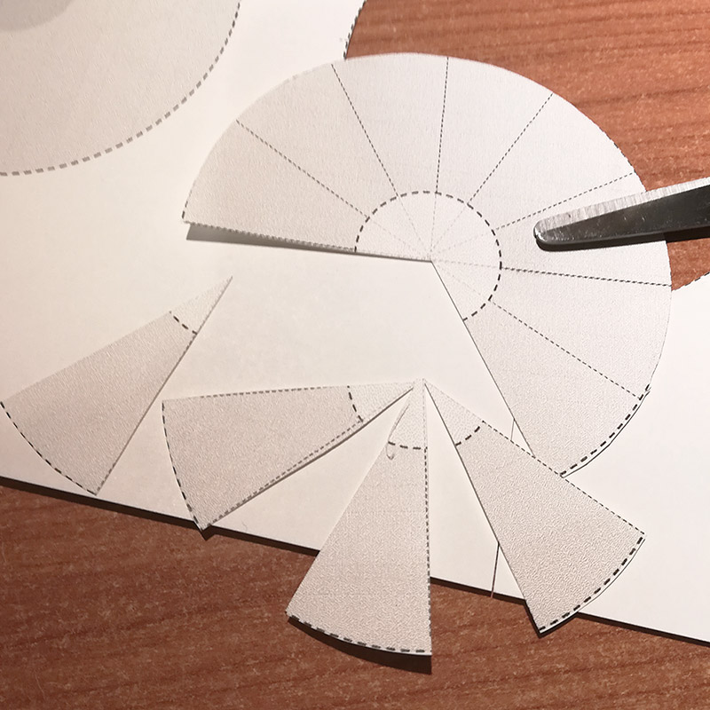
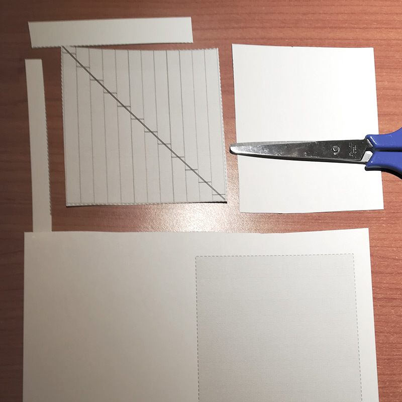
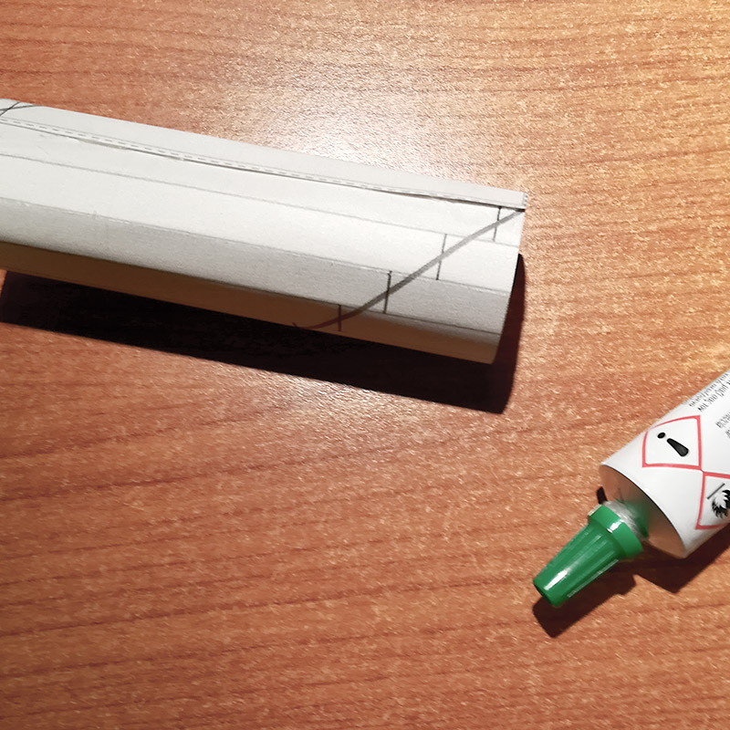
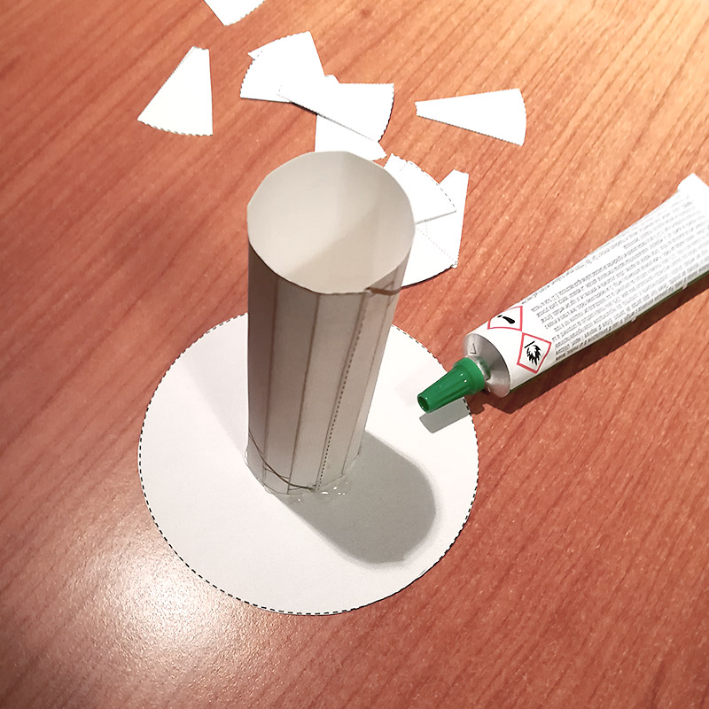
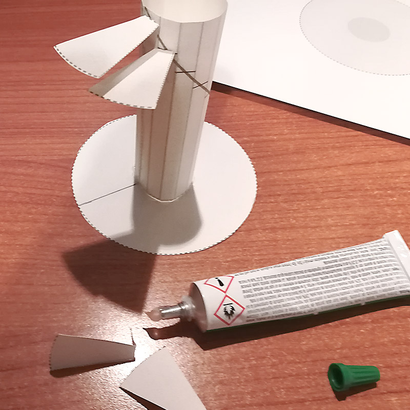
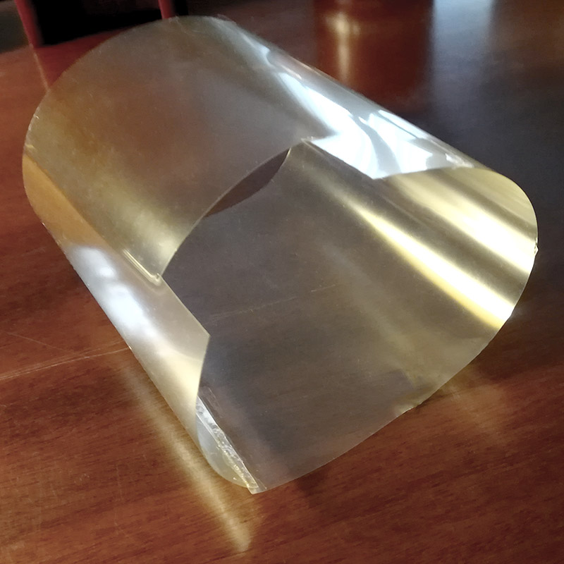

| chapter: Introduction
| section: Start

| theme: dark
| background: ./images/tech-7.jpg
| tint: 0.7
| style: background-position:center;

| cols: 1fr 4fr
| rows: auto
| 3 1
| 3 2

-

<big>

# <big>Spirals</big>

</big>

&nbsp;

<f-next-button title="Start" />

-

---

| sections: Discovering spirals
| theme: dark
| section: Discover spirals

<!-- ## Discovering Spirals

Spiral is a very common shape in nature and in as well as every day life. In the **natural world**, we may find spirals in the DNA double helix, the fingerprint, the flowers, the snails and shells but also in the galaxies, the hurricanes etc. Even the shape of an egg can be seen as a special type of spiral.

Spiral patterns can be also met in parts of **mechanical constructions**: turbines, propellers, screws, drills, springs etc.

**Architects** also use the spirals to shape buildings and components like stairs.

Finally spiral shaped **artworks**, **figures** and **artifacts** are used in every day life objects, even in the ancient time. -->

  <!-- 
 -->
  

    
  ## Dis&shy;cove&shy;ring spirals
  
  Spiral is a very common shape in nature and in as well as every day life. 

  

  

  In the **natural world**, we may find spirals in the DNA double helix, the fingerprint, the flowers, the snails and shells but also in the galaxies, the hurricanes etc. Even the shape of an egg can be seen as a special type of spiral.
  
  

  <f-image src="./images/nature-2.jpg" style="grid-row:span 2" />
  <f-image src="./images/nature-1.jpg"  />
  <f-image src="./images/nature-3.jpg"  />
  <f-image src="./images/nature-4.jpg" />
  <f-image src="./images/nature-6.jpg" style="grid-column:span 2"  />
  <f-image src="./images/nature-5.jpg" />
  <f-image src="./images/nature-7.jpg" />
  <f-image src="./images/nature-9.jpg" />

  

  Spiral patterns can be also met in parts of **mechanical constructions**: turbines, propellers, screws, drills, springs etc.
  
  

  <f-image src="./images/tech-1.jpg" />
  <f-image src="./images/tech-2.jpg" />
  <f-image src="./images/tech-3.jpg" style="grid-row:span 2"  />
  <f-image src="./images/tech-4.jpg" style="grid-column:span 2"  />
  <f-image src="./images/tech-5.jpg" />
  <f-image src="./images/tech-6.jpg" />

  

  **Architects** also use the spirals to shape buildings and components like stairs.
  
  

  <f-image src="./images/architecture-1.jpg" />
  <f-image src="./images/architecture-2.jpg" />
  <f-image src="./images/architecture-9.jpg" />
  <f-image src="./images/architecture-4.jpg" style="grid-row:span 2"  />
  <f-image src="./images/architecture-5.jpg" />
  <f-image src="./images/architecture-6.jpg" />
  <f-image src="./images/architecture-8.jpg" />
  <f-image src="./images/architecture-7.jpg" style="grid-column:span 3" />

  

  Spiral shaped **artworks**, **figures** and **artifacts** are used in every day life objects, even in the ancient time.
  
  

  <f-image src="./images/art-3.jpg" />
  <f-image src="./images/art-4.jpg" style="grid-row:span 2" />
  <f-image src="./images/art-5.jpg" />
  <f-image src="./images/art-6.jpg" />
  <f-image src="./images/art-7.jpg" />
  <f-image src="./images/tech-7.jpg" />
  <f-image src="./images/tech-8.jpg" />

---

| section: Spirals in nature
| theme: light
| 1 1 1 
| 2 3 4
| 5 5 5
| rows: auto

<caption>📺💬 Watch and discuss</caption>

## Spirals in nature

Watch the following videos about the spirals and try answer the questions in the following <a href="./files/worksheet-1-1.pdf" target="_blank">worksheet</a> (pdf)

-

<f-video src="https://www.youtube.com/watch?v=lPOf70xIJyg" />

Spiral in Nature

-

<f-video src="https://www.youtube.com/watch?v=iEnR8zupK0A" />

Demo on Fibonacci Sequence Spirals in Nature – The Golden Ratio

-

<f-video src="https://www.youtube.com/watch?v=aIUu5uMKB70" />

Why Are Most Galaxies Spiral-Shaped?

-

---

| section: Practicing in spreadsheets
| rows: auto
| 1 2
| 3 2

<!-- 2. Working with spirals -->
## Practicing in spreadsheets

Here, you will be able to draw different Archimedean spiral shapes using an Excel spreadsheet. The Excel file contains two spreadsheets: the first labeled “Archimedean Spiral” in which you may type in the basic parameters and draw the corresponding spiral and the second labeled “Explanation” in which you are given the instructions how to setup your own spiral shape in Excel.

<a href="https://spiralsdesignstem.files.wordpress.com/2018/09/spiral-shape-in-excel1.xls" class="tertiary  "><f-arrow-icon rotation="90" />Download spiral shape XSL spreadsheet</a>

-

<f-image src="https://spiralsdesignstem.files.wordpress.com/2018/09/excel1.jpg" style="--image-min-height:40vh; --image-height:40vh;" />
<f-image src="https://spiralsdesignstem.files.wordpress.com/2018/09/excel21.jpg" style="--image-min-height:40vh; --image-height:40vh;" />

<!--  

 -->

-

---

| section: Practicing in Geogebra
| rows: auto 
| cols: 3fr 2fr
| 1 1
| 2 3
| 4 4

## 2D, 3D Spirals in Geogebra

-

Geogebra is a free online math tools for graphing, geometry, 3D modelling etc.

 

<f-inline>

  <f-link to="https://www.geogebra.org/2d" class="button tertiary">Geogebra 2D version</f-link>

  <f-link to="https://www.geogebra.org/3d" class="button tertiary">Geogebra 3D version</f-link>

</f-inline>

 

<f-link to="https://spiralsdesignstem.files.wordpress.com/2018/10/what-is-geogebra.pdf">Short introduction to Geogebra</f-link> (pdf)

In our example Geogebra will be used as a practicing tool for creating 3D spirals.

-

### Geogebra examples

<f-link to="https://www.geogebra.org/m/aKC2MESg">Spiral types in Geogebra</f-link>

#### 3D spiral examples:

Spiral 1: <f-link to="https://www.geogebra.org/m/usfyzvuc">geogebra.org/m/usfyzvuc</f-link>
Spiral 2: <f-link to="https://www.geogebra.org/m/scky7tbf">geogebra.org/m/scky7tbf</f-link>
Spiral 3: <f-link to="https://www.geogebra.org/m/yctfkmjg">geogebra.org/m/yctfkmjg</f-link>
Spiral 4: <f-link to="https://www.geogebra.org/m/jkvcnjpd">geogebra.org/m/jkvcnjpd</f-link>
Screw:    <f-link to="https://www.geogebra.org/m/pdrtw9uv">geogebra.org/m/pdrtw9uv</f-link>

-

---

| 1 1
| 2 3
| rows: auto 1fr

<caption>💻 Exercise</caption>

-

### Task 1

Open the Geogebra application in https://www.geogebra.org/3d

Start practicing in creating 3D spirals, following the instructions of the <f-link to="https://spiralsdesignstem.files.wordpress.com/2018/10/worksheet-spiral.pdf">Worksheet 1</f-link> (PDF)

-

### Task 2

Open the Geogebra application in https://www.geogebra.org/3d

Start practicing in creating 3D spirals, following the instructions of the <f-link to="https://spiralsdesignstem.files.wordpress.com/2018/11/archimedean-spiral-worksheet.pdf">Worksheet 2</f-link> (PDF)

---

| chapter: Basics of trigono­metry
| theme: dark

  # Basics of trigonometry and polar coordinates
  
   

  
  

---

<!-- 3. Background -->

| section: Orthogonal triangle
| cols: 3fr 2fr
| 1 3
| 2 3
| 4 4

<caption>Basics of trigonometry and polar coordinates</caption>

## Basics of trigonometry

-

In order to design a spiral you first need to recall the basic knowledge from trigonometry, a know the basic notation of trigonometry which is the branch of mathematics dealing with the **relations of the sides and angles of triangles**.

### The sides of an orthogonal triangle

Assume that there is an orthogonal triangle (a triangle with one angle equal to 90°). The side that is always opposite to the right angle is called <f-math inline red>**hypotenuse**</f-math>. This is the longest side in the orthogonal triangle.

If we choose an angle <f-math inline>θ</f-math> other the right angle, the side that lies opposite to it is called <f-math inline blue>opposite</f-math>. The third angle, not in the opposite side is called <f-math inline green>adjacent</f-math> sides. Let's call the sides <f-math inline green>a</f-math>, <f-math inline blue>b</f-math> and <f-math inline red>c</f-math>.

The length of the three sides <f-math inline green>a</f-math>, <f-math inline blue>b</f-math> and <f-math inline red>c</f-math> of an orthogonal triangle are linked with **Pythagorean equation**

<f-math>\color{blue}a^2 \color{black}+ \color{green}b^2 \color{black}= \color{red}c^2</f-math>

This equation states that **the square of the hypotenuse** (the side opposite the right angle) is equal to **the sum of the squares of the other two sides**.

-

  <f-scene responsive style="max-width:600px;">
    <defs>
    <marker id="arrow" viewBox="0 0 10 10" refX="5" refY="5"
      markerWidth="5" markerHeight="5"
      orient="auto-start-reverse" fill="lightgray" >
        <path d="M 0 0 L 10 5 L 0 10 z" />
    </marker>
    </defs>
    <f-group position="0.4 0">
      <f-arc position="-1.5 -1" start-angle="90" end-angle="130" r="0.4" inner-radius="0.4" stroke-width="2" />
      <f-line points="-1.5 -1, 1 -1"  :stroke="color('green')" />
      <f-line points="1 -1, 1  1"     :stroke="color('blue')" />
      <f-line points="1 1, -1.5 -1"     :stroke="color('red')" />
      <f-box r="0.2" position="0.9 -0.9" strokeWidth="2" />
      <polyline points="-1.05,-0.85 0.85,-0.1" fill="none" stroke="lightgray" stroke-width="0.02" stroke-dasharray="0.04" marker-end="url(#arrow)" />
      <polyline points="0.9,-0.9 -0.2,-0.1" fill="none" stroke="lightgray" stroke-width="0.02" stroke-dasharray="0.04" marker-end="url(#arrow)" />
      <f-text :fill="color('red')" position="-0.6 0.5">Hypotenuse:c</f-text>
      <f-text :fill="color('green')" position="-0.2 -1.3">Adjascent:a</f-text>
      <f-text :fill="color('blue')" position="1.3 0" rotation="90">Opposite:b</f-text>
      <f-text position="-1.5 -0.8" style="font-size:120%">θ</f-text>
    </f-group>
  </f-scene>

-

 

---

| section: Trigonometric Ratios
| cols: 3fr 2fr
| 1 2
| 3 4
| 5 5

<caption>Basics of trigonometry and polar coordinates</caption>

## Trigonometric Ratios

The ratios (fractions) of the sides a, b and c  of an orthogonal right triangle are called trigonometric ratios. Three common trigonometric ratios are the sine (**sin**), cosine (**cos**), and tangent (**tan**). For any angle θ such that of the triangle in Figure 1, these are defined for as follows:

<f-math>sin(θ) = \frac{\color{blue}Opposite}{\color{red}Hypotenuse} = \frac{\color{blue}b}{\color{red}c}</f-math><f-math>cos(θ) = \frac{\color{green}Adjascent}{\color{red}Hypotenuse} = \frac{\color{green}a}{\color{red}c}</f-math><f-math>tan(θ) = \frac{\color{blue}Opposite}{\color{green}Adjascent} = \frac{sin θ}{cos θ} = \frac{\color{blue}b}{\color{green}a}</f-math>

To remember these definitions, note the following:

<f-math>Sine = \frac{\color{blue}Opposite}{\color{red}Hypotenuse}</f-math><f-math>Cosine = \frac{\color{green}Adjascent}{\color{red}Hypotenuse}</f-math><f-math>Tangent = \frac{\color{blue}Opposite}{\color{green}Adjascent}</f-math>

By applying the Pythagorean equation to the trigonometric ratios derives that, for any angle θ in an orthogonal triangle holds

<f-math>sin^2(θ) + cos^2(θ) = 1</f-math>

-

  <f-scene responsive style="max-width:600px;">
    <defs>
    <marker id="arrow" viewBox="0 0 10 10" refX="5" refY="5"
      markerWidth="5" markerHeight="5"
      orient="auto-start-reverse" fill="lightgray" >
        <path d="M 0 0 L 10 5 L 0 10 z" />
    </marker>
    </defs>
    <f-arc position="-1.5 -1" start-angle="90" end-angle="130" r="0.4" inner-radius="0.4" stroke-width="2" />
    <f-line points="-1.5 -1, 1 -1"  :stroke="color('green')" />
    <f-line points="1 -1, 1  1"     :stroke="color('blue')" />
    <f-line points="1 1, -1.5 -1"     :stroke="color('red')" />
    <f-box r="0.2" position="0.9 -0.9" strokeWidth="2" />
    <polyline points="-1.05,-0.85 0.85,-0.1" fill="none" stroke="lightgray" stroke-width="0.02" stroke-dasharray="0.04" marker-end="url(#arrow)" />
    <polyline points="0.9,-0.9 -0.2,-0.1" fill="none" stroke="lightgray" stroke-width="0.02" stroke-dasharray="0.04" marker-end="url(#arrow)" />
    <f-text :fill="color('red')" position="-0.6 0.5">Hypotenuse:c</f-text>
    <f-text :fill="color('green')" position="-0.2 -1.3">Adjascent:a</f-text>
    <f-text :fill="color('blue')" position="1.3 0" rotation="90">Opposite:b</f-text>
    <f-text position="-1.5 -0.8" style="font-size:120%">θ</f-text>
  </f-scene>

-

### Example

Let the triangle <f-math inline>ABC</f-math> be with sides 3, 4 and 5.

In the above triangle <f-math inline>ABC</f-math>, the trigonometric ratios of the angle <f-math inline>A</f-math> are calculated:

<f-math>sin(A) = \frac{\color{blue}CB}{\color{red}AB} = \frac{\color{blue}3}{\color{red}5} = 0.6</f-math><f-math>cos(A) = \frac{\color{green}AC}{\color{red}AB} = \frac{\color{green}4}{\color{red}5} = 0.8</f-math><f-math>tan(A) = \frac{\color{blue}CB}{\color{green}AC} = \frac{\color{blue}3}{\color{green}4} = 0.75</f-math>

or by using the values of <f-math inline>sin(A)</f-math> and <f-math inline>cos(A)</f-math> 

<f-math>tan(A) = \frac{sin(A)}{cos(A)} = \frac{0.6}{0.8} = 0.75</f-math>

In this example we can verify that 

<f-math>\color{red}AB\color{black}^2 = \color{green}AC\color{black}^2 + \color{blue}BC\color{black}^2 or</f-math><f-math>\color{red}5\color{black}^2 = \color{green}4\color{black}^2 + \color{blue}3\color{black}^2 or</f-math><f-math>\color{red}25\color{black} = \color{green}16\color{black} + \color{blue}9\color{black}</f-math>

<!--  -->

Moreover,  

<f-math inline>sin^2(A) + cos^2(A) = 1 </f-math> or <f-math inline>0.6^2 + 0.8^2 = 0.36 + 0.64 = 1</f-math>

<!--  -->

-

  <f-scene responsive style="max-width:550px;">
    <f-arc position="-1.5 -1" start-angle="90" end-angle="125" r="0.4" inner-radius="0.4" stroke-width="2" />
    <f-line points="-1.5 -1, 1.5 -1"  :stroke="color('green')" />
    <f-line points="1.5 -1, 1.5  1.25"     :stroke="color('blue')" />
    <f-line points="1.5 1.25, -1.5 -1"     :stroke="color('red')" />
    <f-box r="0.2" position="1.4 -0.9" strokeWidth="2" />
    <f-text :fill="color('red')" position="0 0.4">5</f-text>
    <f-text :fill="color('green')" position="0 -1.3">4</f-text>
    <f-text :fill="color('blue')" position="1.3 0">3</f-text>
    <f-text position="-1.6 -1.2">A</f-text>
    <f-text position="1.6 1.3">B</f-text>
    <f-text position="1.6 -1.2">C</f-text>
  </f-scene>

<!--  -->

-

 

---

| section: Cartesian and Polar Coordinates

| section: Cartesian / polar coordinates
| 1 1
| 2 3
| 4 5
| 6 7
| 8 7

<f-value set="activePoint" :value="[ 1.5, 1 ]" />
<f-value set="polarAngle" :value="angleBetweenPoints( 0, 0, 1.5, 1 )" />
<f-value set="polarDistance" :value="distanceBetweenPoints( 0, 0, 1.5, 1 )" />

<caption>Basics of trigonometry and polar coordinates</caption>

## Cartesian and polar coordinates 

-

### Cartesian coordinates

Any point in the plane can be defined by its coordinates <var>X</var> and <var>Y</var> – a pair of numbers denoting the distances from two perpendicular lines: the horizontal line <var>(x-axis)</var> and the vertical line <var>(y-axis)</var>. For example, in the next figure the coordinates of the point can be defined as a pair of numbers, where <var>X={{parseFloat(get('activePoint', [])[0]).toFixed(2)}}</var> and <var>Y={{parseFloat(get('activePoint', [])[1]).toFixed(2)}}</var>. These are called <var>Cartesian coordinates</var> of a point.

<f-table :rows="[
  {
  	X: parseFloat(get('activePoint',[])[0]).toFixed(3),
    Y: parseFloat(get('activePoint',[])[1]).toFixed(3),
  },
]" />

-

<f-scene responsive v-slot="{ mouse }" style="max-width:600px;">
  <f-group position="0 0" scale="1" 
  v-on:click.native="set('activePoint', [mouse.x, mouse.y]);set('polarAngle', angleBetweenPoints(0, 0, get( 'activePoint', [])[0], get('activePoint', [])[1])); set('polarDistance', distanceBetweenPoints(0, 0, get( 'activePoint', [])[0], get('activePoint', [])[1]));">
    <f-box r="6" fill="white" />
    <f-grid />
    <f-text v-for="(tx,i) in range(-1.5, 1.5, 0.5)" :position="[tx, -1.95]" scale="0.4">{{tx.toFixed(1)}}</f-text>
    <f-text v-for="(ty,i) in range(-1.5, 1.5, 0.5)" :position="[-1.85, ty-0.025]" scale="0.4" text-anchor="left">{{ty.toFixed(1)}}</f-text>
    <f-line :points="[[get( 'activePoint', [])[0], 0], [get( 'activePoint', [])[0], get('activePoint', [])[1]]]" strokeWidth="2" :stroke="color('red')" />
    <f-line :points="[[0, get('activePoint', [])[1]], [get( 'activePoint', [])[0], get('activePoint', [])[1]]]" strokeWidth="2" :stroke="color('red')" />
    <f-circle
  	  :x="get( 'activePoint', [])[0]"
      :y="get('activePoint', [])[1]"
      :r="0.075"
      :fill="color('darkgray')"
      stroke
    />
    <f-circle
  	  :x="mouse.x"
      :y="mouse.y"
      :r="mouse.pressed ? 0.05 : 0.035"
      :fill="color('darkgray')"
      stroke
    />
    <f-text :position="[get('activePoint',[])[0]/2, get('activePoint',[])[1]+0.075 ]" scale="0.75" :fill="color('red')">x</f-text>
    <f-text :position="[get('activePoint',[])[0]+0.1, get('activePoint',[])[1]/2 ]" scale="0.75" :fill="color('red')">y</f-text>
  </f-group>
</f-scene>

<!-- <f-image src="https://spiralsdesignstem.files.wordpress.com/2018/09/plane11.jpg" style="--image-size:contain; --image-height:30vh;" /> -->

-

### Polar coordinates

However, in many cases such that of drawing a spiral, a different expression is needed. One may notice that instead of using (x, y) as the coordinates of point, the **distance from the zero point <var>r</var> and the angle <var>θ</var>** may equivalently be used. This means that the position of any point in the plane can be described by the pair (r, θ). These are called <var>Polar coordinates</var> of a point.

<f-table :rows="[
  {
  	θ: parseFloat(get('polarAngle')).toFixed(3) + '°',
    r: parseFloat(get('polarDistance')).toFixed(3)
  }
]" />

-

<f-scene responsive v-slot="{ mouse }" style="max-width:600px;">
  <f-group position="0 0" scale="1" 
  v-on:click.native="set('activePoint', [mouse.x, mouse.y]);set('polarAngle', angleBetweenPoints(0, 0, get( 'activePoint', [])[0], get('activePoint', [])[1])); set('polarDistance', distanceBetweenPoints(0, 0, get( 'activePoint', [])[0], get('activePoint', [])[1]));">
    <f-box r="6" fill="white" />
    <f-circle :stroke="color('gray')" stroke-width="0.5" :r="get('polarDistance')"  />
    <f-arc start-angle="0" :end-angle="get('polarAngle',0)" rotation="90" :r="get('polarDistance')-get('polarDistance')*0.4" inner-radius="0" :stroke="color('blue')" stroke-width="1" :fill="color('lightyellow')" opacity="0.5" />
    <f-grid />
    <!-- <f-text v-for="(tx,i) in range(-1.5, 1.5, 0.5)" :position="[tx, -1.95]" scale="0.4">{{tx.toFixed(1)}}</f-text>
    <f-text v-for="(ty,i) in range(-1.5, 1.5, 0.5)" :position="[-1.85, ty-0.025]" scale="0.4" text-anchor="left">{{ty.toFixed(1)}}</f-text> -->
    <f-text v-for="tr in range(0, 360, 90)" :position="polarxy(tr, 1.9)" scale="0.4" text-anchor="left">{{(-90+tr).toFixed(0)}}°</f-text> -->
    <f-line :points="[[0,0], polarxy(get('polarAngle')+(90), get('polarDistance')) ]" strokeWidth="2" :stroke="color('blue')" />
    <f-circle
  	  :x="get( 'activePoint', [])[0]"
      :y="get('activePoint', [])[1]"
      :r="0.075"
      :fill="color('darkgray')"
      stroke
    />
    <f-circle
  	  :x="mouse.x"
      :y="mouse.y"
      :r="mouse.pressed ? 0.05 : 0.035"
      :fill="color('darkgray')"
      stroke
    />
    <f-text :position="polarxy(get('polarAngle')+( get('polarAngle') > -90 && get('polarAngle') < 90 ? 100 : 80), get('polarDistance')*0.5)" scale="0.75" :fill="color('blue')" style="mix-blend-mode:multiply;">r</f-text>
    <f-text :position="polarxy((get('polarAngle')*0.5)+90, 0.15)" scale="0.75" :fill="color('blue')" style="mix-blend-mode:multiply;">θ</f-text>
  </f-group>
</f-scene>

-

### Cartesian and Polar coordinates

> Cartesian and Polar coordinates are equivalent and can be converted from one type to another.

<f-table :rows="[
  {
  	Cartesian: 'X: ' + parseFloat(get('activePoint',[])[0]).toFixed(3),
    Polar: 'θ: ' + parseFloat(get('polarAngle')).toFixed(3) + '°'
  },
  {
  	Cartesian: 'Y: ' + parseFloat(get('activePoint',[])[1]).toFixed(3),
    Polar: 'r: ' + parseFloat(get('polarDistance')).toFixed(3)
  }
]" />

-

<f-scene responsive v-slot="{ mouse }" style="max-width:600px;">
  <f-group position="0 0" scale="1" v-on:click.native="set('activePoint', [mouse.x, mouse.y]);set('polarAngle', angleBetweenPoints(0, 0, get( 'activePoint', [])[0], get('activePoint', [])[1])); set('polarDistance', distanceBetweenPoints(0, 0, get( 'activePoint', [])[0], get('activePoint', [])[1]));">
    <f-box r="6" fill="white" />
    <f-circle :stroke="color('gray')" stroke-width="0.5" :r="get('polarDistance')"  />
    <f-arc start-angle="0" :end-angle="get('polarAngle',0)" rotation="90" :r="get('polarDistance')-get('polarDistance')*0.4" inner-radius="0" :stroke="color('blue')" stroke-width="1" :fill="color('lightyellow')" opacity="0.5" />
    <f-grid />
    <f-text v-for="(tx,i) in range(-1.5, 1.5, 0.5)" :position="[tx, -1.95]" scale="0.4">{{tx.toFixed(1)}}</f-text>
    <f-text v-for="(ty,i) in range(-1.5, 1.5, 0.5)" :position="[-1.85, ty-0.025]" scale="0.4" text-anchor="left">{{ty.toFixed(1)}}</f-text>
    <f-text position="1.92 0.02" scale="0.4" text-anchor="right">0°</f-text>
    <f-line :points="[[get( 'activePoint', [])[0], 0], [get( 'activePoint', [])[0], get('activePoint', [])[1]]]" strokeWidth="2" :stroke="color('red')" />
    <f-line :points="[[0, get('activePoint', [])[1]], [get( 'activePoint', [])[0], get('activePoint', [])[1]]]" strokeWidth="2" :stroke="color('red')" />
    <f-line :points="[[0,0], polarxy(get('polarAngle')+(90), get('polarDistance')) ]" strokeWidth="2" :stroke="color('blue')" />
    <f-circle
  	  :x="get( 'activePoint', [])[0]"
      :y="get('activePoint', [])[1]"
      :r="0.075"
      :fill="color('darkgray')"
      stroke
    />
    <f-circle
  	  :x="mouse.x"
      :y="mouse.y"
      :r="mouse.pressed ? 0.05 : 0.035"
      :fill="color('darkgray')"
      stroke
    />
    <f-text :position="[get('activePoint',[])[0]/2, get('activePoint',[])[1]+0.075 ]" scale="0.75" :fill="color('red')">x</f-text>
    <f-text :position="[get('activePoint',[])[0]+0.1, get('activePoint',[])[1]/2 ]" scale="0.75" :fill="color('red')">y</f-text>
    <f-text :position="polarxy(get('polarAngle')+( get('polarAngle') > -90 && get('polarAngle') < 90 ? 100 : 80), get('polarDistance')*0.5)" scale="0.75" :fill="color('blue')" style="mix-blend-mode:multiply;">r</f-text>
    <f-text :position="polarxy((get('polarAngle')*0.5)+90, 0.15)" scale="0.75" :fill="color('blue')" style="mix-blend-mode:multiply;">θ</f-text>
  </f-group>
</f-scene>

-

<f-next-button />

---

| section: Calculation of polar coordinates
| cols: 3fr 2fr
| 1 1
| 2 3
| 4 3
| 5 5

<caption>Basics of trigonometry and polar coordinates</caption>

## Calculation of polar coordinates

-

#### 1. Find the Polar coordinates from Cartesian coordinates

Assume that a point A(3,4) is given. According to the next figure, the grey triangle is orthogonal with opposite and adjacent sides equal to y=4 and x=3, respectively.

The **hypotenuse is the distance r** and can be estimated by applying the Pythagorean equation as

<f-math>\color{red}r^2 \color{black} = \color{blue}x^2 \color{blaxk}+ \color{green}y^2 \color{black}= \color{blue}3^2 \color{black}+ \color{green}4^2 \color{black}= \color{blue}9 \color{black}+ \color{green}16 \color{black}= 25</f-math><f-math>\color{red}r \color{black}= \sqrt{25} = 5</f-math>

<!--  -->

From the same triangle, **angle θ can be estimated** indirectly in terms of the tan(θ) ratio.

Indeed

<f-math>tan(θ) = \frac{\color{green}y}{\color{blue}x} = \frac{\color{green}4}{\color{blue}3} = 1.33</f-math><f-math>θ = tan^{-1}(1.33) = 53.06\degree</f-math>

<!--  -->

👉Note the value of θ derives by the **inverse function of tangens** (tan-1). Any typical scientific calculator includes this option.

-

<f-scene responsive style="position:sticky; top:25vh; max-width:600px;">
  <defs>
    <marker id="arrow" viewBox="0 0 10 10" refX="5" refY="5"
      markerWidth="5" markerHeight="5"
      orient="auto-start-reverse" fill="lightgray" >
        <path d="M 0 0 L 10 5 L 0 10 z" />
    </marker>
    </defs>
    <polyline points="0,-1.9 0,1.9" fill="none" stroke="lightgray" stroke-width="0.02" stroke-dasharray="0.04" marker-end="url(#arrow)" />
    <polyline points="-1.9,0 1.9,0" fill="none" stroke="lightgray" stroke-width="0.02" stroke-dasharray="0.04" marker-end="url(#arrow)" />
    <f-circle r="1.5" strokeWidth="1" :stroke="color('gray')" />
    <f-polygon :points="[ [0,0], polarxy(90,0.75), polarxy(150, 1.5) ]" :fill="color('yellow')" stroke opacity="0.6" />
    <f-line points="0 0, 0 1.31" :stroke="color('green')" />
    <f-polygon :points="[ [0,0], polarxy(90,0.75), polarxy(150, 1.5) ]" strokeWidth="1" />
    <f-box r="0.1" position="0.7 0.05" strokeWidth="1" />
    <f-line points="0 0, 0.75 0" :stroke="color('blue')" />
    <f-line :points="[[0,0],polarxy(150, 1.5)]" :stroke="color('red')" />
    <f-arc position="0 0" start-angle="90" end-angle="150" r="0.45" inner-radius="0.45" stroke-width="1" />
    <f-text :position="polarxy(140,1.9)" scale="0.75">A(x:3,y:4)</f-text>
    <f-text position="-0.1 0.6" :fill="color('green')" rotation="90" scale="0.75">r⋅sin(θ)</f-text>
    <f-text position="0.4 -0.25" :fill="color('blue')" scale="0.75">r⋅cos(θ)</f-text>
    <f-text :position="polarxy(155, 0.75)" :fill="color('red')" scale="0.75">r</f-text>
    <f-text position="0.22 0.07" scale="0.75">θ</f-text>
    <f-text position="1.9 0.1" scale="0.75">x</f-text>
    <f-text position="0.15 1.85" scale="0.75">y</f-text>
    
</f-scene>

<!--  -->

-

#### 2. From Polar to Cartesian coordinates

Following the previous example, assume now that the point A is known by its polar coordinates (5, 53.06°). Its Cartesian coordinates derive by applying the trigonometric ratios cos() and sin() as follows.

<f-math>cos(θ) = \frac{\color{blue}x}{\color{red}r}</f-math><f-math>{\color{blue}x} = {\color{red}r} \cdot cos(θ) = {\color{red}5} \cdot cos(53.06\degree) = {\color{red}5} \cdot 0.6 = \color{blue}3</f-math><f-math>sin(θ) = \frac{\color{green}y}{\color{red}r}</f-math><f-math>{\color{green}y} = {\color{red}r} \cdot sin(θ) = {\color{red}5} \cdot sin(53.06\degree) = {\color{red}5} \cdot 0.8 = \color{green}4</f-math>

<!--  -->

-

---

| chapter: Math of Archimedean spirals

| chapter: 2D / 3D Archi­medean spirals
| theme: dark

  # Mathematics of 2D and 3D Archimedean spirals

  This section will help you understand the mathematics and particular the equations and formulas from which 2D and 3D spirals derive.

   

  
  

---

| section:  2D Archimedean spirals
| cols: 2fr 1fr 2fr
| 1 1 1
| 2 4 5
| 3 4 5
| 6 6 6

<caption>Mathematics of 2D and 3D Archimedean spirals</caption>

## Equations of 2D Archimedean spirals

-

Assume that a point is described by its polar coordinates (r, θ). Remember that r is the radius, the distance of the point from the center of the axes and θ is the angle formed between the radius and x axis (see next figure).

-

<f-image src="https://spiralsdesignstem.files.wordpress.com/2018/09/spiral2d-2.jpg?w=300&h=261" style="--image-size:contain; --image-height:35vh; " />

<!--  -->

-

Now, image what happens if the angle θ gradually increases from the zero degrees (θ=0º) to θ=90º and then to θ=180º up to θ=360º. If the radius *r* remains constant, the corresponding point will move along the blue circle. This is the basic movement to produce a circular shape.

-

Lets simulate this:

<f-slider set="circleProgress" value="0" to="360" title="θ" />

<f-scene grid responsive style="max-width:600px;">
  <f-circle r="1.5" strokeWidth="1" :stroke="color('blue')" />
  <f-group rotation="90">
    <!-- <f-line :points="[[0,0], polarxy(get('circleProgress'),1.5) ]" /> -->
    <f-arc r="1.5" inner-radius="0" :stroke="color('red')" start-angle="0" :end-angle="get('circleProgress', 0)" stroke-width="2" />
    <f-circle r="0.1" :stroke="color('red')" :position="polarxy( get('circleProgress', 0), 1.5)"  />
  </f-group>
  <f-text :position="polarxy( get('circleProgress', 0)+90, 1.75)">r</f-text>
  <f-text position="0 0.1">θ={{Math.round(get('circleProgress', 0))}}°</f-text>
</f-scene>

-

---

| gap: 7vh 5vw
| 1 1
| 2 3
| 4 5
| 6 6

<caption>Mathematics of 2D and 3D Archimedean spirals</caption>

## Equations of 2D Archimedean spirals

-

In the previous movement, if we assume that **r is not constant** but changes gradually as the angle θ ranges from 0º to 360º, then we get a **perfect spiral shape**.

To draw an Archimedian spiral, two basic parameters need to define:

- the starting point on the x axis (lets call it **α**) and
- the distance **d** between two consecutive lines of the spiral.

<f-slider 
    title="α"
    :value="150" 
    set="radius"
    from="0"
    to="200" 
/>
<f-slider 
    title="d"
    :value="0" 
    set="padding"
    from="0"
    to="100" 
/>
<f-slider 
    title="Active point"
    :value="0" 
    set="active"
    from="0"
    to="180"
    :step="1" 
/>

The most usual case of an Archimedian spiral is that when the spiral shape begins from the beginning of the axes x and y. In such a case α=0.

-

<f-artboard responsive grid width="600" height="400">
  <g transform="translate(300 200)">
    <Spiral :cycles="5" :padding="get('padding', 0)" :startX="get('radius', 100)" :activePoint="get('active', 0)" :info="false" />
  </g>
</f-artboard>

-

<!--  -->

**Any point (x,y) of the plane belongs to a spiral shape if satisfies the following equations**

<f-math>x = r \cdot cos(θ)</f-math><f-math>y = r \cdot sin(θ)</f-math><f-math>r = a + \frac{d}{2π} \cdot θ</f-math><f-math>θ = 0°...360°</f-math>

Note that π is the well known PI number equal to 3.14159.

The following figure, explains the above equations in terms of the polar coordinates explained in the previous section.

<!--  -->

> Based on the above equations, any flat, 2D Archimedian spiral can be drawn if the angle θ ranges from 0º to 360º, and for every single value in that range, the coordinates  x and y are calculated and the corresponding point (x,y) in plotted in the plane.

-

<!-- <f-image src="https://spiralsdesignstem.files.wordpress.com/2018/09/spiral2d-1.jpg?w=1024&h=671" style="--image-size:contain; --image-min-height:40vh" /> -->

<f-artboard responsive width="600" height="400">
<defs>
<marker id="arrow" viewBox="0 0 10 10" refX="9" refY="5"
    markerWidth="3" markerHeight="3"
    orient="auto-start-reverse" :fill="color('darkgray')" >
    <path d="M 0 0 L 10 5 L 0 10 z" />
  </marker>
  </defs>
  <g transform="translate(300 200)">
    <Spiral :cycles="3" :padding="60" :startX="150" activePoint="6" :info="false" :triangle="true" />
    <f-line :points="[ [0,30], [polarx(90, 150), polary(90, 150)+30] ]" stroke-width="3" marker-end="url(#arrow)" marker-start="url(#arrow)" />
    <f-line :points="[ [polarx(90,150), 0], [polarx(90, 210), 0] ]" stroke-width="3" marker-end="url(#arrow)" marker-start="url(#arrow)" />
    <f-text position="45 -5" scale="1.5">x</f-text>
    <f-text position="90 -60" scale="1.5">y</f-text>
    <f-text position="30 -70" scale="1.5">r</f-text>
    <f-text position="80 50" scale="1.5">α</f-text>
    <f-text position="180 20" scale="1.5">d</f-text>
  </g>
</f-artboard>

-

---

| section: Mathematics of 3D spirals

| cols: 3fr 2fr
| 1 1
| 2 3
| 4 4

<caption>Mathematics of 2D and 3D Archimedean spirals</caption>

## Equations of 3D spirals

-

The equations of a 3D spiral or helix are similar to those presented before.

In three dimensions we assume that a **third axis z denoting the height** is added to the plane. For that new axis and the two horizontal (x and y), the equations are as follows:

<f-math>x = R \cdot cos(t)</f-math><f-math>y = R \cdot sin(t)</f-math><f-math>z = c \cdot t</f-math><f-math>t = {0...2\pi}  =  {0\degree...360\degree}</f-math>

<!--  -->

In the above equations, **R** represents the radius of the cycle in the plane X-Y and **t** varies between 0 and 2π in the right-hand direction full cycle. The factor **c** is constant so the value **2πc** denotes the vertical separation of the helix’s loop.

<!-- Next figure presents the shape of a helix drawn in the three dimensions. -->

-

<f-slider set="t" from="0" to="0.2" step="0.02" value="0" title="t" />
<f-slider set="rad" from="0.2" to="1.8" step="0.1" value="1" title="R" />
<f-slider set="rot" to="360" step="1" value="20" title="Rotate spiral" />

<f-scene3 responsive isometric style="max-width:700px">
  <f-group3 :rotation="[60, 0, get('rot', 20)]" :key="get('t', 0)">
  <f-point3 :key="get('rad')"
    :points="range(-10,10,0.1).map(x => [get('rad', 1)*Math.cos(x),get('rad', 1)*Math.sin(x),x*get('t',0)])"
    :stroke="color('gray')"
  />
  </f-group3>
</f-scene3>

-

---

| chapter: 3D design
| section: Some tools and platforms

| chapter: Spirals and design
| section: 3D design
| 1 1
| 2 3
| 4 3

## 3D design

In this section you can use a 3D Design software to produce objects relevant to spirals or search the internet to find 3D Models online.

-

#### Find objects online

You can find and download 3D Models by visiting the webpages below:

* <f-link to="https://www.thingiverse.com/">www.thingiverse.com</f-link>
* <f-link to="https://www.youmagine.com/">www.youmagine.com</f-link>

**Find a 3D Model you like by visiting the above websites.**

1. Download the files of the 3D Model you selected.
2. Extract the .zip file of the 3D Model after you download it.
3. What are the files extensions?
4. Are these extensions known to you?
5. What the .stl file stands for?

-

#### Design your own objects

Use the online **Tinkercad software**, available at: <f-link to="http://www.tinkercad.com">www.tinkercad.com</f-link> and try to complete the tasks of the following pdf worksheets.

<f-link to="https://spiralsdesignstem.files.wordpress.com/2018/09/worksheet-1.pdf">Worksheet 1</f-link> – Create a simple 3D Spiral Shape – Clockspring

<f-link to="https://spiralsdesignstem.files.wordpress.com/2018/09/worksheet-2.pdf">Worksheet 2</f-link> – Implement a 2D Spiral shape and transform it into a 3D Spiral Shape

<f-link to="https://spiralsdesignstem.files.wordpress.com/2018/09/worksheet-3.pdf">Worksheet 3</f-link> – Create a simple Screw with Spiral Shapes

<f-link to="https://spiralsdesignstem.files.wordpress.com/2018/09/worksheet-4.pdf">Worksheet 4</f-link> – Create a Helical Compression Spring

-

---

| chapter: Designing a cylinder product
| section: Dice games

| section: Let's play dice!
| padding: 0
| 1 2 
| 3 2 
 
 <section>

## 🎲 Let's play dice!

#### **Dice games**
  
Dice games are board games that you play with a dice. The Backgammon, Chuck-a-Luck (Bird cage), Ludo etc are examples of dice games. A list of several dice games can be found at <f-link to="http://www.dice-play.com/GamesAZ.htm">dice-play.com/GamesAZ.htm</f-link>
  
Dice games are based on rules according to which a player throws the dice and depending on the result, an action is performed. In these games the random outcome of the dice is very important. The dice must have **enough space** to roll several times so to end up randomly to their final position.

 </section>

-

<f-image src="./images/dice-game.jpg" style="--image-min-height:40vw;" />

-

<f-notes title="Credits">

https://www.pexels.com/photo/blur-board-game-business-challenge-278918/

</f-notes>

---

| section: The design problem
| 1 2
| 3 2
| padding: 0

<section>

  
## The design problem

There's often not enough space to throw the dice – it often ends up under a couch or punches other game pieces all over the place.

Can we come up with a solution, that would:

1. be easy to use
2. allow one more dice roll down simultaneously
3. assure the random outcome of the dice
4. save space
5. be fair – the players should not to be able to manipulate the outcome.

</section>

-

  <f-image src="./images/dice-throw.jpg" style="--image-min-height:50vh; --image-position:5% center" />

-

<f-notes title="Credits">

https://www.goodfreephotos.com/other-photos/Gambling-game-in-a-casino.jpg.php

</f-notes>

---

| section: The design solution
| 1 2
| 3 2
| padding: 0

<section>

## The design solution

Such dice throwing objects has been previously designed and sold. For example in the e-shop <f-link to="https://www.etsy.com/search?q=dice%20tower">Etsy.com</f-link> you find different implementations of the basic vertical dice throwing idea. They are made of different materials (plastic, wood, paper etc.), shapes (tower, folding boxes, spiral cylinders etc.)

A dice-tower – i.e. a cylinder that when the player lets the dice from the top, it will let them go down rolling and let them exit at the bottom level.

The problem of the dice-cylinder is to think, design and implement a rolling path for the dice within the cylinder so to let them move and roll sufficient distance, greater than the height of the cylinder, so to ensure the random dice outcome. Moreover, the movement of the dice should be smooth, without obstacles and such to ensure that they will not stick in an intermediate position and come down directly.

</section>

-

<f-image src="./images/dice-tower.jpg" style="--image-min-height:50vh" />

-

<f-notes title="Credits">

https://www.etsy.com/listing/692902098/dice-tower-board-game

</f-notes>

---

| section: Directions for the design
| 1 2
| 3 2
| padding: 0

<section>

  
## Directions for the design
  
To solve such a problem, consider the spiral theory. The path that follows the dice down to the exit of the cylinder may be a helix tube or a round staircase. Focusing to the case of the spiral stairs, several questions may arise:

- Why such a helix staircase might be an efficient structure in terms of space capacity and length of the rolling path?
- Given of some parameters such the height, the number of spirals, and the diameter of the cylinder base how the helix staircase can be designed? How long should be the helix path? How many stairs can be used in the specific cylinder height?
  
Look at the metallic stairs. You notice the round tube-shaped central column and the stairs linked to it. The most important characteristics of this stair is the helix shape.

</section>

-

<f-image src="./images/dice-stairs.jpg" />

-

<f-notes title="Credits">

  #### Image sources:

  https://pxhere.com/en/photo/1556977 

</f-notes>

---

| chapter: Dice Cylinder
| section: The helix within a cylinder
| gap: 8vmin
| 1 1
| 2 3
| 4 5
| 6 6

## The Dice Cylinder 

### The helix within a cylinder

But how can one easily design such a helix? Consider the following example.

-

#### 1.

Get a rectangular piece of paper and draw its diagonal with a pencil. Try to bend the paper so to gradually form a cylinder, a tube. Then, you may notice that the round shape automatically transforms the diagonal line to a helix! This helix line will be the basic direction for the stairs to be linked. Further note that this is a simple, one spiral helix.

<!-- {{ range(-1,1,0.2).map( x => [Math.sin(x),Math.cos(x)]) }} -->

<f-scene responsive width="600" height="200">
  <f-group position="-4 0">
    <f-box width="4" height="3" :fill="color('lightgray')" stroke />
    <f-line points="-2 1.5, 2 -1.5" :stroke="color('red')" strokeWidth="2" />
  </f-group>
  <f-group position="0.75 0">
    <f-box width="2" height="3" :fill="color('lightgray')" stroke />
    <!-- <f-line points="-1 1.47, -0.85 1, -0.6 0.5, 0 0, 0.6 -0.5, 0.85 -1, 1 -1.5" :stroke="color('red')" curved strokeWidth="2" /> -->
    <f-circle r="1" :fill="color('white')" scale="1 0.3" position="0 1.5" stroke />
    <!-- <f-line :points="range(-Math.PI,Math.PI,0.5).map(x => [Math.cos(x), 1.5 - ( Math.sin(x) * Math.cos(x) ) ])" curved :stroke="color('red')"  /> -->
    <path d="M -1 1.4 Q -1 0.2, 0 0 T 1 -1.4" :stroke="color('red')" stroke-width="0.04" fill="none" />
    <f-circle r="1" :fill="color('lightgray')" scale="1 0.3" position="0 -1.5" stroke />
  </f-group>
  <f-group position="4 0">
    <f-box width="1" height="3" :fill="color('lightgray')" stroke />
    <f-circle r="0.5" :fill="color('lightgray')" scale="1 0.6" position="0 -1.5" stroke />
    <!-- <f-line points="-0.5 1.47, -0.25 0.9, 0.3 0.4, 0.5 0.3" :stroke="color('red')" strokeWidth="2" curved /> -->
    <!-- <f-line points="-0.5 1.47, -0.25 0.9, 0.3 0.4, 0.5 0.3" position="0 -1.8" :stroke="color('red')" strokeWidth="2" curved /> -->
    <path d="M -0.5 1.45 Q -0.4 0.2, 0.5 0.3" :stroke="color('red')" stroke-width="0.04" fill="none" />
    <path d="M -0.5 1.45 Q -0.4 0.2, 0.5 0.3" :stroke="color('red')" stroke-width="0.04" fill="none" style="transform:translate(0, -1.8px)" />
    <f-circle r="0.5" :fill="color('lightgray')" scale="1 0.5" position="0 1.5" stroke />
    <f-circle r="0.42" :fill="color('white')" scale="1 0.5" position="0 1.5" stroke />
  </f-group>
</f-scene>

<!--  -->

-

#### 2.

<!--  -->

<f-scene responsive width="400" height="300" style="width:50%; height:auto; float: left; max-width:400px;">
  <f-group position="-0.1 0" scale="1.6">
    <f-line points="-1.5 1, -1.5 -1, 1.5 -1, 1.5 1" closed :fill="color('lightgray')" stroke />
    <f-line points="-1.5 1, 1.5 0" :stroke="color('red')" stroke-width="2" />
    <f-line points="-1.5 0, 1.5 -1" :stroke="color('red')" stroke-width="2" />
    <f-line points="-1.6 0, 1.6 0" strokeWidth="1" stroke-dasharray="0.05" />
  </f-group>
</f-scene>

Further note that in the previous figure the helix is simple, with only one spiral. What will be the design if one wants to make a two-spiral helix? This is simple. Start by dividing the rectangular piece of paper into two equal horizontal parts (see next figure). Then draw the diagonals in both parts. If you bend this structure, the red lines will form a two-spiral helix.
  
Helix with more than two spirals can be also formed by dividing the basic rectangular into appropriate number of equal parts.

-

#### 3.

<f-scene responsive style="width:50%; height:auto; float: left; max-width:360px; margin-bottom:20px;">
  <defs>
    <marker id="arrow" viewBox="0 0 10 10" refX="10" refY="5"
      markerWidth="5" markerHeight="5"
      orient="auto-start-reverse" :fill="color('blue')" >
        <path d="M 0 0 L 10 5 L 0 10 z" />
    </marker>
  </defs>
  <f-group position="0 0.15">
    <f-circle r="1.5" stroke-width="2" :fill="color('lightestgray')" />
    <f-circle r="0.5" stroke-width="2" fill="#ffffff" />
    <f-line v-for="(l, i) in 12" :key="'line'+i" 
      :rotation="360/12*i"
      points="0 1.55, 0 -1.55" stroke-width="1" :stroke="color('gray')" stroke-dasharray="0.05" />
    <f-arc r="1.64" inner-radius="1.64" start-angle="180" end-angle="210" stroke-width="1" />
    <f-text position="-0.5 1.65" scale="0.85">30°</f-text>
    <f-line points="-0.5 0, -0.5 -1.6" :stroke="color('blue')" stroke-width="0.5" />
    <f-line points="0.5 0, 0.5 -1.6" :stroke="color('blue')" stroke-width="0.5" />
    <f-line points="-0.5 -1.63, 0.5 -1.63" :stroke="color('blue')" stroke-width="1" marker-end="url(#arrow)" marker-start="url(#arrow)" />
    <f-text position="0 -1.80" scale="0.7">Diameter of the column</f-text>
    <f-line points="-1.5 0, -1.5 -1.9" :stroke="color('blue')" stroke-width="0.5" />
    <f-line points="1.5 0, 1.5 -1.9" :stroke="color('blue')" stroke-width="0.5" />
    <f-line points="-1.5 -1.93, 1.5 -1.93" :stroke="color('blue')" stroke-width="1" marker-end="url(#arrow)" marker-start="url(#arrow)" />
    <f-text position="0 -2.1" scale="0.7">Diameter of the circle base</f-text>
  </f-group>
</f-scene>

Assuming that the helix column has been constructed, the stairs may be designed as equal triangles. The number of the steps required is depended on the height of the stair and the distance between two consecutive steps while their size is linked to the size of the circular base of the stair.

For example, if 12 steps are needed, the following figure presents the 12 equal triangles.

<!--  -->

-

#### 4.

To form the final stair structure, the triangle steps are linked with the helix in equal distances, as next figure presents.

-

---

| section: Calculations for the dice cylinder

| section: Basic calculations
| 1 2
| 3 4
| 5 5

## Basic calculations for the dice cylinder

<!--  -->

As mentioned in previous texts, the proposed dice cylinder will include an internal helix staircase which will be the path for the dice. This document presents the basic calculations for that construction.

-

<!-- <f-image src="https://spiralsdesignstem.files.wordpress.com/2019/05/eikona16.png" style="--image-min-height:40vh;" /> -->

-

By inspecting the basic structure, we notice that the basic part of the helix staircase is the inner cylinder column in which the triagonal-shaped stairs are adopted. The following figure presents these parts and shows the parameters used for the calculations.

These are

<var>h</var> = the height of the stair

<var>R</var> = the radius of the basic cycle

<var>r</var> = the radius of the inner column

<var>d</var> = the distance (height) between two consecutive stairs

<var>θ</var> = the angle of the trigonal stair

<var>N</var> = the number of stairs

Assume that the parameter <var>h</var>, <var>R</var>, <var>r</var> and <var>d</var> are predetermined and known, the rest of them derive as follows:

The number of stairs <var>N</var> are dependent on the height <var>h</var> and the distance <var>d</var> between the stairs and related with the formula <f-math inline>h = d \cdot (N + 1)</f-math>. By solving the equation, <var>N</var> derives as <f-math inline>N = 1 - \frac{h}{d}</f-math>.

The base cycle is divided into N equal triangles, so their angle can be computed as  **θ = 3600 / Ν**

The inner column, seen as a cylinder with base radius **r** and when expanded, it forms a rectangle with height **h** and width the length of the inner cycle which is **2πr** (π=3,14).

The **N** stairs are placed in equal positions by using a grid. Next figure presents such a grid for **N=12** stairs.

The level of each stair is presented by the red line and the green diagonal line represents the helix path of the stair. The length **S** of this path is computed as the hypotenuse of the rectangular triangle with sides **h** and **2πr**. From the Pythagoras theorem derives that **S2 =(2πr)2+h2** so **S = square root ((2πr)2+h2).**

-

<f-image src="https://spiralsdesignstem.files.wordpress.com/2019/05/eikona17.png" style="--image-size:contain; --image-height:60vh; --image-min-height:40vh;" />

<f-artboard responsive width="270" height="220">
  <defs>
    <marker id="arrowBlue" viewBox="0 0 10 10" refX="10" refY="5"
      markerWidth="5" markerHeight="5"
      orient="auto-start-reverse" :fill="color('blue')" >
        <path d="M 0 0 L 10 5 L 0 10 z" />
    </marker>
  </defs>
  <f-group position="5 5">
      <f-line v-for="h in range(0,13)" :key="'h'+h" :points="[ [h*18,0], [h*18,182] ]" strokeWidth="0.5" />
      <f-line v-for="v in range(0,13)" :key="'v'+v" :points="[ [0,v*14], [234,v*14] ]" strokeWidth="0.5" />
      <f-line :points="[[0,0],[ 13*18, 13*14 ]]" strokeWidth="2" :stroke="color('green')" />
      <f-group v-for="s in range(0,11)" :key="'s'+s" :position="[s*18, s*14+14]">
        <f-text position="9 10" scale="0.85">{{s+1}}</f-text>
        <f-line points="0 0, 18 0" strokeWidth="2" :stroke="color('red')" />
      </f-group>
      <f-line points="250 0, 250 182" :stroke="color('blue')" strokeWidth="1" marker-start="url(#arrowBlue)" marker-end="url(#arrowBlue)" />
      <f-text position="260 96" :fill="color('blue')">h</f-text>
      <f-line points="0 190, 234 190" :stroke="color('blue')" strokeWidth="1" marker-start="url(#arrowBlue)" marker-end="url(#arrowBlue)" />
      <f-text position="120 205" :fill="color('blue')">2·π·r</f-text>
  </f-group>
</f-artboard>

-

<f-next-button />

---

| section: Build the Dice Cylinder

| section: Making the cylinder from paper

## Build the Dice Cylinder

  ### Instructions for the paper model

  <f-link class="tertiary" to="https://spiralsdesignstem.files.wordpress.com/2019/05/the_dice_cylinder_paper_sheet_template.pdf">Download the template</f-link>

  🖨 Open and print the pages of the template sheet.

  
To construct the paper model of the dice staircase we need :

* 2 A4 sheets of thick paper where we print the template
* Pair of scissors
* Liquid paper glue
* Plastic A4 sheet e.g. overhead transparency film sheet

 ##### 1.

 

 Cut the 12 triangle stairs and the base.

 ##### 2.

 

 Cut the column.

 ##### 3.

 

 Incise the vertical stripes so to bend the paper along the horizontal dimension. Connect the two edges with glue.

 ##### 4.

 

 Stick the column to the base using glue.

 ##### 5.

 

 Stick the stairs in the column. Use the direction of the black helix line. For every stair, bend the narrow white part of the triangle up to the dotted line so to form a right angle with the rest grey part. Glue the stairs in the column, at the level of the black horizontal line.

 ##### 6.

 

 Make the external cylinder from a plastic sheet. Use an A4 plastic film. Cut a piece of 12 cm width. Cut a rectangular piece at the bottom to let the dice exit. Bend the plastic sheet so to form a cylinder and stick the two edges using the glue.

 ##### 7.

 

 Put the paper staircase model with in the plastic cylinder.

---

| section: 2D / 3D templates

### Dice cylinder paper sheet template

To construct the paper model of the dice staircase you can use the following Paper Sheet Template:

[Paper Sheet Template](https://spiralsdesignstem.files.wordpress.com/2019/05/the_dice_cylinder_paper_sheet_template.pdf) -->

-

### Dice box and dice cylinder in 3D

To construct a 3D Dice Box or a Dice Cylinder in Tinkercad, you can use the following worksheet:

[Dice Box and Dice Cylinder in 3D](https://spiralsdesignstem.files.wordpress.com/2019/05/the_dice_box_in_3d_worksheet.pdf)

---

| section: Wrapping up
| theme: dark
| background: ./images/tech-7.jpg
| tint: 0.7

## Wrapping up

#### Related DesignSTEM projects:

 

<a href="../patterns">2D/3D patterns</a> allows to play around with 2D pattern compositions.

<a href="../frequency">Frequency and Motion</a> explores pattern-making in <var>motion</var>, mixed with <var>visual illusions</var> and music.

<f-link class="tertiary" to=".."><f-leftarrow-icon /> Back to projects</f-link>

-

