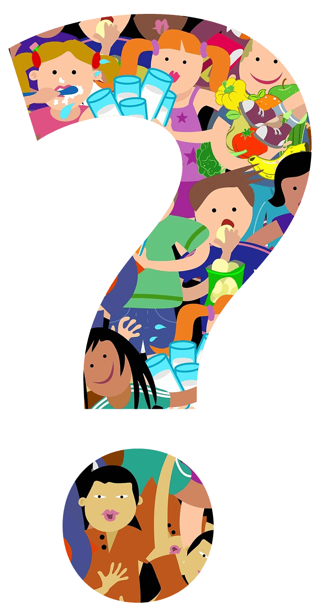

| rows: 1fr 4fr 1fr
| style: --primary: var(--white)
| 1 1
| 2 4
| 3 4

| chapter: Getting started
| section: Introduction

<Background />

-

# <big>Smart Tattoos</big>

<big>Design a biosensitive tattoo that expresses your character and can save your life</big>

<f-notes title="Credits">

Image source: 
https://www.pexels.com/

</f-notes>

-

<f-next-button title="Start" />

<f-notes style="--primary: var(--black)">

## Learning goals

- To promote interest towards learning both design and STEM

- To support creativity by illustrating how ideas across different subjects feed each other

- To learn about concepts in skin biology, indicator chemistry and icon design

</f-notes>

---

| rows: auto 1fr
| padding: 0
| 1 2
| 1 2

## Smart Tattoo 1.0

Tattoos have been around since ancient times.

They are done by punctuating the skin with a needle that injects ink under the skin.

Some people wear so called **medical alert tattoos**, which are not pure decoration or to express themselves, but have an additional function.

#### Tasks

1. Research via Google Pictures for *medical alert tattoos* and find out their functions.
2. Which medical alerts are covered? Can you think of other uses?
3. What's your opinion: Do you think tattoos like this should be mandatory?

 

<f-next-button />

-

<f-image src="./images/tattoo_bee.jpg" />

<f-notes title="credits">
Photo by Savs on Unsplash,
https://unsplash.com/photos/5duK901QD2g
</f-notes>

---

| rows: auto 1fr
| padding: 0
| 1 2
| 1 2

## Smart Tattoo 2.0
Currently, a research group from *Harvard Medical School* and *MIT* has suggested that some inks can be used to create smart tattoos that provide useful information about **hydration, sugar and pH-levels**.
The so-called biosensitive inks are paired with the traditional way of tattooing to overcome the limitations of current biomedical monitor devices and to create *medical alert tattoos 2.0*.

<blockquote>
	
~*The Dermal Abyss tattoo inks change color according to the chemistry of the body’s interstitial fluid, which can be used as a surrogate for constituents of the blood. One ink changes from green to brown as glucose concentration increases. The team has also developed a green ink, viewable under blue light, that grows more intense as sodium concentration rises, an indication of dehydration.*~

</blockquote>

#### Tasks

1. Read the full article from The Harvard Gazette (link in Credits).
2. Which other uses do they mention, besides indicating glucose level and dehydration level?
3. Think of other uses/functions that would be interesting.

 

<f-next-button />

-

<f-image src="images/art-artist-drawing-1304469.jpg" />

<f-notes title="credits">
photo by Isabella Mendes,
https://www.pexels.com/photo/selective-focus-photography-of-tattoo-artist-drawing-a-tatoo-1304469/
  
 

Quote from:"Feeling woozy? Time to check the tattoo", The Havard Gazette; by Alvin Powell, September 28, 2017.
https://news.harvard.edu/gazette/story/2017/09/harvard-researchers-help-develop-smart-tattoos/

</f-notes>

---

| rows: auto 1fr
| padding: 0
| 1 2
| 1 2

<section style="padding:var(--content-padding);">

## Warming up

Tattooing is all about drawing images on the skin. These images are not always easy to recognize

1. Find a partner

2. Select a concept and "tattoo" it to your partner’s back by gently tapping with a finger

3. Try to guess the concept tattooed in your/your partner's back

4. Discuss: what kind of concepts are easy to “guess” from limited information

 

<f-next-button />

</section>

-

<f-image style="background-position: 40%" src="images/bags-best-friends-daylight-1516440.jpg" />

<f-notes title="credits">
photo by Kobe Michael,
https://www.pexels.com/photo/three-men-standing-near-window-1516440/
</f-notes>

---

| chapter: Chemistry & Biology
| section: What to measure

# 🧪

## What to measure?

The MIT and Harvard researchers used inks that functioned as indicators.
Indicators are substances that provide useful information about their environment.
For example, information about acids and bases.

 

**Let's find out more!**

 

<f-next-button />

---

| section: Acids and bases

| padding: 0
| 1 1 1 2 3 3

<section>

**_TODO_** layout

## Acids and bases

The acids and bases can be understood through the concentration of hydrogen-ions <f-math inline blue>(H+)</f-math> in a solution.

The acid level is measured with pH-scale (pH originally comes from the power of hydrogen).

The pH-scale is governed by the equation <f-math inline>pH = -log[H+]</f-math>

<f-slider set="ph" :value=7 :to=14 integer title="ph: " style="padding: calc(var(--content-padding)/2) 0" />

_Move the bar to explore the pH-scale. Talk with a friend: What is the pH-range that you would need to consider with tattoos?_

 

<f-next-button />

</section>

-

<section>

  <f-artboard :width="280" :height="300" :step="20" style="margin-top: 5px" >
  	<f-line :x1="40" :y1="310 - i*20" :x2="240" :y2="310 - i*20" v-for="i in 15" />
    <f-rect style="transition: all .2s ease-in-out" :x="-100" :y="-290" :stroke="none" :fill="color('red')" :width="40" :height="280 - get('ph')*20" :rotation="180"/>
    <f-rect style="transition: all .2s ease-in-out" :x="-220" :y="-290" :stroke="none" :fill="color('blue')" :width="40" :height="get('ph')*20" :rotation="180"/>
    <f-text :x="20" :y="313 - i*20" v-for="i in 15">{{i-1}}</f-text>
  </f-artboard>
  
 
    <small>
      <f-math inline :update="get('ph')">
      [H+] = 10^{(-{{ get('ph') }})}
      </f-math>
    </small>  
    <small>
      <f-math inline :update="get('ph')">
      [OH-] = 10^{({{ 14 - get('ph') }})}
      </f-math>
    </small>
    

</section>

<f-notes title="credits">

https://www.pexels.com/photo/body-of-water-under-blue-and-white-skies-1533720/

https://www.pexels.com/photo/nature-water-blue-abstract-67843/

https://www.pexels.com/photo/flour-in-a-jar-5765/

https://www.pexels.com/photo/chrome-circle-close-up-droplets-220612/

https://commons.wikimedia.org/wiki/File:Clorox_Bleach_products.jpg

https://www.flickr.com/photos/yourbestdigs/28692193236

https://www.flickr.com/photos/horiavarlan/4263958356

https://pixabay.com/photos/tums-pills-tablets-antacid-1528834/

https://www.maxpixel.net/Inflammation-Urine-Container-Urine-The-Test-1006795

https://www.pexels.com/photo/happy-coffee-6347/

https://www.pexels.com/photo/tomato-shake-being-poured-in-drinking-glass-1365445/

https://www.pexels.com/photo/close-up-photo-of-cold-cola-1571700/

https://www.pexels.com/photo/close-up-photo-of-sliced-lemons-1536871/

https://commons.wikimedia.org/wiki/File:Adult_Digestive_System.png

https://www.needpix.com/photo/download/656916/offal-marking-medical-intestine-liver-small-intestine-colon-belly-human

https://www.maxpixel.net/Motorcycle-Battery-Battery-Acid-Battery-2490122

https://pxhere.com/en/photo/977978

</f-notes>

-

<big style="
color: var(--white); 
z-index: 1; 
padding: var(--content-padding); 
position: absolute; 
bottom: 0; 
left: 0; 
right: 0;
background: linear-gradient(to bottom, rgba(0,0,0,0) 0%,rgba(0,0,0,0.65) 100%);
">{{ ['Battery acid','Stomach acid','Lemon juice','Soda','Tomato juice','Black coffee','Urine (average)','Pure water','Seawater','Baking Soda','Antacid tablets','Soap','Ammonia','Bleach','Drain cleaner'][get('ph')] }}</big>
<f-image style="z-index: -1; position: absolute; left: 0; top: 0; bottom: 0; right: 0; background-position: center center; background-size: cover" :src="'images/ph/' + get('ph') + '.jpg'" />

---

| section: Indicators
| padding: 0

<section>

## Indicators

Move the pH-bar. **Why does the color change?**

<f-slider set="ph" :value=7 :to=14 integer title="ph: "  style="padding: calc(var(--content-padding)/2) 0" />

_When designing your indicator, you may need to consider the visibility of the color change. How accurate is the information offered by the color change?_

> <small><small>Phenol red: The structural parts indicated by the red color undergo changes as the pH is increased changing the color of the molecule.</small></small>

 

<f-next-button />

</section>

-

<f-image style="position: absolute; left: 0; top: 0; bottom: 0; right: 0; background-size: cover" src="images/glass.png" />

---

| chapter: Semiotics & design
| section: Designing things

# 👩‍🎨

## Designing <strike>a symbol</strike> <strike>an icon</strike> <strike>a pictogram</strike> a tattoo

Now we have to think about how our tattoo looks, feels, and most importantly - functions!

**Let's get creative!** 🧐
 

<f-next-button />

---
| Section: Introduction to signs
| padding: 0
| style: overflow: hidden

## Life or death?

How can you make sure that others understand what your tattoo is about?

#### Tasks
1. Visualise an abstract phenomena, like life or death, by sketching a picture on a piece of paper.
2. Compare your picture to that of others. In which way are they similar or different?
3. Can everyone understand their meaning?
3. Can you explain why some are different and others are similiar?

 

<f-next-button />

-

<f-scene responsive >
  <f-group position="1 1">
    <f-rotation :duration="30000">
      <f-spin-pattern count="6" :scale="1" :r="0.9">
        <f-text :scale="4">💀</f-text>
      </f-spin-pattern>
    </f-rotation>
    <f-rotation :duration="60000">
      <f-spin-pattern count="12" :scale="1" :r="2" rotation="30">
        <f-text :scale="4">😇</f-text>
      </f-spin-pattern>
    </f-rotation>
  </f-group>
</f-scene>

---

| section: Glossary of signs
| padding: 0
| rows: auto
| 1 2

## Sign? Icon? Symbol? Pictogramm? *Tattoo*?

As a designer, it is important to keep these terms apart.

#### Task

1. Read the definitions and try to understand the differences between logo, icon, symbol and pictogram.
2. Which of these signs did you paint in the task before (visualising life or death)? Can you guess why you used them?
2. Discuss: Which of these signs is suitable for a smart tattoo. Why?

 

	
Sign

  
  Signs are visual, auditive or tactile representations of information. 
  A handshake is a tactile sign, to indicate that you greet someone.  
  Sirens are auditive signs, to inform you of an emergency case, like fire or a passing ambulance.  
  Visual signs are what we are dealing with: Logos, icons, symbols, pictograms are all visual signs.
  

	
Symbol

  
  Visualizes abstract terms, like love ❤️, that something is correct ✔️.  
  The peace symbol is also very famous ☮  
  or even symbols for religions: ✝, ✡, ☪, ☯, 🕉...
  
   
  
  We need symbols to visualise what we cannot paint easily, with few brushstrokes. Some concepts are too complex
  to be quickly visualiszed. So small groups start with symbols that eventually become accepted throughout all of society.
  **But careful:** The meaning of symbols has to be learned. You cannot automatically know what it's about. If you grow up in a certain society, as a child, you automatically learn its symbolism. But if you are new to a group or a culture, you might find new symbols whose meaning you don't understand.
  Symbols are **conventional**, which means that they are agreed upon to mean something, and not everyone may know all of these agreements. A kid may link the ☠️ symbol to pirates of the Carribean, a doctor in a hospital to something else entirely. Context is often key - also for pictograms.

	
Logo

  
 Logos and signets are visual representations of companies or brands. They usually contain writing (then it's called logo &ndash; because logo comes from the Greek *logos* which means *word*). There are several sub-categories: Logos with just wording, like in CocaCola; logos with single letters like in IBM; logos with numbers in them: 7/11; and logos that combine wording with signets, like *adidas*, *Puma*, *KFC* etc. Signet (from Latin *signum* for *seal*) stands for brand visualisations without writing, so just pictures. You problably all know the *Nike swoosh* or the *Apple* apple 🍏 . Sometimes combined logos are reduced to just the signet. This happenes often when the brand is very popular. For example *Starbucks* lost it's writing and is just working with the mermaid.

	
Icon

  
Today, the term icon is used for everything that visualizes something. But originally, it was meant to show functions on computer displays, so that interfaces are easier to work with for people who are new to computers. 
One of the first was the icon for the *search function* &ndash; but it didn't start with the magnifying glass. It started with a very simple silhouette of Sherlock Holmes! People knew that Sherlock is a detective and searches for things, so when they saw this icon, they automatically new, that they could look for things, when they clicked on it. At some point the silhouette got lost, but the magnifying glass, as the most distinctive item of a detective, remained. 🔎
Icons started as metaphors (see *recycling bin*). Nowadays, they can also be abstract: ⏮️▶️⏭⏹️⏺️⏏️
Icons like these need to me learned, but they are also used for displays or buttons, to indicate a certain function.
Software also uses icons or we have favicons on our website, to help us recognize more easily which website we are looking at.

	
Pictogram

  
Pictograms are visual guiding systems. They tell you what to do or what not to do. They offer orientation. We find them at airports, trainstations and in general in public spaces. Pictograms should therefore be language-independent, that means, you have to design them in a way that they don't cause misunderstandings and are easily understood without cultural context or knowledge.
Therefore pictograms are always very simple. One of the most universal pictograms is the *escape pictogram*, with a green background, white rectangle and a human silhouette running towards the rectangle. Some pictograms are more complex or contain symbols ♻️ or even writing 🚾 🚻. Sometimes they forbid certain actions: 🚭 🚳 📵. And then there are super abstract ones, which need to be learned, for example traffic signs: ⛔.

 

<f-next-button />

-

<f-image src="./images/tattoo_picto.jpg" />

<f-notes title="credits">
Photo by Filip Bodlak on Unsplash,
https://unsplash.com/photos/5MvqNDyizBo
</f-notes>

---

| section: Form & Style
| padding: 0
| style: overflow-x: hidden

## Form follows function

The way a sign is presented is also part of the context. Simple lines and bold swatches of color are usually more readable at a glance. Detailed drawings are more decorative, but don't convey information that easily. For this reason, different styles are used for different purposes - if the purpose is to convey important information quickly, then the sign should be as simple (readable) as possible.

*Kurt Weidemann*, a German designer once said something, that is not only important for logos, but for all signs:

<blockquote>
	~*A logo is well done, if you can scratch it into sand with your big toe.*~
</blockquote>

If the tattoo is just decorative and doesn't have an additional function, you can go crazy with details. For our smart tattoo, this would reduce the functionality drastically.

**So when you design your smart tattoo, always remember that information has to be readable and quickly accessible. Always think about the big toe in the sand!**

-

<EmojiBg />

---

## Style or substance?

Think and discuss - what are the things you need to pay attention to when designing a good icon? What are the dos and the don't-s?

To your right there are three sets of symbols, or icons, of different level of detail and style of drawing.
Try to think, in what context, and for what these could be used, and try to sketch the missing icon in the corresponding style.

When you have finished, click the button to reveal the original icon design and compare it to your result.

What is better in your design, what could still be improved?

-

<f-value :value="['./images/beverages_icons_missing.png', './images/beverages_icons.png']" set="bevs" />

<f-toggle title="Show the cup of tea" set="bevs_index" />

<f-value :value="['./images/candy_icons_missing.png', './images/candy_icons.png']" set="candy" />

<f-toggle title="Show the bag of popcorn" set="candy_index" />

<f-value :value="['./images/fastfood_icons_missing.png', './images/fastfood_icons.png']" set="food" />

<f-toggle title="Show the double cheeseburger" set="food_index" />

---

| chapter: Testing the tattoo
| section: Back to tattooing

## Back to tattooing

Tattoos have always had strong symbolic meaning - **cultural**, to convey some message about the bearer to other members of society - and / or **personal**, to mean something to the bearer herself.

What meaning or function would your **smart tattoo** have? Would it be personal, functional or cultural? Does it have to be understood by everyone, at a glance? Or could it be secret and personal, only understood by the bearer?

Tattoos become **blurry** over time and lose their sharpness. Think about how you should design icons for tattoos to reduce these effects?

> ~learn more about tattoo permanence~ <f-rightarrow-icon />

-

<f-video src="https://www.youtube.com/watch?v=DMuBif1mJz0" />

<f-video src="https://www.youtube.com/watch?v=6I9tenSb-Zg" />

---

| section: Deciding the conditions

## Deciding the conditions

In theory, chemicals can be engineered to react to any type of a condition in human body and produce a color.
Decide with your pair a condition that would be important to make visible or measurable with a tattoo.
Justify your choice with arguments.
Write down the condition to a piece of paper.

-

<f-notes title="Credits">

Image source: 
https://www.needpix.com

</f-notes>

---

| section: Creating the appearance

## Creating the appearance

Sketch out the appearance of the smart tattoo, considering

1. the basics of icon design

2. the cultural context of the symbol

3. the specifics of the 'material'

4. the basic principles of pictography and icon design

### Time to test your tattoo

After sketching it is time to look how your tattoo would look like. Test your design in real life,
by sketching it on a friend 😃, and/or by uploading it to the tattoo-simulator on the next slide.

-

<f-notes title="Credits">

Image source: 
https://www.needpix.com

</f-notes>

---

<Simulator />

---

| section: Wrapping up
| 1 1 2
| padding: 0

<f-image src="./images/model2.jpg" style="transform: scale(-1, 1); " />

-

<section>

## Wrapping up

#### Related DesignSTEM projects

<a href="../colorblindness">Color Vision Deficiency & Accessi­bility</a> contains a lot of interactive material about color and considering human condition.

#### The learning never stops.

For example, you can next learn about chemistry of inks by conducting experiments, or the tattoo permanence model by conducting biological experiments.

 

<a class="tertiary" href="../"><f-leftarrow-icon /> Back to projects</a>

</section>
