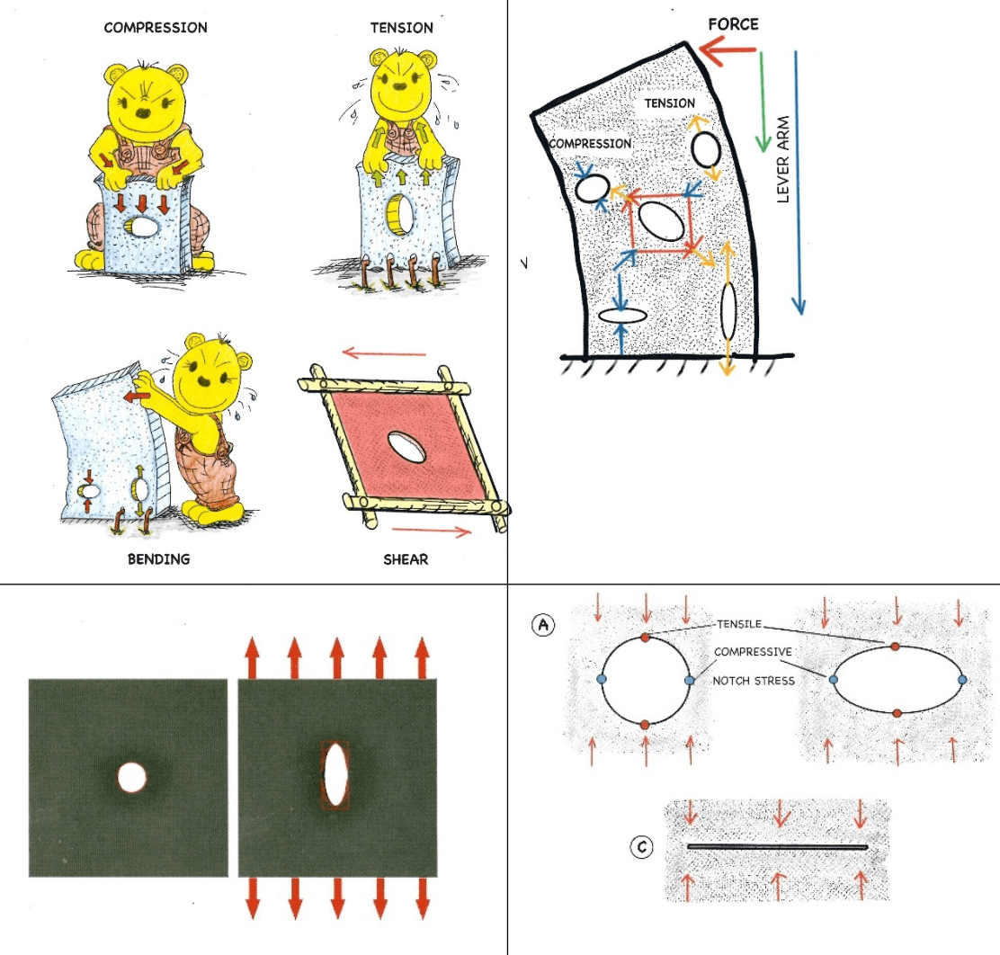

| chapter: Optimization with folds
| section: Looking at nature

## Optimization with folds

### Palm trees

Palm Trees have very clever leaves. In nice weather the leaves spread out to catch the sunlight, but during storms they fold up. The folding makes the leaves compact and thus stronger and more resistant to these circumstances. 

-

<f-notes title="Credits">

Image sources: https://commons.wikimedia.org/wiki/File:Close_Up_look_of_Leaves.jpg

</f-notes>

---

<caption>Optimization with folds</caption>

### Shells

Shells are designed with the purpose of carrying external loads efficiently.
The folds help the thin layered shells to be resistant to predators and rough circumstances. 

-

<f-notes title="Credits">

Image source:
https://pixnio.com/still-life/seashells-mollusk-still-life-object-decoration-macro

</f-notes>

---

| section: Adding strength

<caption>Optimization with folds</caption>

So now we have looked at nature and we understand that through folding materials you can **add strength** to them.

By folding the edges of the metal top of the Pallas table Konstantin Grcic added strength to it.  

-

---

| 1 2 2 3 3 

<caption>Optimization with folds</caption>

In the pictures you see two identical A4 papers folded in **hexagonal like** shapes.

Which one do you think is the strongest?

-

-

---

| 1 2 2 3 3

<caption>Optimization with folds</caption>

See what happens when you place the papers **horizontally** on the table and put a weight on it. 

-

-

---

| 1 2 2 3 3

<caption>Optimization with folds</caption>

See what happens when you place the papers **vertically** on the table and put a weight on it. 

-

-

---

| section: Exercise: Paper construction

<caption>Optimization with folds</caption>

## Exercise

Take some paper and try different ways of folding to make a strong paper construction.

<a class="tertiary" src="https://drive.google.com/file/d/1eI9cVsdktE5wh2lVQHV3nnVB5rvTbVWa/view"><f-arrow-icon rotation="90" />Download rectangular shape template</a>

<a class="tertiary" src="https://drive.google.com/file/d/1vNI9KdNpWQHcdm1R6C7aWIkSFIZ6SnTx/view"><f-arrow-icon rotation="90" />Download hexagonal shape template</a>

***TODO: Copy PDFs to scenario, add legends***

---

| chapter: Optimization with sticks and strings
| section: Tension and compression

## Optimization with sticks and strings

### Tension and compression

Useful and efficient structures can be built using **only tension** or **only compression**.

Simple suspension bridges are examples of **tensile structures**.

Arch bridges are examples of **compressive structures**.

-

<f-notes title="Credits">

[Capilano Suspension Bridge](https://commons.wikimedia.org/wiki/File:Capilano_Suspension_Bridge,_Vancouver,_Canada_(July_2016)_1.jpg) by Markus Säynevirta

[Boulder Bridge, Rock Creek Park](https://commons.wikimedia.org/wiki/File:Boulder_Bridge,_Rock_Creek_Park.jpg) by Carol M. Highsmith

</f-notes>

---

<caption>Optimization with sticks and strings</caption>

Tension and compression members can also be combined.

-

<f-notes title="Credits">

Image source:
https://commons.wikimedia.org/wiki/File:GoldenGateBridge-001.jpg

</f-notes>

---

<caption>Optimization with sticks and strings</caption>

Ropes and cables are lightweight, flexible and strong. Perfect for carrying loads!

A sailing ship can sail because of its **rigging**.

Another example of tension and compression members combined!

-

<f-notes title="Credits">

Screen capture from a video: https://vimeo.com/wiltel/bodacious2014#t=140s

</f-notes>

---

<caption>Optimization with sticks and strings</caption>

## ...in Nature

Cables and ropes in functional constructions (like bridges and boats) echo the tendon, ligaments and muscles in animal skeletons.

-

<f-notes title="Credits">

http://biodidac.bio.uottawa.ca/thumbnails/filedet.htm?File_name=AVES029B&File_type=GIF

https://pxhere.com/en/photo/1230998

</f-notes>

---

| 1 1 2

<caption>Optimization with sticks and strings</caption>

> ...~*Ligament and membrane, muscle and tendon, run between bone and bone...*~

> ... ~*The beauty and strength of the mechanical construction lie not in one part or in another, but in the harmonics concatenation which all parts, soft and hard, rigid and flexible, tension bearing and pressure-bearing, make up together...*~

<small>Thompson, D. A. W., & Bonner, J. T. (2014). On Growth and Form. Cambridge, United Kingdom: Cambridge University Press.</small>

-

<f-notes title="Credits">

https://academy.allaboutbirds.org/features/birdanatomy/

<f-notes>

---

| section: Exercise: Create a space frame

<caption>Optimization with sticks and strings</caption>

## Exercise 1

Try to build a space frame using ice-cream sticks and strings/lines.
For a building description of a space frame, look at the next page.

<small>

The space frame structure of a train station

</small>

-

<f-image src="./images/roof.jpg" />

<f-notes title="Credits">

https://commons.wikimedia.org/wiki/File:Modern_steel_station_roof_of_Zaandam_as_a_space_truss_construction_to_give_maximum_transparancy_to_the_townhall_-_panoramio.jpg

</f-notes>

---

| 1 1 1
| 2 3 4

<caption>Optimization with sticks and strings</caption>

-

***TODO: Where is the content?***

-

-

---

<caption>Optimization with sticks and strings</caption>

## Exercise 2

Now build a model of a functional structure using only sticks and strings. 

Continue for inspiration and information ***TODO: Continue to where?***

---

| 1 1 1
| 2 3 4
 
<caption>Optimization with sticks and strings</caption>

## Exercise 2: Examples and resources

-

-

-

***TODO: Links?***

**Computer-free Design using the Method of Force Cones** 
C. Mattheck

**Example topologies using the method of force cones** 
C. Mattheck

**Further verification of the method of force cones**
C. Mattheck

<f-notes title="Credits">

Mattheck, C. (2007). Secret design rules of nature: Optimum shapes without computers. Karlsruhe: Forschungszentrum Karlsruhe.

</f-notes>

---

| chapter: Optimization with cells
| section: Hexagon for energy optimization
| 1 1 1
| 2 3 4

<caption>Optimization with cells</caption>

## Hexagon for energy optimization

A hexagon is a form we see everywhere in nature when energy optimization is needed. 

For example in a honeycomb, radiolaria or dried clay.

-

-

-

<f-notes title="Credits">

Image sources: https://commons.wikimedia.org/wiki/File:Apis_florea_nest_closeup2.jpg
https://commons.wikimedia.org/wiki/File:Radiolaria_(Challenger)_Plate_135.jpg

</f-notes>

---

| section: Exercise: make a beeboard

<caption>Optimization with cells</caption>

## Exercise: Make a beeboard

Honeycombs can be found in a vast variety of structures. Especially it’s used as core infill for composite sandwiches used in aerospace structures or your everyday kitchen door. Honeycombs are hexagonal-shaped cells.

It’s lightweight and when it’s pressed into a mould, it adapt to its form. 

Beeboard you’ll find in your everyday kitchen cabinet door.

> #### What you will need
* Two sheets of paper format A3, if you use thicker paper you probably need a ruler and a cutter to etch the lines first
* Pencil
* Double-sided tape
* Cutter

---

<caption>Optimization with cells</caption>

## Exercise 1: the steps

There are many ways to cut and etch paper. A laser cutter would probably be the fastest and most precise way to do it. But etching the paper with a ruler and cutter is fine too. First of all print the pattern in attachment.

***TODO: Fix steps***

1. Fold your sheets as seen in the illustration above. The blue lines must be folded inwards. The red lines must be folded outwards. When done, you’ll see the half of the honeycomb shape.

2. Tape the ‘hills’ with double-sided tape. Than, put the other sheet on top of it, so you’ll have long honeycomb shape cylinders.

3. Cut the taped sheets into shorter parts. Tape those shorter part on top of each other. 

  

4. Stretch the parts, so the honeycomb beeboard will appear.

  

---

<caption>Optimization with cells</caption>

## Exercise 2: Soap bubbles

The 3D version of a honeycomb you get when you stack balls in a crate and put weight on them, causing the walls to be pressed to each other. 

The physicist Kelvin proposed that a 14-faced polyhedron or <var>tetrakaidecahedron</var> can be considered the most ideal form to spread the forces exposed to it.

Imagine the balls are soap bubbles, they even start to share the walls!

<f-notes title="TODO: NOTES FOR A TOOL" width="50vw">

## Spheres to polyhedrons

Illustration that when you stack flexible balls in a crate and you put some pressure on it they deform into a polyhedron.

See the 3D-honeycomb created in slicr 3D. 

https://engineerdog.com/2015/03/08/3d-printing-a-3d-honeycomb-infill-concept/

Furthermore, we were talking about a voronoi simulator. In principle the students will draw their own on paper. To understand what’s really happening.

But I found this simulator online: http://alexbeutel.com/webgl/voronoi.html which is movin

https://www.visualcinnamon.com/2015/07/voronoi.html

</f-notes>

---

<caption>Optimization with cells</caption>

When you look at soap bubbles, you see they’re not regular; they vary in size and shape. 

This depends on the external forces, but also on the material properties of the bubble itself, like surface tension, viscosity or the competitive growth of the bubbles due to the air or gas. 

-

Researching the Voronoi diagram

Let’s see if we can mimic dried clay and soap bubbles and modify them into possible emergency plans!   

<f-inline>

</f-inline>

<f-notes title="Credits">

Image sources: https://commons.wikimedia.org/wiki/File:This_must_be_art_(explored)_(4457914327).jpg
https://pixabay.com/photos/drought-ground-clay-cracks-dry-964339/

</f-notes>

---

<caption>Optimization with cells</caption>

~Georgy Voronoi was a Russian mathematician. A Voronoi diagram is built out of various polygons. Imagine you’re are in region and you’re looking for the closest hospital. The region is divided in areas (polygons) with nodes. Every node represents a hospital.~

~**At any point in the polygon you’re closer to the node it contains than to any other node in the whole region.**~

~And, at any point along the boundaries of the polygons, you are at the same distance from at least two nodes. This makes these diagrams very useful for many applications such as mapping and zoning, for example to find the nearest hospital.~

---

| 1 1
| 2 3
| rows: auto 1fr

<caption>Optimization with cells</caption>

## Exercise 3

-

Now make your own Voronoi diagram based on the nodes that represents...

https://www.instructables.com/id/Hand-Drawn-Voronoi-Diagrams/

-

<f-video src="https://www.youtube.com/watch?v=bmaUtG4CbOs" />

---

<caption>Optimization with cells</caption>

## Back to the bone!

When you cut a thigh bone you’ll see a foam structure that is optimally formed by the forces it has to carry. So, bone is strong and light. 

And: like foam bone could eliminate material by adapting to the change of the environment, but of course not at the same speed soap bubbles do! 

-

-

<f-notes title="Credits">

Image sources:
https://www.flickr.com/photos/roderickt-uk/6901706105/

https://commons.wikimedia.org/wiki/File:Femur_(caput_femoris)_-_bone_structure_detail_(vertical_cut).jpg

</f-notes>

---

| chapter: Optimization by deformation
| section: Deformation

<caption>Optimization by deformation</caption>

The deformation (and even failure) of existing materials and structures under load can be very instructive for the designing and building of new ones.

First of all, deformation teaches us about fundamental loads and stresses.

Prof. Dr. Claus Mattheck uses rubber plates and sheets of aluminum foil to help you visualize loads and stresses in structures.

-

<f-inline>

</f-inline>

<f-inline>

</f-inline>

Mattheck, C. (2011). Thinking tools after nature. Karlsruhe: Karlsruhe Institute of Technology.

<f-notes title="TODO: Notes for a tool">

## Virtual rubber sheet

#### Graphics

* A black square with (the suggestion) of a frame made out of four wooden struts that can hinge (see below)

* With 1 or more holes

* A slight 3D/axonometric view also possible (object turned a little relative to the camera)

#### Animation/interaction

* Sheet and hole(s) are responding to applied forces making visible the effect and direction of compression, tension, shear and bending

</f-notes>

---

<caption>Optimization by deformation</caption>

Deformation also acts as a **warning signal**.

-

<f-image src="./images/house.jpg" />

<f-notes title="Credits">

https://www.geograph.org.uk/photo/346439

</f-notes>

---

<caption>Optimization by deformation</caption>

Last but not least: deformation can be seen as a kind of **shape optimization**.

Let’s go back to the rubber plates and sheets of  aluminum foil of Prof. Dr. Mattheck.

The way these (isotropic) **materials** bend, fold, stretch and twist can be seen as an effective adaptation to loads.

-

Mattheck, C. (2011). Thinking tools after nature. Karlsruhe: Karlsruhe Institute of Technology.

---

<caption>Optimization by deformation</caption>

### Example 1

Holes and notches in a piece of rubber under stress deform in such a way that local concentrations of stresses are reduced and loads are distributed evenly.

The shapes that "occur" in this way are to be found all over in the natural and manmade world!
  
-

Mattheck, C. (2018). Pauli explains the form in nature. Karlsruhe: Karlsruhe Institute of Technology.

---

<caption>Optimization by deformation</caption>

## Example 2

The way aluminum foil deforms (and eventually tears) under tension tells us a lot about **lines of compression and tension**.

Here too, deformation offers us clues about the optimal shape given a particular load.
 
-

Mattheck, C. (2018). Pauli explains the form in nature. Karlsruhe: Karlsruhe Institute of Technology.

---

<caption>Optimization by deformation</caption>

The shape of components under stress can be used as a **template** for a new design that’s better suited for a particular load.

Basic idea:

* Apply force and observe the  deformation.

* Use the deformation as the basis of a manufactured form.

Again... listen to the trees!

-

Mattheck, C. (2011). Thinking tools after nature. Karlsruhe: Karlsruhe Institute of Technology.

---

| 1 1 2

<caption>Optimization by deformation</caption>

## Exercise

1. Take a sponge and a piece of chamois cloth (‘shammy’).

2. Push, pull, bend, twist and/or tear them any way you want. 

3. Observe the deformations closely and try to understand the loads and stresses that led to these shapes.

4. Use the **three** shapes that appeal to you most, or in which you sense some technical use.

5. Make a quick sketch of a product that utilizes these shapes.

-

<f-notes title="Credits">

Image source:
https://commons.wikimedia.org/wiki/File:Sponge-viscose.jpg

</f-notes>