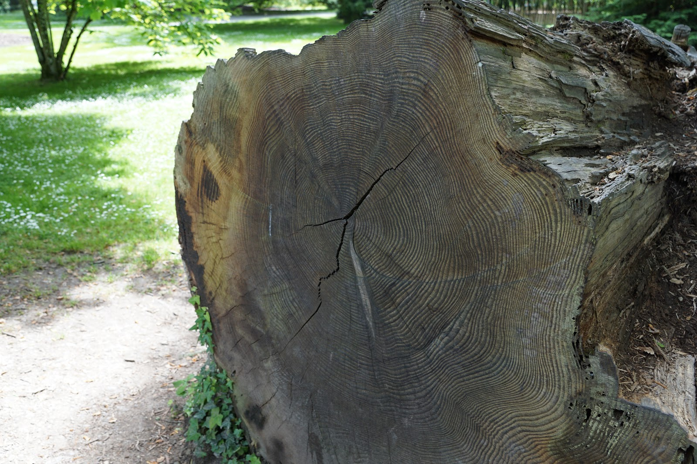
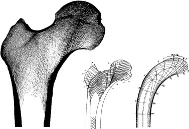
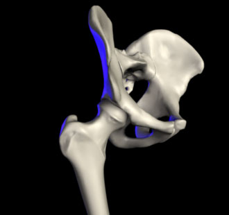
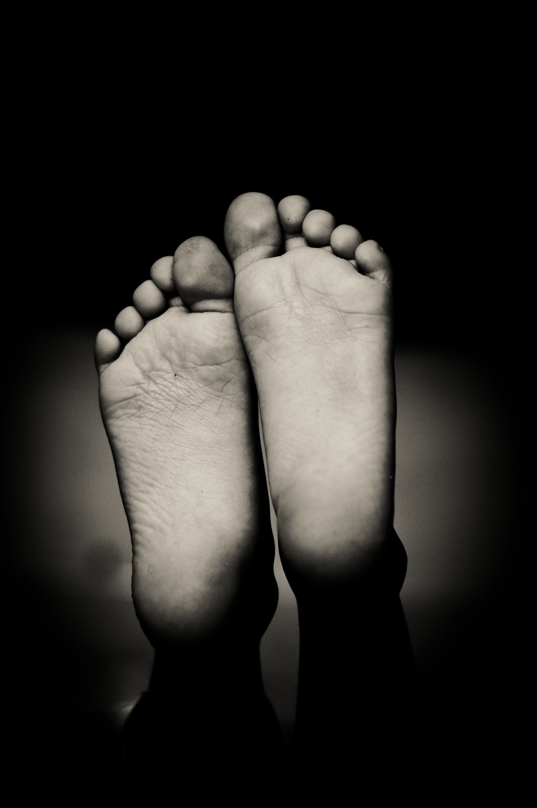

| theme: blue
| chapter: Minimal use of material
| section: Mimimal use of material
| background: ./images/bonechair.jpg

# <big>Mimimal use of material</big>

---

| section: Bone Chair

## Bone Chair by Joris Laarman

Due to innovative digital techniques we can create **customized, smart and more complex forms**. 
Joris Laarman used topology optimization software based on the findings of professor Claus Mattheck to develop **a chair with a bone-like structure**.

-

<f-video src="https://www.youtube.com/watch?v=z5HSzxGsUdI" />

<f-notes title="Credits">

Photo courtesy of Joris Laarman Lab, downloaded from: https://www.cooperhewitt.org/2017/05/16/cooper-hewitt-smithsonian-design-museum-to-present-joris-laarman-lab-design-in-the-digital-age/

</f-notes>

---

| section: Chalk challenge
| 1 1 1 2

<caption>🛠️ Hands-on activity</caption>

## Chalk challenge

1. Take a sidewalk chalk and weigh it.

2. Place it vertically and put a weight on it.

3. Use a knife, rasp or file to take some material off. **Note:** the length of the chalk must stay the same.

4. Try to leave just as much chalk as you need to keep a strong construction. Be careful that is does not break.

5. If you think you have reached the optimum… Let’s put the weight back on.

6. Did it break? If it doesn’t try to scrape off some more and test it again.

Use [this form](https://docs.google.com/document/d/1WHGHGWO3R43I0yfy42PP_W9IsvWljxmRGcs1dD0aDh8/edit) to document your results.

***TODO: Convert to PDF?***

-

<f-image src="./images/chalk.png" />

<f-notes>

Keeping track of your Chalk Challenge

Pressure Weight = ….. g

Start weight of sideboard chalk

g

First time weighing after taking material off

g

Second time weighing after taking more material off

g

Third time weighing after taking  more material off

g

Fourth time ...

g

etc.

g

etc.

g

Breaking point

g

</f-notes>

---

## Why we mimic nature?

There’s a **duality** between nature and engineering, when it comes to lightweight constructions.

* Nature survives with a **minimal use of energy**. So that means, it’s super efficient! As engineers we can learn from nature to reduce material, energy and thus costs.

* Nature has the **ability to adapt** to its changing surroundings during its life time. Think about the skin of a sea cucumber which is extremely flexible, but becomes very rigid in a blink of an eye when it’s threatened. As engineers we can learn from nature’s strategy to make more resilient structures.

---

| 1 1 
| 2 3
| rows: auto 1fr

## A little bit about engineering

-

~Making constructions is not only a matter of choosing the right material. It’s the combination of material, form and production process, which makes the construction light and strong.~

**~Form, material and production process is a trinity.~**

~You can imagine when it comes to lightweight constructions the balance of the trinity becomes more critical!~

-

<f-scene width="300" height="400">
  <f-group v-for="(a,i) in [0 + 180,120 + 180,240 + 180]">
    <f-circle :x="polarx(a, 1)" :y="polary(a,1)" r="1.1" fill="hsla(200,25%,75%,0.5)" />
    <f-text :x="polarx(a, 1)" :y="polary(a,1)"> {{ ['form','material','production'][i] }} </f-text>
  </f-group>
</f-scene>

---

## A little bit more about engineering

Besides the trinity (form, material and production process) the efficiency of a construction is depending on the **kind of load** the construction has to carry. 

Loads on a construction could be: bending, pressure, tension, shear, torsion, vibration… etc.

When designing an object an engineer investigates all its possible loads. 

---

## Trees & Bones

Take for instance the growth of **trees** and **bones**.

During their lifecycle both these natural structures make **optimal use of material** in dealing with stresses and loads. But in different ways. 

<f-inline>
  
  

    <f-rightarrow-icon />
     
    <f-leftarrow-icon />
  

  
</f-inline>

<f-notes title="Credits">

Image sources: https://commons.wikimedia.org/wiki/File:Awl,bone,1933.379,_(r).jpg
https://commons.wikimedia.org/wiki/File:Imbondeiro_Tree.jpg

</f-notes>

---

## Trees ability to adapt

Trees **only add material where it is needed** by producing thicker tree rings at heavier loaded spots. 

e.g. When a tree is constantly exposed to wind at one side, it grows thicker at the other side. 

-

<f-notes title="Credits">

Image source: https://pxhere.com/nl/photo/720601

</f-notes>

---

***TODO*** layout

## Bones ability to adapt

Bones also produce extra material where needed, but they are also able to **eliminate material** in less loaded spots.

<f-inline>
  
  
  
</f-inline>

<f-notes title="Credits">

1. https://commons.wikimedia.org/wiki/File:Bone_cross-section.svg

2. https://en.wikipedia.org/wiki/Hip#/media/File:Hip.jpg

3. https://www.researchgate.net/figure/Trabecular-architecture-in-the-mid-frontal-section-of-the-proximal-femur-left-To-the_fig33_248475019 

</f-notes>

---

## Adaptive growth

This growing and killing of material in response to mechanical forces is called **adaptive growth**.
 
An everyday (visible) example of adaptive growth is the growth of callus on the soles of feet!

-

<f-notes title="Credits">

https://pxhere.com/en/photo/59627

</f-notes>

---

| theme: blue

<big>~*Nature is a smart engineer*~</big>

<big>~*Are you?*~</big>

---

| section: Four ways to optimize

## Four ways to optimize

The following four hands-on exercises introduce some useful principles in the designing and building of structures, with **minimal use of material** and therefore **maximized efficiency**.

***TODO: Fix links***

<!--foldin

<f-card @click.native="goto('folds')" background="var(--gray)" color="white" title="Optimization with folds" />

<f-card @click.native="goto('sticks')" background="var(--gray)" color="white" title="Optimization with sticks and strings" />

<f-card @click.native="goto('cells')" background="var(--gray)" color="white" title="Optimization with cells" />

<f-card @click.native="goto('deformation')" background="var(--gray)" color="white" title="Optimization with deformation" />

-->
