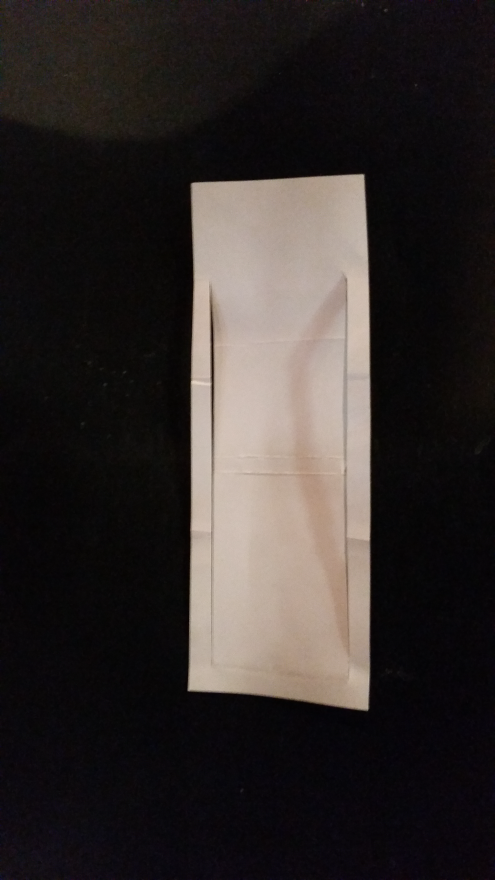

<!-- Start of index.md -->

| chapter: Introduction
| theme: dark
| background: https://upload.wikimedia.org/wikipedia/commons/b/bd/Aerial%40sendai.jpg

# <big>Waste is a design mistake!</big>

### Today's environmental challenges, footprint calculator and material properties

<f-notes>

Image source: https://commons.wikimedia.org/wiki/File:Aerial@sendai.jpg

</f-notes>

---

| section: Our planet
| 1 2 2

## Our planet

We all know that we can’t keep on wasting resources. 

We’re exhausting our planet!

**What’s your feeling about that?**

-

<f-image src="https://upload.wikimedia.org/wikipedia/commons/2/2e/Aterro_Sanitario.jpg" />

<f-notes>
Image source: https://commons.wikimedia.org/wiki/File:Aterro_Sanitario.jpg
<f-notes>

---

| 1 2 2 2

## TED talk

***TODO: Clearer title needed***

Look at the TED talk of Thomas Twaites and 
explain the core of what he’s saying.

-

<f-video src="https://www.youtube.com/watch?v=5ODzO7Lz_pw" />

---

| section: Calculate your footprint

##  Your living habits make up your footprint 

https://footprint.wwf.org.uk/

What could you do to make your footprint less?

Write this down. 

---

| section: Ocean Cleanup

## Ocean Cleanup initiative

***TODO: Shorten, add stcructure***

A lot of people are aware of our footprint and are taking action in order to make the world a better place to live

At age 16 (2011), Boyan Slat came across more plastic than fish while diving in Greece. He decided to devote a high school project for deeper investigation into ocean plastic pollution and why it was considered impossible to clean up.

He later came up with the idea to build a passive system, using the circulating ocean currents to his advantage, which he presented at a TEDx talk in Delft in 2012.

https://www.theoceancleanup.com/

Have a look at his Ocean Cleanup foundation at the website.  
What do you think what is most remarkable about this project?

-

<f-video src="https://www.youtube.com/watch?v=ROW9F-c0kIQ" />

---

| section: Look for initiatives

## Look for initiatives

1. Look for 3 initiatives that have found solutions for a waste problem

2. Collect what you’ve found and discuss with the class why you choose these initiatives.

-

<f-image src="https://github.com/designstem/scenarios/blob/master/waste/images/discussion.jpg?raw=true" />

<f-notes>Image https://www.mibellegroup.com/blog/general/design-thinking/</f-notes>

---

<f-activity-icon />

## Choose 2 concepts and explain them

You probably found a lot of initiatives to make the world cleaner and they all have their own methodologies and concepts.

For example:

<f-card background="none" border="var(--lightgray)">circular economy</f-card>

<f-card background="none" border="var(--lightgray)">upcycle, recycle, downcycle</f-card>

<f-card background="none" border="var(--lightgray)">cradle to cradle</f-card>

<f-card background="none" border="var(--lightgray)">sustainability</f-card>

<f-card  background="none" border="var(--lightgray)">urban mining</f-card>

<f-card  background="none" border="var(--lightgray)">shared economy</f-card>

Explain of the two concepts you have chosen how they contribute to make the world cleaner from waste.

---

| 1 3 3
| 1 2 2

## Example

<f-card background="none" border="var(--lightgray)">circular economy</f-card>

In a nutshell this animation shows the concept of circular economy.
Before you watch the animation look at the following questions.

1. What is the difference between human and nature concerning waste?

2. What is meant by linear economy?

3. Which solutions for our waste problem does this animation show us?

Share what you’ve seen with the class.

-

https://www.ellenmacarthurfoundation.org/resources/learn/courses

***TODO: Perhaps add a better link with actual information, not just a course promotion?***

-

<f-video src="https://www.youtube.com/watch?v=zCRKvDyyHmI" />

---

| section: Make a flat lay from waste

## Make a flat lay from waste in your neighbourhood

***TODO: Condense to 3 steps***

1. Go outside for 15 minutes

2. Collect roaming waste

3. Take it back to the classroom

4. Make a nice composition for the flat-lay

5. Take a picture

***TODO Better links***

https://www.designboom.com/art/gabriel-orozco-asterisms-at-the-guggenheim-new-york/

https://www.enlightapp.com/blog/7-fantastic-tips-for-fabulous-flat-lay-photography/

https://www.instagram.com/djhinva

http://www.slate.com/blogs/behold/2014/07/08/gregg_segal_photographs_people_with_a_week_s_worth_of_their_trash_in_his.html?via=gdpr-consent

-

<f-image src="./images/wastelay.jpg" />

<f-notes>

> #### Tips
* Divide the group into pairs
* User rubber gloves

</f-notes>

---

| section: Next steps

| 1 1 1
| 2 3 4
| rows: auto 1fr

## Choose your next path

### Design a product...

-

<a class="primary" style="display: block; height: 20vh;" href="./index1.html">with minimal use of resources</a>

-

<a class="primary" style="display: block; height: 20vh;" href="./index2.html">with zero waste</a>

-

<a class="primary" style="display: block; height: 20vh;" href="./index3.html">from waste only</a>

<!-- End of index.md -->

---

<!-- Start of index1_start.md -->

| theme: blue
| chapter: Minimal use of material
| background: https://raw.githubusercontent.com/designstem/scenarios/master/waste/images/bonechair.jpg

# <big>Mimimal use of material</big>

***ERIK: Can we use Joris photos? Dunno ***

---

| section: Bone Chair

## Bone Chair by Joris Laarman

Due to innovative digital techniques we can create **customized, smart and more complex forms**. 

Joris Laarman used topology optimization software based on the findings of professor Claus Mattheck to develop **a chair with a bone-like structure**.

-

<f-video src="https://www.youtube.com/watch?v=z5HSzxGsUdI" />

<f-notes title="Source">

  Source: https://www.jorislaarman.com/work/bone-chair/

</f-notes>

---

| section: Chalk challenge
| 1 1 1 2

<caption>🛠️ Hands-on activity</caption>

## Chalk challenge

1. Take a sidewalk chalk and weigh it.

2. Place it vertically and put a weight on it.

3. Use a knife, rasp or file to take some material off. **Note:** the length of the chalk must stay the same.

4. Try to leave just as much chalk as you need to keep a strong construction. Be careful that is does not break.

5. If you think you have reached the optimum… Let’s put the weight back on.

6. Did it break? If it doesn’t try to scrape off some more and test it again.

Use [this form](https://docs.google.com/document/d/1WHGHGWO3R43I0yfy42PP_W9IsvWljxmRGcs1dD0aDh8/edit) to document your results.

***TODO: Convert to PDF?***

-

<f-image src="./images/chalk.png" />

<f-notes>

Keeping track of your Chalk Challenge

Pressure Weight = ….. g

Start weight of sideboard chalk

g

First time weighing after taking material off

g

Second time weighing after taking more material off

g

Third time weighing after taking  more material off

g

Fourth time ...

g

etc.

g

etc.

g

Breaking point

g

</f-notes>

---

## Why we mimic nature?

There’s a **duality** between nature and engineering, when it comes to lightweight constructions.

* Nature survives with a **minimal use of energy**. So that means, it’s super efficient! As engineers we can learn from nature to reduce material, energy and thus costs.

* Nature has the **ability to adapt** to its changing surroundings during its life time. Think about the skin of a sea cucumber which is extremely flexible, but becomes very rigid in a blink of an eye when it’s threatened. As engineers we can learn from nature’s strategy to make more resilient structures.

---

| 1 1 
| 2 3
| rows: auto 1fr

## A little bit about engineering

-

~Making constructions is not only a matter of choosing the right material. It’s the combination of material, form and production process, which makes the construction light and strong.~

**~Form, material and production process is a trinity.~**

~You can imagine when it comes to lightweight constructions the balance of the trinity becomes more critical!~

-

<f-scene width="300" height="400">
  <f-group v-for="(a,i) in [0 + 180,120 + 180,240 + 180]">
    <f-circle :x="polarx(a, 1)" :y="polary(a,1)" r="1.1" fill="hsla(200,25%,75%,0.5)" />
    <f-text :x="polarx(a, 1)" :y="polary(a,1)"> {{ ['form','material','production'][i] }} </f-text>
  </f-group>
</f-scene>

---

## A little bit more about engineering

Besides the trinity (form, material and production process) the efficiency of a construction is depending on the **kind of load** the construction has to carry. 

Loads on a construction could be: bending, pressure, tension, shear, torsion, vibration… etc.

When designing an object an engineer investigates all its possible loads. 

---

## Trees & Bones

Take for instance the growth of **trees** and **bones**.

During their lifecycle both these natural structures make **optimal use of material** in dealing with stresses and loads. But in different ways. 

<f-inline>
  
  

    <f-rightarrow-icon />
     
    <f-leftarrow-icon />
  

  
</f-inline>

<f-notes title="Credits">

Image sources: https://commons.wikimedia.org/wiki/File:Awl,bone,1933.379,_(r).jpg
https://commons.wikimedia.org/wiki/File:Imbondeiro_Tree.jpg

</f-notes>

---

## Trees ability to adapt

Trees **only add material where it is needed** by producing thicker tree rings at heavier loaded spots. 

e.g. When a tree is constantly exposed to wind at one side, it grows thicker at the other side. 

-

<f-notes title="Credits">

Image source: https://pxhere.com/nl/photo/720601

</f-notes>

---

## Bones ability to adapt

Bones also produce extra material where needed, but they are also able to **eliminate material** in less loaded spots.

<f-inline>
  
  
  
</f-inline>

<f-notes title="Credits">

1. https://commons.wikimedia.org/wiki/File:Bone_cross-section.svg

2. https://en.wikipedia.org/wiki/Hip#/media/File:Hip.jpg

3. https://www.researchgate.net/figure/Trabecular-architecture-in-the-mid-frontal-section-of-the-proximal-femur-left-To-the_fig33_248475019 

</f-notes>

---

## Adaptive growth

This growing and killing of material in response to mechanical forces is called **adaptive growth**.
 
An everyday (visible) example of adaptive growth is the growth of callus on the soles of feet!

-

<f-notes title="Credits">

https://pxhere.com/en/photo/59627

</f-notes>

---

| theme: blue

<big>~*Nature is a smart engineer*~</big>

<big>~*Are you?*~</big>

---

| section: Four ways to optimize

## Four ways to optimize

The following four hands-on exercises introduce some useful principles in the designing and building of structures, with **minimal use of material** and therefore **maximized efficiency**.

***TODO: Fix links***

<!--foldin

<f-card @click.native="goto('folds')" background="var(--gray)" color="white" title="Optimization with folds" />

<f-card @click.native="goto('sticks')" background="var(--gray)" color="white" title="Optimization with sticks and strings" />

<f-card @click.native="goto('cells')" background="var(--gray)" color="white" title="Optimization with cells" />

<f-card @click.native="goto('deformation')" background="var(--gray)" color="white" title="Optimization with deformation" />

-->

<!-- End of index1_start.md -->

---

<!-- Start of index1_optimization.md -->

| chapter: Optimization with folds
| section: Looking at nature

## Optimization with folds

### Palm trees

Palm Trees have very clever leaves. In nice weather the leaves spread out to catch the sunlight, but during storms they fold up. The folding makes the leaves compact and thus stronger and more resistant to these circumstances. 

-

<f-notes title="Credits">

Image sources: https://commons.wikimedia.org/wiki/File:Close_Up_look_of_Leaves.jpg

</f-notes>

---

<caption>Optimization with folds</caption>

### Shells

Shells are designed with the purpose of carrying external loads efficiently.
The folds help the thin layered shells to be resistant to predators and rough circumstances. 

-

<f-notes title="Credits">

Image source:
https://pixnio.com/still-life/seashells-mollusk-still-life-object-decoration-macro

</f-notes>

---

| section: Adding strength

<caption>Optimization with folds</caption>

So now we have looked at nature and we understand that through folding materials you can **add strength** to them.

By folding the edges of the metal top of the Pallas table Konstantin Grcic added strength to it.  

-

---

| 1 2 2 3 3 

<caption>Optimization with folds</caption>

In the pictures you see two identical A4 papers folded in **hexagonal like** shapes.

Which one do you think is the strongest?

-

-

---

| 1 2 2 3 3

<caption>Optimization with folds</caption>

See what happens when you place the papers **horizontally** on the table and put a weight on it. 

-

-

---

| 1 2 2 3 3

<caption>Optimization with folds</caption>

See what happens when you place the papers **vertically** on the table and put a weight on it. 

-

-

---

| section: Exercise: Paper construction

<caption>Optimization with folds</caption>

## Exercise

Take some paper and try different ways of folding to make a strong paper construction.

<a class="tertiary" src="https://drive.google.com/file/d/1eI9cVsdktE5wh2lVQHV3nnVB5rvTbVWa/view"><f-arrow-icon rotation="90" />Download rectangular shape template</a>

<a class="tertiary" src="https://drive.google.com/file/d/1vNI9KdNpWQHcdm1R6C7aWIkSFIZ6SnTx/view"><f-arrow-icon rotation="90" />Download hexagonal shape template</a>

***TODO: Copy PDFs to scenario, add legends***

---

| chapter: Optimization with sticks and strings
| section: Tension and compression

## Optimization with sticks and strings

### Tension and compression

Useful and efficient structures can be built using **only tension** or **only compression**.

Simple suspension bridges are examples of **tensile structures**.

Arch bridges are examples of **compressive structures**.

-

<f-notes title="Credits">

[Capilano Suspension Bridge](https://commons.wikimedia.org/wiki/File:Capilano_Suspension_Bridge,_Vancouver,_Canada_(July_2016)_1.jpg) by Markus Säynevirta

[Boulder Bridge, Rock Creek Park](https://commons.wikimedia.org/wiki/File:Boulder_Bridge,_Rock_Creek_Park.jpg) by Carol M. Highsmith

</f-notes>

---

<caption>Optimization with sticks and strings</caption>

Tension and compression members can also be combined.

-

<f-notes title="Credits">

Image source:
https://commons.wikimedia.org/wiki/File:GoldenGateBridge-001.jpg

</f-notes>

---

<caption>Optimization with sticks and strings</caption>

Ropes and cables are lightweight, flexible and strong. Perfect for carrying loads!

A sailing ship can sail because of its **rigging**.

Another example of tension and compression members combined!

-

<f-notes title="Credits">

Screen capture from a video: https://vimeo.com/wiltel/bodacious2014#t=140s

</f-notes>

---

<caption>Optimization with sticks and strings</caption>

## ...in Nature

Cables and ropes in functional constructions (like bridges and boats) echo the tendon, ligaments and muscles in animal skeletons.

-

<f-notes title="Credits">

http://biodidac.bio.uottawa.ca/thumbnails/filedet.htm?File_name=AVES029B&File_type=GIF

https://pxhere.com/en/photo/1230998

</f-notes>

---

| 1 1 2

<caption>Optimization with sticks and strings</caption>

> ...~*Ligament and membrane, muscle and tendon, run between bone and bone...*~

> ... ~*The beauty and strength of the mechanical construction lie not in one part or in another, but in the harmonics concatenation which all parts, soft and hard, rigid and flexible, tension bearing and pressure-bearing, make up together...*~

<small>Thompson, D. A. W., & Bonner, J. T. (2014). On Growth and Form. Cambridge, United Kingdom: Cambridge University Press.</small>

-

<f-notes title="Credits">

https://academy.allaboutbirds.org/features/birdanatomy/

<f-notes>

---

| section: Exercise: Create a space frame

<caption>Optimization with sticks and strings</caption>

## Exercise 1

Try to build a space frame using ice-cream sticks and strings/lines.
For a building description of a space frame, look at the next page.

<small>

The space frame structure of a train station

</small>

-

<f-image src="./images/roof.jpg" />

<f-notes title="Credits">

https://commons.wikimedia.org/wiki/File:Modern_steel_station_roof_of_Zaandam_as_a_space_truss_construction_to_give_maximum_transparancy_to_the_townhall_-_panoramio.jpg

</f-notes>

---

| 1 1 1
| 2 3 4

<caption>Optimization with sticks and strings</caption>

-

***TODO: Where is the content?***

-

-

---

<caption>Optimization with sticks and strings</caption>

## Exercise 2

Now build a model of a functional structure using only sticks and strings. 

Continue for inspiration and information ***TODO: Continue to where?***

---

| 1 1 1
| 2 3 4
 
<caption>Optimization with sticks and strings</caption>

## Exercise 2: Examples and resources

-

-

-

***TODO: Links?***

**Computer-free Design using the Method of Force Cones** 
C. Mattheck

**Example topologies using the method of force cones** 
C. Mattheck

**Further verification of the method of force cones**
C. Mattheck

<f-notes title="Credits">

Mattheck, C. (2007). Secret design rules of nature: Optimum shapes without computers. Karlsruhe: Forschungszentrum Karlsruhe.

</f-notes>

---

| chapter: Optimization with cells
| section: Hexagon for energy optimization
| 1 1 1
| 2 3 4

<caption>Optimization with cells</caption>

## Hexagon for energy optimization

A hexagon is a form we see everywhere in nature when energy optimization is needed. 

For example in a honeycomb, radiolaria or dried clay.

-

-

-

<f-notes title="Credits">

Image sources: https://commons.wikimedia.org/wiki/File:Apis_florea_nest_closeup2.jpg
https://commons.wikimedia.org/wiki/File:Radiolaria_(Challenger)_Plate_135.jpg

</f-notes>

---

| section: Exercise: make a beeboard

<caption>Optimization with cells</caption>

## Exercise: Make a beeboard

Honeycombs can be found in a vast variety of structures. Especially it’s used as core infill for composite sandwiches used in aerospace structures or your everyday kitchen door. Honeycombs are hexagonal-shaped cells.

It’s lightweight and when it’s pressed into a mould, it adapt to its form. 

Beeboard you’ll find in your everyday kitchen cabinet door.

> #### What you will need
* Two sheets of paper format A3, if you use thicker paper you probably need a ruler and a cutter to etch the lines first
* Pencil
* Double-sided tape
* Cutter

---

<caption>Optimization with cells</caption>

## Exercise 1: the steps

There are many ways to cut and etch paper. A laser cutter would probably be the fastest and most precise way to do it. But etching the paper with a ruler and cutter is fine too. First of all print the pattern in attachment.

***TODO: Fix steps***

1. Fold your sheets as seen in the illustration above. The blue lines must be folded inwards. The red lines must be folded outwards. When done, you’ll see the half of the honeycomb shape.

2. Tape the ‘hills’ with double-sided tape. Than, put the other sheet on top of it, so you’ll have long honeycomb shape cylinders.

3. Cut the taped sheets into shorter parts. Tape those shorter part on top of each other. 

  

4. Stretch the parts, so the honeycomb beeboard will appear.

  

---

<caption>Optimization with cells</caption>

## Exercise 2: Soap bubbles

The 3D version of a honeycomb you get when you stack balls in a crate and put weight on them, causing the walls to be pressed to each other. 

The physicist Kelvin proposed that a 14-faced polyhedron or <var>tetrakaidecahedron</var> can be considered the most ideal form to spread the forces exposed to it.

Imagine the balls are soap bubbles, they even start to share the walls!

<f-notes title="TODO: NOTES FOR A TOOL" width="50vw">

## Spheres to polyhedrons

Illustration that when you stack flexible balls in a crate and you put some pressure on it they deform into a polyhedron.

See the 3D-honeycomb created in slicr 3D. 

https://engineerdog.com/2015/03/08/3d-printing-a-3d-honeycomb-infill-concept/

Furthermore, we were talking about a voronoi simulator. In principle the students will draw their own on paper. To understand what’s really happening.

But I found this simulator online: http://alexbeutel.com/webgl/voronoi.html which is movin

https://www.visualcinnamon.com/2015/07/voronoi.html

</f-notes>

---

<caption>Optimization with cells</caption>

When you look at soap bubbles, you see they’re not regular; they vary in size and shape. 

This depends on the external forces, but also on the material properties of the bubble itself, like surface tension, viscosity or the competitive growth of the bubbles due to the air or gas. 

-

Researching the Voronoi diagram

Let’s see if we can mimic dried clay and soap bubbles and modify them into possible emergency plans!   

<f-inline>

</f-inline>

<f-notes title="Credits">

Image sources: https://commons.wikimedia.org/wiki/File:This_must_be_art_(explored)_(4457914327).jpg
https://pixabay.com/photos/drought-ground-clay-cracks-dry-964339/

</f-notes>

---

<caption>Optimization with cells</caption>

~Georgy Voronoi was a Russian mathematician. A Voronoi diagram is built out of various polygons. Imagine you’re are in region and you’re looking for the closest hospital. The region is divided in areas (polygons) with nodes. Every node represents a hospital.~

~**At any point in the polygon you’re closer to the node it contains than to any other node in the whole region.**~

~And, at any point along the boundaries of the polygons, you are at the same distance from at least two nodes. This makes these diagrams very useful for many applications such as mapping and zoning, for example to find the nearest hospital.~

---

| 1 1
| 2 3
| rows: auto 1fr

<caption>Optimization with cells</caption>

## Exercise 3

-

Now make your own Voronoi diagram based on the nodes that represents...

https://www.instructables.com/id/Hand-Drawn-Voronoi-Diagrams/

-

<f-video src="https://www.youtube.com/watch?v=bmaUtG4CbOs" />

---

<caption>Optimization with cells</caption>

## Back to the bone!

When you cut a thigh bone you’ll see a foam structure that is optimally formed by the forces it has to carry. So, bone is strong and light. 

And: like foam bone could eliminate material by adapting to the change of the environment, but of course not at the same speed soap bubbles do! 

-

-

<f-notes title="Credits">

Image sources:
https://www.flickr.com/photos/roderickt-uk/6901706105/

https://commons.wikimedia.org/wiki/File:Femur_(caput_femoris)_-_bone_structure_detail_(vertical_cut).jpg

</f-notes>

---

| chapter: Optimization by deformation
| section: Deformation

<caption>Optimization by deformation</caption>

The deformation (and even failure) of existing materials and structures under load can be very instructive for the designing and building of new ones.

First of all, deformation teaches us about fundamental loads and stresses.

Prof. Dr. Claus Mattheck uses rubber plates and sheets of aluminum foil to help you visualize loads and stresses in structures.

-

<f-inline>

</f-inline>

<f-inline>

</f-inline>

Mattheck, C. (2011). Thinking tools after nature. Karlsruhe: Karlsruhe Institute of Technology.

<f-notes title="TODO: Notes for a tool">

## Virtual rubber sheet

#### Graphics

* A black square with (the suggestion) of a frame made out of four wooden struts that can hinge (see below)

* With 1 or more holes

* A slight 3D/axonometric view also possible (object turned a little relative to the camera)

#### Animation/interaction

* Sheet and hole(s) are responding to applied forces making visible the effect and direction of compression, tension, shear and bending

</f-notes>

---

<caption>Optimization by deformation</caption>

Deformation also acts as a **warning signal**.

-

<f-image src="./images/house.jpg" />

<f-notes title="Credits">

https://www.geograph.org.uk/photo/346439

</f-notes>

---

<caption>Optimization by deformation</caption>

Last but not least: deformation can be seen as a kind of **shape optimization**.

Let’s go back to the rubber plates and sheets of  aluminum foil of Prof. Dr. Mattheck.

The way these (isotropic) **materials** bend, fold, stretch and twist can be seen as an effective adaptation to loads.

-

Mattheck, C. (2011). Thinking tools after nature. Karlsruhe: Karlsruhe Institute of Technology.

---

<caption>Optimization by deformation</caption>

### Example 1

Holes and notches in a piece of rubber under stress deform in such a way that local concentrations of stresses are reduced and loads are distributed evenly.

The shapes that "occur" in this way are to be found all over in the natural and manmade world!
  
-

Mattheck, C. (2018). Pauli explains the form in nature. Karlsruhe: Karlsruhe Institute of Technology.

---

<caption>Optimization by deformation</caption>

## Example 2

The way aluminum foil deforms (and eventually tears) under tension tells us a lot about **lines of compression and tension**.

Here too, deformation offers us clues about the optimal shape given a particular load.
 
-

Mattheck, C. (2018). Pauli explains the form in nature. Karlsruhe: Karlsruhe Institute of Technology.

---

<caption>Optimization by deformation</caption>

The shape of components under stress can be used as a **template** for a new design that’s better suited for a particular load.

Basic idea:

* Apply force and observe the  deformation.

* Use the deformation as the basis of a manufactured form.

Again... listen to the trees!

-

Mattheck, C. (2011). Thinking tools after nature. Karlsruhe: Karlsruhe Institute of Technology.

---

| 1 1 2

<caption>Optimization by deformation</caption>

## Exercise

1. Take a sponge and a piece of chamois cloth (‘shammy’).

2. Push, pull, bend, twist and/or tear them any way you want. 

3. Observe the deformations closely and try to understand the loads and stresses that led to these shapes.

4. Use the **three** shapes that appeal to you most, or in which you sense some technical use.

5. Make a quick sketch of a product that utilizes these shapes.

-

<f-notes title="Credits">

Image source:
https://commons.wikimedia.org/wiki/File:Sponge-viscose.jpg

</f-notes>

<!-- End of index1_optimization.md -->

---

<!-- Start of index1_end.md -->

## Design assignment

You have practiced with different ways and techniques to optimize strength and adaptability in your construction when designing a new product.

Design a usable object using one or more of the techniques (optimization with folds, optimization with sticks and strings, optimization with cells, optimization by deformation).

Do this by following the steps on the next slide.

---

## Design assignment

1. Choose your preferred technique(s).

2. Find a reference in nature or in an existing design object and describe why it appeals to you.

3. Make at least three 2D sketches. 

4. Choose one of or combine your 2D sketches and make a 3D sketch model of it.

5. Evaluate your model, add or adjust where needed.  

6. Make your final object.

<!-- End of index1_end.md -->

---

<!-- Start of index2.md -->

| theme: dark
| chapter: Zero waste products

## <big>Zero waste products</big>

---

| section: The Flax Chair
| 1 2 2

## The FLAX Chair by Christien Meindertsma

With the Flax Chair Christien Meindertsma tried to use a **local biodegradable product** in a new contemporary way and she made sure to use the material **as economical as possible**. 

-

<f-video src="https://www.youtube.com/watch?v=eb7zJCavMJ0" />

---

## From flax to form

A new **composite material** was created **to fit in a circular system**, using four layers of an existing woven flax textile and five layers of a newly developed dry-needle felted flax. 

The soft pile of fabrics is heat pressed, melting the **flax** and **PLA** (a biodegradable plastic) into the shape of a rigid chair.

-

<f-notes title="Credits">

https://christienmeindertsma.com/Flax-Chair

</f-notes>

---

| section: Sustainable materials

## Design to disappear

In the past 20 years designers, artists and makers are looking more and more for **sustainable alternatives**. Ecology and design became an integrated practice.

As an answer to the throw-away society they choose for a **circular approach**. Their ideal is that disposable products are fully degradable or be a raw material for something new. Making degradable objects could be done with biobased material.

---

## Experiment to design

With this circular approach designers, architects, makers, scientists and craftsmen all participate in the **experimentation with materials** and are forced to work together interdisciplinary.

Their inventiveness and creativity comes possible from this opportunity of **working with hands, new techniques** and by **working interdisciplinary**.

---

| section: Dung as a material

## Low value material - dung

**From disgust to desire!**

By 2050 when the population exceed nine billion, feces, hair and dust are among the few natural resources which are actually increasing.

Poo is a low value natural material, and you could make functional products of it.

-

<f-notes title="Credits">

Image source:

Henrik Blomqvist for Museo della Merda

</f-notes>

---

## Designers as material innovators 

> *~Imagine a world where biological fabrication replaces traditional manufacture, plants that grow products, and bacteria genetically re-programmed to "biofacture" new materials, artifacts, energy or medicine.~*

<small>Quote of Carole Collet at ‘Alive’ exhibition held in Paris, 2013</small>

In the years after the Alive exhibition the gap between the above mentioned **concept and reality** shrinks. 

How? Let’s have a look!

---

| section: Living materials

## Living materials - mycelium

<big><var>my·ce·li·um (mī-sē′lē-əm)</var></big>
~*n. pl.* my·ce·li·a (-lē-ə)~

1) The vegetative part of a fungus, consisting of a mass of branching, threadlike hyphae.

2) A similar mass of fibers formed by certain bacteria.

In other words: mycelium is a dense network of fungal threads of which mushroom sprout and of which one could make a variety of products.

-

<f-video src="https://www.youtube.com/watch?v=jBXGFOk5_Rs" />

---

## Living materials - bacteria

Susan Lee, textile designer, and David Hepworth, scientist, are pioneers of producing fabrics and clothing from bacteria-generated cellulose.

https://ideas.ted.com/the-skirt-and-shoe-made-from-kombucha/

-

<f-video src="https://www.youtube.com/watch?v=Ds8ZFzOwGeI" />

---

| section: Exercise: Bio-based materials

## Exercise

We talked about three examples of bio-based material. Now research your own.

1. Per person find one other bio-based material and fill in the A5 Format you find below. (You can use this in Indesign or Photoshop)

2. Safe it as a PDF file and optionally print it on thick paper and cut to A5 size. 

3. Combine all the cards to make your class library of bio-based materials. 

https://drive.google.com/file/d/1TZXeotMLKTi6G3FSeWWT4-mc6w9l6dpM/view

***TODO*** Convert to PDF

---

| section: Shape and countershape

## Shape and Countershape

Remember Christien Meindertsma’s FLAX Chair? 

She made optimal use of the material **using the full sheet of cloth** to make a chair.

The principle behind this is **using shape and countershape**. 

-

<f-notes title="Credits">

https://christienmeindertsma.com/Flax-Chair

</f-notes>

---

<caption>Shape and Countershape</caption>

The principle of shape and countershape is used across all art and design disciplines; graphic design, art, product design, etc. 

Let’s look at some examples.

-

---

| 1 2 2 3 3

<caption>Shape and Countershape</caption>

In graphic design...

-

-

---

| 1 2 2 3 3

<caption>Shape and Countershape</caption>

In art...

-

-

---

| 1 2 2

<caption>Shape and Countershape</caption>

In product design...

Here working with shape and countershape is a great way to make something and **minimize waste material** at the same time!

-

<f-notes title="Credits">

http://www.co-oproduct.org/rethink/design-cat/zero-waste-design/details/14/59-zero-waste-menswear

</f-notes>

---

<caption>Shape and Countershape</caption>

Another example in product design is the **Mobilier puzzle** of Jean-Pierre Levasseur. 

It uses both shape and countershape to get a complete dollhouse interior out of one sheet of pre-cut plywood.

Of course you could apply this on a bigger scale for life-size furniture...

-

---

| section: Exercise: Shape and countershape

<caption>Shape and Countershape</caption>

## Exercise

1. Choose your discipline, 2D (think graphic design) or 3D (think product design or art) 

2. Find at least three images of examples within your discipline in which the technique of shape and countershape is being used. (10 minutes)

3. Design a 2D or 3D design using the shape and countershape technique. Make a small prototype/sketch within. (30 minutes)

---

| section: Folding

## Folding

To have **as little as possible waste** material, you can also use folding techniques. 

For example the **Foldaroid stool** by Anthony Yu Wei Tong.

-

<f-inline>

</f-inline>

<f-inline>

</f-inline>

---

## Folding

Or what do you think of the **Z seat** by Studio Stallinga.

-

<f-notes title="Credits">

Image source:

Studio Stallinga, www.stallinga.nl

</f-notes>

---

| section: Cut and fold

## Cut and Fold

Another option for optimizing your material use and minimizing waste is **using a combination of cuts and folds**.

A perfect example is the **Pop-up Lamp** by the French studio Well Well Designers is. It’s constructed from one sheet of paper with a special coating.

-

<f-notes title="Credits">

Image source:

Well Well Designers, www.wellwelldesigners.com

</f-notes>

---

| 1 2 2 3 3

<caption>Cut and Fold</caption>

A bit more elaborate is the **Origami Folding Lamp** by Mirco Kirsch.

-

-

<f-notes title="Credits">

Image source:

Design Boom, www.designboom.com

</f-notes>

---

<caption>Cut and Fold</caption>

Zev Bianchi and Bcompact design used a fancier version of cutting and folding called **kerf bending** to make the **Aviator Chair** out of one sheet of plywood. To the right you see there prototypes in paper.

-

<f-notes title="Credits">

Image source:

Core77, www.core77.com

</f-notes>

---

<caption>Cut and Fold</caption>

## Exercise

Try to make a chair out of paper using the cut and fold technique in the template. Print the PDF from the link below.

https://drive.google.com/file/d/1GnK9yLvlw__J5pjTnHlRZXNJfShIlVeE/view

***TODO Copy to github***

---

| section: Design assignment

| 1 1
| 2 3
| 4 4

## Design assignment

-

You have practiced with different ways and techniques to minimize waste when designing a new product. 

Design a usable object using one of the techniques (shape and countershape folding, cut and fold). 

Do this by following the steps on the next slide. 

-

Key steps

1. Choose your material and look at the dimensions of the material. 

2. Make at least three 2D sketches. Keep in mind that you cannot have waste material. For example if you use a sheet of hardboard take the standard size to work with. (You can also make your design in such a way that you can make multiple out of one sheet.)

3. Choose one of or combine your 2D sketches and make a 3D sketch model of it. 

4. Evaluate your model, add or adjust where needed.  

5. Make your final object.

<!-- End of index2.md -->
